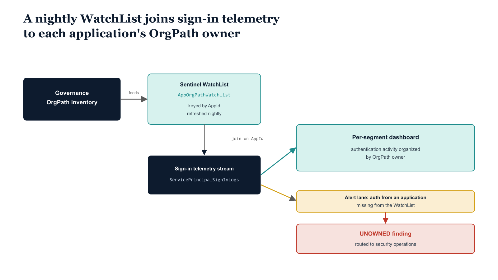

# Chapter 7 — Sentinel Monitoring for Application Identity Anomalies

::: {.callout-note}
## In this chapter
Application authentications carry a different risk profile than user sign-ins — no MFA, no device, no user-risk signal — so the anomalies that matter are organizational and behavioral. This chapter shows how a nightly Sentinel WatchList maps each app to its OrgPath owner, letting the KQL monitoring layer surface authentication volume by segment, flag successful sign-ins from unowned applications, and audit permission-grant events with organizational context.
:::

## Application Authentication Telemetry and Its Distinctive Risk Profile

Application identities generate a class of telemetry in Microsoft Sentinel that differs from user sign-in telemetry in ways that matter for detection engineering. User authentications are recorded in the SigninLogs table and carry attributes — MFA status, conditional access outcome, user risk level, device compliance — that provide immediate context about whether the authentication follows an expected pattern.

Application authentications are recorded in the ServicePrincipalSignInLogs table and carry a different set of attributes: the resource being accessed, the IP address of the authenticating client, the credential type used (secret, certificate, managed identity token), and whether the authentication succeeded. There is no MFA to check, no device compliance to evaluate, and no user risk signal.

The risk signals that matter for application authentications are different ones: authentication from an unexpected IP range or cloud region, authentication at an unusual time of day, sudden spikes in authentication volume, authentication to resources the application has not accessed before, and — most importantly — successful authentication using a credential belonging to an application that the governance framework has classified as orphaned or high-risk.

OrgPath on application objects makes it possible to surface these anomalies with organizational context in Sentinel. The mechanism is a Sentinel WatchList — a lookup table that maps each application's AppId to its OrgPath, OrgNodeId, and display name, populated by the same governance pipeline that maintains the drift detection report. When the KQL queries in the monitoring layer join ServicePrincipalSignInLogs against this WatchList, every application authentication event becomes contextualized with the organizational segment of the owning team.

An authentication failure spike in a Finance-owned application surfaces in the Finance segment of the monitoring dashboard and generates an alert routed to the Finance application review group. An authentication event from an application that the WatchList does not recognize — because it was created without going through the OrgPath stamping pipeline — surfaces as an UNOWNED application authentication, a high-priority finding that the security operations team investigates regardless of whether the authentication succeeded or failed.

{#fig-book-08-cpt-07-diagram-01 fig-alt="On the left, a federal navy box \"governance OrgPath inventory\" feeds a teal box \"Sentinel WatchList AppOrgPathWatchlist, keyed by AppId, refreshed nightly\". In the center, a navy stream \"ServicePrincipalSignInLogs\" joins the WatchList on AppId and produces a teal per-segment dashboard organized by OrgPath owner. An amber alert lane flags a successful authentication from an application missing from the WatchList as a red UNOWNED finding routed to security operations. White background, 16:9, engineering blueprint style, monospace labels for the table and column names, red reserved for the UNOWNED finding, no human figures." width="100%"}

## WatchList Population and Maintenance

The WatchList referenced in the KQL queries below — named AppOrgPathWatchlist — is a Sentinel WatchList with the SearchKey set to AppId, populated by a pipeline step that reads the application OrgPath inventory from the governance repository and uploads it to the Sentinel workspace via the Log Analytics WatchList API. The WatchList is refreshed nightly after the drift detection pipeline completes, ensuring that newly stamped applications appear in monitoring queries promptly and that applications whose OrgPath has been corrected following a drift remediation are reflected accurately.

The WatchList schema requires four columns at minimum: AppId (the application client ID, used as the SearchKey for the join), OrgPath (the full OrgPath string), OrgNodeId (the OrgTree node identifier), and DisplayName (the application's human-readable name). Additional columns for RiskLevel and OrgPathStatus from the drift report output can be included to enable risk-stratified queries that surface high-risk applications in monitoring alerts.

## KQL Query Library

The three queries below form the core of the application identity monitoring layer in Sentinel. The first is a daily dashboard query that produces an aggregated view of application authentication volume organized by OrgPath owner — the operational overview that tells the governance team whether authentication patterns across the application portfolio are within expected ranges.

The second is an alert query that detects successful authentications from unowned applications — applications that appear in ServicePrincipalSignInLogs but have no corresponding entry in the WatchList, which indicates either a governance gap (the application was never stamped) or a security event (an application credential was used from outside the known application portfolio).

The third detects new permission grant events — admin consent operations and role assignment additions — enriched with the OrgPath of the receiving application, enabling the security team to monitor for consent grant events that were not routed through the admin consent workflow.

## Query 7.1 — Service Principal Sign-Ins by OrgPath Owner: Daily Dashboard (KQL)

```kql
// Query 1: Service Principal Sign-Ins by OrgPath Owner — Daily Dashboard
// Surfaces application authentication volume organized by owning organizational segment.
// Join ServicePrincipalSignInLogs against app OrgPath from a Sentinel WatchList
// WatchList "AppOrgPathWatchlist" columns: AppId, OrgPath, OrgNodeId, DisplayName
ServicePrincipalSignInLogs
| where TimeGenerated >= ago(1d)
| join kind=leftouter (
    _GetWatchlist("AppOrgPathWatchlist")
    | project AppId = SearchKey, OrgPath, OrgNodeId, AppDisplayName = DisplayName
) on $left.AppId == $right.AppId
| extend OrgPathResolved = iff(isnotempty(OrgPath), OrgPath, "UNOWNED")
| summarize
    TotalAuths        = count(),
    Successful        = countif(ResultType == 0),
    Failed            = countif(ResultType != 0),
    UniqueResources   = dcount(ResourceDisplayName),
    UniqueIPAddresses = dcount(IPAddress)
    by OrgPathResolved, OrgNodeId, bin(TimeGenerated, 1d)
| order by TotalAuths desc
```

## Query 7.2 — High-Risk Authentication from Unowned Applications: Hourly Alert (KQL)

```kql
// Query 2: High-Risk App Credential Usage from Unowned Applications
// Alert on service principal authentications where the app has no OrgPath owner.
// Run every 1 hour, lookback 1 hour. Fire when UnownedAuthCount > 0.
ServicePrincipalSignInLogs
| where TimeGenerated >= ago(1h)
| where ResultType == 0   // Successful authentications only
| join kind=leftouter (
    _GetWatchlist("AppOrgPathWatchlist")
    | project AppId = SearchKey, OrgPath
) on $left.AppId == $right.AppId
| where isempty(OrgPath) or OrgPath == "UNOWNED"
| summarize
    UnownedAuthCount = count(),
    AppIds           = make_set(AppId),
    Resources        = make_set(ResourceDisplayName),
    IPAddresses      = make_set(IPAddress)
    by bin(TimeGenerated, 1h)
| where UnownedAuthCount > 0
```

## Query 7.3 — Anomalous Permission Grant Events by OrgPath: Daily Audit (KQL)

```kql
// Query 3: Anomalous Permission Grant Events by OrgPath
// Detects new OAuth permission grants and admin consent events,
// enriched with the OrgPath of the application receiving the grant.
AuditLogs
| where TimeGenerated >= ago(24h)
| where Category == "ApplicationManagement"
| where OperationName in (
    "Add delegated permission grant",
    "Add app role assignment to service principal",
    "Consent to application"
  )
| extend
    AppId         = tostring(TargetResources[0].id),
    AppName       = tostring(TargetResources[0].displayName),
    PermGranted   = tostring(TargetResources[0].modifiedProperties[0].newValue),
    InitiatedBy   = tostring(InitiatedBy.user.userPrincipalName)
| join kind=leftouter (
    _GetWatchlist("AppOrgPathWatchlist")
    | project AppId = SearchKey, OrgPath, OrgNodeId
) on $left.AppId == $right.AppId
| extend OrgPathResolved = iff(isnotempty(OrgPath), OrgPath, "UNOWNED")
| project
    TimeGenerated, OperationName, AppName, AppId,
    OrgPathResolved, OrgNodeId,
    PermGranted, InitiatedBy, CorrelationId
| order by TimeGenerated desc
```

::: {.callout-note title="Detection Engineering Note: Behavioral Baseline"}
The three queries above establish the organizational and operational context layer for application identity monitoring. For production detection coverage, these queries should be supplemented with behavioral baseline analytics: time-series models for each application's normal authentication volume, IP-to-OrgPath consistency checks (detecting authentications from IP ranges inconsistent with the owning OrgPath's geographic or network footprint), and resource access pattern analysis (detecting application authentications to resources the application has not previously accessed). These behavioral detections require sufficient historical telemetry to establish baselines and are best implemented as Sentinel Analytics Rules with a lookback window of fourteen or more days.
:::

## Synthesis and Series Continuity

With the application identity governance layer in place, every identity type in the Entra ID tenant now carries OrgPath context — users, devices, servers, guests, and applications, managed identities included. The governance substrate governs not just who the identity is and where it sits in the organizational hierarchy, but who is accountable for it, when its permissions were last reviewed, whether its credentials are current, and whether its organizational anchor remains valid.

The drift detection pipelines that span user OrgPath, device OrgPath, server OrgPath, guest OrgPath, and now application OrgPath run in coordinated sequence, produce a unified governance dashboard, and surface findings to the organizational teams that have the context and authority to remediate them.

Sentinel ties the monitoring layer together: every security event in the tenant — whether it originates from a user, a device, or an application — can now be contextualized with the OrgPath of the identity involved, enabling the security operations team to triage with organizational precision rather than working from raw identity attributes.

Part Twelve addresses the final machine-state gap in the series: using OrgPath tags on Arc-enrolled servers to drive DSC-based configuration enforcement through Azure Policy Guest Configuration packages. Where Part Five established the tagging model and the policy compliance reporting layer, Part Twelve closes the enforcement loop — using the OrgPath of each enrolled server to select the correct DSC configuration package for its organizational segment, apply it through the Guest Configuration extension, and report compliance state back to the governance dashboard in organizational terms. The OrgTree defines the desired state of the organization; DSC Guest Configuration enforces the desired state of the machines the organization operates.
