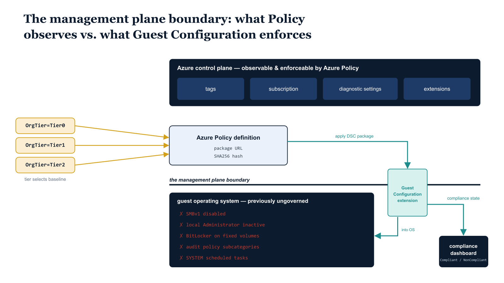

# Chapter 1 — The Machine State Governance Gap

::: {.callout-note}
## In this chapter
Azure Policy can govern an Arc-enrolled server's control-plane state — its tags, subscription, diagnostic settings, and extensions — but it cannot natively reach inside the guest operating system to verify or enforce in-OS configuration. This chapter introduces Azure Policy Guest Configuration as the bridge that closes that gap, and explains why machine-state enforcement is incomplete until OrgPath supplies the organizational dimension: a server's tier must determine the baseline it is held to, and tier changes must re-baseline it automatically.
:::

## The Surface OrgPath Has Not Yet Reached

Eleven parts into this governance architecture series, the OrgPath substrate reaches across a wide and deliberately chosen surface. Identity lifecycle, privileged access, security event correlation, Azure role assignments, device compliance, DNS zone authority, certificate issuance, information protection, external collaboration, and service principal control are all governed, at least in part, by an organization's structural position as expressed through OrgPath. That is an unusually broad enforcement perimeter for a single positional attribute, and the discipline required to maintain it across those domains is considerable. Yet there remains one surface that none of the preceding parts addressed in full: the configuration state of the physical and virtual servers that run inside organizational boundaries and carry Arc enrollment into the Azure management plane.

{#fig-book-09-cpt-01-diagram-01 fig-alt="Engineering blueprint diagram on a white background showing the boundary between the Azure control plane and the guest operating system of an Arc-enrolled server, and how OrgPath tier targets the in-OS baseline. Across the top, a federal navy (#1F3A5F) horizontal band labeled Azure control plane contains boxes for tags, subscription, diagnostic settings, and extensions, each marked observable and enforceable by Azure Policy. A bold navy horizontal line across the middle is labeled the management plane boundary. Below the line, a federal navy box labeled guest operating system contains in-OS settings drawn in red (#C0392B) to mark them as previously ungoverned: SMBv1 disabled, local Administrator inactive, BitLocker on fixed volumes, audit policy subcategories, and SYSTEM scheduled tasks. A teal (#1A9E8F) vertical pipe labeled Guest Configuration extension crosses the boundary line, carrying a teal arrow from an Azure Policy definition (referencing a package by URL and SHA256 hash) down into the guest OS box, and a return teal arrow labeled compliance state (Compliant, NonCompliant, Pending) back up to a navy compliance dashboard box. On the left margin, three stacked amber (#D4A017) tags read OrgTier=Tier0, OrgTier=Tier1, and OrgTier=Tier2, each with an amber arrow pointing at the Azure Policy definition to show that tier selects which baseline package is applied. Monospace labels for settings, tags, and the URL and hash, no human figures, 16:9 landscape." width="100%"}

The distinction between what Azure Policy can observe and what it can actually enforce inside an operating system is not subtle, but it is easy to overlook when assembling a governance architecture from the outside in. Azure Policy is enormously capable at the control-plane level. It can audit whether an Arc-enrolled machine carries the correct tags, is located in the correct subscription, has diagnostic settings configured, or has an extension installed. It can deny resource deployments that violate structural rules. What it cannot do natively, through a simple audit or deny rule, is reach inside the guest operating system and verify — let alone enforce — properties such as these:

- SMBv1 is disabled
- The local Administrator account is inactive
- BitLocker is protecting fixed volumes
- Audit policy subcategories are configured to the correct verbosity
- The scheduled tasks running under SYSTEM are the ones the governance architecture expects

Those properties exist beneath the Azure management plane, inside the operating system, and they require a different mechanism to govern.

## Guest Configuration: The Bridge Into the Guest OS

That mechanism is Azure Policy Guest Configuration. Guest Configuration is the bridge between the Azure Policy enforcement plane and the in-guest operating system of an Arc-enrolled server. At its core, a Guest Configuration package is a PowerShell Desired State Configuration (DSC) configuration — a declarative description of what the machine's operating system should look like — that moves through a defined lifecycle:

1. **Authored** as a PowerShell DSC configuration that declares the intended OS state.
2. **Compiled** into a MOF document.
3. **Wrapped** in a zip archive.
4. **Published** to Azure Blob Storage at a stable, authenticated URL.
5. **Referenced** by an Azure Policy definition, by URL and SHA256 content hash.
6. **Applied** on each machine: when the policy is assigned to a scope containing Arc-enrolled machines, the Guest Configuration extension running on each machine's Arc agent downloads the package, compiles and applies the DSC configuration, and reports the resulting compliance state back to Azure Policy.

The compliance state — Compliant, NonCompliant, or Pending — surfaces in the same Azure Policy compliance dashboard and Resource Graph tables used throughout this series for every other governance signal.

> Guest Configuration is not a secondary or optional layer. It is the only native Azure mechanism that enforces configuration state inside the operating system of an Arc-enrolled machine at scale — without a separate agent, a separate management product, or a separate reporting infrastructure.

## The Gap: Machine-State Enforcement Without Organizational Dimension

The gap that Guest Configuration addresses in this architecture is specifically the absence of organizational dimension in machine-state enforcement. Without OrgPath, Guest Configuration packages are assigned by policy definitions that target resource types, locations, or arbitrary tags — and those targeting mechanisms carry no concept of organizational position or tier. A Tier0 domain controller that anchors the identity substrate and a Tier2 departmental file server in a regional branch office could receive identical Guest Configuration assignments if they share the same resource group, subscription, or tag structure.

This is not a hypothetical edge case. In any organization where Arc enrollment has been applied broadly and resource organization has been driven by operational convenience rather than governance architecture, this conflation is the default state.

> The same baseline that is barely sufficient for a non-critical file server is dangerously insufficient for infrastructure whose compromise would break the governance substrate itself.

## How OrgPath Restores the Tier Dimension

OrgPath changes this. Every Arc-enrolled server in this architecture carries an OrgPath tag that establishes its organizational position and, through the OrgTier attribute derived from OrgTree, its tier classification. Each tier carries a fundamentally different risk profile, and that risk profile must be reflected in the DSC configuration baseline the machine is required to maintain:

| Tier | What it hosts | Risk profile |
| :--- | :--- | :--- |
| **Tier0** | Domain controllers, key management services, Entra Connect sync infrastructure, PKI certificate authorities, and other systems whose availability and integrity the rest of the governance architecture depends upon | Compromise breaks the governance substrate itself |
| **Tier1** | Production application workloads and line-of-business services | Operationally critical, but not themselves part of the governance substrate |
| **Tier2** | The broad population of standard organizational servers — departmental file services, non-critical infrastructure, workstations in managed segments | Standard organizational risk |

Guest Configuration, targeted by OrgTier tag through Azure Policy condition logic, is how that differentiation is enforced at scale.

## The Dynamic Property: Re-Baselining on Tier Change

The dynamic property of this architecture — the one that distinguishes it from a static baseline assignment model — is its response to OrgTree tier changes. When an organizational node is reclassified, perhaps because a server population that was once used for non-critical workloads has grown to host sensitive data or privileged access infrastructure, the OrgPath propagation pipeline updates the OrgTier tag on all resources in that node's branch. That tag change immediately shifts which Guest Configuration policy assignment's condition matches the affected machines. A remediation task triggered by the pipeline then applies the new, stricter baseline, with three properties worth naming:

- **No manual intervention** — the re-baselining follows the tag change automatically.
- **No dependent change ticket** — enforcement does not wait on someone remembering to update a policy assignment.
- **No drift window** — there is no interval of uncontrolled configuration drift between the business decision and the enforcement action.

## How This Document Is Structured

This document is structured as follows:

| Chapter | Covers |
| :--- | :--- |
| **Two** | The three-tier DSC baseline model — the configuration categories that differ across Tier0, Tier1, and Tier2, and the reasoning behind each differentiation |
| **Three** | The authoring of Guest Configuration packages in PowerShell DSC, including complete production-ready DSC configurations for all three tiers and the packaging and publishing workflow |
| **Four** | The Azure Policy definition structure and the PowerShell automation that deploys definitions and assignments at management group scope |
| **Five** | Compliance reporting by OrgPath segment using Resource Graph KQL and Sentinel integration |
| **Six** | The pipeline extension that responds to OrgTree tier change events with immediate Guest Configuration remediation |
| **Seven** | The decommission and cleanup procedure for Arc machines whose OrgTree nodes have been archived |
| **Eight** | How Part Twelve sits within the series, and the capstone reporting layer that Part Thirteen will construct |
