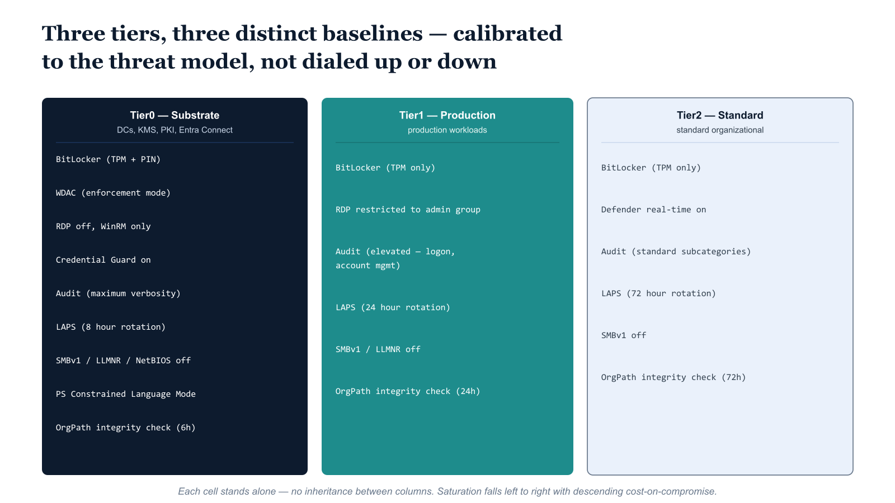

# Chapter 2 — The Three-Tier DSC Baseline Model

::: {.callout-note}
## In this chapter
Three Desired State Configuration baselines — one per governance tier — are not three settings on a single restriction dial but three distinct configuration profiles, each calibrated to the threat model of the server population it governs. This chapter walks the Tier0 infrastructure-hardening baseline control by control, then the Tier1 production baseline and the Tier2 standard-organizational baseline, and explains where controls are deliberately omitted because their enforcement cost outweighs their value at that tier.
:::

## Tier Classification and Its Machine-State Consequences

The tier classification model used throughout this series was established in Part Three and has been the organizing principle for every governance domain addressed since. Its application to machine-state enforcement follows the same logic it follows elsewhere: tier is not merely an administrative label but a structural expression of what a server's compromise would cost the organization. The severity of that cost is what determines how much enforcement the machine must tolerate and how much operational friction is acceptable to achieve it.

> Tier0 machines bear the highest cost upon compromise; Tier2 machines bear the lowest. The DSC baselines in this chapter are calibrated accordingly.

What is important to state explicitly at this point is that the three baselines described here are not three points on a single sliding scale of restriction. They are three distinct configuration profiles, each targeting a specific threat model appropriate to the server population it governs. Tier0 servers are targeted by adversaries who understand that compromising the governance substrate is the highest-leverage attack against an organization's security architecture. Tier2 servers face a broader but less sophisticated threat surface. The controls in each baseline are selected for the threat model of that tier, not simply dialed up or down from a shared template.

{#fig-09-orgpath-and-azure-policy-guest-config-diagram-01 fig-alt="Column \"Tier0 — Substrate (DCs, KMS, PKI, Entra Connect)\" lists nine control rows: BitLocker (TPM + PIN); WDAC (enforcement mode); RDP off, WinRM only; Credential Guard on; Audit (maximum verbosity); LAPS (8 hour rotation); SMBv1 / LLMNR / NetBIOS off; PS Constrained Language Mode; OrgPath integrity check (6h). Column \"Tier1 — Production workloads\" lists six rows: BitLocker (TPM only); RDP restricted to admin group; Audit (elevated — logon, account mgmt); LAPS (24 hour rotation); SMBv1 / LLMNR off; OrgPath integrity check (24h). Column \"Tier2 — Standard organizational\" lists six rows: BitLocker (TPM only); Defender real-time on; Audit (standard subcategories); LAPS (72 hour rotation); SMBv1 off; OrgPath integrity check (72h). The matrix is a static comparison — no arrows between columns; each cell stands alone. Engineering blueprint style, white background, deeper federal-navy (#1F3A5F) fill for Tier0, mid teal (#1A9E8F) for Tier1, light slate for Tier2, monospace control values, 16:9 landscape." width="85%"}

## Tier0: Infrastructure Hardening Baseline

Tier0 servers host the systems that underpin the identity and governance substrate: domain controllers, key management services, Entra Connect synchronization servers, PKI certificate authorities, and any other infrastructure whose unavailability or compromise would directly impair the governance architecture's ability to function. The DSC baseline for Tier0 machines is built around a single principle:

> These servers should have the smallest possible attack surface, communicate through the narrowest possible set of authenticated channels, and leave a comprehensive audit trail of every significant system event.

The baseline expresses that principle through the following controls.

### Disk and Code Integrity

- **BitLocker — TPM + PIN.** Drive encryption is enforced on all fixed volumes with both a TPM protector and a PIN protector. The TPM-only configuration that is sufficient for Tier1 is not acceptable at Tier0 because a stolen or physically accessed machine with a TPM-only configuration can be booted without challenge. The PIN requirement means that volume decryption requires human knowledge that is not stored on the device, which materially raises the cost of physical attacks against Tier0 hardware.

- **Windows Defender Application Control — enforcement mode.** WDAC is configured in enforcement mode, not audit mode. Audit mode is appropriate during rollout for workload discovery, but production Tier0 machines must execute only explicitly authorized code. The WDAC policy itself is managed through a separate configuration channel and referenced by the DSC configuration; the DSC enforces that the policy is set to enforcement mode and that the enforcement registry key is present and correct.

### Access and Credential Protection

- **Local Administrator account — disabled and renamed.**
- **Remote Desktop Services — disabled entirely.** Tier0 management occurs through Windows Remote Management, restricted at the WinRM listener level to specific management subnet CIDRs that are environment parameters in the DSC configuration.
- **Credential Guard — enabled** through the Device Guard configuration, protecting credential material in kernel memory from extraction by LSASS-targeting attack tools.
- **LAPS — eight-hour maximum password age.** This reflects the operational reality that Tier0 systems require tightly rotated local credentials and that any eight-hour window during which a credential might be valid is already longer than the response time expected for a Tier0 incident.

### Audit and Telemetry

Audit policy is configured for maximum verbosity across all categories. This is not a performance-neutral decision — maximum audit verbosity on a domain controller generates substantial event volume — but on Tier0 machines the forensic completeness of the audit trail outweighs the storage and processing cost. The Sentinel integration established in Part Four ingests these events and applies the OrgPath-aware analytic rules that provide contextual alerting based on organizational position.

### Network and Execution Surface Reduction

- **SMBv1, LLMNR, and NetBIOS over TCP/IP — all disabled** on all network adapters. These three controls together remove the most commonly exploited name resolution and file sharing attack vectors at the network layer.
- **Legacy Windows features removed if present** — IIS, Telnet, TFTP, Simple TCP/IP Services, RIP Listener, and SNMP.
- **PowerShell Constrained Language Mode — enforced** through the \_\_PSLockdownPolicy registry key, which prevents the execution of arbitrary PowerShell script classes and COM objects that are the foundation of many post-exploitation frameworks.
- **OrgPath tag integrity check — every six hours.** A scheduled task running under SYSTEM validates the OrgPath tag integrity by querying the Arc IMDS endpoint and writing to the Windows Event Log if the tag is absent, malformed, or inconsistent with the server's known organizational position.

## Tier1: Production Baseline

Tier1 servers host production application workloads, line-of-business databases, and broadly used services that are operationally critical but not themselves part of the governance substrate. The Tier1 baseline enforces controls that protect against the most common attack vectors against production infrastructure while preserving the operational access patterns that production support workflows require.

- **BitLocker — TPM-only protector.** Adequate for servers in physically secured data center environments where drive theft is unlikely and boot-time PIN entry would create availability risks for unattended systems.
- **Local Administrator account — disabled.**
- **SMBv1 and LLMNR — disabled.**
- **Audit policy — elevated** for logon and logoff and account management subcategories, which provides sufficient coverage for identity-based attacks against production systems without the full verbosity cost of the Tier0 configuration.
- **LAPS — 24-hour maximum password age.**
- **Remote Desktop — enabled but restricted** through a local group policy preference to members of the designated administrative group.
- **OrgPath integrity check — every 24 hours.**

## Tier2: Standard Organizational Baseline

Tier2 servers are the broadest population: departmental file servers, non-critical infrastructure hosts, standard organizational workstations in managed segments. The Tier2 baseline enforces the organizational security minimum.

- **Windows Defender with real-time protection — enforced** and must be running.
- **BitLocker — TPM protector enforced.**
- **SMBv1 — disabled.**
- **Audit policy — standard logon and account management subcategories** configured.
- **LAPS — 72-hour maximum password age**, which is appropriate for the lower sensitivity of Tier2 systems and reduces operational overhead for large Tier2 populations.
- **OrgPath integrity check — every 72 hours.**

Controls are deliberately omitted from the Tier2 baseline in two cases: when a control is operationally impractical for Tier2 populations at scale — disabling NetBIOS over TCP/IP across all adapters can break legacy application dependencies that are more common in Tier2 segments — or when its enforcement value does not justify the operational cost at this tier.
