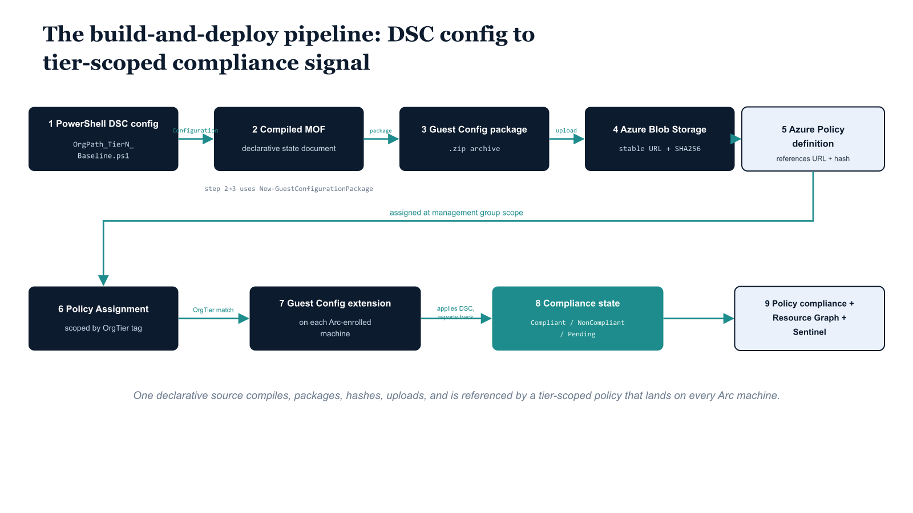

# Chapter 3 — Authoring Guest Configuration Packages

::: {.callout-note}
## In this chapter
This chapter authors the three tier baselines as PowerShell DSC configurations and compiles them into Guest Configuration packages. It covers the four DSC modules the authoring environment requires, the Tier0 reference configuration with every environment-specific value flagged for substitution, the production-appropriate Tier1 and minimum-baseline Tier2 variants, and the packaging script that compiles each MOF, hashes the zip, uploads it to Azure Blob Storage, and logs the result to the governance repository.
:::

## Module Requirements and Environment Preparation

Guest Configuration packages are authored in PowerShell DSC and compiled using the GuestConfiguration PowerShell module from the PowerShell Gallery. The authoring environment requires four modules to be installed before any configuration can be compiled or packaged:

| Module | Version | What it provides |
| :--- | :--- | :--- |
| **GuestConfiguration** | — | The `New-GuestConfigurationPackage` cmdlet that wraps the compiled MOF into the zip archive format the Guest Configuration extension expects |
| **PSDesiredStateConfiguration** | 2.x | The cross-platform DSC engine Guest Configuration uses — *not* the Windows-only DSC v1 engine; version 1.x configurations will not compile correctly for Guest Configuration packaging |
| **PSDscResources** | — | Cross-platform resource implementations for common configuration items: user accounts, registry keys, Windows optional features, and scheduled tasks |
| **ComputerManagementDsc** | — | Windows-specific resource implementations: BitLocker volume management, audit policy subcategory configuration, and LAPS settings |
| **AuditPolicyDsc** | — | The `AuditPolicySubcategory` resource used across all three tier configurations to set granular audit policy subcategory settings without relying on `auditpol.exe` command-line invocation |

> Module installation is a one-time environment setup step — not part of the per-tier compilation workflow.

The authoring workstation or pipeline agent must have all four modules installed before any of the DSC configuration scripts in this chapter can be dot-sourced and compiled. Once the authoring environment is prepared, the workflow for each tier is the same five steps:

1. **Dot-source** the configuration script.
2. **Invoke** the configuration function to compile the MOF.
3. **Package** the MOF with `New-GuestConfigurationPackage` to produce the zip archive.
4. **Hash** the zip with SHA256.
5. **Upload** the zip to the Azure Blob Storage container that the policy definitions reference.

{#fig-09-orgpath-and-azure-policy-guest-config-diagram-02 fig-alt="Stage 1 box \"PowerShell DSC config — OrgPath_TierN_Baseline.ps1\" → arrow labeled \"Configuration cmdlet\" → Stage 2 \"Compiled MOF — declarative state document\" → arrow labeled \"New-GuestConfigurationPackage\" → Stage 3 \"Guest Configuration package — .zip archive\" → arrow labeled \"upload\" → Stage 4 \"Azure Blob Storage — stable URL + SHA256 hash\" → arrow labeled \"referenced by\" → Stage 5 \"Azure Policy definition — references URL + hash\" → arrow labeled \"assigned at MG scope\" → Stage 6 \"Policy Assignment — scoped by OrgTier tag\" → arrow labeled \"OrgTier match condition\" → Stage 7 \"Arc Guest Configuration extension — on each Arc-enrolled machine\" → arrow labeled \"applies DSC + reports back\" → Stage 8 \"Compliance state — Compliant / NonCompliant / Pending\" → unlabeled arrow → Stage 9 \"Azure Policy compliance + Resource Graph + Sentinel\". Engineering blueprint style, monospace filenames and cmdlet names on the arrows, white background, federal navy (#1F3A5F) accents, 16:9 landscape." width="85%"}

## Tier0 DSC Configuration

The Tier0 configuration is the most complete of the three and serves as the reference implementation for the Guest Configuration authoring pattern used across this series. Every environment-specific parameter — management subnet CIDRs, script deployment paths, storage account names — is marked in comments with the token \# ENV-PARAM so that engineers working in a specific environment can locate every value that requires substitution without reading the full configuration.

```powershell
#
# .SYNOPSIS
#     PowerShell DSC configuration for OrgPath Tier0 servers (hardened baseline).
# .DESCRIPTION
#     Compile this configuration with:
#         . .\OrgPath-Tier0-Baseline.ps1
#         OrgPath_Tier0_Baseline -OutputPath "C:\GuestConfig\Tier0"
#     Then package with New-GuestConfigurationPackage (see packaging script).
# .NOTES
#     Required DSC modules:
#         PSDesiredStateConfiguration 2.x
#         PSDscResources
#         ComputerManagementDsc
#         AuditPolicyDsc
#     Environment-specific parameters are marked with: # ENV-PARAM
#

Configuration OrgPath_Tier0_Baseline {

    Import-DscResource -ModuleName PSDesiredStateConfiguration
    Import-DscResource -ModuleName PSDscResources
    Import-DscResource -ModuleName ComputerManagementDsc
    Import-DscResource -ModuleName AuditPolicyDsc

    Node localhost {

        #region — Disable SMBv1
        Script DisableSMBv1 {
            GetScript  = { @{ Result = (Get-SmbServerConfiguration).EnableSMB1Protocol } }
            TestScript = { -not (Get-SmbServerConfiguration).EnableSMB1Protocol }
            SetScript  = { Set-SmbServerConfiguration -EnableSMB1Protocol $false -Force }
        }
        #endregion

        #region — Disable LLMNR
        Registry DisableLLMNR {
            Key       = "HKLM:\SOFTWARE\Policies\Microsoft\Windows NT\DNSClient"
            ValueName = "EnableMulticast"
            ValueType = "DWORD"
            ValueData = "0"
            Ensure    = "Present"
        }
        #endregion

        #region — Disable NetBIOS over TCP/IP (Tier0 only)
        Script DisableNetBIOS {
            GetScript  = {
                $adapters = Get-ChildItem "HKLM:\SYSTEM\CurrentControlSet\Services\NetBT\Parameters\Interfaces"
                $values   = $adapters | ForEach-Object { (Get-ItemProperty $_.PSPath).NetbiosOptions }
                @{ Result = ($values | Where-Object { $_ -ne 2 }).Count -eq 0 }
            }
            TestScript = {
                $adapters = Get-ChildItem "HKLM:\SYSTEM\CurrentControlSet\Services\NetBT\Parameters\Interfaces"
                $values   = $adapters | ForEach-Object { (Get-ItemProperty $_.PSPath).NetbiosOptions }
                ($values | Where-Object { $_ -ne 2 }).Count -eq 0
            }
            SetScript  = {
                Get-ChildItem "HKLM:\SYSTEM\CurrentControlSet\Services\NetBT\Parameters\Interfaces" |
                    ForEach-Object { Set-ItemProperty $_.PSPath -Name NetbiosOptions -Value 2 }
            }
        }
        #endregion

        #region — Local Administrator disabled (Tier0: all local admins except LAPS account)
        User LocalAdministrator {
            UserName = "Administrator"
            Ensure   = "Present"
            Disabled = $true
        }
        #endregion

        #region — Disable Remote Desktop (Tier0: management via WinRM only)
        Registry DisableRDP {
            Key       = "HKLM:\System\CurrentControlSet\Control\Terminal Server"
            ValueName = "fDenyTSConnections"
            ValueType = "DWORD"
            ValueData = "1"
            Ensure    = "Present"
        }
        #endregion

        #region — Disable Telnet client
        WindowsOptionalFeature DisableTelnet {
            Name   = "TelnetClient"
            Ensure = "Disable"
        }
        #endregion

        #region — Disable TFTP client
        WindowsOptionalFeature DisableTFTP {
            Name   = "TFTP"
            Ensure = "Disable"
        }
        #endregion

        #region — Disable SNMP
        WindowsOptionalFeature DisableSNMP {
            Name   = "SNMP"
            Ensure = "Disable"
        }
        #endregion

        #region — PowerShell Constrained Language Mode (Tier0)
        Registry PSConstrainedLanguage {
            Key       = "HKLM:\SYSTEM\CurrentControlSet\Control\Session Manager\Environment"
            ValueName = "__PSLockdownPolicy"
            ValueType = "String"
            ValueData = "4"
            Ensure    = "Present"
        }
        #endregion

        #region — Audit Policy (Tier0: maximum verbosity)
        AuditPolicySubcategory AuditLogon {
            Name      = "Logon"
            AuditFlag = "Success,Failure"
            Ensure    = "Present"
        }
        AuditPolicySubcategory AuditAccountLogon {
            Name      = "Credential Validation"
            AuditFlag = "Success,Failure"
            Ensure    = "Present"
        }
        AuditPolicySubcategory AuditProcessCreation {
            Name      = "Process Creation"
            AuditFlag = "Success"
            Ensure    = "Present"
        }
        AuditPolicySubcategory AuditPrivilegeUse {
            Name      = "Sensitive Privilege Use"
            AuditFlag = "Success,Failure"
            Ensure    = "Present"
        }
        AuditPolicySubcategory AuditPolicyChange {
            Name      = "Audit Policy Change"
            AuditFlag = "Success,Failure"
            Ensure    = "Present"
        }
        AuditPolicySubcategory AuditObjectAccess {
            Name      = "File System"
            AuditFlag = "Success,Failure"
            Ensure    = "Present"
        }
        #endregion

        #region — OrgPath integrity validation scheduled task
        ScheduledTask OrgPathIntegrityCheck {
            TaskName  = "OrgPath-Tier0-IntegrityCheck"
            TaskPath  = "\Governance\"
            # Script checks for the OrgPath tag via Arc metadata endpoint
            ActionExecutable  = "powershell.exe"
            ActionArguments   = @(
                "-NonInteractive",
                "-ExecutionPolicy", "Bypass",
                "-File", "C:\Governance\Scripts\Test-OrgPathTag.ps1"  # ENV-PARAM: script path
            )
            ScheduleType                = "RepetitionInterval"
            RepetitionIntervalMinutes   = 360   # 6 hours for Tier0
            RepetitionDurationUnbounded = $true
            Enable                      = $true
            Ensure                      = "Present"
            RunLevel                    = "Highest"
            ExecuteAsAccount            = "SYSTEM"
        }
        #endregion

    } # Node localhost
} # Configuration
```

## Tier1 DSC Configuration

The Tier1 configuration follows the same structural pattern as the Tier0 configuration. The key differences reflect the production-appropriate trade-offs described in Chapter Two: Remote Desktop is enabled rather than disabled, PowerShell Constrained Language Mode is not enforced (to preserve compatibility with production automation tooling), the OrgPath integrity check interval is extended to 24 hours, and the audit policy subcategory set is reduced to the logon, account management, and process creation categories that are most relevant to identity-based attacks against production workloads. All controls that are universally applicable across tiers — SMBv1 disabled, LLMNR disabled, local Administrator disabled, audit logon events — are present in the Tier1 configuration.

```powershell
#
# .SYNOPSIS
#     PowerShell DSC configuration for OrgPath Tier1 servers (production baseline).
# .NOTES
#     Same authoring/packaging workflow as Tier0 configuration.
#     Key differences from Tier0: RDP enabled (restricted), audit policy reduced,
#     LAPS 24h password age, OrgPath check every 24h, no PowerShell CLM.
#

Configuration OrgPath_Tier1_Baseline {

    Import-DscResource -ModuleName PSDesiredStateConfiguration
    Import-DscResource -ModuleName PSDscResources
    Import-DscResource -ModuleName ComputerManagementDsc
    Import-DscResource -ModuleName AuditPolicyDsc

    Node localhost {

        Script DisableSMBv1 {
            GetScript  = { @{ Result = (Get-SmbServerConfiguration).EnableSMB1Protocol } }
            TestScript = { -not (Get-SmbServerConfiguration).EnableSMB1Protocol }
            SetScript  = { Set-SmbServerConfiguration -EnableSMB1Protocol $false -Force }
        }

        Registry DisableLLMNR {
            Key       = "HKLM:\SOFTWARE\Policies\Microsoft\Windows NT\DNSClient"
            ValueName = "EnableMulticast"
            ValueType = "DWORD"
            ValueData = "0"
            Ensure    = "Present"
        }

        User LocalAdministrator {
            UserName = "Administrator"
            Ensure   = "Present"
            Disabled = $true
        }

        # Tier1: RDP enabled but restricted to management group via GPP (separate channel)
        Registry EnableRDPTier1 {
            Key       = "HKLM:\System\CurrentControlSet\Control\Terminal Server"
            ValueName = "fDenyTSConnections"
            ValueType = "DWORD"
            ValueData = "0"
            Ensure    = "Present"
        }

        AuditPolicySubcategory AuditLogon {
            Name      = "Logon"
            AuditFlag = "Success,Failure"
            Ensure    = "Present"
        }
        AuditPolicySubcategory AuditAccountLogon {
            Name      = "Credential Validation"
            AuditFlag = "Success,Failure"
            Ensure    = "Present"
        }
        AuditPolicySubcategory AuditProcessCreation {
            Name      = "Process Creation"
            AuditFlag = "Success"
            Ensure    = "Present"
        }

        ScheduledTask OrgPathIntegrityCheck {
            TaskName  = "OrgPath-Tier1-IntegrityCheck"
            TaskPath  = "\Governance\"
            ActionExecutable = "powershell.exe"
            ActionArguments  = @(
                "-NonInteractive", "-ExecutionPolicy", "Bypass",
                "-File", "C:\Governance\Scripts\Test-OrgPathTag.ps1"  # ENV-PARAM
            )
            ScheduleType                = "RepetitionInterval"
            RepetitionIntervalMinutes   = 1440   # 24 hours for Tier1
            RepetitionDurationUnbounded = $true
            Enable                      = $true
            Ensure                      = "Present"
            RunLevel                    = "Highest"
            ExecuteAsAccount            = "SYSTEM"
        }
    }
}
```

## Tier2 DSC Configuration

The Tier2 configuration enforces the organizational security minimum. It carries only the controls that the organization's security baseline requires of every managed server regardless of tier.

> Tier2 is the floor below which no Arc-enrolled machine in the environment should fall.

The OrgPath integrity check interval at 72 hours reflects the lower sensitivity of Tier2 systems; a missed check window on a Tier2 server is a governance concern but not an incident response trigger in the way that a missed check on a Tier0 server would be.

```powershell
#
# .SYNOPSIS
#     PowerShell DSC configuration for OrgPath Tier2 servers (standard baseline).
# .NOTES
#     Minimum organizational security baseline. Tier2 servers carry no sensitive
#     data classification and host non-critical workloads.
#     Key differences: LAPS 72h password age, OrgPath check every 72h.
#

Configuration OrgPath_Tier2_Baseline {

    Import-DscResource -ModuleName PSDesiredStateConfiguration
    Import-DscResource -ModuleName PSDscResources
    Import-DscResource -ModuleName AuditPolicyDsc

    Node localhost {

        Script DisableSMBv1 {
            GetScript  = { @{ Result = (Get-SmbServerConfiguration).EnableSMB1Protocol } }
            TestScript = { -not (Get-SmbServerConfiguration).EnableSMB1Protocol }
            SetScript  = { Set-SmbServerConfiguration -EnableSMB1Protocol $false -Force }
        }

        AuditPolicySubcategory AuditLogon {
            Name      = "Logon"
            AuditFlag = "Success,Failure"
            Ensure    = "Present"
        }
        AuditPolicySubcategory AuditAccountLogon {
            Name      = "Credential Validation"
            AuditFlag = "Success,Failure"
            Ensure    = "Present"
        }

        ScheduledTask OrgPathIntegrityCheck {
            TaskName  = "OrgPath-Tier2-IntegrityCheck"
            TaskPath  = "\Governance\"
            ActionExecutable = "powershell.exe"
            ActionArguments  = @(
                "-NonInteractive", "-ExecutionPolicy", "Bypass",
                "-File", "C:\Governance\Scripts\Test-OrgPathTag.ps1"  # ENV-PARAM
            )
            ScheduleType                = "RepetitionInterval"
            RepetitionIntervalMinutes   = 4320   # 72 hours for Tier2
            RepetitionDurationUnbounded = $true
            Enable                      = $true
            Ensure                      = "Present"
            RunLevel                    = "Highest"
            ExecuteAsAccount            = "SYSTEM"
        }
    }
}
```

## Package Compilation and Publishing

Once the three DSC configuration scripts are authored, each must be compiled to a MOF document and then wrapped in a Guest Configuration package zip archive using New-GuestConfigurationPackage. The packaging script below handles all three tiers in sequence, computes the SHA256 content hash of each zip (the hash is required in the policy definition to prevent the Guest Configuration extension from downloading a tampered or corrupted package), uploads each zip to the Azure Blob Storage container that the policy definitions will reference, and writes a structured governance log entry for each published package. The log entries are in JSON Lines format and feed the governance repository established in earlier parts of this series.

```powershell
#
# .SYNOPSIS
#     Compiles DSC configurations into Guest Configuration packages and
#     publishes them to Azure Blob Storage for policy assignment.
# .DESCRIPTION
#     For each tier, compiles the DSC configuration to MOF, wraps it in a
#     Guest Configuration package zip archive using New-GuestConfigurationPackage,
#     and uploads to a dedicated Azure Storage account. The blob URL and content
#     hash are written to the governance repository for traceability.
# .PARAMETER StorageAccountName
#     Name of the Azure Storage account hosting Guest Configuration packages.
# .PARAMETER ContainerName
#     Blob container name within the storage account.
# .PARAMETER ResourceGroupName
#     Resource group containing the storage account.
# .NOTES
#     Requires: Install-Module GuestConfiguration, PSDesiredStateConfiguration,
#               PSDscResources, ComputerManagementDsc, AuditPolicyDsc
#     Requires: Az.Storage, Az.Accounts modules
#     The GuestConfiguration module installs GuestConfig compilation tools.
#
param(
    [string]$StorageAccountName = "orgpathguestconfig",    # ENV-PARAM: substitute
    [string]$ContainerName      = "packages",
    [string]$ResourceGroupName  = "rg-governance",         # ENV-PARAM: substitute
    [string]$DscScriptPath      = "C:\GuestConfig\DSC",
    [string]$OutputBasePath     = "C:\GuestConfig\Packages",
    [string]$GovernanceLogPath  = "C:\governance\logs\guestconfig-publish.jsonl"
)

# Ensure output directory exists
New-Item -ItemType Directory -Path $OutputBasePath -Force | Out-Null

# Connect to Azure
Connect-AzAccount -UseDeviceAuthentication  # Or use managed identity in pipeline

$storageCtx = (Get-AzStorageAccount `
    -ResourceGroupName $ResourceGroupName `
    -Name $StorageAccountName).Context

$tiers = @(
    @{ Name = "Tier0"; ConfigFile = "OrgPath-Tier0-Baseline.ps1"; ConfigName = "OrgPath_Tier0_Baseline" },
    @{ Name = "Tier1"; ConfigFile = "OrgPath-Tier1-Baseline.ps1"; ConfigName = "OrgPath_Tier1_Baseline" },
    @{ Name = "Tier2"; ConfigFile = "OrgPath-Tier2-Baseline.ps1"; ConfigName = "OrgPath_Tier2_Baseline" }
)

foreach ($tier in $tiers) {

    Write-Host "[$($tier.Name)] Compiling DSC configuration..."

    $configPath = Join-Path $DscScriptPath $tier.ConfigFile
    $mofOutPath = Join-Path $OutputBasePath $tier.Name

    # Dot-source the configuration and compile to MOF
    . $configPath
    & $tier.ConfigName -OutputPath $mofOutPath

    $mofFile = Get-ChildItem $mofOutPath -Filter "*.mof" | Select-Object -First 1
    if (-not $mofFile) { Write-Error "MOF not generated for $($tier.Name)"; continue }

    Write-Host "  MOF: $($mofFile.FullName)"

    # Build Guest Configuration package
    $packagePath = Join-Path $OutputBasePath "$($tier.Name).zip"
    New-GuestConfigurationPackage `
        -Name        "OrgPath-$($tier.Name)-Baseline" `
        -Version     "1.0.0" `
        -Path        $mofFile.FullName `
        -Destination $packagePath `
        -Force

    Write-Host "  Package: $packagePath"

    # Compute content hash for policy definition
    $hash = (Get-FileHash $packagePath -Algorithm SHA256).Hash

    # Upload to Azure Blob Storage
    $blobName = "OrgPath-$($tier.Name)-Baseline.zip"
    Set-AzStorageBlobContent `
        -File      $packagePath `
        -Container $ContainerName `
        -Blob      $blobName `
        -Context   $storageCtx `
        -Force | Out-Null

    $blobUrl = "https://$StorageAccountName.blob.core.windows.net/$ContainerName/$blobName"
    Write-Host "  Published: $blobUrl"
    Write-Host "  SHA256   : $hash"

    # Log to governance repository
    @{
        Timestamp   = (Get-Date -Format "o")
        Event       = "GuestConfigPackagePublished"
        Tier        = $tier.Name
        PackageName = "OrgPath-$($tier.Name)-Baseline"
        Version     = "1.0.0"
        BlobUrl     = $blobUrl
        ContentHash = $hash
    } | ConvertTo-Json -Compress | Out-File -Append $GovernanceLogPath
}

Write-Host "All Guest Configuration packages published."
```

::: {.callout-note title="⚠ Important: Hash Propagation"}
The SHA256 content hash logged by the publishing script must be injected into each Azure Policy definition before assignment. The policy deployment script in Chapter Four reads the hash from the governance log. Any manual edit to a published package without re-running the publishing script will produce a hash mismatch and the Guest Configuration extension will refuse to apply the package, generating a NonCompliant state on all affected machines until the correct hash is updated in the policy definition parameters.
:::
