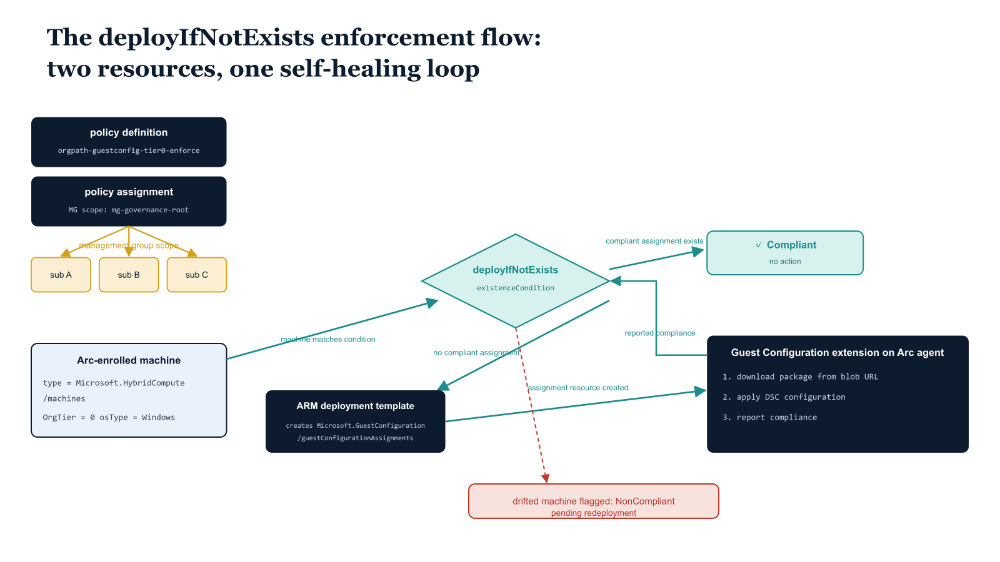

# Chapter 4 — Policy Definition and Assignment Automation

::: {.callout-note}
## In this chapter
Each Guest Configuration package needs two Azure Policy resources to be operationally complete — a definition that carries the targeting logic and a deployment template, and an assignment that puts it into effect at a scope. This chapter shows how both are deployed at the management group scope from Part Three, why the `deployIfNotExists` effect drives enforcement rather than audit-only behavior, and how the `OrgTier` tag keeps targeting simple and deterministic. It then walks the Tier0 policy definition (ARM JSON) and the script that deploys all three tiers and creates their assignments.
:::

## The Two-Resource Guest Configuration Policy Model

Azure Policy Guest Configuration requires two Azure Policy resources for each Guest Configuration package to be operationally complete:

- **A policy definition** — contains the targeting logic (which resource types, under what conditions, the policy applies to) and the deployment template that creates the Guest Configuration assignment resource on matching machines.
- **A policy assignment** — places the policy definition into effect at a specified scope.

In this architecture, both resources are deployed at the management group scope established in Part Three, which ensures that every Arc-enrolled server across all subscriptions in the organizational hierarchy is subject to the tier-appropriate Guest Configuration baseline without requiring per-subscription policy management.

{#fig-book-09-cpt-04-diagram-01 fig-alt="Engineering blueprint diagram on a white background showing the two-resource Guest Configuration policy model and its enforcement flow. On the left, two stacked federal navy (#1F3A5F) boxes labeled in monospace policy definition orgpath-guestconfig-tier0-enforce and policy assignment at management group scope mg-governance-root. An amber (#D4A017) connector marks the management group scope boundary that fans down to three subscription boxes. In the center, an Arc-enrolled machine box of type Microsoft.HybridCompute/machines with monospace tag fields type equals Microsoft.HybridCompute/machines, OrgTier equals 0, osType equals Windows. A teal (#1A9E8F) diamond labeled deployIfNotExists evaluates an existenceCondition; one teal arrow labeled compliant assignment exists leads to a green-checked Compliant state with no action, and a second teal arrow labeled no compliant assignment triggers an embedded ARM deployment template box that creates a Microsoft.GuestConfiguration/guestConfigurationAssignments resource. On the right, a navy box Guest Configuration extension on Arc agent with monospace steps download package from blob URL, apply DSC configuration, report compliance, and a teal arrow looping the reported compliance back to the deployIfNotExists diamond. A small red (#C0392B) marker flags a drifted machine as non-compliant pending redeployment. Monospace labels for all identifiers, resource types, and paths, no human figures, 16:9 landscape." width="85%"}

For enforcement rather than audit-only behavior, the policy definition uses the `deployIfNotExists` effect. This effect instructs Azure Policy to deploy an ARM template whenever a matching resource does not have the described child resource in the expected state. In the Guest Configuration context, the child resource is a `Microsoft.GuestConfiguration/guestConfigurationAssignments` resource scoped to the Arc machine.

The enforcement sequence proceeds as follows when a machine matches the policy condition — its resource type is `Microsoft.HybridCompute/machines`, its `OrgTier` tag matches the tier being enforced, and its OS type is Windows:

1. The policy evaluates whether a compliant Guest Configuration assignment already exists on that machine.
2. If no compliant assignment exists, the `deployIfNotExists` effect triggers the embedded ARM deployment template, which creates the Guest Configuration assignment resource.
3. The Guest Configuration extension on the Arc agent picks up the new assignment, downloads the package from the blob URL, applies the DSC configuration, and reports compliance back to Azure Policy.

> The `OrgTier` tag is the critical targeting filter. Using it rather than attempting to match OrgPath prefix patterns in the policy condition keeps the policy definition simple and deterministic.

The `OrgTier` tag has three possible values in this architecture — `0`, `1`, or `2` — and each policy definition targets exactly one of them. The OrgPath propagation pipeline established in Part Three writes and maintains the `OrgTier` tag on all Arc-enrolled resources as a derived attribute of their OrgTree node's tier classification, so the tag is always authoritative and consistent with the organizational structure. The policy definition does not need to understand OrgPath structure; it only needs to match on the `OrgTier` tag value that the propagation pipeline maintains.

## Tier0 Policy Definition (ARM JSON)

The policy definition below is for Tier0 enforcement. The equivalent Tier1 and Tier2 definitions follow the identical structure with the `OrgTier` tag condition value and Guest Configuration assignment name changed accordingly. All three definitions are stored in the governance repository alongside their deployment scripts.

```json
{
  "name": "orgpath-guestconfig-tier0-enforce",
  "properties": {
    "displayName": "OrgPath — Deploy Tier0 Guest Configuration hardened baseline",
    "description": "Deploys the OrgPath Tier0 Guest Configuration package to all Arc-enabled
                    machines tagged with OrgTier=0. Enforces the hardened DSC baseline
                    appropriate for infrastructure-tier servers.",
    "policyType": "Custom",
    "mode": "Indexed",
    "parameters": {
      "packageUrl": {
        "type": "String",
        "defaultValue": "https://orgpathguestconfig.blob.core.windows.net/packages/OrgPath-Tier0-Baseline.zip",
        "metadata": { "displayName": "Guest Configuration package URL" }
      },
      "packageHash": {
        "type": "String",
        "defaultValue": "REPLACE_WITH_SHA256_HASH_FROM_PUBLISH_SCRIPT",
        "metadata": { "displayName": "SHA256 hash of Guest Configuration package" }
      }
    },
    "policyRule": {
      "if": {
        "allOf": [
          {
            "field": "type",
            "equals": "Microsoft.HybridCompute/machines"
          },
          {
            "field": "tags['OrgTier']",
            "equals": "0"
          },
          {
            "field": "Microsoft.HybridCompute/machines/osType",
            "equals": "Windows"
          }
        ]
      },
      "then": {
        "effect": "deployIfNotExists",
        "details": {
          "type": "Microsoft.GuestConfiguration/guestConfigurationAssignments",
          "name": "OrgPath-Tier0-Baseline",
          "roleDefinitionIds": [
            "/providers/Microsoft.Authorization/roleDefinitions/088ab73d-1256-47ae-bea9-9de8e7131f31"
          ],
          "existenceCondition": {
            "allOf": [
              {
                "field": "Microsoft.GuestConfiguration/guestConfigurationAssignments/guestConfiguration.name",
                "equals": "OrgPath-Tier0-Baseline"
              },
              {
                "field": "Microsoft.GuestConfiguration/guestConfigurationAssignments/complianceStatus",
                "equals": "Compliant"
              }
            ]
          },
          "deployment": {
            "properties": {
              "mode": "incremental",
              "parameters": {
                "vmName":      { "value": "[field('name')]" },
                "location":    { "value": "[field('location')]" },
                "packageUrl":  { "value": "[parameters('packageUrl')]" },
                "packageHash": { "value": "[parameters('packageHash')]" }
              },
              "template": {
                "$schema": "https://schema.management.azure.com/schemas/2019-04-01/deploymentTemplate.json#",
                "contentVersion": "1.0.0.0",
                "parameters": {
                  "vmName":      { "type": "string" },
                  "location":    { "type": "string" },
                  "packageUrl":  { "type": "string" },
                  "packageHash": { "type": "string" }
                },
                "resources": [
                  {
                    "type": "Microsoft.HybridCompute/machines/providers/guestConfigurationAssignments",
                    "apiVersion": "2020-06-25",
                    "name": "[concat(parameters('vmName'),
                             '/Microsoft.GuestConfiguration/OrgPath-Tier0-Baseline')]",
                    "location": "[parameters('location')]",
                    "properties": {
                      "guestConfiguration": {
                        "name":        "OrgPath-Tier0-Baseline",
                        "version":     "1.0.0",
                        "contentUri":  "[parameters('packageUrl')]",
                        "contentHash": "[parameters('packageHash')]"
                      }
                    }
                  }
                ]
              }
            }
          }
        }
      }
    }
  }
}
```

## Policy Deployment Script

The following script deploys policy definitions for all three tiers from ARM JSON files stored in the governance repository and creates policy assignments at the specified management group scope. The deployment principal requires Policy Contributor at management group scope and Guest Configuration Resource Contributor on the Arc machine resources. In an automated pipeline context, a managed identity with these roles pre-assigned should replace the interactive device authentication shown in the development version of this script; the comment marks every such substitution point with the `# ENV-PARAM` token.

```powershell
#
# .SYNOPSIS
#     Deploys OrgPath Guest Configuration policy definitions and assignments
#     for all three organizational tiers at management group scope.
# .DESCRIPTION
#     For each tier (0, 1, 2), creates the Azure Policy definition from the
#     corresponding ARM JSON template and assigns it at the specified management
#     group scope. Uses Managed Identity authentication for the deployment
#     principal.
# .PARAMETER ManagementGroupId
#     Management group ID at which to assign the policies.
# .PARAMETER PackageUrlBase
#     Base URL for Guest Configuration packages in Azure Blob Storage.
#     Format: https://{storageAccount}.blob.core.windows.net/{container}
# .PARAMETER HashManifestPath
#     Path to JSON file containing SHA256 hashes output by the publish script.
# .NOTES
#     Requires: Az.PolicyInsights, Az.Resources modules
#     The deployment principal requires Policy Contributor at management group scope
#     and Guest Configuration Resource Contributor on Arc machines.
#
param(
    [string]$ManagementGroupId   = "mg-governance-root",        # ENV-PARAM: substitute
    [string]$PackageUrlBase      = "https://orgpathguestconfig.blob.core.windows.net/packages",
    [string]$HashManifestPath    = "C:\governance\guestconfig\package-hashes.json",
    [string]$PolicyDefinitionDir = "C:\governance\guestconfig\policies"
)

Connect-AzAccount -UseDeviceAuthentication  # ENV-PARAM: use managed identity in pipeline

$hashes = Get-Content $HashManifestPath -Raw | ConvertFrom-Json

$tiers = @(
    @{ TierNum = 0; PolicyFile = "tier0-policy.json"; DefinitionName = "orgpath-guestconfig-tier0-enforce" },
    @{ TierNum = 1; PolicyFile = "tier1-policy.json"; DefinitionName = "orgpath-guestconfig-tier1-enforce" },
    @{ TierNum = 2; PolicyFile = "tier2-policy.json"; DefinitionName = "orgpath-guestconfig-tier2-enforce" }
)

foreach ($tier in $tiers) {

    Write-Host "[Tier$($tier.TierNum)] Deploying policy definition..."

    $policyJson = Get-Content (Join-Path $PolicyDefinitionDir $tier.PolicyFile) -Raw
    $tierHash   = $hashes."Tier$($tier.TierNum)"

    if (-not $tierHash) {
        Write-Warning "  Hash not found for Tier$($tier.TierNum) — re-run package publish script."
        continue
    }

    # Inject computed SHA256 hash into policy JSON before deployment
    $policyJson = $policyJson -replace "REPLACE_WITH_SHA256_HASH_FROM_PUBLISH_SCRIPT", $tierHash
    $tempFile   = [System.IO.Path]::GetTempFileName()
    Set-Content $tempFile -Value $policyJson

    # Create or update the policy definition at management group scope
    $definition = New-AzPolicyDefinition `
        -Name                $tier.DefinitionName `
        -DisplayName         "OrgPath — Deploy Tier$($tier.TierNum) Guest Configuration baseline" `
        -Policy              $tempFile `
        -ManagementGroupName $ManagementGroupId `
        -Mode                "Indexed"

    Write-Host "  Definition ID: $($definition.PolicyDefinitionId)"

    # Create the policy assignment at management group scope
    $assignmentName = "assign-orgpath-guestconfig-tier$($tier.TierNum)"

    $params = @{
        packageUrl  = @{ value = "$PackageUrlBase/OrgPath-Tier$($tier.TierNum)-Baseline.zip" }
        packageHash = @{ value = $tierHash }
    }

    New-AzPolicyAssignment `
        -Name                  $assignmentName `
        -DisplayName           "OrgPath GuestConfig Tier$($tier.TierNum) — Management Group" `
        -Scope                 "/providers/Microsoft.Management/managementGroups/$ManagementGroupId" `
        -PolicyDefinition      $definition `
        -PolicyParameterObject $params `
        -IdentityType          "SystemAssigned" `
        -Location              "eastus" | Out-Null   # ENV-PARAM: substitute location

    Write-Host "  Assignment created: $assignmentName"
    Remove-Item $tempFile -Force
}

Write-Host "OrgPath Guest Configuration policy deployment complete."
```

::: {.callout-note title="ℹ Role Assignment Note"}
When a policy assignment uses a system-assigned managed identity with the deployIfNotExists effect, Azure Policy automatically grants the identity the roles specified in roleDefinitionIds at the assignment scope. The role GUID 088ab73d-1256-47ae-bea9-9de8e7131f31 is the Guest Configuration Resource Contributor role, which grants the managed identity permission to create Guest Configuration assignment resources on Arc machines. This role grant occurs at deployment time and does not require a separate role assignment step.
:::
