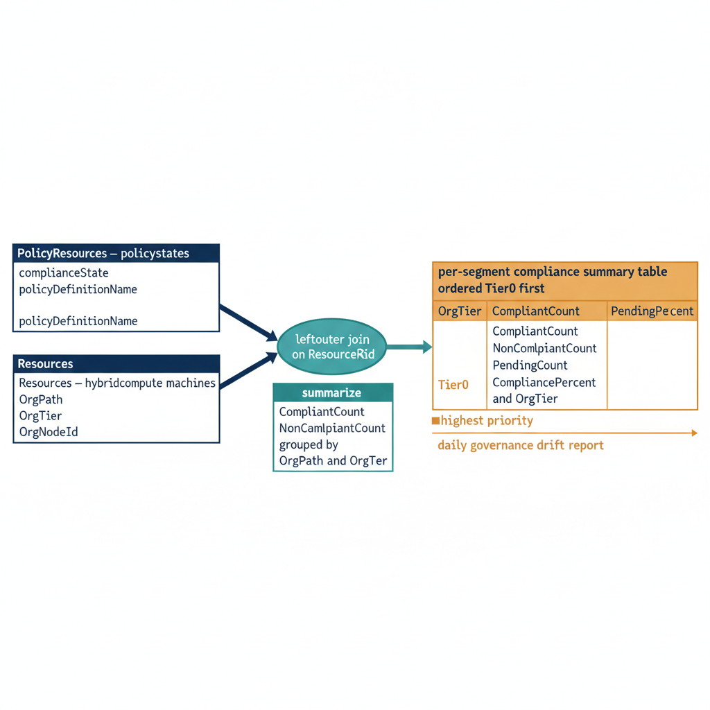

# Chapter 5 — Compliance Reporting by OrgPath Segment

::: {.callout-note}
## In this chapter
How Guest Configuration compliance results become organizational compliance
reporting. Two query surfaces — Azure Policy compliance states and Azure
Resource Graph — are joined against OrgPath and OrgTier tags to produce a
per-segment compliance summary in the daily governance drift report, and a
Sentinel analytics rule turns new non-compliance in Tier0 and Tier1 segments
into incidents already enriched with their full organizational context.
:::

## Resource Graph as the Compliance Query Plane

Guest Configuration compliance results are surfaced through two complementary query surfaces:

- **Azure Policy compliance states** record the compliance status of each policy assignment against each in-scope resource.
- **Azure Resource Graph** allows those compliance states to be joined against the properties of the resources themselves — including their OrgPath and OrgTier tags.

The governance pipeline queries both surfaces and produces a unified compliance summary organized by OrgPath segment. This summary is included in the daily governance drift report alongside the identity, device, and network drift categories produced by the pipelines established in earlier parts of this series.

> The compliance state is recorded once; OrgPath is what makes it *legible* as organizational reporting rather than a flat list of resource IDs.

{#fig-book-09-cpt-05-diagram-01 fig-alt="Engineering blueprint diagram on a white background showing the OrgPath compliance query plane. On the left, two source surfaces feed a join: a federal navy box labeled PolicyResources -- policystates with monospace fields complianceState and policyDefinitionName, and a second navy box labeled Resources -- hybridcompute machines with monospace tag fields OrgPath, OrgTier and OrgNodeId. Both arrows converge on a teal join node in the center labeled leftouter join on ResourceId, then flow into a teal summarize box listing CompliantCount, NonCompliantCount, PendingCount and CompliancePercent grouped by OrgPath and OrgTier. An arrow exits to the right into an amber per-segment compliance summary table ordered Tier0 first, with a small amber marker highlighting the top Tier0 row as highest priority. Below the table a thin amber arrow labeled daily governance drift report carries the summary onward. Monospace labels for all identifiers and field names, no human figures, 16:9 landscape, navy primary, teal secondary, amber for governance markers.", width="85%"}

The Resource Graph query below joins the `PolicyResources` table, which contains policy compliance states, against the `Resources` table, which contains Arc machine properties including OrgPath and OrgTier tags. The join produces a per-segment compliance summary showing compliant, non-compliant, and pending machine counts for each combination of OrgPath and OrgTier, organized in ascending tier order so that Tier0 non-compliance — the highest-priority concern — appears at the top of the output.

```kql
// OrgPath Guest Configuration Compliance Dashboard
// Run in Azure Resource Graph Explorer (portal or az graph query)
// Replace OrgTier tag values to match your OrgTree tier classification

PolicyResources
| where type == "microsoft.policyinsights/policystates"
| where properties.policyDefinitionName contains "orgpath-guestconfig"
| extend
    ComplianceState = tostring(properties.complianceState),
    PolicyName      = tostring(properties.policyDefinitionName),
    ResourceId      = tostring(properties.resourceId)
| join kind=leftouter (
    Resources
    | where type == "microsoft.hybridcompute/machines"
    | project
        ResourceId  = id,
        MachineName = name,
        OrgPath     = tostring(tags['OrgPath']),
        OrgTier     = tostring(tags['OrgTier']),
        OrgNodeId   = tostring(tags['OrgNodeId'])
) on ResourceId
| summarize
    CompliantCount    = countif(ComplianceState == "Compliant"),
    NonCompliantCount = countif(ComplianceState == "NonCompliant"),
    PendingCount      = countif(ComplianceState == "Pending"),
    TotalMachines     = count()
    by OrgPath, OrgTier, PolicyName
| extend CompliancePercent = round(toreal(CompliantCount) / toreal(TotalMachines) * 100, 1)
| order by OrgTier asc, CompliancePercent asc
```

## Sentinel Integration for Compliance Alerting

Compliance state reporting through Resource Graph provides the daily governance summary view. Real-time alerting on new Guest Configuration non-compliance in high-sensitivity segments requires Sentinel integration. The architecture established in Part Four routes Azure Activity Log events, including Guest Configuration assignment write operations, into the Sentinel workspace.

The KQL query below is designed for use as a Sentinel Analytics Rule with the following configuration:

| Setting | Value | Rationale |
| :--- | :--- | :--- |
| **Frequency** | 1 hour | Detects new non-compliance shortly after it is recorded |
| **Lookback window** | 4 hours | Bounds each evaluation to recent events |
| **Alert condition** | `OrgTier` is 0 or 1 | Tiers where non-compliance is an active security concern, not routine drift |

It alerts on any new non-compliant Guest Configuration state detected on a machine whose OrgTier tag is 0 or 1, which are the tiers where non-compliance represents an active security concern rather than a routine drift remediation task.

```kql
// Alert: New NonCompliant Arc machines in high-sensitivity OrgPath segments
// Feed into Sentinel Analytics Rule with frequency = 1h, lookback = 4h

AzureActivity
| where OperationNameValue == "Microsoft.GuestConfiguration/guestConfigurationAssignments/write"
| where ActivityStatusValue == "Success"
| extend
    ResourceId   = tolower(ResourceId),
    PolicyResult = tostring(parse_json(Properties).complianceStatus)
| where PolicyResult == "NonCompliant"
| join kind=inner (
    Resources
    | where type == "microsoft.hybridcompute/machines"
    | project
        ResourceId  = tolower(id),
        MachineName = name,
        OrgPath     = tostring(tags['OrgPath']),
        OrgTier     = tostring(tags['OrgTier'])
) on ResourceId
| where OrgTier in ("0", "1")    // Alert only on Tier0 and Tier1 non-compliance
| project
    TimeGenerated, MachineName, OrgPath, OrgTier,
    PolicyResult, ResourceId
| order by TimeGenerated desc
```

The Sentinel rule produces incidents that are automatically enriched with the OrgPath context of the affected machine through the incident enrichment workflow established in Part Four. When a Tier0 machine reports a non-compliant Guest Configuration state, the resulting Sentinel incident carries:

- the machine's full organizational position,
- the name of the OrgTree node it belongs to,
- the tier classification, and
- links to the associated Tier0 policy assignment.

> The on-call engineer receives an incident that already answers the first three triage questions — what machine, where in the organization, what policy — without any manual lookup.
