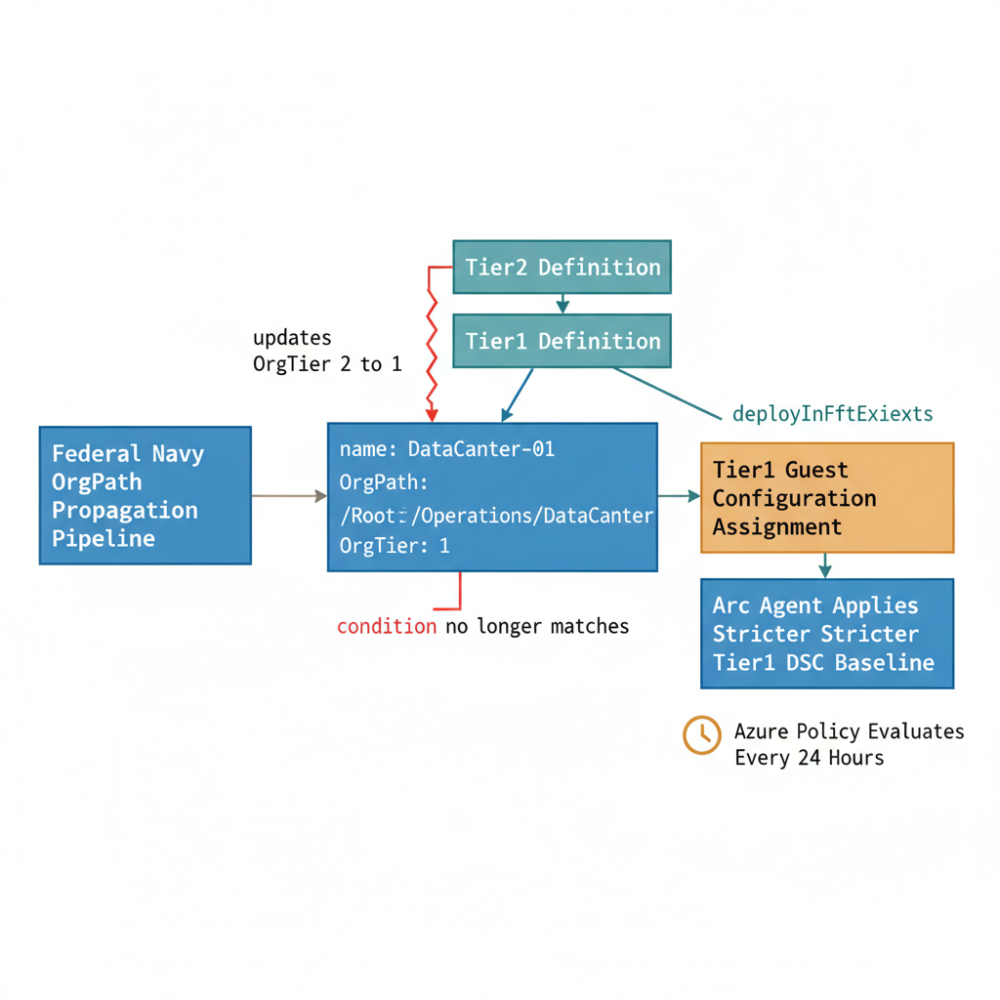

# Chapter 6 — Pipeline Integration for Tier Change Events

::: {.callout-note}
## In this chapter
When an OrgTree node's tier changes, a machine's Guest Configuration baseline must change with it — but not by editing assignments directly. This chapter shows how the OrgTier tag drives policy retargeting, why the routine 24-hour evaluation cycle is acceptable for some reclassifications but not for promotions to Tier0, the pipeline script that forces immediate remediation on a tier change, and how to handle the old tier's now-orphaned assignment.
:::

## The OrgTier Tag as the Policy Retargeting Mechanism

The dynamic governance property of this architecture — that a machine's Guest Configuration baseline changes when its OrgTree node's tier changes — works through the OrgTier tag rather than through any direct manipulation of Guest Configuration assignment resources. Each of the three policy definitions targets resources by OrgTier tag value. When the OrgPath propagation pipeline updates the OrgTier tag on a machine from 2 to 1 because its node has been reclassified, the Tier2 policy definition's condition no longer matches that machine, and the Tier1 policy definition's condition now matches it. Azure Policy detects this change on its next evaluation cycle, which runs automatically every 24 hours. The Tier1 definition's deployIfNotExists effect then deploys the Tier1 Guest Configuration assignment resource to the machine, and the Arc agent applies the stricter Tier1 DSC baseline.

{#fig-book-09-cpt-06-diagram-01 fig-alt="Engineering blueprint diagram on a white background showing how a tier change retargets a Guest Configuration baseline through the OrgTier tag. On the left, a federal navy box labeled OrgPath propagation pipeline carries an arrow labeled updates OrgTier 2 to 1 toward a central navy machine card showing monospace fields name, OrgPath /Root/Operations/DataCenter, and OrgTier 1. Above the machine card sit two teal policy-definition boxes stacked vertically, the upper one labeled Tier2 definition with a red broken connector to the machine marked condition no longer matches, the lower one labeled Tier1 definition with a solid teal connector marked condition now matches. From the Tier1 definition an arrow labeled deployIfNotExists points to an amber box labeled Tier1 Guest Configuration assignment, which points to a navy box labeled Arc agent applies stricter Tier1 DSC baseline. A small amber clock marker in the corner is labeled Azure Policy evaluates every 24 hours. Monospace labels for tags, paths, and definition names, no human figures, 16:9 landscape." width="85%"}

The 24-hour automatic evaluation cycle is acceptable for routine tier changes in Tier2-to-Tier1 reclassification scenarios where the change is planned and the new node's server population is not immediately at elevated risk. It is not acceptable for Tier-to-Tier0 reclassification, where the rationale for the promotion is typically the discovery that a server is hosting infrastructure that should have been Tier0 from the beginning — a situation that implies the machine may already be operating in a more sensitive role than its current configuration reflects. In those cases, and as a general operational practice for any tier change in a large environment, the pipeline triggers a remediation task immediately rather than waiting for the next evaluation cycle. The remediation task instructs Azure Policy to re-evaluate all in-scope resources immediately and deploy Guest Configuration assignments to any machine that is now in scope for the new assignment but does not yet have a compliant assignment resource.

The decision of whether to wait for the next cycle or force immediate remediation turns on the nature of the reclassification:

| Reclassification | Typical rationale | Evaluation strategy |
| :--- | :--- | :--- |
| **Tier2 → Tier1** | Planned change; new node population not at elevated risk | Routine 24-hour automatic cycle is acceptable |
| **Any tier → Tier0** | Discovery that the server hosts infrastructure that should always have been Tier0 | Immediate remediation — the machine may already be in a more sensitive role than its config reflects |
| **Any tier change at scale** | General operational practice in a large environment | Immediate remediation as standard practice |

> The OrgTier tag is the only thing that changes. Azure Policy's matching conditions do the rest — retargeting the baseline is a consequence of the tag update, never a direct edit to an assignment resource.

## Tier Change Remediation Pipeline Script

The following script is the pipeline extension that responds to OrgTree tier change events. It is called by the OrgPath propagation pipeline immediately after the OrgTier tag update has been applied to all resources in the changed node's branch. The script queries Resource Graph to enumerate all Arc-enrolled machines in the affected branch, confirms that the OrgTier tag has been updated on each, and then starts a Policy remediation task for the new tier's Guest Configuration assignment. The remediation task uses the ReEvaluateCompliance discovery mode, which forces a full compliance re-evaluation before determining which resources need the deployment template applied, rather than relying on the last cached compliance state.

```powershell
#
# .SYNOPSIS
#     Triggers Azure Policy remediation tasks when OrgTree node tier changes,
#     ensuring immediate Guest Configuration baseline reassignment on all
#     Arc-enrolled servers in the affected node's branch.
# .DESCRIPTION
#     Called by the OrgPath propagation pipeline when an OrgTree node's Tier
#     value changes. Identifies all Arc-enrolled servers in the affected branch
#     by querying for resources tagged with OrgPath values that start with the
#     changed node's path. For each affected machine, triggers a policy
#     remediation task against the new tier's Guest Configuration policy.
# .PARAMETER ChangedNodePath
#     OrgPath of the node whose tier changed (e.g., /Root/Operations/DataCenter).
# .PARAMETER OldTier
#     Previous tier value (0, 1, or 2).
# .PARAMETER NewTier
#     New tier value (0, 1, or 2).
# .PARAMETER ManagementGroupId
#     Management group ID where policy assignments are scoped.
# .NOTES
#     Requires: Az.PolicyInsights, Az.Resources, Az.ResourceGraph modules
#     The remediation principal requires Resource Policy Contributor role.
#
param(
    [string]$ChangedNodePath   = "",          # ENV-PARAM: provided by calling pipeline
    [int]   $OldTier           = 2,           # ENV-PARAM: provided by calling pipeline
    [int]   $NewTier           = 1,           # ENV-PARAM: provided by calling pipeline
    [string]$ManagementGroupId = "mg-governance-root"   # ENV-PARAM: substitute
)

if (-not $ChangedNodePath) { throw "ChangedNodePath parameter is required." }

Connect-AzAccount -Identity  # Managed Identity in pipeline

Write-Host "Tier change detected: $ChangedNodePath changed from Tier$OldTier to Tier$NewTier"

# Query Resource Graph for all Arc machines in the affected branch
$query = @"
Resources
| where type == 'microsoft.hybridcompute/machines'
| where tags['OrgPath'] startswith '$ChangedNodePath'
| project id, name, resourceGroup, subscriptionId,
    OrgPath = tostring(tags['OrgPath']),
    OrgTier = tostring(tags['OrgTier'])
"@

$affectedMachines = Search-AzGraph -Query $query -ManagementGroup $ManagementGroupId
Write-Host "Affected machines: $($affectedMachines.Count)"

if ($affectedMachines.Count -eq 0) {
    Write-Host "No Arc-enrolled machines found in path $ChangedNodePath — no remediation needed."
    return
}

# Update OrgTier tag on all affected machines
foreach ($machine in $affectedMachines) {
    $resource      = Get-AzResource -ResourceId $machine.id
    $tags          = $resource.Tags
    $tags['OrgTier'] = $NewTier.ToString()
    Set-AzResource -ResourceId $machine.id -Tag $tags -Force | Out-Null
    Write-Host "  Updated OrgTier tag: $($machine.name) => Tier$NewTier"
}

# Trigger remediation task for the new tier's Guest Configuration policy
$newPolicyAssignmentName = "assign-orgpath-guestconfig-tier$NewTier"
$mgScope = "/providers/Microsoft.Management/managementGroups/$ManagementGroupId"

$assignment = Get-AzPolicyAssignment -Scope $mgScope |
    Where-Object { $_.Name -eq $newPolicyAssignmentName }

if (-not $assignment) {
    Write-Error "Policy assignment '$newPolicyAssignmentName' not found at $mgScope"
    return
}

# Start a remediation task scoped to the changed node's OrgPath prefix
$remediationName = "remediate-tier$NewTier-$((Get-Date).ToString('yyyyMMddHHmm'))"

Start-AzPolicyRemediation `
    -ManagementGroupName   $ManagementGroupId `
    -Name                  $remediationName `
    -PolicyAssignmentId    $assignment.PolicyAssignmentId `
    -ResourceDiscoveryMode "ReEvaluateCompliance"

Write-Host "Remediation task started: $remediationName"

# Log event to governance repository
@{
    Timestamp        = (Get-Date -Format "o")
    Event            = "GuestConfigTierReassignment"
    ChangedNodePath  = $ChangedNodePath
    OldTier          = $OldTier
    NewTier          = $NewTier
    AffectedMachines = $affectedMachines.Count
    RemediationTask  = $remediationName
} | ConvertTo-Json -Compress |
    Out-File -Append "C:\governance\logs\guestconfig-pipeline.jsonl"   # ENV-PARAM: substitute path

Write-Host "Tier change remediation complete."
```

The script proceeds through a fixed sequence of stages, each of which is observable in its `Write-Host` output:

1. **Connect** as the pipeline's managed identity and record the detected tier change.
2. **Enumerate** every Arc-enrolled machine in the changed node's branch by matching the OrgPath tag prefix in Resource Graph; if none are found, exit without remediation.
3. **Stamp** the new OrgTier value onto each affected machine's tags.
4. **Resolve** the new tier's policy assignment at the management-group scope, failing fast if it is missing.
5. **Start** a uniquely named remediation task in `ReEvaluateCompliance` mode so compliance state is recomputed rather than read from cache.
6. **Log** a structured JSON-lines event to the governance repository for the audit trail.

> Using `ReEvaluateCompliance` is the operative choice: it forces a fresh compliance pass before the deployment template is applied, so a machine that was just retagged is not skipped on the basis of a stale cached result.

## Handling the Old Tier Assignment

One operational consideration that the tier change pipeline must address is the old tier's Guest Configuration assignment. When a machine transitions from Tier2 to Tier1, the Tier2 policy definition's condition no longer matches the machine, so Azure Policy will not maintain the Tier2 Guest Configuration assignment going forward. However, the existing Tier2 Guest Configuration assignment resource that was previously deployed to the machine may still be present as a static ARM resource. It will not actively enforce anything, because the Guest Configuration extension only applies assignments that are referenced by an active policy assignment whose condition matches the machine, but it will appear as an orphaned resource in the machine's resource list.

The remediation pipeline script can be extended to explicitly delete old-tier Guest Configuration assignment resources using the Remove-AzResource approach shown in Chapter Seven's decommission script, scoped specifically to the old tier's assignment name. Whether to include this cleanup step depends on operational preference:

- **The governance audit trail is not impaired** by the presence of an orphaned assignment resource — it enforces nothing and references no active policy.
- **Clean resource states reduce confusion** during incident investigation, where an analyst scanning a machine's resource list benefits from seeing only the assignment that actually applies.
