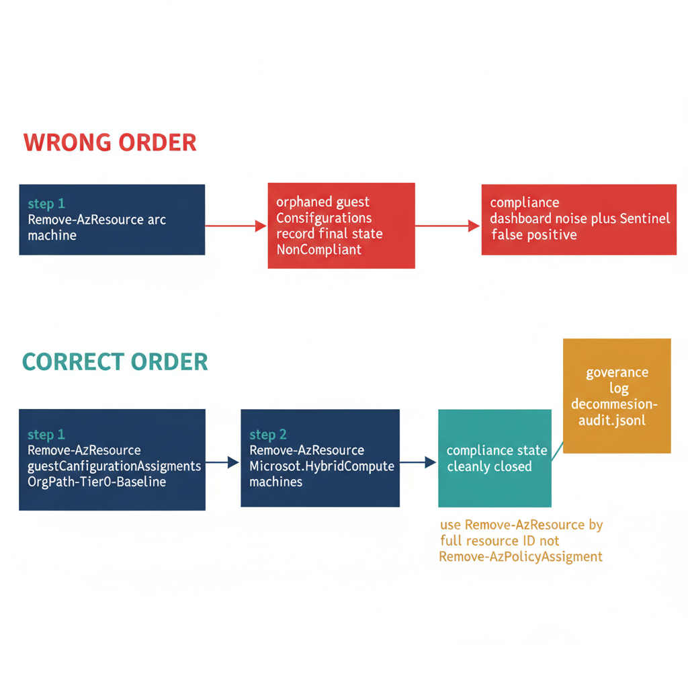

# Chapter 7 — Decommission and Cleanup

::: {.callout-note}
## In this chapter
When an OrgTree node is archived and its servers are retired, the order in which Azure resources are removed determines whether the compliance dashboard stays clean. This chapter explains the orphaned-assignment problem, establishes the correct decommission sequence — Guest Configuration assignments first, then the Arc machine resource — walks through an idempotent decommission script, and shows how to refresh compliance state after a batch so dashboards no longer show NonCompliant records for resources that no longer exist.
:::

## The Orphaned Assignment Problem

When an OrgTree node is archived and its servers are decommissioned, the standard Azure resource cleanup process — deleting the Arc machine resource — removes the machine from Arc management and from Azure Policy scope. Azure Policy will eventually reflect the deleted resource as no longer in scope, and its compliance state records will age out of the active compliance dataset. However, if the decommission is executed without first removing the Guest Configuration assignment resources from the machine, the compliance state at the moment of deletion may be recorded as NonCompliant for a resource that no longer exists.

The consequences of that intermediate state are operational, not theoretical:

- It creates **noise in the compliance dashboard**, where governance stakeholders see NonCompliant entries for machines that have already been retired.
- It can trigger **false-positive alerts** from the Sentinel rule established in Chapter Five if the deletion event is processed in a sequence that registers the assignment write before the machine deletion is reflected in the Resource Graph join.

{#fig-book-09-cpt-07-diagram-01 fig-alt="Engineering blueprint diagram on a white background contrasting two decommission orderings for an archived OrgTree node. Top row labelled WRONG ORDER in red #C0392B: a navy #1F3A5F box Remove-AzResource arc machine flows to a red box orphaned guestConfigurationAssignments record final state NonCompliant which flows to a red box compliance dashboard noise plus Sentinel false positive. Bottom row labelled CORRECT ORDER in teal #1A9E8F: a navy box step 1 Remove-AzResource guestConfigurationAssignments OrgPath-Tier0-Baseline flows to a navy box step 2 Remove-AzResource Microsoft.HybridCompute machines which flows to a teal box compliance state cleanly closed. To the right an amber #D4A017 marker box governance log decommission-audit.jsonl receives an arrow from the correct-order path. A small side note in amber reads use Remove-AzResource by full resource ID not Remove-AzPolicyAssignment. Monospace labels for cmdlets resource ids and assignment names, no human figures, 16:9 landscape." width="85%"}

The correct decommission sequence is therefore: remove the Guest Configuration assignment resources from the machine first, then remove the Arc machine resource itself. This ensures that the compliance state for the machine is cleanly closed at the assignment level before the machine resource is deleted, which prevents any intermediate window of orphaned compliance state records.

> The order of operations *is* the control. Closing the assignment-level compliance state before the machine disappears is what keeps the dashboard honest — there is no cleanup step that can retroactively erase a NonCompliant record stamped against a resource that no longer exists.

Two cmdlet choices matter here:

| Cmdlet | Role in decommission | Why |
| :--- | :--- | :--- |
| **`Remove-AzResource`** | Deletes Guest Configuration assignment resources directly, using their full resource ID | The resource ID is a predictable compound path built from the Arc machine resource ID and the Guest Configuration assignment name |
| **`Remove-AzPolicyAssignment`** | Not appropriate here | It removes policy assignments *at scope*, not the individual Guest Configuration assignment resources that live on specific machines |

## Decommission Script

```powershell
#
# .SYNOPSIS
#     Removes Guest Configuration assignments and Arc enrollment from servers
#     whose OrgTree node has been archived, completing clean decommission.
# .PARAMETER MachineName
#     Name of the Arc-enrolled machine to decommission.
# .PARAMETER MachineResourceGroup
#     Resource group of the Arc machine resource.
# .PARAMETER SubscriptionId
#     Subscription containing the Arc machine.
# .NOTES
#     Requires: Az.HybridCompute, Az.Resources modules
#     Must be run with sufficient permissions to delete Arc resources.
#     Always run the OrgPath propagation pipeline BEFORE this script to
#     confirm the machine's OrgTree node is truly archived.
#
param(
    [string]$MachineName          = "",   # ENV-PARAM: provided by calling pipeline
    [string]$MachineResourceGroup = "",   # ENV-PARAM: provided by calling pipeline
    [string]$SubscriptionId       = ""    # ENV-PARAM: provided by calling pipeline
)

Connect-AzAccount -Identity  # Managed Identity in pipeline
Set-AzContext -SubscriptionId $SubscriptionId

$arcMachineId = "/subscriptions/$SubscriptionId/resourceGroups/$MachineResourceGroup" +
                "/providers/Microsoft.HybridCompute/machines/$MachineName"

# Delete Guest Configuration assignments for all tiers (remove whichever exists)
$gcAssignmentNames = @(
    "OrgPath-Tier0-Baseline",
    "OrgPath-Tier1-Baseline",
    "OrgPath-Tier2-Baseline"
)

foreach ($gcName in $gcAssignmentNames) {

    $gcResourceId = "$arcMachineId/providers/Microsoft.GuestConfiguration" +
                    "/guestConfigurationAssignments/$gcName"

    try {
        $existing = Get-AzResource -ResourceId $gcResourceId -ErrorAction SilentlyContinue
        if ($existing) {
            Remove-AzResource -ResourceId $gcResourceId -Force | Out-Null
            Write-Host "[REMOVED] Guest Configuration assignment: $gcName from $MachineName"
        }
    } catch {
        Write-Warning "  Could not remove $gcName from $MachineName : $_"
    }
}

# Unenroll from Azure Arc (removes the machine from Arc management plane)
Remove-AzResource -ResourceId $arcMachineId -Force | Out-Null
Write-Host "[REMOVED] Arc enrollment: $MachineName"

# Log decommission event to governance repository
@{
    Timestamp     = (Get-Date -Format "o")
    Event         = "ArcMachineDecommissioned"
    Machine       = $MachineName
    ResourceGroup = $MachineResourceGroup
    SubscriptionId = $SubscriptionId
} | ConvertTo-Json -Compress |
    Out-File -Append "C:\governance\logs\decommission-audit.jsonl"   # ENV-PARAM: substitute path

Write-Host "Decommission complete for $MachineName."
```

## Post-Decommission Compliance State Refresh

After the Arc machine resource is deleted, the Azure Policy compliance engine requires time to process the deletion and remove the resource from active compliance scope. In large environments where compliance dashboards are queried frequently, it is good practice to trigger a policy compliance scan at the subscription level after a batch decommission to accelerate the processing of deleted resources. The `Start-AzPolicyComplianceScan` cmdlet initiates this scan.

> The scan is asynchronous — the pipeline must account for that rather than assume the dashboard updates the instant the scan is requested.

Because the operation is asynchronous, the pipeline has two acceptable ways to handle it:

1. **Wait for completion** using the `-AsJob` parameter and polling the job to confirm the scan has finished.
2. **Defer the dashboard refresh** by scheduling the refresh query to run with a 30-minute delay after the decommission batch completes.

Either approach ensures that the compliance dashboard presented to governance stakeholders reflects the decommissioned machines' removal rather than showing stale NonCompliant states for resources that no longer exist.
