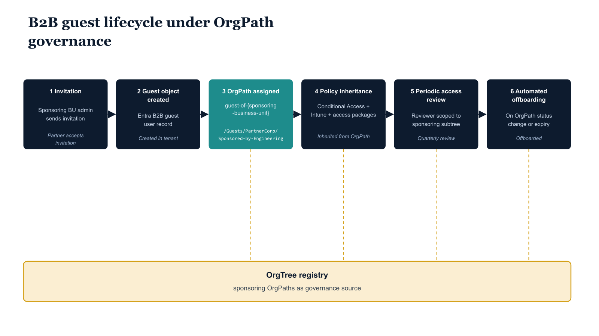

# Chapter 1 — The Guest Identity Problem

::: {.callout-note}
## In this chapter
The entire OrgPath governance model rests on one assumption — that every in-scope identity carries an OrgPath attribute — and B2B guest users break it, because no provisioning flow ever stamps one. This chapter names the two failure modes that absence produces (over-application and under-application), then introduces the Guest OrgPath Stub: a reserved `/EXTERNAL/B2B/{PartnerDomain}` path that brings external identities back under the same predicate engine, schema, and change-control toolchain as internal users. It closes with a map of the seven chapters in this document.
:::

## The Governance Blind Spot

Every architectural decision made across the first nine parts of this series rests on a single foundational assumption: every identity in scope carries an OrgPath attribute that encodes its position within the organizational hierarchy. That attribute is the predicate for every Conditional Access condition, every Lifecycle Workflow trigger, every Sentinel analytic rule join, every Purview DLP scope, and every Intune assignment filter documented to this point. The assumption holds cleanly for internal users, whose OrgPath is stamped at provisioning time and maintained by the mover pipeline thereafter.

It holds for managed devices, whose OrgPath tag is written at Autopilot enrollment. It holds for servers and Arc machines, whose OrgPath resource tag flows from the infrastructure-as-code pipeline. There is, however, a class of identity for which the assumption fails entirely: the B2B guest user introduced through Entra External ID collaboration.

When an external partner, contractor, or vendor is invited to collaborate with a team in the host tenant, Entra ID creates a guest object in the host tenant directory. That object carries the invited user's display name, email address, and a UserType value of Guest. It does not carry an OrgPath. No provisioning flow stamps one. No Lifecycle Workflow has been configured to write one, because guest users are not members of any node in the OrgTree. The result is a structural gap at the boundary of the governance architecture. The guest object exists inside the same directory that every OrgPath-based policy queries, but it is invisible to every predicate that reads the OrgPath extension attribute. The attribute is simply absent on the object.

This invisibility has two failure modes, and understanding both is prerequisite to appreciating why a purpose-built solution is necessary rather than a workaround:

- **Over-application.** Policies scoped to "all users" unintentionally capture guest objects. An Intune compliance policy, a Conditional Access grant control requiring a compliant device, or a Purview DLP rule that blocks download of sensitivity-labeled documents may have been designed with internal users in mind, but because guest objects satisfy the "all users" predicate and fail to match any OrgPath exclusion (since OrgPath is absent, not equal to some excluded value), those policies apply to guests in ways that were never intended and were never tested against the external use case.

- **Under-application.** Policies that explicitly exclude guests by checking for `UserType eq Guest` leave that entire population ungoverned by the OrgPath-based policy engine. They may fall under a separate, far simpler policy set, but that set cannot benefit from the organizational structure context that the OrgPath model provides. The guest population becomes a governance island, managed by cruder instruments than the rest of the directory.

Neither failure mode is acceptable for a production governance architecture. The first creates policy violations and potential compliance findings when internal controls are applied to external identities with different contractual and regulatory contexts. The second creates a monitoring and access control gap at precisely the boundary where external threat actors operate.

> B2B guests represent the most frequently exploited vector in cross-organizational compromise scenarios, and they are the population with the thinnest behavioral baseline in the tenant's identity protection signals.

{#fig-10-orgpath-and-cross-tenant-collaboration-diagram-02 fig-alt="Left-to-right lifecycle timeline of a B2B guest with OrgPath governance, six stages connected by horizontal arrows. Stage 1 \"Invitation\" (envelope icon above): sponsoring business unit's admin sends invitation, label \"External partner accepts invitation\". Stage 2 \"Guest object created\" (person icon): Entra B2B guest user record, label \"Guest object created in tenant\". Stage 3 \"OrgPath assigned\" (tag icon): per guest-of-{sponsoring-business-unit} pattern, label \"/Guests/PartnerCorp/Sponsored-by-Engineering\". Stage 4 \"Policy inheritance\" (lock icon): Conditional Access + Intune profiles + access packages flow from the guest OrgPath, label \"Policies inherited from OrgPath\". Stage 5 \"Periodic access review\" (magnifier icon): reviewer selection scoped by the sponsoring OrgPath subtree, label \"Quarterly review by sponsoring OrgPath\". Stage 6 \"Automated offboarding\" (door icon): triggered when sponsoring OrgPath status changes or invitation expires, label \"Offboarded on OrgPath status change\". A horizontal bar spans the bottom of the diagram labeled \"OrgTree registry — sponsoring OrgPaths as governance source\" with dashed vertical lines connecting to stages 3, 4, 5, and 6. Engineering blueprint style, white background, federal navy (#1F3A5F) for lifecycle stage boxes, teal (#1A9E8F) for guest-OrgPath operations, amber (#D4A017) for the governance source bar, monospace OrgPath strings, no human figures, 16:9 landscape." width="85%"}

## The Guest OrgPath Stub

The solution introduced in this document is the Guest OrgPath Stub. Rather than forcing guest identities into the internal OrgTree — which would be architecturally incorrect, since guests are not members of the organizational hierarchy — the stub model defines a reserved, well-known path segment outside the organizational tree but within the same attribute namespace. Every guest object receives an OrgPath value in the form /EXTERNAL/B2B/{PartnerDomain}, where PartnerDomain is the registered internet domain of the partner organization from which the guest originates. A guest from contoso-partner.com receives the stub /EXTERNAL/B2B/contoso-partner.com. A guest from an unrecognized or unregistered domain receives the stub /EXTERNAL/B2B/UNREGISTERED.

This single design decision closes the governance gap in four dimensions simultaneously:

1. **Class identification.** Because the stub begins with `/EXTERNAL`, every policy that uses a `startsWith("/EXTERNAL")` predicate can now correctly identify all guest identities as a class, enabling accurate inclusion or exclusion without relying on `UserType`.

2. **Per-partner differentiation.** Because the stub encodes the partner domain, policies can be differentiated by partner, applying stricter controls to unknown or high-risk partners and relaxed controls to partners who have completed security attestation.

3. **No new schema.** Because the stub is stored in the same OrgPath extension attribute used by internal users, no new attribute schema is required; existing dynamic group membership rules, Sentinel WatchLists, and assignment filters that already read OrgPath can be extended to cover the external population with minimal modification.

4. **Reused change-control toolchain.** Because the stub is a structured path string, the same OrgTree toolchain — the governance repository, the PR-based approval process, and the pipeline CI/CD — can govern the partner registry that maps domains to stubs, applying the same change-control rigor to partner classification changes as to internal organizational restructuring.

The stub encodes four distinct pieces of information in a single string:

| Element | Value | What it declares |
| :--- | :--- | :--- |
| First | `/EXTERNAL` | The identity is **not** a member of the internal organizational hierarchy. |
| Second | `/B2B` | The identity is a B2B collaboration identity created through Entra External ID invitation, distinguishing it from other external identity types that may be introduced in future series parts. |
| Third | `{PartnerDomain}` | Identifies the originating organization. |
| Fourth (special case) | `/EXTERNAL/B2B/UNREGISTERED` | Present only for this value: signals that the partner has not been registered in the governance partner registry and requires remediation action from the governance team before the guest can be properly classified. |

## Document Scope

This document covers seven chapters:

| Chapter | What it covers |
| :--- | :--- |
| **Two** | Defines the Guest OrgPath Stub model in full, including the partner registry schema, the invitation-time automation function that stamps the stub on newly created guest objects, and the dynamic group library that consumes the stub for policy targeting. |
| **Three** | Defines the three-tier Conditional Access architecture enabled by OrgPath stub differentiation, with complete policy definitions for unregistered, standard, and high-trust guest populations. |
| **Four** | Addresses device governance for guest users, explaining why Intune enrollment is unavailable to guests and how Cross-Tenant Access Settings and Mobile Application Management policies fill that gap, driven by the partner registry's risk tier classification. |
| **Five** | Covers the guest lifecycle through Access Reviews, describing the sponsor linkage mechanism and the automated quarterly review configuration that ensures guest accounts are actively re-validated by internal stakeholders who own each partner relationship. |
| **Six** | Presents the Sentinel monitoring architecture for the external OrgPath subtree, including a governance WatchList and three production-ready KQL queries. |
| **Seven** | Addresses the pipeline handling of partner-level change events — reclassification, domain reassignment, and partner offboarding — and closes with a synthesis of how the stub model completes the governance substrate across all identity classes in the tenant. |
