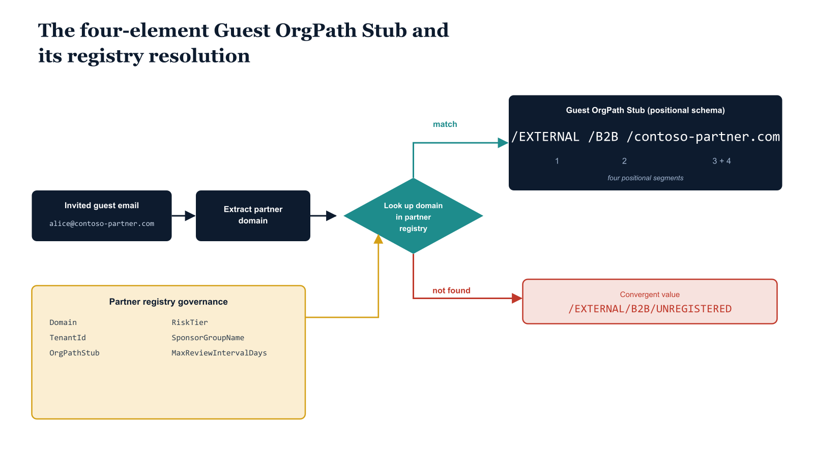

# Chapter 2 — The Guest OrgPath Stub Model

::: {.callout-note}
## In this chapter
The Guest OrgPath Stub is a governed, four-element path string that partitions external collaborators from the internal directory and carries each partner's trust tier. This chapter defines the stub's positional schema, the change-controlled partner registry that resolves it, the invitation-time Azure Function that stamps it on every guest object, and the dynamic group library that turns those stubs into uniform policy targeting scopes for the `/EXTERNAL` subtree.
:::

## Stub Anatomy and Information Encoding

The Guest OrgPath Stub is not a freeform label. It is a structured, hierarchical path string governed by the same versioning and change-control rules as every internal OrgTree node path. Its four information elements are arranged in a fixed positional schema.

| Position | Element | Purpose |
| :--- | :--- | :--- |
| 1 | `/EXTERNAL` | Reserved root segment, explicitly absent from all valid internal OrgPath values (which begin with `/ORG` or a tenant-specific root). A simple `startsWith` predicate partitions the directory into internal and external populations without ambiguity. |
| 2 | `/B2B` | Identifies the collaboration modality. Future modalities — Entra External ID self-service sign-up, SAML-federated partner identities — will each occupy a distinct second-level segment, so policy targeting can differentiate collaboration types without changing the first-level predicate. |
| 3 | `/{domain}` | The fully qualified domain name of the partner organization, lowercased and normalized, extracted from the invited user's email address. This is the primary lookup key against the partner registry. |
| 4 | `UNREGISTERED` (special case) | When the partner domain is not found in the registry, the stub is written as `/EXTERNAL/B2B/UNREGISTERED` rather than `/EXTERNAL/B2B/{unknown-domain}`. All unregistered guests converge on a single well-known value. |

> Unregistered domains must not create unique stub values that proliferate silently in the directory. Converging every unregistered guest on a single well-known value makes them trivially queryable and prevents governance drift from domain enumeration.

{#fig-book-10-cpt-02-diagram-01 fig-alt="Engineering blueprint diagram on a white background showing how an external collaborator email resolves into a four-element Guest OrgPath Stub. On the left, a federal navy (#1F3A5F) box labeled invited guest email alice at contoso-partner.com feeds an arrow into a navy parser box labeled extract partner domain. The parser feeds a teal (#1A9E8F) decision diamond labeled lookup domain in partner registry. From the diamond, an upper teal path labeled match leads to a navy stub assembly box rendering the positional schema in monospace as /EXTERNAL then /B2B then /contoso-partner.com, with each of the four segments numbered 1 through 4 below it. A lower red (#C0392B) path labeled not found leads to a red box rendering the convergent monospace value /EXTERNAL/B2B/UNREGISTERED. An amber (#D4A017) side panel labeled partner registry governance shows monospace fields Domain, TenantId, OrgPathStub, RiskTier, SponsorGroupName, MaxReviewIntervalDays connected by an amber arrow into the registry decision diamond. Monospace labels for all paths and identifiers, no human figures, 16:9 landscape." width="100%"}

## The Partner Registry

The partner registry is a JSON file, `partner-registry.json`, stored in the OrgTree governance repository alongside the organizational node definitions. It is subject to the same pull request and approval process as OrgTree node changes: a proposed addition or modification to a partner entry must pass automated JSON schema validation, must include the approval of the designated governance stakeholder for external partnerships, and must be merged by the pipeline runner account rather than by an individual contributor.

This change-control requirement is non-negotiable: the partner registry controls trust tier assignment, and a trust tier controls which Cross-Tenant Access Settings apply, which Conditional Access tier is enforced, and what the Access Review interval is.

> An unreviewed change to a partner's `RiskTier` field is equivalent to an unreviewed change to a Conditional Access policy.

The registry's schema enforces the following fields on every entry:

| Field | Meaning |
| :--- | :--- |
| `Domain` | The fully qualified partner domain, lowercased. |
| `TenantId` | The Entra ID tenant ID of the partner organization, used for Cross-Tenant Access Settings configuration. Resolved by querying the partner tenant's OpenID Connect metadata endpoint during the registration process. |
| `OrgPathStub` | The exact string to be written to the guest object's OrgPath extension attribute, following the `/EXTERNAL/B2B/{Domain}` convention. |
| `RiskTier` | `Tier1` — a high-trust partner that has completed the organization's security attestation process; or `Tier2` — a standard registered partner. |
| `AccessCategory` | A free-text classification label used for audit reporting and Purview sensitivity label scoping, distinguishing categories such as `StrategicVendor`, `ContractStaff`, and `TechnologyPartner`. |
| `SponsorGroupName` | The display name of the internal security group whose members serve as reviewers in the quarterly Access Review for that partner's guests. |
| `MaxReviewIntervalDays` | The outer bound on how long a guest from this partner can remain active without an explicit review decision. The Access Review configuration uses this value to compute recurrence intervals; the default for all registered partners is ninety days. |

## Invitation-Time Automation

The mechanism that stamps the OrgPath stub on a guest object at invitation time is an Azure Function operating under a system-assigned Managed Identity. The function is triggered either by an Event Grid subscription on the Entra ID audit log event for "Invite external user," or by a Logic App custom task connector that fires from the Entra ID Lifecycle Workflows invitation flow.

Upon invocation, the function performs the following sequence:

1. Receives the invited user's object ID and email address.
2. Extracts the partner domain from the email address.
3. Queries the partner registry JSON file from a governance storage account.
4. Performs a Microsoft Graph `PATCH` operation against the user object to write the resolved OrgPath stub to the OrgPath extension attribute.
5. If the partner domain is not found in the registry, assigns `/EXTERNAL/B2B/UNREGISTERED` and enqueues a notification to the governance team for registration review.

Every invocation emits a structured audit record to a governance log sink, recording the timestamp, the guest object ID, the resolved domain, the assigned stub, and whether the domain was registered. This audit record is consumed by the governance pipeline's compliance reporting queries in Chapter Six.

### Function Permissions and Configuration

The function's runtime dependencies are deliberately minimal:

- **Graph permission.** Requires the `User.ReadWrite.All` application permission granted to the Managed Identity via a Microsoft Graph application permission assignment.
- **No secrets.** Requires no client secret or certificate, because Managed Identity token acquisition uses the Azure Instance Metadata Service endpoint.
- **Registry access.** The partner registry file must be accessible from the function's network path; the recommended configuration is a storage account in the same resource group as the function app, with the Managed Identity granted the **Storage Blob Data Reader** role on the container that holds the registry file.
- **No caching.** The function does not cache the registry between invocations; it fetches the current version on each call, ensuring that partner registration changes take effect immediately for new invitations without requiring a function restart.

```powershell
#
# .SYNOPSIS
#     Azure Function — Guest OrgPath Stamp on B2B Invitation
# .DESCRIPTION
#     Triggered by Event Grid event for "Invite external user" in Entra ID audit log,
#     or via Logic App HTTP trigger. Extracts the partner domain from the invited
#     user's email, looks up the OrgTree partner registry, and stamps OrgPath on the
#     guest object via Microsoft Graph.
#     Authentication: System-assigned Managed Identity with User.ReadWrite.All (application).
#     Runtime: PowerShell 7.4 on Azure Functions v4.
# .NOTES
#     Set environment variables in Function App Configuration:
#     TENANT_ID              - Your Entra ID tenant ID
#     ORGPATH_EXTENSION_NAME - e.g. extension_abc123def456_OrgPath (no hyphens in app ID)
#     PARTNER_REGISTRY_URI   - URL to partner-registry.json in your governance storage account
#
using namespace System.Net
param($Request, $TriggerMetadata)

$tenantId             = $env:TENANT_ID
$orgPathExtensionName = $env:ORGPATH_EXTENSION_NAME
$partnerRegistryUri   = $env:PARTNER_REGISTRY_URI

$body       = $Request.Body | ConvertFrom-Json
$userId     = $body.userId
$guestEmail = $body.invitedUserEmailAddress   # e.g. alice@contoso-partner.com

if (-not $userId -or -not $guestEmail) {
    Push-OutputBinding -Name Response -Value ([HttpResponseContext]@{
        StatusCode = [HttpStatusCode]::BadRequest
        Body       = '{"error":"Missing userId or invitedUserEmailAddress"}'
    })
    return
}

$partnerDomain = ($guestEmail -split "@")[-1].ToLower()
Write-Host "Guest invitation: userId=$userId domain=$partnerDomain"

# Load partner registry from governance storage
try {
    $registry     = Invoke-RestMethod -Uri $partnerRegistryUri -Method Get
    $partnerEntry = $registry | Where-Object { $_.Domain -eq $partnerDomain }
} catch {
    Write-Warning "Partner registry unavailable: $_"
    $partnerEntry = $null
}

$orgPathValue = if ($partnerEntry) {
    Write-Host "Matched partner registry entry for $partnerDomain"
    $partnerEntry.OrgPathStub
} else {
    Write-Warning "Domain '$partnerDomain' not in partner registry — assigning UNREGISTERED"
    # TODO: Send alert to governance team queue for partner registration review
    "/EXTERNAL/B2B/UNREGISTERED"
}

# Obtain Managed Identity token for Microsoft Graph
$tokenUri    = "http://169.254.169.254/metadata/identity/oauth2/token" +
               "?api-version=2018-02-01&resource=https%3A%2F%2Fgraph.microsoft.com%2F"
$tokenResp   = Invoke-RestMethod -Uri $tokenUri -Headers @{ Metadata = "true" }
$bearerToken = $tokenResp.access_token

$patchPayload = @{ $orgPathExtensionName = $orgPathValue } | ConvertTo-Json

try {
    Invoke-RestMethod `
        -Uri     "https://graph.microsoft.com/v1.0/users/$userId" `
        -Method  PATCH `
        -Headers @{ Authorization = "Bearer $bearerToken"; "Content-Type" = "application/json" } `
        -Body    $patchPayload
    Write-Host "OrgPath stamped: $userId => $orgPathValue"
} catch {
    Write-Error "Graph PATCH failed for $userId : $_"
    Push-OutputBinding -Name Response -Value ([HttpResponseContext]@{
        StatusCode = [HttpStatusCode]::InternalServerError
        Body       = "{`"error`":`"Graph PATCH failed`"}"
    })
    return
}

# Emit structured audit record for the governance pipeline log
$auditRecord = [ordered]@{
    Timestamp   = (Get-Date -Format "o")
    Event       = "GuestOrgPathStamp"
    UserId      = $userId
    GuestEmail  = $guestEmail
    Domain      = $partnerDomain
    OrgPath     = $orgPathValue
    Registered  = ($null -ne $partnerEntry)
} | ConvertTo-Json -Compress
Write-Host "AUDIT: $auditRecord"

Push-OutputBinding -Name Response -Value ([HttpResponseContext]@{
    StatusCode = [HttpStatusCode]::OK
    Body       = "{`"orgPath`":`"$orgPathValue`"}"
})
```

## Dynamic Group Library for the External Subtree

The dynamic group library for the `/EXTERNAL` subtree follows the identical structural pattern established in Part Two for internal organizational groups: one branch group covering the entire subtree, and one node group per partner domain. This consistency is intentional. Every policy targeting mechanism in the series — Conditional Access include/exclude groups, Intune assignment filters, Lifecycle Workflow scope conditions, and Access Review scopes — uses Entra ID dynamic security groups as the policy attachment point. By maintaining the same group naming convention and membership rule pattern across internal and external populations, policies can be composed uniformly without requiring separate targeting logic for guests.

### Group Definitions

The `{AppIdWithoutHyphens}` placeholder below is the application ID of the directory extension registration with all hyphens removed, as required by Entra ID dynamic membership rule syntax.

| Group | Membership rule | Targeting role |
| :--- | :--- | :--- |
| `ORG-BRANCH-EXTERNAL-B2B` | `user.extension_{AppIdWithoutHyphens}_OrgPath -startsWith "/EXTERNAL/B2B"` | Include scope for any policy that should apply uniformly to all guests regardless of partner, such as MAM App Protection Policies in Chapter Four. |
| `ORG-EXTERNAL-B2B-{PartnerDomainNormalized}` | `user.extension_{AppIdWithoutHyphens}_OrgPath -eq "/EXTERNAL/B2B/contoso-partner.com"` | Per-partner node group. Domain normalized to uppercase with dots and hyphens replaced by hyphens for readability — e.g. `ORG-EXTERNAL-B2B-CONTOSO-PARTNER` for partner domain `contoso-partner.com`. |
| `ORG-EXTERNAL-B2B-UNREGISTERED` | `user.extension_{AppIdWithoutHyphens}_OrgPath -eq "/EXTERNAL/B2B/UNREGISTERED"` | Highest-priority targeting scope in the Conditional Access tier structure: unregistered guests represent the highest-risk population and must receive the most restrictive controls regardless of any other group membership. |

### Propagation Timing and the Stamp-Before-Sign-In Guarantee

Dynamic group membership evaluation for OrgPath extension attributes is subject to the same propagation latency applicable to all Entra ID dynamic groups: membership is typically computed within minutes of the attribute write, but policy enforcement at the Conditional Access layer does not wait for group membership to settle before evaluating the session. For this reason, the invitation-time function stamps the OrgPath attribute before the guest's first sign-in attempt whenever possible.

- **Event Grid trigger path** — fires on the invitation audit event before the guest receives the invitation email, providing a sufficient window for group membership to propagate before the guest activates the invitation link.
- **Logic App custom task path** — fires synchronously during the invitation workflow, providing the same guarantee for invitation flows initiated through Lifecycle Workflow custom extensions.
