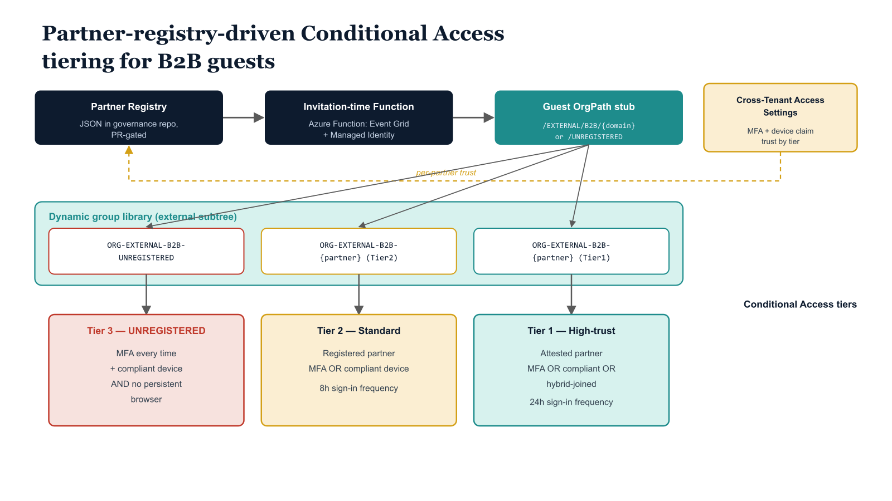

# Chapter 3 — Conditional Access for Guests by OrgPath Stub

::: {.callout-note}
## In this chapter
Once a guest's OrgPath stub encodes its partner-trust classification, Conditional Access can stop treating every external identity identically. This chapter builds three differentiated CA tiers — unregistered, standard registered, and high-trust attested — each targeting an OrgPath-backed dynamic group and applying controls calibrated to its trust level. It walks the grant and session controls for each tier, the idempotent policy-creation script, and the Report-Only rollout discipline that must precede enforcement.
:::

## The Limitation of UserType-Based Targeting

Before OrgPath stub assignment, the only Conditional Access targeting predicate available to distinguish guests from internal users is the UserType attribute, which accepts the value Guest for all B2B invitees. A Conditional Access policy scoped to all guests via UserType eq Guest applies identical controls to every external identity in the directory: the high-trust partner who has been collaborating with the organization for three years under a formal security agreement receives the same restrictions as the vendor whose domain was registered in the partner registry forty-eight hours ago and the unrecognized user whose email domain has never appeared in the registry.

> This bluntness is not an acceptable governance posture: overly restrictive controls applied uniformly to high-trust partners drive shadow-IT collaboration, while insufficiently restrictive controls applied uniformly to accommodate those partners leave the unregistered population inadequately protected.

With OrgPath stubs assigned, three differentiated Conditional Access tiers become implementable using the dynamic group targeting established in Chapter Two. Each tier maps to a specific OrgPath stub classification and applies controls calibrated to the trust level encoded in that stub. The three tiers are ordered by restriction level, and the Conditional Access engine evaluates them in that order: a guest who matches multiple groups will receive the most restrictive applicable policy, a behavior enforced by targeting each tier at the appropriate group exclusively rather than using broad include-with-exclude patterns.

The sections that follow specify each tier in full; the table below summarizes how they differ at a glance:

| Tier | Target group | Grant control | Sign-in frequency | Session posture |
| :--- | :--- | :--- | :--- | :--- |
| **Tier 3 — Unregistered** | ORG-EXTERNAL-B2B-UNREGISTERED | MFA **AND** compliant/hybrid-join device | 1 hour, `everyTime` (MFA on every token) | Persistent browser blocked; browser-only path |
| **Tier 2 — Standard registered** | RiskTier = Tier2 partner groups | MFA **OR** compliant device | 8 hours, `timeBased` | Session persistence within window; native clients in scope |
| **Tier 1 — High-trust attested** | RiskTier = Tier1 partner groups | MFA **OR** compliant **OR** hybrid-joined device | 24 hours, `timeBased` | Parity with internal Tier-2 user controls |

{#fig-10-orgpath-and-cross-tenant-collaboration-diagram-01 fig-alt="Top row, three sequential boxes: Partner Registry (JSON in governance repo, PR-gated) → Invitation-time Azure Function (Event Grid + Managed Identity) → Guest OrgPath stub (/EXTERNAL/B2B/{domain} or /UNREGISTERED). Middle band labeled \"Dynamic group library (external subtree)\" with three group boxes side-by-side: ORG-EXTERNAL-B2B-UNREGISTERED, ORG-EXTERNAL-B2B-{partner} (Tier2), ORG-EXTERNAL-B2B-{partner} (Tier1). The stub box fans down to each of the three groups. Bottom band labeled \"Conditional Access tiers\" with three policy boxes vertically aligned beneath their groups: Tier 3 — UNREGISTERED (MFA every time + compliant device AND no persistent browser); Tier 2 — Standard registered (MFA OR compliant device, 8h sign-in frequency); Tier 1 — High-trust attested (MFA OR compliant OR hybrid-joined, 24h sign-in frequency). Each group connects vertically to its matching CA tier. A separate side box \"Cross-Tenant Access Settings (MFA + device claim trust by tier)\" connects to the Partner Registry via a dashed arrow labeled \"per-partner trust\". Engineering blueprint style, white background, deepening red-to-amber-to-teal severity gradient on the three CA tiers (with red for Tier 3 reserved for highest restriction), 16:9 landscape." width="85%"}

## Tier Three — Unregistered Guests

The strictest tier targets the ORG-EXTERNAL-B2B-UNREGISTERED dynamic group. Guests in this group have arrived at the tenant boundary without a corresponding partner registration in the governance registry. Their presence may be the result of an ad-hoc invitation sent by an internal user without following the formal partner onboarding process, a domain change at the partner organization that invalidated their previous stub, or a genuine security concern. Until the governance team classifies the guest's domain, these users are treated as maximally untrusted.

Every session requires MFA re-authentication, enforced through a sign-in frequency of one hour with a frequency interval of everyTime, meaning MFA is required on every token issuance, not merely at the start of a session window. Device compliance or hybrid-join is required in addition to MFA, with grant controls combined by the AND operator rather than OR. Persistent browser sessions are blocked.

Because unmanaged personal devices cannot satisfy the device compliance requirement and no Cross-Tenant Access trust is configured for unregistered partners, this tier effectively forces unregistered guests into a browser-only path that requires MFA on every interaction and cannot maintain a persistent session.

> This is not a usable collaboration posture, which is intentional: the policy creates pressure on internal sponsors to complete the partner registration process rather than allowing unregistered guests to operate indefinitely in a degraded-access state.

## Tier Two — Standard Registered Partners

The second tier targets the group set that maps to RiskTier = Tier2 partners. These are registered partners who have been accepted into the partner registry through the governance approval process but have not yet completed the organization's security attestation program. They receive MFA as a mandatory control, applied at an eight-hour sign-in frequency window rather than per-session.

The grant control uses an OR operator between MFA and device compliance, meaning a guest who presents from a compliant device registered in their home tenant — when Cross-Tenant Access Settings for that partner include device compliance trust — can satisfy the grant control without a separate MFA prompt. Session persistence is permitted within the eight-hour window. The mobileAppsAndDesktopClients client app type is included in scope, allowing native client access alongside browser sessions, subject to the device compliance or MFA requirement.

## Tier One — High-Trust Partners

The third tier targets the group set that maps to RiskTier = Tier1 partners. These partners have completed the security attestation process, which includes verification of their own identity security posture, confirmation of MFA enforcement in their home tenant, and demonstration of device compliance standards equivalent to the host organization's requirements. The Conditional Access policy for this tier mirrors the controls applied to internal Tier-2 users from Part Three of this series: MFA or compliant device or hybrid-joined device, combined by OR, with a twenty-four-hour sign-in frequency window.

The parity with internal controls is deliberate and communicates a meaningful governance statement: a partner who has met the attestation bar is treated as organizationally equivalent to a trusted internal collaborator for the purpose of access controls, even though their OrgPath stub keeps them structurally segregated from the internal tree for all other governance purposes.

All three policies are created in enabledForReportingButNotEnforced (Report-Only) mode.

> Report-Only mode is not optional: activating a Conditional Access policy against a guest population without first observing its effect in sign-in logs is an operational risk.

Guests from a specific partner may be using application types, locations, or device configurations that trigger unexpected deny conditions. The promotion path from Report-Only to enforced is therefore deliberate:

1. **Observe.** Review sign-in logs for the policy across a fourteen-day window, checking for application types, locations, or device configurations that would trigger unexpected deny conditions.
2. **Promote under change control.** Switch the policy to enabled state as a pipeline-controlled change, gated by the same approval process as partner registry modifications.

```powershell
#
# .SYNOPSIS
#     Creates three-tier Conditional Access policies for external B2B guests,
#     differentiated by their OrgPath stub (partner trust classification).
# .NOTES
#     Requires: Connect-MgGraph -Scopes "Policy.ReadWrite.ConditionalAccess","Group.Read.All"
#     All policies are created in Report-Only mode (enabledForReportingButNotEnforced).
#     Review sign-in logs for 14 days before switching each policy state to "enabled."
#     Dynamic group IDs must exist before running — retrieve with:
#       Get-MgGroup -Filter "displayName eq 'ORG-EXTERNAL-B2B-UNREGISTERED'" | Select-Object Id
#
param(
    [string]$GroupId_Unregistered = "00000000-0000-0000-0000-aaaaaaaaaaaa",  # Substitute
    [string]$GroupId_Standard     = "00000000-0000-0000-0000-bbbbbbbbbbbb",  # Substitute
    [string]$GroupId_HighTrust    = "00000000-0000-0000-0000-cccccccccccc"   # Substitute
)

Connect-MgGraph -Scopes "Policy.ReadWrite.ConditionalAccess" -NoWelcome

function New-CaPolicy([hashtable]$Body) {
    Invoke-MgGraphRequest `
        -Method      POST `
        -Uri         "https://graph.microsoft.com/v1.0/identity/conditionalAccess/policies" `
        -Body        ($Body | ConvertTo-Json -Depth 10) `
        -ContentType "application/json"
}

# Tier 3 — UNREGISTERED guests (maximum restriction)
$result1 = New-CaPolicy @{
    displayName = "CA-EXT-001 — Unregistered B2B Guests — Maximum Restriction"
    state       = "enabledForReportingButNotEnforced"
    conditions  = @{
        users        = @{ includeGroups = @($GroupId_Unregistered) }
        applications = @{ includeApplications = @("All") }
        clientAppTypes = @("all")
    }
    grantControls = @{
        operator        = "AND"
        builtInControls = @("mfa", "compliantDevice")
    }
    sessionControls = @{
        signInFrequency = @{
            value             = 1; type = "hours"
            frequencyInterval = "everyTime"; isEnabled = $true
        }
        persistentBrowser = @{ mode = "never"; isEnabled = $true }
    }
}
Write-Host "[CREATED] CA-EXT-001: $($result1.id)"

# Tier 2 — Standard registered partners
$result2 = New-CaPolicy @{
    displayName = "CA-EXT-002 — Standard B2B Partners — Compliant MFA"
    state       = "enabledForReportingButNotEnforced"
    conditions  = @{
        users        = @{ includeGroups = @($GroupId_Standard) }
        applications = @{ includeApplications = @("All") }
        clientAppTypes = @("browser", "mobileAppsAndDesktopClients")
    }
    grantControls = @{
        operator        = "OR"
        builtInControls = @("mfa", "compliantDevice")
    }
    sessionControls = @{
        signInFrequency = @{
            value             = 8; type = "hours"
            frequencyInterval = "timeBased"; isEnabled = $true
        }
    }
}
Write-Host "[CREATED] CA-EXT-002: $($result2.id)"

# Tier 1 — High-trust partners
$result3 = New-CaPolicy @{
    displayName = "CA-EXT-003 — High-Trust B2B Partners — Standard Internal Controls"
    state       = "enabledForReportingButNotEnforced"
    conditions  = @{
        users        = @{ includeGroups = @($GroupId_HighTrust) }
        applications = @{ includeApplications = @("All") }
        clientAppTypes = @("browser", "mobileAppsAndDesktopClients")
    }
    grantControls = @{
        operator        = "OR"
        builtInControls = @("mfa", "compliantDevice", "domainJoinedDevice")
    }
    sessionControls = @{
        signInFrequency = @{
            value             = 24; type = "hours"
            frequencyInterval = "timeBased"; isEnabled = $true
        }
    }
}
Write-Host "[CREATED] CA-EXT-003: $($result3.id)"
Write-Host "All external CA policies created in Report-Only mode."
```

::: {.callout-note title="⚠ Operational Note — CA Policy Ordering and Exclusion Hygiene"}
Each tier policy must include the emergency access (break-glass) accounts in its exclude list, consistent with the exclusion pattern applied to all CA policies in the series. Confirm that the ORG-EXTERNAL-B2B-UNREGISTERED, standard-tier, and high-trust-tier groups are mutually exclusive by construction — a guest can only hold one OrgPath value, so membership in these groups is already exclusive. No additional exclusion logic between policies is required.
:::
