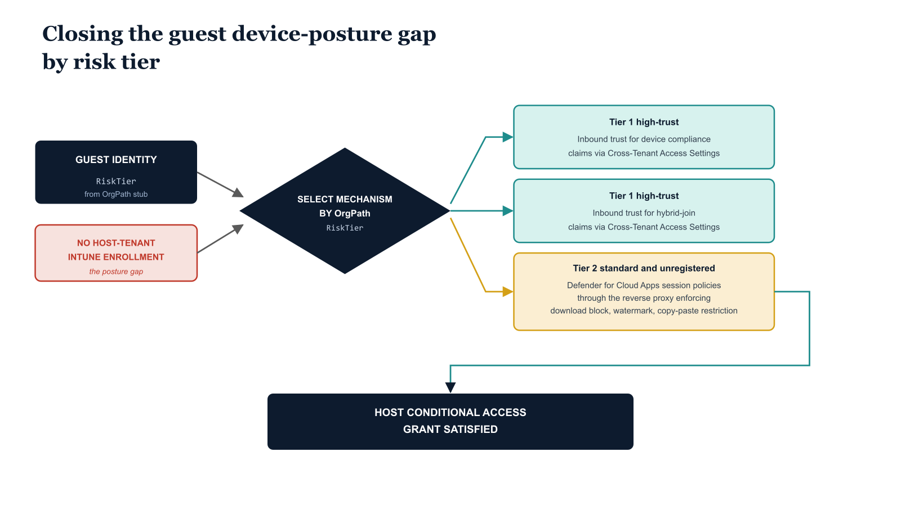

# Chapter 4 — Device Governance and Cross-Tenant Access Settings

::: {.callout-note}
## In this chapter
Guests cannot enroll devices into the host tenant's Intune, which leaves a device-posture gap against every Conditional Access grant that demands a compliant device. This chapter explains why that boundary exists, the three trust mechanisms that close the gap — inbound compliance-claim trust, hybrid-join trust, and Defender for Cloud Apps session control — and how the correct choice is selected by the partner's OrgPath risk tier. It then shows the Cross-Tenant Access Settings synchronization script and the MAM-without-enrollment policy that contains data at the application layer on unmanaged guest devices.
:::

## Why Device Enrollment Is Unavailable to Guests

The Intune device enrollment architecture established in Part Six of this series is scoped to identities that are members of the host tenant as full users. Guests cannot enroll devices into the host tenant's Intune because the enrollment process requires a user identity in the host tenant with a sufficient license assignment, and guest objects are not eligible for Intune license assignment under the B2B collaboration model. This is a Microsoft-imposed boundary, not a local configuration decision, and it is architecturally correct: the host organization should not be responsible for managing the device lifecycle of an external contractor's personal or employer-issued laptop. The device management responsibility remains with the guest's home organization or the guest themselves.

> This is a Microsoft-imposed boundary, not a local configuration decision — and it is architecturally correct. The host organization should not own the device lifecycle of an external contractor's laptop.

This boundary creates a device posture gap. Every internal Conditional Access grant control that requires a compliant device is satisfied by the Intune compliance policy infrastructure documented in Part Six. For guests, that infrastructure is inaccessible. Three mechanisms are available to address this gap, and the correct choice depends on the partner's risk tier as encoded in the OrgPath stub. Understanding all three mechanisms and their applicability is essential before configuring either Cross-Tenant Access Settings or Conditional Access grant controls for the guest population.

{#fig-book-10-cpt-04-diagram-01 fig-alt="Engineering blueprint diagram on a white background showing how the guest device-posture gap is closed by partner risk tier. On the left, a federal navy box labeled GUEST IDENTITY carries a monospace OrgPath stub field RiskTier, and a red box labeled NO HOST-TENANT INTUNE ENROLLMENT marks the posture gap. A navy decision diamond reads SELECT MECHANISM BY OrgPath RiskTier and fans out to three lanes. Lane one, a teal box, reads Tier1 high-trust, inbound trust for device compliance claims via Cross-Tenant Access Settings. Lane two, a teal box, reads Tier1 high-trust, inbound trust for hybrid-join claims via Cross-Tenant Access Settings. Lane three, an amber box, reads Tier2 standard and unregistered, Defender for Cloud Apps session policies through the reverse proxy enforcing download block, watermark, and copy-paste restriction. All three lanes converge on a navy box labeled HOST CONDITIONAL ACCESS GRANT SATISFIED. Monospace labels throughout, no human figures, 16:9 landscape.} width="85%"}

## Device Trust Mechanisms for Guests

Three mechanisms close the device-posture gap. Each maps to a different partner risk tier, and accepting a higher-trust mechanism for a lower-trust partner is equivalent to accepting unverified security attestations as access-control inputs.

| Mechanism | How it works | Applicable tier | Where configured |
| :--- | :--- | :--- | :--- |
| **Inbound device-compliance trust** | The partner manages devices in its own Intune and Entra ID issues a compliance claim in the access token; the host accepts that claim as equivalent to its own | **Tier1** high-trust partners only | Cross-Tenant Access Settings |
| **Hybrid-join trust** | The partner's devices are hybrid-joined to an on-premises AD domain; the host trusts the inbound hybrid-join claim | **Tier1** high-trust partners only | Cross-Tenant Access Settings |
| **Conditional Access App Control** | Browser sessions are routed through the Defender for Cloud Apps reverse proxy, enforcing data-protection controls regardless of device state | **Tier2** standard partners and unregistered guests (mechanism of last resort) | Conditional Access + Defender for Cloud Apps session policies |

**Inbound device-compliance trust** is the first mechanism. When a partner organization manages their devices in their own Intune and marks those devices as compliant, Entra ID in the partner's home tenant issues a device compliance claim in the access token presented to the host tenant. By default, the host tenant does not trust this claim — it originated from an external authority and has not been verified against the host tenant's own compliance policies.

Cross-Tenant Access Settings for a specific partner tenant can be configured to accept inbound device compliance claims, at which point the host tenant's Conditional Access engine treats the compliance claim from the partner tenant as equivalent to a compliance claim from the host tenant's own Intune. This mechanism is only appropriate for Tier1 high-trust partners who have demonstrated that their device management policies meet the host organization's security standards.

> Accepting compliance claims from a partner whose device-management posture has not been verified is equivalent to accepting unverified security attestations as access-control inputs.

**Hybrid-join trust** is the second mechanism. If the partner's devices are hybrid-joined to an on-premises Active Directory domain and that join claim is presented in the token, the host tenant can be configured to trust inbound hybrid-join claims from specific partner tenants. This mechanism is applicable where partner organizations operate hybrid environments and where the host organization has verified the partner's domain join security posture. Like compliance trust, hybrid-join trust is available in Cross-Tenant Access Settings and is appropriate only for Tier1 partners.

**Conditional Access App Control** with Microsoft Defender for Cloud Apps session policies, applied through the reverse proxy, is the third mechanism. When a guest accesses a web application through a browser session, Conditional Access can route the session through the Defender for Cloud Apps reverse proxy. Session policies applied at the proxy layer enforce data protection controls regardless of the device's management state:

- Document downloads can be blocked or watermarked.
- Copy-paste from web applications to unmanaged clipboard targets can be blocked.
- Upload operations from unverified locations can be restricted.

This is the mechanism of last resort for unregistered guests and Tier2 standard partners who present from devices that cannot satisfy either compliance or hybrid-join requirements. Browser sessions through the proxy are more secure than allowing uncontrolled native client access, and session policies can be differentiated by the OrgPath stub of the authenticated guest identity, enabling stricter policies for unregistered guests than for registered Tier2 partners.

## Cross-Tenant Access Settings Synchronization

Cross-Tenant Access Settings must be configured per partner tenant ID, not per domain. The partner registry includes the TenantId field for exactly this reason. The following script reads the partner registry and creates or updates one Cross-Tenant Access Settings entry per registered partner, setting inbound trust flags based on the partner's RiskTier classification. The B2B collaboration inbound policy is set to allow all users and all applications for all registered partners, because access restriction at the application level is handled by the Conditional Access tier policies and by application assignment rather than by the Cross-Tenant Access blunt instrument.

The trust flags assigned by tier are as follows:

| RiskTier | MFA claim trust | Device-compliance trust | Hybrid-join trust |
| :--- | :--- | :--- | :--- |
| **Tier1** (high-trust) | Yes | Yes | Yes |
| **Tier2** (standard) | Yes | No | No |
| **Unregistered** | None — no Cross-Tenant Access entry; default policy applies | None | None |

Unregistered partners, by definition, have no Cross-Tenant Access Settings entry, which means the default Cross-Tenant Access policy applies to them. The default policy should be configured to trust no claims from unverified external tenants, reinforcing the unregistered tier's maximum-restriction posture.

```powershell
#
# .SYNOPSIS
#     Synchronizes Entra ID Cross-Tenant Access Settings from the OrgTree
#     partner registry. Creates or updates one partner configuration per
#     registry entry based on RiskTier.
# .NOTES
#     Requires: Connect-MgGraph with scopes:
#     "Policy.ReadWrite.CrossTenantAccess","CrossTenantInformation.ReadBasic.All"
#     TenantId for each partner must be in the registry.
#     If unknown, resolve with:
#       (Invoke-RestMethod "https://login.microsoftonline.com/{domain}/v2.0/.well-known/openid-configuration").issuer
#
param(
    [string]$PartnerRegistryPath = "C:\governance\orgtree\partner-registry.json"  # Substitute
)

Connect-MgGraph -Scopes "Policy.ReadWrite.CrossTenantAccess" -NoWelcome

$registry = Get-Content $PartnerRegistryPath -Raw | ConvertFrom-Json

foreach ($partner in $registry) {
    if (-not $partner.TenantId) {
        Write-Warning "No TenantId for $($partner.Domain) — skipping"
        continue
    }

    # Tier1 = high-trust: trust both MFA and device compliance claims from partner
    # Tier2 = standard:   trust MFA claims only
    $trustMfa         = $true
    $trustCompliance  = ($partner.RiskTier -eq "Tier1")
    $trustHybridJoin  = ($partner.RiskTier -eq "Tier1")

    $policyBody = @{
        tenantId     = $partner.TenantId
        inboundTrust = @{
            isMfaAccepted                       = $trustMfa
            isCompliantDeviceAccepted           = $trustCompliance
            isHybridAzureADJoinedDeviceAccepted = $trustHybridJoin
        }
        b2bCollaborationInbound = @{
            usersAndGroups = @{
                accessType = "allowed"
                targets    = @(@{ target = "AllUsers"; targetType = "user" })
            }
            applications = @{
                accessType = "allowed"
                targets    = @(@{ target = "AllApplications"; targetType = "application" })
            }
        }
    }

    # Check if policy already exists
    try {
        Get-MgPolicyCrossTenantAccessPolicyPartner `
            -CrossTenantAccessPolicyPartnerTenantId $partner.TenantId -ErrorAction Stop | Out-Null
        Update-MgPolicyCrossTenantAccessPolicyPartner `
            -CrossTenantAccessPolicyPartnerTenantId $partner.TenantId `
            -BodyParameter $policyBody
        Write-Host "[UPDATED] $($partner.Domain) (Tier: $($partner.RiskTier))"
    } catch {
        New-MgPolicyCrossTenantAccessPolicyPartner -BodyParameter $policyBody | Out-Null
        Write-Host "[CREATED] $($partner.Domain) (Tier: $($partner.RiskTier))"
    }
}
Write-Host "Cross-Tenant Access Settings synchronization complete."
```

## MAM-Only Policy Targeting for Guest Devices

Because guest users cannot enroll in the host tenant's Intune, the mobile device management (MDM) enrollment-based App Protection Policy assignment model used for internal users is unavailable for the guest population. However, App Protection Policies configured for Mobile Application Management without enrollment (MAM-WE) can target any Entra ID identity in the directory, including guests, because they are enforced at the application layer by the Intune SDK built into managed applications rather than at the device layer by the MDM agent. The host organization's Intune instance can therefore publish MAM-WE App Protection Policies targeting the ORG-BRANCH-EXTERNAL-B2B dynamic group, and those policies will be delivered to managed applications — Microsoft Teams, Microsoft 365 apps, SharePoint — running on the guest's unmanaged device the next time the guest authenticates to that application.

The MAM-WE policy targeting guests should enforce the following data protection controls at minimum:

- Block clipboard operations from policy-managed applications to unmanaged applications on the device.
- Require a PIN or biometric for application launch.
- Disable backup of managed application data to personal cloud storage services.
- Restrict screen capture within managed applications.
- Block the "Save As" function to locations not controlled by the host organization's managed storage policies.

These controls do not require device enrollment, do not require the device to appear in Intune's device list, and do not conflict with the guest's home organization's MDM policy on the same device. They operate as an additional application-layer containment boundary for data accessed through the collaboration platform, ensuring that even if the guest's device is compromised or unmanaged, data accessed through managed applications cannot be trivially exfiltrated to unmanaged storage or applications on the same device.
