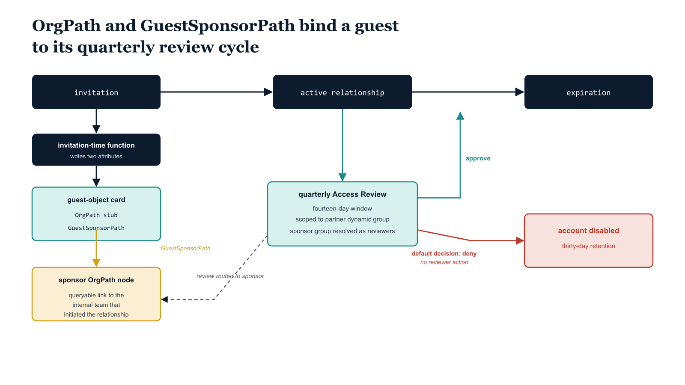

# Chapter 5 — Guest Lifecycle: Access Reviews and Expiration

::: {.callout-note}
## In this chapter
B2B guest identities pass through three lifecycle stages — invitation, active relationship, and expiration — and a governance failure at each produces a different risk profile. This chapter shows how the OrgPath stub and a companion GuestSponsorPath attribute create a permanent, queryable link between every guest and the internal position that sponsored it, then walks through the quarterly Access Review configuration that uses that link to route review decisions, deny by default, and disable stale accounts on a perpetual cadence.
:::

## Three Lifecycle Stages

Every B2B guest identity passes through three lifecycle stages, and governance failures at any stage produce materially different risk profiles.

| Stage | What it is | The governance question |
| :--- | :--- | :--- |
| **Invitation** | The access a guest receives at invitation time is the access they will hold until something explicitly removes it. | Was the relationship recorded with an accountable internal stakeholder who can review it when circumstances change? |
| **Active relationship** | The guest is actively collaborating, accessing resources, and generating activity signals in the tenant's logs. | Not *whether* the guest should have access — that was answered at invitation — but whether the **access scope and trust level remain appropriate** as personnel change and the collaboration evolves. |
| **Expiration** | Partner contracts end, projects conclude, and vendor relationships are replaced. | Is there an explicit mechanism to end access, or do accounts survive indefinitely after the relationship has ended? |

The invitation stage is unforgiving precisely because it sets a default that persists. If the invitation process does not record who initiated the collaboration relationship and why, there is no internal stakeholder who can be held accountable for reviewing that access when circumstances change.

> Stale guest accounts are a persistent attack surface: they retain access to the resources tied to their original invitation, they may hold group memberships accumulated over the course of the relationship, and they are rarely monitored because their owners have disengaged.

{#fig-book-10-cpt-05-diagram-01 fig-alt="Engineering blueprint diagram on a white background showing the B2B guest governance lifecycle as a closed loop. Across the top, three federal navy (#1F3A5F) stage boxes connected by arrows read left to right: invitation, active relationship, expiration, with monospace stage labels. Below the invitation box, a navy box labeled invitation-time function writes two attributes onto a teal (#1A9E8F) guest-object card: OrgPath stub and GuestSponsorPath. An arrow from GuestSponsorPath points to an amber (#D4A017) box labeled sponsor OrgPath node, showing the queryable link to the internal team that initiated the relationship. From the active-relationship stage, an arrow feeds a teal box labeled quarterly Access Review, fourteen-day window, scoped to the partner dynamic group, with the sponsor group resolved as reviewers. From the Access Review box two outcome arrows branch: a teal arrow labeled approve loops back to active relationship, and a red (#C0392B) arrow labeled default decision deny, no reviewer action leads to a red box labeled account disabled, thirty-day retention. A dashed return arrow runs from the review box back to the sponsor OrgPath node, labeled review routed to sponsor. All component labels in monospace, no human figures, 16:9 landscape." width="100%"}

## Sponsor Linkage at Invitation Time

The invitation-time automation function documented in Chapter Two writes the OrgPath stub to the OrgPath extension attribute. A second extension attribute, configured on the same directory extension registration and named with a GuestSponsorPath suffix, records the OrgPath value of the internal user who initiated the invitation. This attribute is populated from the audit event payload, which includes the initiating user's object ID.

The function resolves that object ID to an OrgPath value using a Graph GET against the initiating user's profile, then writes the resolved OrgPath to the GuestSponsorPath attribute on the guest object. The result is a permanent, queryable link between the guest identity and the internal organizational position responsible for the relationship. When an Access Review is initiated for that guest, the system knows which internal team sponsored the relationship and can route review responsibility to the appropriate group.

When a guest's OrgPath stub changes due to a partner reclassification event, the system can notify the sponsor OrgPath node that the relationship has been reclassified and that a review may be warranted outside the normal quarterly cycle.

## Quarterly Access Review Configuration

For each registered partner domain, the governance pipeline creates one recurring Access Review definition targeting the partner's dynamic group. The review is scoped to the transitive members of the ORG-EXTERNAL-B2B-{PartnerDomain} group, which is to say all guests carrying the corresponding OrgPath stub. Reviewers are the members of the partner's SponsorGroupName security group from the registry, fetched as a Microsoft Graph transitive members query at review time so that sponsor group membership changes are reflected without requiring review definition updates.

If the sponsor group cannot be resolved at review creation time — because the named group does not exist in the directory — the script falls back to the partner dynamic group's owners as reviewers, which typically includes the governance administrator account that created the group, and logs a warning for remediation.

The review settings encode a deliberately conservative governance posture, where inaction resolves toward removal rather than retention:

| Setting | Value | Effect |
| :--- | :--- | :--- |
| `instanceDurationInDays` | `14` | Gives sponsors a two-week window to complete their decisions. |
| `defaultDecision` | `Deny` | Any guest account for which the reviewer takes no action — because the reviewer is unavailable, has left the organization, or simply fails to respond — is automatically denied at the close of the window. |
| `autoApplyDecisionsEnabled` | `true` | Deny decisions are applied without requiring a manual administrative step. |
| apply action | `disableAndDeleteUserApplyAction` | Disables the guest account immediately on deny rather than deleting it, preserving the object for the thirty-day retention window required for audit-trail continuity and for the cleanup pipeline to confirm deletion afterward. |
| `recommendationsEnabled` | `true` | Surfaces Entra ID's activity-based recommendation (approve or deny based on whether the guest signed in during the past thirty days) to assist reviewers across large partner populations. |
| recurrence | `absoluteMonthly`, interval `3`, range `noEnd` | Creates a perpetual quarterly cadence that continues until the partner's registry entry is removed and the review definition is decommissioned by the pipeline. |

> The default decision is **Deny**. A guest whose sponsor never responds does not quietly retain access — at the close of the review window the account is automatically disabled. Silence resolves toward removal, not toward survival.

```powershell
#
# .SYNOPSIS
#     Creates quarterly Access Reviews for each B2B partner group, with
#     reviewers drawn from the partner's sponsor security group.
# .NOTES
#     Requires: Connect-MgGraph -Scopes "AccessReview.ReadWrite.All","Group.Read.All"
#     Requires Entra ID Governance license for Access Reviews.
#     defaultDecision = "Deny" means: if reviewer takes no action, access is denied.
#     autoApplyDecisionsEnabled = true applies the decision automatically at review close.
#     disableAndDeleteUserApplyAction disables the account immediately on Deny;
#     permanent deletion occurs 30 days later via the governance cleanup script.
#
param(
    [string]$PartnerRegistryPath = "C:\governance\orgtree\partner-registry.json"  # Substitute
)

Connect-MgGraph -Scopes "AccessReview.ReadWrite.All","Group.Read.All" -NoWelcome

$registry = Get-Content $PartnerRegistryPath -Raw | ConvertFrom-Json

# Start next review cycle on the coming Monday
$daysToMonday = ((1 - [int](Get-Date).DayOfWeek + 7) % 7)
if ($daysToMonday -eq 0) { $daysToMonday = 7 }
$startDate = (Get-Date).AddDays($daysToMonday).ToString("yyyy-MM-dd")

foreach ($partner in $registry) {

    # Resolve the partner's Entra ID dynamic group
    $groupName = "ORG-EXTERNAL-B2B-$($partner.Domain -replace '[\.\-]','-')"
    $group     = Get-MgGroup -Filter "displayName eq '$groupName'" -ErrorAction SilentlyContinue
    if (-not $group) {
        Write-Warning "Group '$groupName' not found — skipping $($partner.Domain)"
        continue
    }

    # Resolve the sponsor reviewer group
    $sponsorGroup = Get-MgGroup `
        -Filter "displayName eq '$($partner.SponsorGroupName)'" `
        -ErrorAction SilentlyContinue

    $reviewers = if ($sponsorGroup) {
        @(@{
            query     = "/groups/$($sponsorGroup.Id)/transitiveMembers"
            queryType = "MicrosoftGraph"
        })
    } else {
        Write-Warning "Sponsor group '$($partner.SponsorGroupName)' not found — using group owners"
        @(@{ query = "/groups/$($group.Id)/owners"; queryType = "MicrosoftGraph" })
    }

    $reviewName = "AccessReview-External-$($partner.Domain)-Quarterly"

    # Skip if already exists
    $exists = Get-MgIdentityGovernanceAccessReviewDefinition `
        -Filter "displayName eq '$reviewName'" -ErrorAction SilentlyContinue
    if ($exists) {
        Write-Host "[EXISTS] $reviewName"
        continue
    }

    $body = @{
        displayName            = $reviewName
        descriptionForAdmins   = "Quarterly access review for B2B guests from $($partner.Domain)"
        descriptionForReviewers = "Review each guest user's continued need for access. Deny removes their access automatically."
        scope      = @{
            query     = "/groups/$($group.Id)/transitiveMembers"
            queryType = "MicrosoftGraph"
        }
        reviewers  = $reviewers
        settings   = @{
            mailNotificationsEnabled        = $true
            reminderNotificationsEnabled    = $true
            justificationRequiredOnApproval = $true
            defaultDecisionEnabled          = $true
            defaultDecision                 = "Deny"
            instanceDurationInDays          = 14
            autoApplyDecisionsEnabled       = $true
            recommendationsEnabled          = $true
            applyActions                    = @(
                @{ "@odata.type" = "#microsoft.graph.disableAndDeleteUserApplyAction" }
            )
            recurrence = @{
                pattern = @{ type = "absoluteMonthly"; interval = 3 }
                range   = @{ type = "noEnd"; startDate = $startDate }
            }
        }
    } | ConvertTo-Json -Depth 10

    Invoke-MgGraphRequest `
        -Method      POST `
        -Uri         "https://graph.microsoft.com/v1.0/identityGovernance/accessReviews/definitions" `
        -Body        $body `
        -ContentType "application/json" | Out-Null

    Write-Host "[CREATED] $reviewName (reviewers: $($partner.SponsorGroupName))"
}

Write-Host "Guest access review configuration complete."
```

::: {.callout-note title="ⓘ License Requirement"}
Entra ID Governance licensing is required for the Access Review features used in this configuration, specifically for the autoApplyDecisionsEnabled setting, the disableAndDeleteUserApplyAction apply action, and the recommendations engine. Confirm that the Entra ID Governance license is applied at the tenant level before deploying this script. Guest users themselves do not consume Entra ID Governance seats for Access Review purposes — only the host tenant's configuration requires the license.
:::
