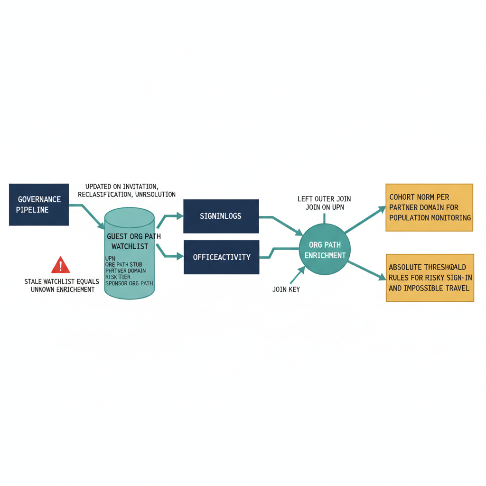

# Chapter 6 — Sentinel Monitoring for the External OrgPath Subtree

::: {.callout-note}
## In this chapter
Guest users arrive with no behavioral baseline, so the deviation-from-baseline monitoring that governs internal users does not work on the external subtree. This chapter establishes the two approaches that do — population-level cohort norms and absolute threshold rules — anchored on the GuestOrgPathWatchlist that enriches every query with OrgPath context. It then presents three production KQL queries: a sign-in summary dashboard, a high-risk unregistered-guest alert, and a cohort-relative data-volume anomaly detector.
:::

## Why the External Subtree Is a High-Priority Monitoring Surface

The monitoring architecture built across Parts Seven and Eight of this series is organized around behavioral baselines. An internal user's sign-in behavior, application access patterns, data volume, and resource access sequence have been observed over months or years, and Sentinel analytics rules can identify deviations from that baseline with meaningful signal-to-noise ratios. The baseline is an asset that accumulates through sustained observation.

> A guest who signed in for the first time yesterday has a behavioral history of exactly one session. Sentinel's user entity behavioral analytics engine can do very little with a single data point.

This structural deficit means that the external OrgPath subtree cannot be monitored effectively using the same deviation-from-baseline approach that governs internal user monitoring. Two alternative approaches are required:

- **Population-level monitoring** — establishes cohort norms for a given partner domain, providing a statistical reference frame where no personal baseline exists.
- **Threshold-based monitoring** — flags absolute behaviors (accessing an unusually large number of files, signing in from an impossible-travel location, presenting a risky sign-in signal) without relying on a personal baseline.

{#fig-book-10-cpt-06-diagram-01 fig-alt="Engineering blueprint diagram on a white background depicting how guest sign-in monitoring works without a personal behavioral baseline. On the left a federal navy box labeled governance pipeline writes into a teal cylinder labeled GuestOrgPathWatchlist holding columns UPN, OrgPath stub, PartnerDomain, RiskTier, SponsorOrgPath; an arrow from the pipeline is labeled updated on invitation, reclassification, UNREGISTERED resolution. In the center two navy log stores labeled SigninLogs and OfficeActivity each connect by a teal arrow labeled left outer join on UPN into a teal join node labeled OrgPath enrichment, drawing the Watchlist as the join key. On the right two amber output boxes branch from the join node: one labeled cohort norm per partner domain for population monitoring and one labeled absolute threshold rules for risky sign-in and impossible travel. A small red warning marker labeled stale Watchlist equals UNKNOWN enrichment sits beside the cylinder to flag the synchronization dependency. Monospace labels for column and store names, navy 1F3A5F for stores and pipeline, teal 1A9E8F for the Watchlist and joins, amber D4A017 for outputs, red C0392B only for the stale-data warning, no human figures, 16:9 landscape." width="85%"}

The governance WatchList named GuestOrgPathWatchlist is the infrastructure that makes both approaches possible. Maintained by the governance pipeline, this WatchList is a tabular mapping of guest user principal names to their current OrgPath stub, partner domain, risk tier, and sponsor OrgPath. It is updated by the governance pipeline on any event that changes a guest's OrgPath value:

- a new stamp at invitation,
- a reclassification, and
- an UNREGISTERED alert resolution.

The WatchList is the join key in every KQL query that needs to enrich sign-in or activity data with OrgPath context. Without the WatchList, OrgPath information lives only on the directory object and is not replicated into the Log Analytics workspace. With the WatchList, every Sentinel query can enrich guest sign-in events with the full OrgPath context in a single left outer join, at the cost of keeping the WatchList synchronized with the directory state.

> The pipeline's responsibility for WatchList maintenance is a monitoring dependency, not a convenience: stale WatchList entries mean stale enrichment, which means monitoring queries that cannot correctly classify the guest they are analyzing.

## Production KQL Queries

The three queries presented in this chapter represent three distinct monitoring objectives:

| # | Query | Type | Objective |
| :--- | :--- | :--- | :--- |
| 1 | External Guest Sign-In Summary Dashboard | Workbook tile, 1-day lookback | At-a-glance volume, success rate, geographic distribution, and application diversity of guest sign-ins, aggregated by OrgPath stub and partner domain across all partners simultaneously |
| 2 | High-Risk Sign-Ins from Unregistered Guests | Alert rule | Fires on risky sign-ins from unregistered guests — the highest-priority monitoring target in the external subtree |
| 3 | Guest Data Volume Anomaly Detector | Scheduled analytics rule | Detects individual guests whose daily file-activity volume exceeds three times the thirty-day rolling average for their partner cohort |

```kql
// Query 1: External Guest Sign-In Summary Dashboard
// Run as Workbook query — 1-day lookback
// Join guest sign-ins against OrgPath WatchList for enrichment
SigninLogs
| where TimeGenerated >= ago(1d)
| where HomeTenantId != ResourceTenantId   // B2B guest sign-ins
| join kind=leftouter (
    _GetWatchlist("GuestOrgPathWatchlist")
    | project WL_UPN = SearchKey, OrgPath, PartnerDomain, RiskTier
) on $left.UserPrincipalName == $right.WL_UPN
| extend OrgPathResolved = iff(isnotempty(OrgPath), OrgPath, "/EXTERNAL/B2B/UNKNOWN")
| summarize
    TotalSignIns    = count(),
    Successful      = countif(ResultType == 0),
    Failed          = countif(ResultType != 0),
    UniqueLocations = dcount(Location),
    UniqueApps      = dcount(AppDisplayName),
    RiskLevels      = make_set(RiskLevelDuringSignIn)
    by OrgPathResolved, PartnerDomain, RiskTier, bin(TimeGenerated, 1d)
| order by TotalSignIns desc
// Query 2: High-Risk Sign-Ins from Unregistered External Guests
// Alert rule — run every 4 hours, lookback 4 hours
// Fire on any risky sign-in from /EXTERNAL/B2B/UNREGISTERED
_GetWatchlist("GuestOrgPathWatchlist")
| where OrgPath == "/EXTERNAL/B2B/UNREGISTERED"
| project UPN = SearchKey, OrgPath, PartnerDomain
| join kind=inner (
    SigninLogs
    | where TimeGenerated >= ago(4h)
    | where RiskLevelDuringSignIn in ("low","medium","high")
    | project TimeGenerated, UserPrincipalName, Location, IPAddress,
              AppDisplayName, RiskLevelDuringSignIn, RiskDetail,
              ConditionalAccessStatus, ResultType
) on $left.UPN == $right.UserPrincipalName
| project
    TimeGenerated, UserPrincipalName, OrgPath, PartnerDomain,
    RiskLevel = RiskLevelDuringSignIn, RiskDetail,
    Location, IPAddress, Application = AppDisplayName,
    CAStatus = ConditionalAccessStatus
| order by TimeGenerated desc
// Query 3: Guest Data Volume Anomaly Detector
// Detects B2B guests with file access volumes above 3x their partner cohort 30-day average
// Run daily as scheduled analytics rule
let threshold      = 3.0;
let baselineWindow = 30d;
let alertWindow    = 1d;

let cohortBaseline =
    OfficeActivity
    | where TimeGenerated between (ago(baselineWindow) .. ago(alertWindow))
    | where Operation in ("FileDownloaded","FileAccessed","FileCopied","SharingInvitationCreated")
    | join kind=inner (
        _GetWatchlist("GuestOrgPathWatchlist")
        | project UserId = SearchKey, OrgPath, PartnerDomain
    ) on $left.UserId == $right.UserId
    | where OrgPath startswith "/EXTERNAL/"
    | summarize AvgDailyOps = avg(countif(TimeGenerated > ago(alertWindow))) by OrgPath
    ;

OfficeActivity
| where TimeGenerated >= ago(alertWindow)
| where Operation in ("FileDownloaded","FileAccessed","FileCopied","SharingInvitationCreated")
| join kind=inner (
    _GetWatchlist("GuestOrgPathWatchlist")
    | project UserId = SearchKey, OrgPath, PartnerDomain, RiskTier
) on $left.UserId == $right.UserId
| where OrgPath startswith "/EXTERNAL/"
| summarize TodayOps = count() by UserId, OrgPath, PartnerDomain, RiskTier
| join kind=inner cohortBaseline on OrgPath
| extend VolumeRatio = TodayOps / AvgDailyOps
| where VolumeRatio >= threshold
| project UserId, OrgPath, PartnerDomain, RiskTier,
          TodayOps, AvgDailyOps, VolumeRatio
| order by VolumeRatio desc
```

### Query One — Operational Sign-In Summary

Query One produces output that is appropriate for an operations team reviewing external collaboration activity at the start of each shift. The `OrgPathResolved` column captures guests whose WatchList entry is missing — typically due to a WatchList synchronization lag — under the `/EXTERNAL/B2B/UNKNOWN` sentinel value, distinguishing them from guests with a properly assigned `/EXTERNAL/B2B/UNREGISTERED` stub.

> A non-zero count in the UNKNOWN category is itself a monitoring signal: it indicates that WatchList maintenance has fallen behind directory state and requires attention.

### Query Two — High-Risk Unregistered-Guest Alert

Query Two is an alert-generating rule. Its threshold of any risky sign-in from an unregistered guest reflects the policy stance of Chapter Three: unregistered guests have no behavioral history, no Cross-Tenant Access trust, and no verified identity security posture. Any Identity Protection risk signal from that population is therefore an event that warrants immediate investigation rather than queuing for a next-business-day review.

### Query Three — Cohort-Relative Volume Anomaly

Query Three uses a cohort baseline rather than a personal baseline because individual guest behavioral history is thin. The cohort — all guests sharing the same OrgPath stub — provides a more statistically meaningful reference frame: if three hundred guests from a given partner typically download forty files per day collectively, a single guest downloading four hundred files in one day is an outlier against the cohort norm even if that individual has no personal baseline for comparison. The three-times multiplier is a starting point; organizations with large guest populations and established cohort histories should tune the threshold based on observed alert rates during a validation period.
