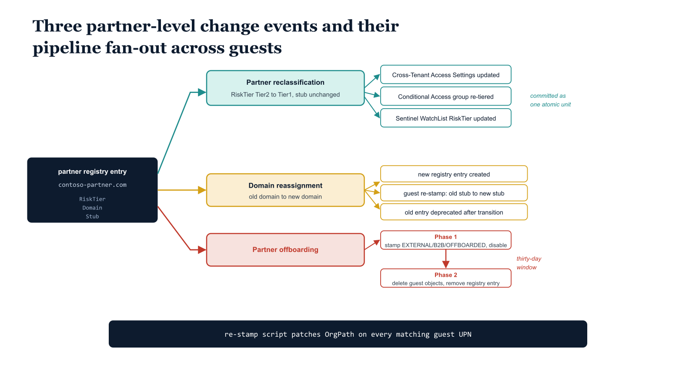

# Chapter 7 — Pipeline Integration and Guest Mover Handling

::: {.callout-note}
## In this chapter
Why a guest "mover" is categorically unlike an internal mover — a guest never changes position within the OrgPath hierarchy because guests do not occupy one. What changes instead is how their *partner* is classified. This chapter defines the three partner-level change events the pipeline must handle — reclassification, domain reassignment, and offboarding — each with a distinct scope of impact, the shared re-stamp script that executes them, and the governance synthesis that closes out the identity plane.
:::

## Why Guest Movers Are Categorically Different

Part Five of this series documented the internal mover pipeline: when an employee changes organizational position, the OrgPath pipeline detects the HR attribute change, resolves the new OrgPath value from the updated OrgTree position, stamps the new OrgPath on the identity object, and triggers all downstream policy re-evaluations — group membership changes, Conditional Access session reevaluation, Intune assignment filter recalculation — that flow from the OrgPath change. The internal mover pattern is fundamentally an identity movement within a fixed hierarchy: the user's position in the tree changes, but the tree itself remains stable, and the user's identity object in the directory remains the same object throughout the move.

Guest movers do not follow this pattern. A guest's identity does not move within the OrgPath hierarchy because guests do not occupy a position within the hierarchy. Their OrgPath stub encodes partner classification, not organizational position. What changes for a guest is not where they are in a hierarchy but how their partner is classified.

> A guest mover is not an identity moving through the tree; it is a *partner relationship* changing state. The pipeline acts on the partner, and the change fans out to every guest carrying that partner's stub.

Three distinct partner-level change events require pipeline action, and each has a different scope of impact:

1. **Partner reclassification** — the partner's trust tier changes; the stub stays the same, but every tier-differentiated control must be updated.
2. **Domain reassignment** — the partner adopts a new email domain; existing guests must be re-stamped from the old stub to the new one.
3. **Partner offboarding** — the relationship ends; all of the partner's guests must be disabled, then deleted.

Understanding each event type and its correct pipeline response is essential to maintaining the consistency of the governance substrate as partner relationships evolve.

{#fig-book-10-cpt-07-diagram-01 fig-alt="Engineering blueprint diagram on a white background showing the three partner-level change events that drive the guest pipeline. In the center sits a federal navy (#1F3A5F) box labeled in monospace partner registry entry contoso-partner.com with fields RiskTier, Domain, and Stub. Three branches fan out to the right. The first branch, in teal (#1A9E8F), is labeled Partner reclassification, RiskTier Tier2 to Tier1, stub unchanged, and points to three small boxes reading Cross-Tenant Access Settings updated, Conditional Access group re-tiered, and Sentinel WatchList RiskTier updated, with a note committed as one atomic unit. The second branch, in amber (#D4A017), is labeled Domain reassignment, old domain to new domain, and points to steps new registry entry created, guest re-stamp old stub to new stub, and old entry deprecated after transition. The third branch, in red (#C0392B), is labeled Partner offboarding and shows two phases: Phase 1 stamp stub EXTERNAL B2B OFFBOARDED and disable accounts, then a thirty-day arrow to Phase 2 permanently delete guest objects and remove registry entry. A shared monospace label at the bottom reads re-stamp script patches OrgPath on every matching guest UPN. No human figures, 16:9 landscape." width="85%"}

## Partner Reclassification

A partner reclassification event occurs when the RiskTier field of a registry entry is changed through the PR-and-approval process — most commonly when a standard Tier2 partner completes the security attestation process and is promoted to Tier1, or when a Tier1 partner fails a security review and is demoted to Tier2.

> The OrgPath stub value itself does not change in a reclassification event: /EXTERNAL/B2B/contoso-partner.com remains the correct stub regardless of whether that partner is Tier1 or Tier2. What changes is every downstream configuration that is differentiated by tier.

The pipeline updates three tier-differentiated surfaces and commits them as an atomic unit, recording a reclassification audit event in the governance log:

1. **Cross-Tenant Access Settings** must be updated to reflect the new trust level.
2. **Conditional Access group mapping.** Group membership does not change (the stub is unchanged), but the partner's dynamic group may need to be mapped to a different CA policy tier — this requires adding the per-partner group as an exclude target in the previous tier's policy and an include target in the new tier's policy, which the pipeline performs by patching the relevant CA policy conditions.
3. **Sentinel WatchList** must be updated to reflect the new RiskTier value so that monitoring queries correctly classify the partner's guests from the moment the reclassification takes effect.

## Domain Reassignment

A domain reassignment event occurs when a partner organization changes their email domain — due to an acquisition, a corporate rebranding, or a domain migration. Guests who were invited under the old domain carry OrgPath stubs encoded with the old domain. New guests invited under the new domain will receive the correct new stub from the invitation-time function, but existing guests remain on the old stub until explicitly re-stamped.

The pipeline handles domain reassignment in three steps:

1. **Create a new partner registry entry** for the new domain, carrying the same metadata as the old entry.
2. **Run the guest re-stamp script** to update all existing guests from the old domain to a new stub reflecting the new domain.
3. **Deprecate the old registry entry** after a transition period during which both stubs are considered valid. Deprecation removes the old dynamic group, decommissions the old Access Review definition, and triggers a final WatchList synchronization to ensure no guests remain associated with the deprecated stub.

## Partner Offboarding

A partner offboarding event occurs when the business relationship ends and all guests from the offboarding partner must be removed from the tenant. The pipeline approach is a two-phase operation, with the WatchList synchronized at both phases to reflect the current state accurately:

1. **Phase 1 — disable and quarantine (immediate).** The re-stamp script is invoked with the new stub set to /EXTERNAL/B2B/OFFBOARDED and the DisableAccounts flag set to true. This immediately disables all guest accounts from the offboarding partner and moves them into a distinct OrgPath stub that carries no dynamic group membership, no Conditional Access tier, and no resource access. The accounts are disabled but not immediately deleted, preserving the audit trail and satisfying the thirty-day retention requirement for identity lifecycle records.

2. **Phase 2 — permanent cleanup (thirty days later).** Executed by a scheduled pipeline task, the governance cleanup script permanently deletes all guest objects carrying the /EXTERNAL/B2B/OFFBOARDED stub, removes the partner's registry entry, decommissions the partner's dynamic group and Access Review definition, and removes the partner's Cross-Tenant Access Settings entry.

```powershell
#
# .SYNOPSIS
#     Re-stamps OrgPath on all B2B guests from a partner whose registry entry changed.
#     Also used for partner offboarding: set NewOrgPathStub = "/EXTERNAL/B2B/OFFBOARDED"
#     and set Disable = $true to immediately disable all guests from that partner.
# .PARAMETER PartnerDomain
#     The partner domain to re-process. Example: "contoso-partner.com"
# .PARAMETER NewOrgPathStub
#     The new OrgPath stub. Example: "/EXTERNAL/B2B/contoso-partner.com" (reclassification)
#     or "/EXTERNAL/B2B/OFFBOARDED" (partner relationship ended)
# .PARAMETER DisableAccounts
#     If $true, disables all matching guest accounts (used for partner offboarding).
# .NOTES
#     Requires: Connect-MgGraph -Scopes "User.ReadWrite.All"
#     B2B guest UPNs follow the pattern:
#       original_alias_partnerDomain-com#EXT#@yourtenant.onmicrosoft.com
#     Dots in the domain are replaced with underscores in the UPN.
#
param(
    [string]$PartnerDomain       = "contoso-partner.com",                     # Substitute
    [string]$NewOrgPathStub      = "/EXTERNAL/B2B/contoso-partner.com",       # Substitute
    [string]$OrgPathAttrName     = "extension_{AppIdWithoutHyphens}_OrgPath", # Substitute
    [switch]$DisableAccounts     = $false
)

Connect-MgGraph -Scopes "User.ReadWrite.All" -NoWelcome

# B2B UPN encodes dots as underscores in the domain portion before #EXT#
$domainEncoded = ($PartnerDomain -replace "\.", "_").ToLower()

Write-Host "[$((Get-Date).ToString('HH:mm:ss'))] Searching for guests from: $PartnerDomain"

$guests = Get-MgUser `
    -Filter "UserType eq 'Guest'" `
    -Property "id,displayName,userPrincipalName,accountEnabled,$OrgPathAttrName" `
    -All `
    | Where-Object { $_.UserPrincipalName -like "*_$domainEncoded#EXT#*" }

Write-Host "  Found $($guests.Count) guests from $PartnerDomain"

$updated = 0; $errors = 0; $skipped = 0

foreach ($guest in $guests) {
    $currentOrgPath = $guest.AdditionalProperties[$OrgPathAttrName]

    $patchBody = @{}
    if ($currentOrgPath -ne $NewOrgPathStub) { $patchBody[$OrgPathAttrName] = $NewOrgPathStub }
    if ($DisableAccounts -and $guest.AccountEnabled) { $patchBody["accountEnabled"] = $false }

    if ($patchBody.Count -eq 0) {
        $skipped++
        continue
    }

    try {
        Invoke-MgGraphRequest `
            -Method      PATCH `
            -Uri         "https://graph.microsoft.com/v1.0/users/$($guest.Id)" `
            -Body        ($patchBody | ConvertTo-Json) `
            -ContentType "application/json"
        $action = if ($DisableAccounts) { "UPDATED+DISABLED" } else { "UPDATED" }
        Write-Host "  [$action] $($guest.UserPrincipalName) => $NewOrgPathStub"
        $updated++
    } catch {
        Write-Error "  [ERROR] $($guest.UserPrincipalName): $_"
        $errors++
    }
}

Write-Host ""
Write-Host "=== Guest Re-Stamp Complete === Updated: $updated | Errors: $errors | Skipped: $skipped"

# Commit audit record to governance log
@{
    Timestamp      = (Get-Date -Format "o")
    Event          = if ($DisableAccounts) { "GuestPartnerOffboard" } else { "GuestOrgPathReclassify" }
    PartnerDomain  = $PartnerDomain
    NewOrgPathStub = $NewOrgPathStub
    GuestsUpdated  = $updated
    GuestsErrored  = $errors
} | ConvertTo-Json -Compress | Out-File -Append "C:\governance\logs\guest-pipeline.jsonl"  # Substitute path
```

## Governance Synthesis

With the guest OrgPath stub model fully implemented across all seven chapters of this document, every identity that touches the tenant now carries an OrgPath value. Internal users carry positions within the internal organizational tree, expressed as paths that trace the hierarchy from root to their leaf node. B2B guest users carry stubs in the /EXTERNAL subtree that encode partner identity and trust classification without placing them inside a hierarchy to which they do not belong. The two populations are structurally segregated by their OrgPath root segment — /ORG versus /EXTERNAL — while sharing a single attribute schema, a single dynamic group targeting model, a single Sentinel enrichment architecture, and a single governance pipeline.

> One attribute mediates every governance decision — for internal employee, high-trust partner, registered vendor, or unregistered external guest alike. That is what it means for the governance substrate to be complete for the identity plane.
 Every policy decision made across the series — Conditional Access grant controls, Intune assignment filters, Sentinel analytics rule predicates, Purview DLP scope conditions, Access Review scope queries, and Azure RBAC eligible assignment conditions — can now include or exclude external identities consistently, because the same attribute mediates every governance decision regardless of whether the identity under evaluation is an internal employee, a high-trust partner, a standard registered vendor, or an unregistered external guest. The governance substrate is complete for the identity plane. What remains is the extension of that substrate into the non-human and non-person identity planes addressed in Parts Eleven through Thirteen.

## Closing Chapter — Series Progression

Part Ten completes the identity-plane coverage of the OrgPath governance architecture. Every human identity class — internal employees, contractors provisioned as members, and external B2B guests — now carries a well-defined, policy-mediated OrgPath value, and every major governance control surface in the tenant uses that value as a primary predicate for access decisions, lifecycle management, and threat monitoring. Three integration surfaces remain, each extending the OrgPath substrate into a domain where human identities are not the primary actor.

Part Eleven addresses Service Principals and App Registrations. Applications in the tenant — both first-party and third-party — represent a non-human identity class with access to tenant resources, consent grants, and in many cases delegated permissions on behalf of users. Part Eleven defines the mechanism for mapping ownership of every application registration to an OrgPath node, creating a queryable link between the application's access scope and the organizational team responsible for its security posture. This ownership mapping enables consent policy enforcement scoped by the application owner's OrgPath, drift detection alerts when an application's permission set changes outside the node owner's approval chain, and privileged access governance for application credential rotation that mirrors the PIM integration from Part Three.

Part Twelve addresses Azure Policy Guest Configuration. Servers onboarded through Azure Arc carry OrgPath resource tags as established in the infrastructure pipeline. Part Twelve closes the loop between the OrgPath tag on an Arc machine and the Desired State Configuration packages deployed to that machine, using Azure Policy Guest Configuration to drive DSC-based configuration enforcement through the OrgPath tag value. A machine tagged with a specific OrgPath node receives precisely the Guest Configuration package assignments appropriate for that node's policy group, applied through the Azure Policy inheritance chain rather than through manual agent configuration. This extends the organizational governance model from the identity plane into the configuration management plane for every server in the environment, on-premises or cloud-hosted.

Part Thirteen is the capstone aggregation layer. The governance architecture across all thirteen parts produces a large and distributed body of operational data: OrgTree node change records in the governance repository, OrgPath stamp audit events in the function log, Sentinel analytics rule results in the Log Analytics workspace, Intune device compliance states in the Intune reporting API, Defender for Endpoint security posture scores, Purview audit logs, and Access Review decision records in the Entra ID Governance API.

Part Thirteen defines a Power BI semantic model that ingests all of these sources, joins them on the OrgPath dimension, and produces a per-division governance posture view consumable by engineering leadership and technical stakeholders.

The model is designed to answer the questions that the governance architecture was built to answer: which organizational nodes are compliant with the baseline control set, which nodes have open access review findings, which nodes have devices or servers out of policy, and which nodes are generating elevated threat signals in Sentinel — all sliced by the same organizational structure that governs every policy decision in the tenant.

## Document Information

## Series: OrgTree and OrgPath Governance Architecture • Part Ten of Thirteen

## Author: Michael • Generated: 08 May 2026, 12:11 EDT • Location: Herald Harbor, MD

All code samples are production-ready with placeholder values marked by inline comments. Substitute all values before deployment. All Conditional Access policies are created in Report-Only mode and must be reviewed before enforcement enablement.
