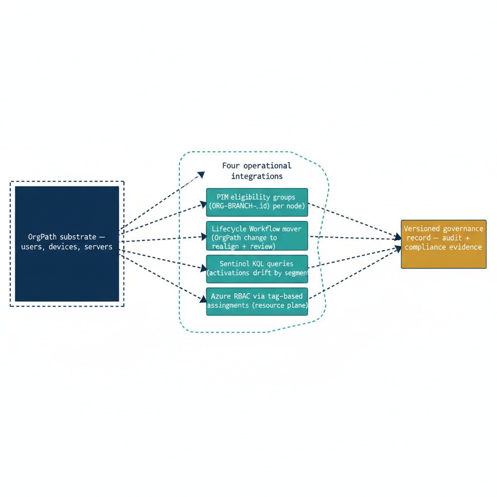

# Chapter 1 — From Substrate to Operations — Why PIM, RBAC, and Monitoring Complete the Model

::: {.callout-note}
## In this chapter
Part Four leaves a complete governance *substrate* — OrgTree, OrgPath, dynamic
groups, and drift detection — but a substrate is not yet operationally closed.
This chapter names the four integrations that carry OrgPath into the security
operations plane (PIM eligibility, the structural-mover workflow, Sentinel
monitoring, and Azure RBAC at the resource plane), explains the failure mode
each one prevents, and maps the remaining chapters of this document onto them.
:::

## The Governance Gap That Remains After Part Four

At the conclusion of Part Four, the governance substrate is operational. OrgTree holds the authoritative representation of the organizational hierarchy: every division, department, and unit exists as a node in the registry, connected to its parent by a typed relationship and assigned a unique identifier that persists across organizational changes. OrgPath encodes positional identity for every user, device, and server in the environment — a single attribute value that places each asset precisely within the hierarchy and changes only when the underlying organizational reality changes.

The dynamic group library derives policy coverage from structural position automatically: a user who moves into a node inherits group membership in that node's policy groups within minutes of the OrgPath write, with no manual group management required. The drift detection pipeline monitors OrgPath values across the environment and flags divergence between directory state and registry state before it accumulates into an audit problem.

This is a complete design and construction achievement. But it is not yet operationally closed. The substrate defines structure and encodes position, but it does not yet drive the security operations that depend on that structure. The gap is specific, not general. It is not that OrgPath fails to reach the security operations plane — it is that no integration has yet been built to carry it there. Four such integrations are required, and each addresses a distinct operational failure mode that the substrate alone cannot prevent.

> The substrate defines structure and encodes position; it does not yet *drive* the security operations that depend on that structure. Closing the gap is a matter of building four integrations, not of redesigning anything Part Four delivered.

## The Four Missing Connections

The first missing connection is between OrgPath and Privileged Identity Management. The dynamic groups derived from OrgPath can serve as the principals for PIM eligibility assignments — they are security groups, they have stable identifiers, and their membership reflects current organizational position. But PIM eligibility assignments do not create themselves. Without an automated pipeline that reads the current OrgTree registry and creates or updates PIM eligibility schedule requests for each node's corresponding group, the dynamic group library and the PIM eligibility configuration remain two separate systems that must be manually kept in sync. Manual synchronization at scale does not hold. Eligibility assignments accumulate drift whenever the organizational structure changes faster than the manual update cadence — which in active organizations is continuously.

The second missing connection is between OrgPath changes and structural mover automation. When a user's OrgPath changes because they have moved to a different organizational unit, the dynamic group membership changes automatically — the user leaves the old node's groups and joins the new node's groups. This is the mechanism Part Four built.

What it does not do is revoke the user's PIM eligibilities that were scoped to their old position, create new PIM eligibilities scoped to their new position, notify affected managers, or initiate an access review to confirm that the user's accumulated privileged access is appropriate for their new role. Without those steps, the mover accumulates privilege from both their old and new positions, and neither the governance team nor the receiving manager has a workflow notification that anything significant has occurred.

The third missing connection is between OrgPath and the Microsoft Sentinel monitoring plane. Sentinel receives PIM activation events, sign-in logs, audit events, and privileged access alerts. Without organizational context, those events are analyzed at the tenant level or the role level. An analyst who sees an elevated number of Global Administrator activations can observe the count but cannot ask whether those activations are concentrated in a single organizational segment, whether the activating users' OrgPath values correspond to the roles being activated, or whether the pattern differs between the executive segment and the field operations segment. OrgPath, if carried into the Sentinel log model, makes those questions answerable. Without the integration, the monitoring plane is structurally blind to the organizational context that gives PIM events their risk meaning.

The fourth missing connection is between OrgPath and Azure RBAC at the resource plane. Arc-managed servers and Azure resources are the infrastructure that the identities governed by OrgPath actually operate on. A governance model that covers identity plane access but leaves resource plane access control as a separately managed concern produces a well-governed identity estate sitting on top of an ungoverned resource estate. Tag-based RBAC assignments tied to OrgPath dynamic groups close this gap — they extend the same structural governance to the resource plane and make Azure RBAC assignments as responsive to organizational changes as the directory group memberships that Part Four established.

{#fig-11-orgpath-in-security-operations-diagram-01 fig-alt="A single root box on the far left labeled \"OrgPath substrate — users, devices, servers\" fans rightward into a labeled cluster \"Four operational integrations\" containing four boxes stacked vertically: PIM eligibility groups (ORG-BRANCH-{id} per node); Lifecycle Workflow mover (OrgPath change to realign + review); Sentinel KQL queries (activations + drift by segment); Azure RBAC via tag-based assignments (resource plane). All four integration boxes then converge rightward into a single terminal box \"Versioned governance record — audit + compliance evidence\". Engineering blueprint style, white background, federal navy (#1F3A5F) for substrate, teal (#1A9E8F) for integrations, amber (#D4A017) for the audit record terminus, monospace group names, 16:9 landscape." width="100%"}

## Architecture of This Document

Chapter Two covers the automation of PIM group eligibility assignment from OrgPath. It presents the complete pipeline script that keeps PIM eligibility synchronized with the current OrgTree registry without human intervention, and explains every design decision in the implementation so that the engineering team can maintain and extend the pipeline as OrgTree evolves.

Chapter Three covers the Lifecycle Workflow mover pattern — the automated process triggered when an identity's OrgPath changes, which realigns PIM eligibilities for the new organizational position, removes stale eligibilities from the old position, and initiates an access review and manager notification. The custom task extension architecture is described in full, and the handler implementation is presented as a complete Azure Function or Logic App payload processor.

Chapter Four covers the Sentinel KQL query library. Three query patterns are presented in full: a daily dashboard query that organizes PIM activations by organizational segment, a near-real-time alert query that detects activations from designated sensitive OrgPath nodes, and a drift detection query that surfaces users whose PIM eligibility does not match their current organizational position. Each query is presented with its intended operationalization in Sentinel — the workbook configuration, the analytics rule parameters, and the incident routing logic.

Chapter Five covers the Azure RBAC integration. The tag strategy that maps OrgPath values onto Azure resource tags is described, along with the Azure Policy definition that enforces tag presence at Arc enrollment time. The dynamic group-to-RBAC assignment pattern is explained, and the pipeline extension that creates and maintains RBAC assignments synchronized with structural changes is presented in full.

Chapter Six synthesizes the complete five-part model and describes what the organization now has, what it can now answer, and what it still requires of the engineering team to remain operational over time.

::: {.callout-note title="Prerequisites"}
This document assumes the successful completion of Parts One through Four: the OrgTree registry is populated, OrgPath values are stamped and propagating across user, device, and server objects, dynamic groups are provisioned and evaluated, and the drift detection pipeline is running. Scripts in this document reference the OrgTree registry JSON file, the OrgPath schema extension attribute name, and the governance repository checkout pattern established in Part Four. These references are annotated inline with substitution instructions wherever environment-specific values are required.
:::
