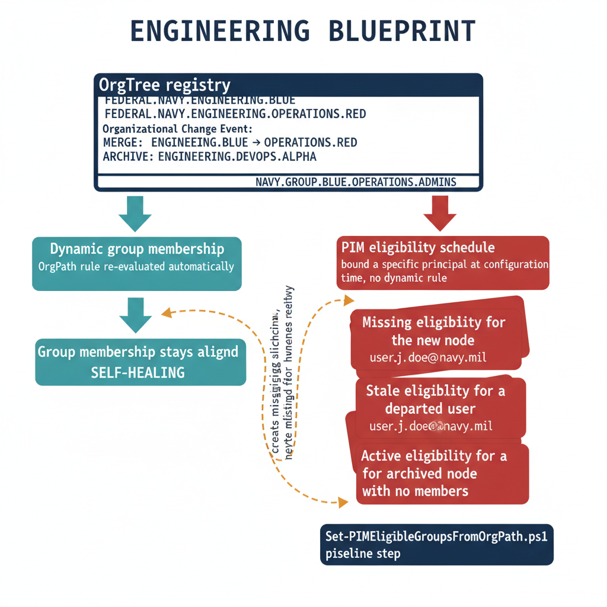

# Chapter 2 — Keeping Privileged Access Aligned with Organizational Structure

::: {.callout-note}
## In this chapter
PIM eligibility is configured against specific principals, so it does not follow organizational change the way dynamic groups do — and the gap between privileged access and current structure is *PIM eligibility drift*. This chapter explains why drift accumulates, the synchronization design that makes OrgTree the single source of truth for PIM-eligible groups, and the complete `Set-PIMEligibleGroupsFromOrgPath.ps1` pipeline step that creates missing eligibilities and flags archived-node groups for human review rather than deleting them.
:::

## The Problem of PIM Eligibility Drift

When an organization first implements Privileged Identity Management, the eligibility configuration reflects the organizational reality at the moment of implementation. Every node in the hierarchy that requires privileged access governance receives a corresponding PIM eligible group, the appropriate role is mapped to each group, and the access policy — approval requirements, activation duration, MFA enforcement — is configured for each role assignment. At the moment of completion, PIM eligibility is accurate.

The problem is that organizations do not stay still. Divisions merge. New departments are created. Teams are reorganized under different reporting chains. Units are renamed or disbanded. Each of these changes modifies the OrgTree registry, which in turn changes the OrgPath values of every user in the affected segment, which changes dynamic group memberships, which changes policy coverage.

But PIM eligibility does not update automatically in response to any of these changes, because PIM eligibility is configured through schedule requests against specific principals and role definitions — not through dynamic membership rules. A new node added to OrgTree has no PIM eligibility group because the initial PIM configuration predates the node's creation. A user who has moved out of a division retains eligibility for roles scoped to their old division's group because the eligibility schedule has no expiration event tied to the user's departure from that group.

A node that has been archived still has an active PIM eligibility group, still accepting activation requests, with no active members but also no block preventing a reactivated account from being manually re-added.

> The cumulative effect is **PIM eligibility drift**: a growing divergence between the privileged access configuration and the actual organizational structure.

Drift is not merely an aesthetic problem. It is an audit finding in every compliance framework that requires privileged access to reflect least privilege and current organizational role. It is a security exposure because stale eligibilities represent dormant privilege that an attacker who compromises a previously privileged account can activate. And it is a governance failure because the governance team cannot truthfully report that PIM eligibility reflects organizational position if that alignment is maintained only at initial configuration time and never thereafter.

{#fig-book-11-cpt-02-diagram-01 fig-alt="Engineering blueprint diagram on a white background contrasting two propagation paths from a single source of truth. At the top, a federal navy box labeled OrgTree registry, with monospace node identifiers, shows an organizational change event — a division merge and a node archival. From it, two arrows descend. The left arrow, drawn in teal, flows through a teal box labeled Dynamic group membership, OrgPath rule re-evaluated automatically, and reaches a teal box labeled Group membership stays aligned, marked self-healing. The right arrow, drawn in red, flows through a red box labeled PIM eligibility schedule, bound to a specific principal at configuration time, with no dynamic rule, and reaches three stacked red problem cards — Missing eligibility for the new node, Stale eligibility for a departed user, and Active eligibility for an archived node with no members. A dashed amber arrow loops from a navy box labeled Set-PIMEligibleGroupsFromOrgPath.ps1 pipeline step back across to the red problem cards, labeled creates missing, flags archived for human review, never deletes silently. Monospace labels for group and node names throughout, no human figures, 16:9 landscape.} width="85%"}

## Synchronization Design

The automated synchronization design resolves this by making the OrgTree registry the single source of truth for PIM eligibility configuration. The governance pipeline maintains a set of PIM-eligible groups — one per significant organizational node in OrgTree — that are created and managed alongside the dynamic group library described in Part Four. Each PIM-eligible group is named following the convention ORG-BRANCH-{NodeId}, where NodeId is the unique identifier assigned to the node in the OrgTree registry at creation time. This naming convention provides a deterministic mapping from any node in the registry to its corresponding directory group: given a NodeId, the group name is computable without a lookup, and given a group name, the NodeId is extractable without additional context.

When the pipeline runs following an OrgTree commit, it executes four operations in sequence:

1. It reads the current set of active branch nodes from the registry.
2. It enumerates the existing set of ORG-BRANCH- prefixed groups in the directory.
3. It computes the difference between the two sets to identify nodes without groups and groups without nodes.
4. It acts on that difference: creating PIM eligibility schedule requests for nodes that do not yet have active eligibilities, and flagging groups that correspond to archived or deleted nodes for deactivation review.

The pipeline does not delete groups automatically — it marks them for human review, because an archived node may be temporarily suspended rather than permanently removed, and the governance team should make the determination to revoke eligibility explicitly rather than have the pipeline do so silently.

## Implementation: Set-PIMEligibleGroupsFromOrgPath.ps1

The following script is the complete implementation of the PIM eligibility synchronization step. It is named Set-PIMEligibleGroupsFromOrgPath.ps1 and runs as a pipeline step following OrgTree registry changes. It requires the Microsoft.Graph PowerShell SDK version 2.x or later, PowerShell 7.4 or later, and a service principal or Managed Identity with the Directory.ReadWrite.All and RoleManagement.ReadWrite.Directory permission scopes consented at the tenant level.

## Script 2-A: Set-PIMEligibleGroupsFromOrgPath.ps1 — PIM Eligibility Synchronization Pipeline Step

```powershell
#Requires -Version 7.4
#Requires -Modules Microsoft.Graph.Authentication, Microsoft.Graph.Groups,
#           Microsoft.Graph.Identity.Governance

<#
.SYNOPSIS
    Synchronizes PIM group eligibility assignments with the current OrgTree registry.

.DESCRIPTION
    Reads the OrgTree registry from the governance repository and ensures that
    every active branch node has a corresponding PIM-eligible group with an active
    eligibility schedule. Nodes without a corresponding schedule receive one.
    Groups whose nodes have been archived are flagged in the pipeline output
    for human review — they are NOT automatically removed.

    Run as part of the governance propagation pipeline, triggered by OrgTree
    commits to the governance repository.

.PARAMETER OrgPathExtensionName
    The full schema extension attribute name for OrgPath on directory objects.
    Format: extension_{AppId without hyphens}_OrgPath

    SUBSTITUTE: Replace {AppId without hyphens} with the Application (client) ID
    of the app registration used to define the OrgPath schema extension,
    with all hyphens removed.
    Example: extension_a1b2c3d4e5f6a1b2c3d4e5f6a1b2c3d4_OrgPath

.PARAMETER RoleDisplayName
    The display name of the directory role or custom role for which PIM eligibility
    will be assigned at each organizational node scope.

    SUBSTITUTE: Replace with the exact display name of the role in your tenant.
    For a custom role, this must match the role definition name exactly.
    Example: "Organizational Unit Administrator"

.PARAMETER OrgTreeRegistryPath
    Local filesystem path to the OrgTree registry JSON file, checked out from
    the governance repository before this script runs.

    SUBSTITUTE: Replace with the actual path on the automation runner.
    Example: "C:\governance\orgtree\registry.json"

.PARAMETER DryRun
    If set to $true, the script reports what it would do without creating
    any PIM eligibility schedule requests. Use for pipeline validation.

.NOTES
    Requires Microsoft.Graph PowerShell SDK 2.x or later.
    Requires PowerShell 7.4 or later.
    Run under the automation service account with appropriate Graph permissions.
    In production, replace Connect-MgGraph interactive auth with Managed Identity
    or certificate-based service principal authentication.
#>
param(
    [string]$OrgPathExtensionName  = "extension_{AppIdWithoutHyphens}_OrgPath",
    [string]$RoleDisplayName       = "Organizational Unit Administrator",
    [string]$OrgTreeRegistryPath   = "C:\governance\orgtree\registry.json",
    [bool]  $DryRun                = $false
)

Set-StrictMode -Version Latest
$ErrorActionPreference = "Stop"

# ---------------------------------------------------------------
# AUTHENTICATION
# ---------------------------------------------------------------
# Interactive authentication is used here for clarity.
# In production automation pipelines, replace with one of:
#   Managed Identity:           Connect-MgGraph -Identity -NoWelcome
#   Certificate-based SPN:      Connect-MgGraph -ClientId "{ClientId}" `
#                                   -TenantId "{TenantId}" `
#                                   -CertificateThumbprint "{Thumbprint}" `
#                                   -NoWelcome
#
# SUBSTITUTE: {ClientId}   — the Application (client) ID of the service principal
# SUBSTITUTE: {TenantId}   — the tenant (directory) ID
# SUBSTITUTE: {Thumbprint} — the certificate thumbprint from the automation runner store
Connect-MgGraph `
    -Scopes "Directory.ReadWrite.All", "RoleManagement.ReadWrite.Directory" `
    -NoWelcome

# ---------------------------------------------------------------
# LOAD ORGTREE REGISTRY
# ---------------------------------------------------------------
# The registry file is a JSON document committed to the governance repository.
# Each node object contains: Id, Name, Type, ParentId, Path, Status
# Status values: "Active" | "Archived" | "Pending"
# Only "Active" nodes receive PIM eligibility schedule requests.
if (-not (Test-Path $OrgTreeRegistryPath)) {
    throw "OrgTree registry not found at '$OrgTreeRegistryPath'. " +
          "Ensure the repository checkout step ran before this script."
}

$registryContent = Get-Content -Path $OrgTreeRegistryPath -Raw
$orgTree         = $registryContent | ConvertFrom-Json
$activeNodes     = $orgTree.nodes | Where-Object { $_.Status -eq "Active" }
$archivedNodes   = $orgTree.nodes | Where-Object { $_.Status -eq "Archived" }

Write-Host "[$(Get-Date -Format 'yyyy-MM-dd HH:mm:ss')] Registry loaded."
Write-Host "  Active nodes  : $($activeNodes.Count)"
Write-Host "  Archived nodes: $($archivedNodes.Count)"

# ---------------------------------------------------------------
# ENUMERATE EXISTING ORG-BRANCH GROUPS
# ---------------------------------------------------------------
$existingGroups = Get-MgGroup `
    -Filter "startsWith(displayName,'ORG-BRANCH-')" `
    -All `
    -Property "Id,DisplayName,Description"

$existingGroupMap = @{}
foreach ($g in $existingGroups) {
    $nodeId = $g.DisplayName -replace "^ORG-BRANCH-", ""
    $existingGroupMap[$nodeId] = $g
}

Write-Host "[$(Get-Date -Format 'yyyy-MM-dd HH:mm:ss')] Found $($existingGroups.Count) existing ORG-BRANCH groups."

# ---------------------------------------------------------------
# RESOLVE ROLE DEFINITION
# ---------------------------------------------------------------
$roleDefinition = Get-MgRoleManagementDirectoryRoleDefinition `
    -Filter "displayName eq '$RoleDisplayName'"

if (-not $roleDefinition) {
    throw "Role definition '$RoleDisplayName' not found in this tenant. " +
          "Verify the RoleDisplayName parameter matches the exact role name."
}

Write-Host "[$(Get-Date -Format 'yyyy-MM-dd HH:mm:ss')] Role definition resolved: $($roleDefinition.DisplayName) [$($roleDefinition.Id)]"

# ---------------------------------------------------------------
# SYNCHRONIZE PIM ELIGIBILITY PER ACTIVE NODE
# ---------------------------------------------------------------
$results = @{ Created = 0; Skipped = 0; Failed = 0; FlaggedArchived = 0 }

foreach ($node in $activeNodes) {
    $groupName = "ORG-BRANCH-$($node.Id)"

    if (-not $existingGroupMap.ContainsKey($node.Id)) {
        Write-Warning "  [MISSING] No ORG-BRANCH group found for node '$($node.Id)' ($($node.Name))."
        Write-Warning "            Run the dynamic group provisioning step before PIM synchronization."
        $results.Failed++
        continue
    }

    $group = $existingGroupMap[$node.Id]

    # Check whether an active eligibility schedule already exists for this group
    $existingSchedule = Get-MgRoleManagementDirectoryRoleEligibilitySchedule `
        -Filter "principalId eq '$($group.Id)' and roleDefinitionId eq '$($roleDefinition.Id)'"

    if ($existingSchedule) {
        Write-Host "  [SKIP]    Active eligibility exists for $groupName — no action required."
        $results.Skipped++
        continue
    }

    # Build the eligibility schedule request body.
    #
    # DirectoryScopeId is set to "/" (tenant root) in this template.
    # For organizations using Administrative Units scoped to each organizational node,
    # replace "/" with the AU resource path:
    #   DirectoryScopeId = "/administrativeUnits/{AdministrativeUnitId}"
    # SUBSTITUTE: {AdministrativeUnitId} — the object ID of the AU for this node.
    #
    # The expiration type "NoExpiration" creates a standing eligibility.
    # To enforce annual review cycles, use:
    #   Type     = "AfterDuration"
    #   Duration = "P365D"
    $requestBody = @{
        Action           = "AdminAssign"
        PrincipalId      = $group.Id
        RoleDefinitionId = $roleDefinition.Id
        DirectoryScopeId = "/"
        Justification    = "OrgPath governance pipeline — node $($node.Id) ($($node.Name)) | Path: $($node.Path)"
        ScheduleInfo     = @{
            StartDateTime = (Get-Date).ToUniversalTime().ToString("o")
            Expiration    = @{
                Type = "NoExpiration"
            }
        }
    }

    if ($DryRun) {
        Write-Host "  [DRYRUN]  Would create PIM eligibility for $groupName (Path: $($node.Path))"
        $results.Created++
        continue
    }

    try {
        $null = New-MgRoleManagementDirectoryRoleEligibilityScheduleRequest `
            -BodyParameter $requestBody
        Write-Host "  [CREATED] PIM eligibility schedule created for $groupName (Path: $($node.Path))"
        $results.Created++
    }
    catch {
        Write-Warning "  [FAILED]  Could not create PIM eligibility for $groupName. Error: $_"
        $results.Failed++
    }
}

# ---------------------------------------------------------------
# FLAG ARCHIVED NODE GROUPS FOR REVIEW
# ---------------------------------------------------------------
foreach ($node in $archivedNodes) {
    if ($existingGroupMap.ContainsKey($node.Id)) {
        $g = $existingGroupMap[$node.Id]
        Write-Warning "  [REVIEW]  ORG-BRANCH-$($node.Id) exists in directory but node is ARCHIVED."
        Write-Warning "            Review and revoke PIM eligibility manually if no longer required."
        $results.FlaggedArchived++
    }
}

# ---------------------------------------------------------------
# SUMMARY
# ---------------------------------------------------------------
Write-Host ""
Write-Host "================================================================"
Write-Host "  PIM Eligibility Synchronization — Complete"
Write-Host "================================================================"
Write-Host "  Created          : $($results.Created)"
Write-Host "  Skipped (exists) : $($results.Skipped)"
Write-Host "  Failed           : $($results.Failed)"
Write-Host "  Flagged (archive): $($results.FlaggedArchived)"
if ($DryRun) {
    Write-Host "  *** DRY RUN — no changes were made ***"
}
Write-Host "================================================================"

Disconnect-MgGraph
```

## Script Walkthrough and Decision Rationale

The authentication block uses Connect-MgGraph with explicit scope declarations. The scope declarations serve two purposes beyond their functional role: they make the permission requirements of the script auditable from the script itself, and they fail loudly if the authenticating identity has not been granted those scopes, rather than failing silently at the first Graph API call that requires them. In a production automation pipeline, the interactive Connect-MgGraph call is replaced with either Connect-MgGraph -Identity for a Managed Identity running in an Azure automation account, or with Connect-MgGraph -ClientId -TenantId -CertificateThumbprint for a certificate-based service principal. The certificate-based pattern is preferred for pipeline automation that runs outside Azure, such as on-premises automation servers, because the certificate never traverses the network and the credential is not stored in plain text.

The OrgTree registry load block validates the file path before attempting to parse it. This validation step prevents a silent failure mode in which the registry file is absent because the repository checkout step failed or was skipped, and the script runs against an empty dataset, flagging every existing PIM eligibility group as orphaned. The fail-fast approach — throwing an exception if the registry is absent — forces the pipeline to surface checkout failures before they can cause data loss.

The DirectoryScopeId parameter in the eligibility schedule request body is set to "/" — tenant root scope — in the template. This is intentional for initial deployment, because tenant root scope allows the eligibility to be activated against any resource in the directory. For organizations that have implemented Administrative Units corresponding to each organizational node, the DirectoryScopeId should be set to the AU path for the corresponding node. This change constrains the eligible role to resources within that AU, which is a significantly tighter and more defensible privilege boundary. The AU path for each node is available in the OrgTree registry if the AU provisioning pipeline described in Part Four has been run — the node object includes an AdminUnitId field when the corresponding AU has been created.

The archived node flagging behavior — warning rather than deleting — is a deliberate design choice. The pipeline's job is synchronization, not remediation. A group corresponding to an archived node may have active activation requests in flight, may be under review by the compliance team, or may be temporarily archived during a reorganization with the expectation that it will return to Active status. Automatic deletion of PIM eligibilities in response to node archival would produce silent access revocations that could interrupt legitimate work without warning. The flag surfaces the condition to the governance team, who make the revocation decision explicitly.

::: {.callout-note title="Pipeline Integration Note"}
This script is invoked as the third step in the OrgTree change propagation pipeline, after the dynamic group provisioning step and before the drift detection baseline update step. The pipeline sequence is: (1) validate registry commit, (2) propagate OrgPath writes to affected users and devices, (3) provision or update dynamic groups, (4) run Set-PIMEligibleGroupsFromOrgPath.ps1, (5) update drift detection baseline, (6) commit pipeline audit record to governance repository. If step 4 fails, the pipeline halts and creates an alert. It does not proceed to step 5, because an incomplete PIM synchronization should not be recorded as a successful baseline update.
:::
