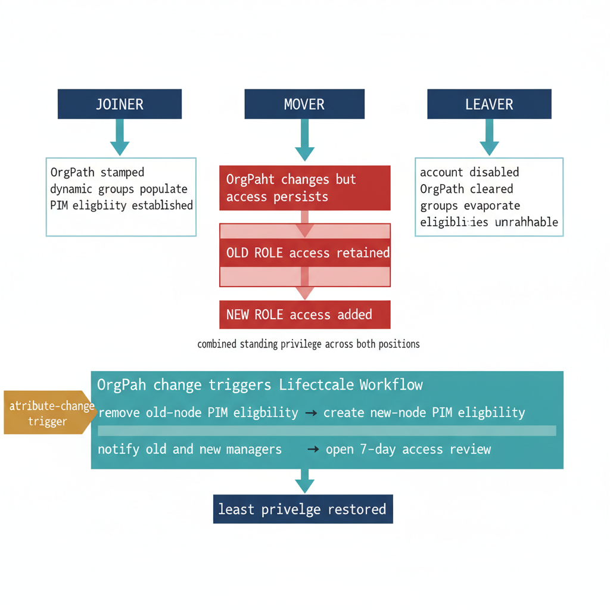

# Chapter 3 — When an Identity Moves — Automating Structural Access Realignment

::: {.callout-note}
## In this chapter
Why the mover is the hardest of the three lifecycle events — the identity persists with uninterrupted access, so a structural move silently accumulates privilege from both the old and new positions. This chapter designs an Entra ID Lifecycle Workflow that fires on an OrgPath change, walks the idempotent realignment task sequence, details the custom task extension that creates the PIM eligibility and the mover access review, and closes on manager notification and the HR-integration dependency the whole pattern rests on.
:::

## Why the Mover Is the Hardest Event

The identity governance lifecycle has three canonical events: the joiner, the mover, and the leaver. The joiner and the leaver are operationally simple in a substrate-backed environment. A joiner arrives with no prior state: OrgPath is stamped, dynamic groups populate, PIM eligibility is established by the synchronization pipeline at its next run, and the identity enters the environment with access shaped precisely by its structural position. A leaver departs with no forward state: the account is disabled, the OrgPath attribute is cleared, dynamic group memberships evaporate as the membership rules re-evaluate, and PIM eligibilities become unreachable because the principal is disabled. In both cases, the direction of the state change is unambiguous and the platform mechanisms handle the consequence.

The mover is complicated because the identity persists with continuous, uninterrupted access. There is no disable event, no attribute clear, no group evaporation. There is only an OrgPath change — a value that transitions from one node path to another — and that change, by itself, updates dynamic group memberships but does nothing to the identity's accumulated PIM eligibilities, its active role assignments, or its standing access to resources scoped to its previous position. The dynamic group change is immediate and automatic. Everything else requires explicit remediation, and without a workflow to drive that remediation, the mover accumulates privilege from both positions simultaneously: the full access of their old role and the full access of their new role, combined, for as long as the stale eligibilities remain.

> **The mover does not lose anything — it only gains.** Absent an explicit workflow, a structural move adds the new position's access on top of the old, and the combined privilege persists until something removes it.

This is not a hypothetical edge case. In organizations with active internal mobility, the mover event is the most frequent identity governance event after joiner and leaver combined. It is also the event most likely to produce audit findings, because the accumulation of privilege across positions is exactly what least-privilege frameworks prohibit and exactly what access reviews are designed to detect. The mover pattern presented in this chapter eliminates the manual remediation requirement by making OrgPath changes the trigger for a structured realignment workflow that runs automatically, completely, and with a full audit trail.

{#fig-book-11-cpt-03-diagram-01 fig-alt="Engineering blueprint diagram on a white background contrasting the three identity lifecycle events and the mover remediation flow. Across the top, three federal navy boxes labeled in monospace JOINER, MOVER, LEAVER. Under JOINER a teal arrow points to a clean box reading OrgPath stamped, dynamic groups populate, PIM eligibility established. Under LEAVER a teal arrow points to a clean box reading account disabled, OrgPath cleared, groups evaporate, eligibilities unreachable. Under MOVER, the center column, a red C0392B box reads OrgPath changes but access persists, then two red stacked boxes labeled OLD ROLE access retained and NEW ROLE access added showing combined standing privilege across both positions. Below the red zone a teal 1A9E8F horizontal flow band labeled OrgPath change triggers Lifecycle Workflow shows four sequential monospace steps, remove old-node PIM eligibility, create new-node PIM eligibility, notify old and new managers, open 7-day access review, resolving into a single clean navy box reading least privilege restored. Amber D4A017 callout tag on the trigger band reads attribute-change trigger. Palette federal navy 1F3A5F for events and end state, teal 1A9E8F for the remediation flow, amber D4A017 for the trigger annotation, red C0392B only for the accumulated-privilege problem state, monospace labels throughout, no human figures, 16:9 landscape." width="85%"}

## Mover Lifecycle Workflow Design

Microsoft Entra ID Lifecycle Workflows execute task sequences against identity objects in response to trigger conditions. The mover workflow described here uses one of two trigger mechanisms, depending on the organization's Lifecycle Workflow configuration. The preferred trigger is an attribute change event on the OrgPath extension attribute: when the Lifecycle Workflow engine detects that a user's OrgPath value has changed, it queues the user for the mover workflow immediately. The fallback trigger is a scheduled daily evaluation that finds all users whose OrgPath value differs from the value recorded in the workflow's last execution context for that user — this approach works in all environments but introduces up to a 24-hour lag between the OrgPath change and the workflow execution. For organizations where PIM realignment must occur within hours of a structural move, the attribute change trigger is required, and the OrgPath extension attribute must be included in the set of attributes that the Lifecycle Workflow engine monitors.

Once triggered, the workflow executes tasks in a defined sequence. The sequence is designed to be idempotent — running the same workflow against the same user twice produces the same end state without creating duplicate eligibility requests or duplicate access reviews. The task sequence is as follows:

1.  **Remove the user from all PIM-eligible groups associated with their previous OrgPath node.** The previous node is recoverable from the Entra ID audit log, which records the old and new values of the OrgPath attribute change event. The workflow engine passes the old OrgPath value to the task as a context variable.

2.  **Invoke the custom task extension** that creates a new PIM eligibility schedule request for the user targeted at the group corresponding to their new OrgPath node.

3.  **Send a notification email** to the user's new manager — resolved through the manager attribute on the Entra ID user object — and to their previous manager, identified from the audit log of the OrgPath attribute change event.

4.  **Initiate an immediate one-time Access Review** scoped to the user's current privileged group memberships, with the new manager assigned as the primary reviewer and a seven-day completion window.

Tasks one and three use built-in Lifecycle Workflow task types — group membership removal and custom email notification respectively. Tasks two and four require custom extensions and a Graph API call. The custom extension architecture is described in the following section.

## Custom Task Extension Architecture

The built-in Lifecycle Workflow task catalog covers group membership additions and removals, email notifications, and a set of account lifecycle actions such as enable, disable, and password reset. It does not cover PIM eligibility schedule request creation or Access Review definition creation — both of which require calls to the identity governance Graph API endpoints that are not exposed as built-in task types. These operations are delivered through a custom task extension: an Azure Function or Logic App that the Lifecycle Workflow invokes via an HTTP POST carrying a structured JSON payload describing the workflow execution context.

The Lifecycle Workflow custom task extension receives a payload in the format shown below. The data.id field contains the userId of the identity being processed. The source field identifies the workflow and task that triggered the extension, which allows the extension to behave differently based on which task in which workflow invoked it — enabling a single extension endpoint to serve multiple workflow tasks.

## Schema 3-A: Lifecycle Workflow Custom Task Extension — HTTP Trigger Payload

```kql
// Logic App or Azure Function HTTP trigger payload schema.
// Sent by the Lifecycle Workflow engine when the custom task extension task executes.
// Fields are defined by the Lifecycle Workflows custom extension API contract.
{
    "data": {
        "subject": "users/{userId}",
        "odataType": "microsoft.graph.user",
        "id": "{userId}",         // The objectId of the user being processed by the workflow
        "tenantId": "{tenantId}"  // SUBSTITUTE: Your Azure AD tenant (directory) ID
    },
    "source": "identityGovernance/lifecycleWorkflows/workflows/{workflowId}/tasks/{taskId}",
    // workflowId: The GUID of the triggering Lifecycle Workflow
    // taskId:     The GUID of the specific task within the workflow
    "type": "microsoft.graph.lifecycleWorkflows.workflowTaskExecution"
}
```

## Implementation: Mover PIM Realignment Handler

The following script implements the custom task extension handler. It runs as an Azure Function (PowerShell runtime) triggered by the HTTP POST from the Lifecycle Workflow engine. The function authenticates using the Function App's Managed Identity, reads the user's current OrgPath value, resolves the corresponding PIM-eligible group, creates the eligibility schedule request, and then calls the Access Review definition API to initiate the mover access review. The Managed Identity assigned to the Function App must hold the RoleManagement.ReadWrite.Directory and Directory.Read.All Microsoft Graph application permissions.

## Script 3-B: Mover PIM Realignment Handler — Azure Function (run.ps1)

```powershell
#Requires -Version 7.4
#Requires -Modules Microsoft.Graph.Authentication, Microsoft.Graph.Users,
#           Microsoft.Graph.Groups, Microsoft.Graph.Identity.Governance

using namespace System.Net

# ---------------------------------------------------------------
# AZURE FUNCTION ENTRY POINT
# Triggered by Lifecycle Workflow custom task extension HTTP POST
# ---------------------------------------------------------------
param($Request, $TriggerMetadata)

$userId   = $Request.Body.data.id
$tenantId = $Request.Body.data.tenantId

Write-Host "[$(Get-Date -Format 'o')] Mover handler invoked for userId: $userId"

if (-not $userId) {
    Push-OutputBinding -Name Response -Value ([HttpResponseContext]@{
        StatusCode = [HttpStatusCode]::BadRequest
        Body       = "Missing required field: data.id (userId)"
    })
    return
}

# ---------------------------------------------------------------
# AUTHENTICATION — MANAGED IDENTITY
# The Function App's system-assigned Managed Identity must have:
#   Microsoft Graph application permissions:
#     Directory.Read.All
#     RoleManagement.ReadWrite.Directory
#     AccessReview.ReadWrite.All
# These are granted via the Azure portal or via:
#   New-MgServicePrincipalAppRoleAssignment (Microsoft.Graph)
# ---------------------------------------------------------------
Connect-MgGraph -Identity -NoWelcome

# ---------------------------------------------------------------
# READ USER'S CURRENT ORGPATH
# SUBSTITUTE: Replace {AppIdWithoutHyphens} in the extension attribute name
# with your schema extension application registration ID, hyphens removed.
# Format: extension_{AppId}_OrgPath
# Example: extension_a1b2c3d4e5f64321a1b2c3d4e5f64321_OrgPath
# ---------------------------------------------------------------
$extensionAttrName = "extension_{AppIdWithoutHyphens}_OrgPath"

$user = Get-MgUser -UserId $userId -Property "id,displayName,mail,$extensionAttrName"
$newOrgPath = $user.AdditionalProperties[$extensionAttrName]

if (-not $newOrgPath) {
    Write-Warning "OrgPath not set for user $userId. Cannot perform PIM realignment."
    Push-OutputBinding -Name Response -Value ([HttpResponseContext]@{
        StatusCode = [HttpStatusCode]::BadRequest
        Body       = "OrgPath attribute not set for userId $userId. Ensure the OrgPath propagation pipeline ran before this workflow executed."
    })
    Disconnect-MgGraph
    return
}

Write-Host "  OrgPath resolved: $newOrgPath"

# ---------------------------------------------------------------
# RESOLVE TARGET PIM ELIGIBLE GROUP FROM ORGPATH
# OrgPath format: /Root/Division/Department/Unit
# The leaf segment identifies the user's current organizational node.
# That node's group name follows the ORG-BRANCH-{NodeId} convention.
# ---------------------------------------------------------------
$pathSegments = $newOrgPath -split "/" | Where-Object { $_ -ne "" }
$leafNodeId   = $pathSegments[-1]
$groupName    = "ORG-BRANCH-$leafNodeId"

$targetGroup = Get-MgGroup `
    -Filter "displayName eq '$groupName'" `
    -Property "Id,DisplayName"

if (-not $targetGroup) {
    Write-Warning "PIM group '$groupName' not found. OrgTree may need re-propagation."
    Push-OutputBinding -Name Response -Value ([HttpResponseContext]@{
        StatusCode = [HttpStatusCode]::NotFound
        Body       = "PIM group not found: $groupName. Run OrgPath pipeline and retry."
    })
    Disconnect-MgGraph
    return
}

Write-Host "  Target PIM group: $($targetGroup.DisplayName) [$($targetGroup.Id)]"

# ---------------------------------------------------------------
# REMOVE USER FROM PREVIOUS ORGPATH PIM GROUPS
# The previous OrgPath is read from the Entra ID audit log.
# The most recent "Update user" event for this user that modified
# the OrgPath attribute carries the old value in oldValue.
# ---------------------------------------------------------------
$auditFilter = "activityDisplayName eq 'Update user' and targetResources/any(t: t/id eq '$userId')"

$recentAudit = Get-MgAuditLogDirectoryAudit `
    -Filter $auditFilter `
    -Top 10 |
    Where-Object {
        $_.AdditionalDetails |
        Where-Object { $_.Key -like "*OrgPath*" }
    } |
    Select-Object -First 1

if ($recentAudit) {
    $orgPathDetail = $recentAudit.AdditionalDetails |
        Where-Object { $_.Key -like "*OrgPath*" } |
        Select-Object -First 1

    $oldOrgPath = $orgPathDetail.DisplayName  # oldValue is in the ModifiedProperties
    if ($oldOrgPath) {
        $oldPathSegments = $oldOrgPath -split "/" | Where-Object { $_ -ne "" }
        $oldLeafNodeId   = $oldPathSegments[-1]
        $oldGroupName    = "ORG-BRANCH-$oldLeafNodeId"

        $oldGroup = Get-MgGroup `
            -Filter "displayName eq '$oldGroupName'" `
            -Property "Id,DisplayName" `
            -ErrorAction SilentlyContinue

        if ($oldGroup) {
            try {
                Remove-MgGroupMemberByRef `
                    -GroupId $oldGroup.Id `
                    -DirectoryObjectId $userId `
                    -ErrorAction SilentlyContinue
                Write-Host "  Removed user from previous PIM group: $oldGroupName"
            }
            catch {
                Write-Warning "  Could not remove user from $oldGroupName (may not have been a direct member): $_"
            }
        }
    }
}

# ---------------------------------------------------------------
# RESOLVE ROLE DEFINITION FOR PIM ELIGIBILITY
# SUBSTITUTE: Replace the displayName filter value with the exact
# name of the custom or built-in role used for OrgPath PIM eligibility.
# ---------------------------------------------------------------
$role = Get-MgRoleManagementDirectoryRoleDefinition `
    -Filter "displayName eq 'Organizational Unit Administrator'"

if (-not $role) {
    Write-Warning "Role definition not found. Verify RoleDisplayName in handler configuration."
    Push-OutputBinding -Name Response -Value ([HttpResponseContext]@{
        StatusCode = [HttpStatusCode]::InternalServerError
        Body       = "Role definition not found. Check Function App configuration."
    })
    Disconnect-MgGraph
    return
}

# ---------------------------------------------------------------
# CHECK FOR EXISTING ELIGIBILITY (IDEMPOTENCY GUARD)
# ---------------------------------------------------------------
$existingEligibility = Get-MgRoleManagementDirectoryRoleEligibilitySchedule `
    -Filter "principalId eq '$userId' and roleDefinitionId eq '$($role.Id)'"

if (-not $existingEligibility) {
    # CREATE NEW PIM ELIGIBILITY SCHEDULE REQUEST
    # DirectoryScopeId "/" = tenant root scope.
    # SUBSTITUTE with AU path if AU-scoped PIM is configured:
    # DirectoryScopeId = "/administrativeUnits/{AdministrativeUnitId}"
    $scheduleRequest = @{
        Action           = "AdminAssign"
        PrincipalId      = $userId
        RoleDefinitionId = $role.Id
        DirectoryScopeId = "/"
        Justification    = "Lifecycle Workflow mover realignment | OrgPath: $newOrgPath | $(Get-Date -Format 'yyyy-MM-dd')"
        ScheduleInfo     = @{
            StartDateTime = (Get-Date).ToUniversalTime().ToString("o")
            Expiration    = @{ Type = "NoExpiration" }
        }
    }

    try {
        $null = New-MgRoleManagementDirectoryRoleEligibilityScheduleRequest `
            -BodyParameter $scheduleRequest
        Write-Host "  PIM eligibility schedule created for user $userId | Role: $($role.DisplayName)"
    }
    catch {
        Write-Warning "  Failed to create PIM eligibility: $_"
    }
}
else {
    Write-Host "  PIM eligibility already exists for user $userId — skipping creation (idempotency)."
}

# ---------------------------------------------------------------
# INITIATE IMMEDIATE ACCESS REVIEW FOR MOVER
# The access review is scoped to the user's current privileged
# group memberships and assigned to the user's current manager.
# Review window is 7 days from now. Adjust EndDateTime as needed.
# ---------------------------------------------------------------
$reviewStartTime = (Get-Date).AddMinutes(15).ToUniversalTime().ToString("o")
$reviewEndTime   = (Get-Date).AddDays(7).ToUniversalTime().ToString("o")

$reviewDefinition = @{
    DisplayName    = "Mover Access Review — $($user.DisplayName) — $(Get-Date -Format 'yyyy-MM-dd')"
    DescriptionForAdmins = "Triggered automatically by OrgPath mover Lifecycle Workflow. " +
                           "User moved to: $newOrgPath"
    StartDateTime  = $reviewStartTime
    EndDateTime    = $reviewEndTime
    Reviewers      = @(
        @{
            Query     = "/users/$userId/manager"
            QueryType = "MicrosoftGraph"
        }
    )
    Scope = @{
        "@odata.type" = "#microsoft.graph.accessReviewQueryScope"
        Query         = "/users/$userId/memberOf/microsoft.graph.group"
        QueryType     = "MicrosoftGraph"
    }
    Settings = @{
        MailNotificationsEnabled = $true
        ReminderNotificationsEnabled = $true
        AutoApplyDecisionsEnabled    = $false
        DefaultDecision              = "None"
        InstanceDurationInDays       = 7
        RecommendationsEnabled       = $true
    }
}

try {
    $null = Invoke-MgGraphRequest `
        -Method POST `
        -Uri "https://graph.microsoft.com/v1.0/identityGovernance/accessReviews/definitions" `
        -Body ($reviewDefinition | ConvertTo-Json -Depth 10) `
        -ContentType "application/json"
    Write-Host "  Access review initiated for user $userId."
}
catch {
    Write-Warning "  Failed to create access review: $_"
    # Non-fatal: PIM realignment succeeded; log access review failure for retry
}

# ---------------------------------------------------------------
# RESPOND TO LIFECYCLE WORKFLOW ENGINE
# ---------------------------------------------------------------
Push-OutputBinding -Name Response -Value ([HttpResponseContext]@{
    StatusCode = [HttpStatusCode]::OK
    Body       = "Mover PIM realignment complete | userId: $userId | OrgPath: $newOrgPath"
})

Disconnect-MgGraph
```

## Notification and Access Review Closure

The Lifecycle Workflow sends notification emails to the user's new manager and, where recoverable, their previous manager. The new manager notification is generated by a built-in Send email to manager task configured with a custom message body that includes the user's new organizational position, the date of the change, the PIM roles for which the user is now eligible, and instructions for accessing the PIM portal to review activation requests. The previous manager notification uses a custom task extension that queries the Entra ID audit log for the manager attribute value as it existed immediately before the OrgPath change event and sends an informational email to that identity confirming that the mover has departed their reporting chain and that their privileged access to resources under the previous manager's organizational segment is being realigned.

The access review created in the handler script above is a one-time review, not a recurring review. It is specifically scoped to the transition event. It runs for seven days and is assigned to the user's new manager as the primary reviewer. The new manager reviews the user's current group memberships — which, at review time, already reflect the new OrgPath position — and certifies that the memberships are appropriate for the user's new role. If the manager denies any membership, the Lifecycle Workflow system removes the user from the denied group automatically when the review is processed. If the access review expires without a decision, the default decision is configured as None — no automatic removal — with an alert escalated to the governance team queue. This conservative default ensures that an expired review does not cause an inadvertent access revocation during a transition period when the new manager may not yet have visibility into what the user's role requires.

::: {.callout-note title="Important: HR System Integration Dependency"}
The mover workflow is triggered by an OrgPath attribute change event. That attribute change is written by the governance propagation pipeline when the OrgTree registry changes. The OrgTree registry changes when the registry is updated — which, in a well-integrated environment, is driven by the HR system of record via the HR-to-Entra provisioning connector. The mover workflow's reliability is therefore directly dependent on the reliability of the HR-to-OrgTree integration. If the HR system records a position change but the OrgTree registry is not updated within the integration window, the mover workflow will not fire. Validate the HR integration pipeline end-to-end before relying on the mover workflow for compliance-critical access realignment.
:::
