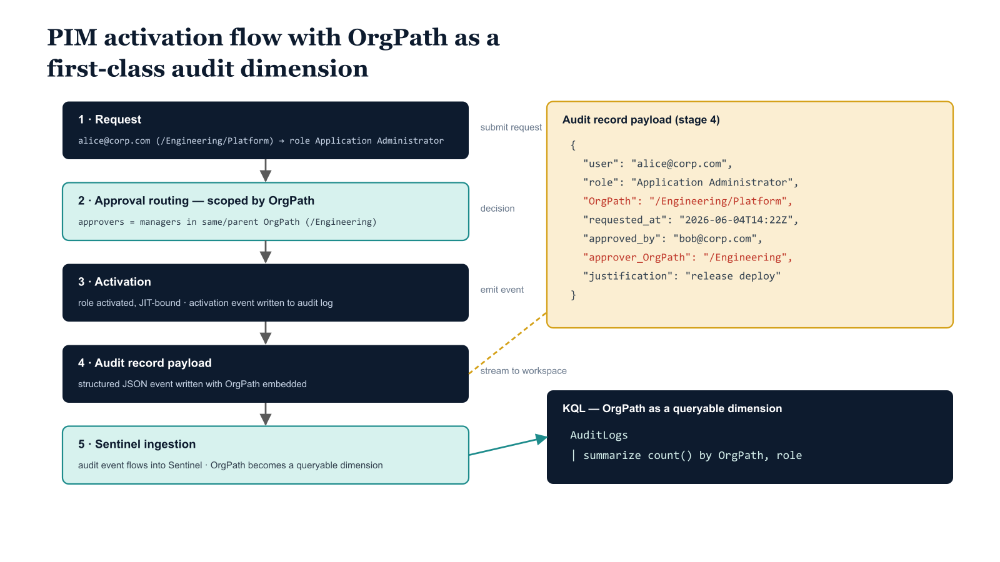

# Chapter 4 — Operational Visibility — Monitoring PIM Through the Lens of Organizational Structure

## Why OrgPath Changes the Value of PIM Monitoring

Without organizational context, PIM activation logs are a stream of events annotated by identity, role, and time. Microsoft Sentinel can surface anomalies against those three dimensions: a user who activates more frequently than their baseline, a role that sees elevated activation volumes, a time window that deviates from the expected pattern. These are valuable signals. But they are structurally incomplete, because they have no awareness of the organizational context in which the activation occurred. A Tier0 infrastructure role activation by a user in the operations engineering segment is a routine administrative event. The same role activation by a user in the finance reporting segment is an anomaly that warrants immediate investigation. Without OrgPath, Sentinel cannot distinguish between these two events. They are both activations of the same role, at the same time of day, with similarly worded justification strings. The detection logic has nothing to work with except the identity and the role.

OrgPath makes the organizational context of every activation queryable. When a user's OrgPath is available in the Sentinel log model, every PIM activation event carries an implicit tag identifying the organizational segment from which the activation originated. Alert thresholds can be tuned per segment. Anomaly detection can be baselining against the activation pattern of a specific organizational unit rather than the tenant as a whole. Dashboards can present privileged access activity organized by hierarchy, so that a governance manager can see at a glance that the Finance division had twelve activations in the past 24 hours, all by users whose OrgPath confirms membership in that division, and that one of those activations was for a role that no Finance division user has a documented need for.

{#fig-11-orgpath-in-security-operations-diagram-02 fig-alt="Top-down five-stage flow diagram showing a PIM eligible-assignment activation with OrgPath as a first-class audit dimension. Stage 1 \"Request\" (top): user alice@corp.com (OrgPath: /Engineering/Platform) requests PIM activation for role Application Administrator. Downward arrow labeled \"submit request\" to Stage 2 \"Approval routing\": workflow scoped by OrgPath — approvers are managers in same or parent OrgPath (/Engineering or /Engineering/Platform). Downward arrow labeled \"approver decision\" to Stage 3 \"Activation\": role activated, JIT-bound; activation event written to audit log. Downward arrow labeled \"emit event\" to Stage 4 \"Audit record payload\": shown as a monospace JSON-style record with fields { user, role, OrgPath, requested_at, approved_by, approver_OrgPath, justification }. Downward arrow labeled \"stream to workspace\" to Stage 5 \"Sentinel ingestion\": audit event flows into Sentinel; OrgPath becomes a queryable dimension. Below stage 5, an inset monospace KQL snippet: | summarize count() by OrgPath, role. Engineering blueprint style, neutral slate background, federal navy (#1F3A5F) for stage boxes, teal (#1A9E8F) for OrgPath-scoped routing in stage 2, amber (#D4A017) for the audit record overlay in stage 4, monospace formatting for KQL and JSON, no human figures, 16:9 landscape." width="85%"}

## Data Availability Prerequisites

OrgPath values flow into the Sentinel log model through two paths. The first is the Entra ID audit log, exported to a Log Analytics workspace via Entra ID diagnostic settings. Every write to the OrgPath extension attribute generates an "Update user" audit event that includes the previous and new values of the attribute. These events accumulate in the AuditLogs table in the connected Log Analytics workspace and can be queried to reconstruct the current OrgPath value for any user by taking the most recent "Update user" event that modified the OrgPath attribute. The retention window for the AuditLogs table — typically 90 days by default, extensible to 730 days with appropriate Log Analytics configuration — determines how far back the query can look. For environments where OrgPath writes are infrequent, extending retention to at least 365 days is recommended so that users who have not changed positions recently are still resolvable from the audit log.

The second path is the sign-in log. If the OrgPath extension attribute has been configured as a token claim in the relevant application registrations, and if Entra ID diagnostic settings are configured to export the non-interactive sign-in logs with extended attribute fields, the OrgPath value will appear in the AdditionalDetails column of sign-in log entries in the AADNonInteractiveUserSignInLogs table. This path provides a more current OrgPath value for users who sign in frequently, because the value is captured at sign-in time rather than at the time of the most recent attribute write. However, it requires the token claim configuration to be in place and is not universally available. The queries in this chapter are written against the AuditLogs path, which is available in all environments that have Entra ID diagnostic settings configured — the more reliable baseline assumption.

Before deploying these queries, verify the following prerequisites are met:

- Entra ID diagnostic settings are configured to export AuditLogs and SignInLogs to the Log Analytics workspace connected to Sentinel.

- The Log Analytics workspace is connected to Sentinel as a data connector (Entra ID connector enabled).

- The OrgPath schema extension attribute name is known and consistent — queries must reference the exact attribute name as it appears in audit log records.

- The OrgTree node naming convention (segment delimiters, root label) is consistent so that startswith and contains predicates on OrgPath values produce reliable results.

## Query 1: PIM Activations by OrgPath — Daily Dashboard

The first query aggregates PIM role activations by organizational segment over a rolling 24-hour window. It joins PIM activation events from the audit log to the most recent OrgPath value for each activating user, then summarizes by OrgPath prefix and time bucket. The result set is designed for a Sentinel Workbook heat-map tile: one row per organizational segment per hour, with activation count, unique user count, average activation duration, and the set of roles activated in that segment during that hour.

## Query 4-A: PIM Activations by OrgPath — Daily Dashboard (KQL)

```kql
// ---------------------------------------------------------------
// Query 1: PIM Activations by OrgPath — Daily Dashboard
// ---------------------------------------------------------------
// Purpose:
//   Summarize PIM role activations by organizational position
//   over a rolling 24-hour window.
// Target table: AuditLogs
// Prerequisite: Entra ID diagnostic settings must export AuditLogs
//   to the Log Analytics workspace connected to Sentinel.
// ---------------------------------------------------------------

// Step 1: Extract PIM activation events from the audit log.
// The OperationName value "Add member to role completed (PIM activation)"
// is generated by Entra ID PIM when a user successfully activates
// an eligible role assignment. Validate this string against your
// tenant's AuditLogs if activations are not appearing — the exact
// string may vary slightly between PIM v2 and PIM for Groups.
let PIMActivations = AuditLogs
| where TimeGenerated >= ago(24h)
| where OperationName == "Add member to role completed (PIM activation)"
| extend
    UserId            = tostring(InitiatedBy.user.id),
    UserPrincipalName = tostring(InitiatedBy.user.userPrincipalName),
    RoleName          = tostring(TargetResources[0].displayName),
    // RequestDuration is recorded in AdditionalDetails as a key-value pair.
    // If this field is not present in your tenant's logs, remove the
    // ActivationDurationMin column and the AvgDurationMin aggregation below.
    ActivationDurationMin = tolong(
        parse_json(tostring(
            AdditionalDetails
            | where Key == "RequestDuration"
        )).Value
    )
| where isnotempty(UserId)
| project TimeGenerated, UserId, UserPrincipalName, RoleName, ActivationDurationMin;

// Step 2: Resolve the current OrgPath for each user.
// This reads the most recent OrgPath attribute change audit event
// within the past 7 days. Users whose OrgPath has not changed
// recently will not appear here; extend the lookback window if needed.
//
// NOTE: The ModifiedProperties displayName filter uses "OrgPath" as a
// substring match. Replace "OrgPath" with the full attribute name if
// your audit log records the full extension attribute name in this field.
// Example: "extension_a1b2c3d4e5f6_OrgPath"
let UserOrgPaths = AuditLogs
| where TimeGenerated >= ago(7d)
| where OperationName == "Update user"
| mv-expand ModifiedProperties = AdditionalDetails
| where tostring(ModifiedProperties.displayName) contains "OrgPath"
| extend
    UserId  = tostring(TargetResources[0].id),
    OrgPath = tostring(ModifiedProperties.newValue)
| where isnotempty(UserId) and isnotempty(OrgPath)
| summarize OrgPath = arg_max(TimeGenerated, OrgPath) by UserId
| project UserId, OrgPath;

// Step 3: Join and aggregate.
// Users whose OrgPath cannot be resolved (no recent attribute write)
// are placed in the UNPOSITIONED bucket — a governance signal that
// should be investigated if it contains non-trivial activation counts.
PIMActivations
| join kind=leftouter UserOrgPaths on UserId
| extend OrgPath = iif(isempty(OrgPath), "UNPOSITIONED", OrgPath)
| summarize
    Activations       = count(),
    UniqueUsers       = dcount(UserPrincipalName),
    AvgDurationMin    = round(avg(ActivationDurationMin), 1),
    Roles             = make_set(RoleName)
    by OrgPath, bin(TimeGenerated, 1h)
| order by Activations desc
```

*This query is intended for a Sentinel Workbook tile refreshed on a one-hour schedule. Pin it as a heat-map visualization with OrgPath on the Y axis and hour-of-day on the X axis, with activation count as the color intensity. The UNPOSITIONED row should be visually distinct — a dark color regardless of count — because any activation from a user without a resolved OrgPath is a data quality issue as well as a potential security signal.*

## Query 2: High-Risk Activations in Sensitive OrgPath Segments

The second query drives a near-real-time alert rule. It evaluates PIM activations against a defined list of sensitive OrgPath prefixes — organizational segments whose assets and data justify a higher alert threshold and a faster response time than the general population. The list of sensitive prefixes is maintained in the SensitivePaths let binding at the top of the query; the governance team updates this list as organizational structure evolves and as risk assessments identify new high-value segments. The query runs on a one-hour frequency with a one-hour lookback window and produces a high-severity incident for any result row.

## Query 4-B: High-Risk PIM Activations in Sensitive OrgPath Segments (KQL)

```kql
// ---------------------------------------------------------------
// Query 2: High-Risk PIM Activations in Sensitive OrgPath Segments
// ---------------------------------------------------------------
// Purpose:
//   Alert on PIM activations by users whose current OrgPath
//   belongs to a designated sensitive organizational segment.
// Intended use: Sentinel Analytics Rule, High severity.
// Query frequency: Every 1 hour.
// Lookback window: Last 1 hour.
// Alert threshold: Any result row generates an incident.
// ---------------------------------------------------------------

// SUBSTITUTE: Update SensitivePaths to match your OrgTree node
// path structure. Each entry is an OrgPath prefix for an
// organizational segment considered high-value or high-risk.
// Use the exact path format used in your OrgPath attribute values.
// Example entries below are illustrative — replace with real paths.
let SensitivePaths = dynamic([
    "/Root/Executive/",
    "/Root/Finance/",
    "/Root/Legal/",
    "/Root/Operations/Security/",
    "/Root/Engineering/Infrastructure/Tier0/"
    // Add additional sensitive OrgPath prefixes as required
]);

// Resolve the most recent OrgPath for each user from audit log.
// Lookback is 7 days to catch users who have not been repositioned recently.
let RecentOrgPaths = AuditLogs
| where TimeGenerated >= ago(7d)
| where OperationName == "Update user"
| mv-expand ModifiedProperties = AdditionalDetails
| where tostring(ModifiedProperties.displayName) contains "OrgPath"
| extend
    UserId  = tostring(TargetResources[0].id),
    OrgPath = tostring(ModifiedProperties.newValue)
| where isnotempty(UserId) and isnotempty(OrgPath)
| summarize OrgPath = arg_max(TimeGenerated, OrgPath) by UserId
| project UserId, OrgPath;

// PIM activation events in the past 1 hour
AuditLogs
| where TimeGenerated >= ago(1h)
| where OperationName == "Add member to role completed (PIM activation)"
| extend
    UserId            = tostring(InitiatedBy.user.id),
    UserPrincipalName = tostring(InitiatedBy.user.userPrincipalName),
    RoleName          = tostring(TargetResources[0].displayName),
    // Extract user-supplied justification from AdditionalDetails.
    // Key name may vary — validate against your tenant's audit log schema.
    Justification = tostring(
        parse_json(tostring(
            AdditionalDetails | where Key == "Justification"
        )).Value
    ),
    IpAddress = tostring(InitiatedBy.user.ipAddress)
| where isnotempty(UserId)
// Join to OrgPath values
| join kind=inner RecentOrgPaths on UserId
// Filter to sensitive organizational segments
| where OrgPath has_any (SensitivePaths)
// Present alert-relevant columns in consistent order
| project
    TimeGenerated,
    UserPrincipalName,
    OrgPath,
    RoleName,
    Justification,
    IpAddress,
    UserId
| order by TimeGenerated desc
```

*The has_any operator against the SensitivePaths dynamic array performs a substring match, which correctly handles OrgPath values for nodes deeper in the hierarchy than the prefix defines — a user at /Root/Finance/Accounting/Payroll/ will match the /Root/Finance/ prefix. Review the SensitivePaths list quarterly in alignment with the organization's risk assessment cycle. The incident generated by this rule routes to the security operations queue, not the governance queue — a PIM activation from a sensitive segment is a security operations matter requiring active analyst review, not a governance finding to be triaged at the next business day.*

## Query 3: PIM Eligibility vs. OrgPath Drift Detection

The third query identifies users who hold PIM eligibility for an organizational segment that does not correspond to their current OrgPath position. This is the Sentinel-side complement to the pipeline-side drift detection described in Part Four. Where the pipeline drift detection compares directory attribute values against the OrgTree registry, this query compares directory privilege assignments against organizational position as recorded in the audit log. The two drift detection mechanisms are intentionally redundant — each catches failure modes that the other may miss.

## Query 4-C: PIM Eligibility vs. OrgPath Drift Detection (KQL)

```kql
// ---------------------------------------------------------------
// Query 3: PIM Eligibility vs. OrgPath Drift Detection
// ---------------------------------------------------------------
// Purpose:
//   Identify users who hold PIM eligibility for an ORG-BRANCH group
//   that does not correspond to any node in their current OrgPath.
//   These users have stale eligibilities that survived a position
//   change without realignment.
// Intended use: Scheduled daily query. Results drive a governance
//   incident when stale eligibility count exceeds threshold.
// Incident routing: Identity governance queue (not SOC).
// ---------------------------------------------------------------

// Step 1: Identify current PIM eligible group assignments.
// We look for audit events that assigned a user as an eligible
// member of a group whose name starts with "ORG-BRANCH-".
// The 90-day lookback covers the standard PIM eligibility audit window.
// Extend if your eligibilities were created more than 90 days ago
// and no renewal events exist in that window.
let PIMEligible = AuditLogs
| where TimeGenerated >= ago(90d)
| where OperationName in (
    "Add eligible member to role (PIM activation)",
    "Add eligible member to role",
    "Add member to role (eligible)"
  )
| extend
    UserId    = tostring(TargetResources[0].id),
    GroupName = tostring(TargetResources[1].displayName)
| where isnotempty(GroupName) and GroupName startswith "ORG-BRANCH-"
| extend NodeId = replace_string(GroupName, "ORG-BRANCH-", "")
| where isnotempty(NodeId) and isnotempty(UserId)
| summarize EligibleNodes = make_set(NodeId) by UserId;

// Step 2: Resolve each user's current OrgPath.
let CurrentOrgPaths = AuditLogs
| where TimeGenerated >= ago(7d)
| where OperationName == "Update user"
| mv-expand ModifiedProperties = AdditionalDetails
| where tostring(ModifiedProperties.displayName) contains "OrgPath"
| extend
    UserId            = tostring(TargetResources[0].id),
    UserPrincipalName = tostring(TargetResources[0].userPrincipalName),
    OrgPath           = tostring(ModifiedProperties.newValue)
| where isnotempty(UserId) and isnotempty(OrgPath)
| summarize arg_max(TimeGenerated, OrgPath, UserPrincipalName) by UserId
| project UserId, UserPrincipalName, CurrentOrgPath = OrgPath;

// Step 3: Identify drift.
// For each user, expand their set of eligible node IDs and test
// whether each eligible node ID appears anywhere in the user's
// current OrgPath value. An eligible node ID that does NOT appear
// in the current OrgPath is a stale eligibility — the user is
// eligible for a branch they are no longer part of.
//
// NOTE: This check uses a substring test (OrgPath contains NodeId).
// This is valid because NodeIds are unique and appear as complete
// path segments. If your NodeId values are numeric or very short,
// consider using segment-level matching to prevent false positives
// from partial string matches within longer segment names.
CurrentOrgPaths
| join kind=inner PIMEligible on UserId
| mv-expand EligibleNode = EligibleNodes
| extend
    NodeId            = tostring(EligibleNode),
    IsCurrentlyInPath = CurrentOrgPath contains tostring(EligibleNode)
| where IsCurrentlyInPath == false
| project
    UserId,
    UserPrincipalName,
    CurrentOrgPath,
    StaleEligibilityNode = NodeId,
    StaleGroupName       = strcat("ORG-BRANCH-", NodeId)
| order by UserPrincipalName asc
```

*This query is saved as a Sentinel Analytics Rule scheduled to run daily. When the result set count exceeds a threshold configured by the governance team — a reasonable starting value is five distinct users, adjusted downward as the mover workflow matures and drift becomes genuinely exceptional — the rule creates a Sentinel incident assigned to the identity governance queue. The incident title is populated with the count of users with stale eligibilities. The governance team's remediation action is to run the PIM eligibility synchronization pipeline manually for the affected users or, if the mover workflow did not fire correctly, to investigate why the Lifecycle Workflow did not trigger and resolve the root cause before processing the next batch of movers.*

## Operationalizing the Query Library

The three queries form a layered operational model. Query One is the governance team's daily situational awareness tool: it shows where in the organizational hierarchy privileged access is being activated, at what volume, and by how many unique identities. It is not an alert query — it produces no incidents and routes to no queue. It is a workbook tile that a governance manager reviews each morning to understand the privileged access activity of the past day in organizational terms.

Query Two is the security operations team's real-time signal for elevated-risk activations. It fires within one hour of a PIM activation from a sensitive segment and creates a high-severity incident requiring analyst review. The analyst's response procedure should include verifying that the activating user's OrgPath entitles them to the role activated, checking the justification string for coherence with the user's expected work, and reviewing the source IP address and device compliance state of the activation session. If all of these checks pass, the incident is closed as informational. If any fails, the incident escalates to the identity risk investigation procedure.

Query Three is the governance team's drift posture metric. The daily incident it produces — when the threshold is exceeded — is not a threat incident. It is a governance finding that the PIM eligibility configuration has diverged from the organizational structure, and that divergence must be remediated before the next compliance review. The finding is documented in the governance repository as a formal drift event, the remediation pipeline is run, and the query is re-executed within 24 hours to confirm that the count has returned below the threshold.

::: {.callout-note title="Alert Tuning Guidance"}
The sensitive segment list in Query Two and the drift threshold in Query Three both require tuning during the initial deployment period. For the first 30 days after the Sentinel queries are deployed, collect baseline data on activation frequencies per organizational segment and on the typical drift count at each weekly governance review. Use those baselines to set the sensitive segment alert threshold and the drift incident threshold at levels that produce actionable incidents without overwhelming the queues. Revisit thresholds quarterly as organizational structure and activation patterns evolve.
:::
