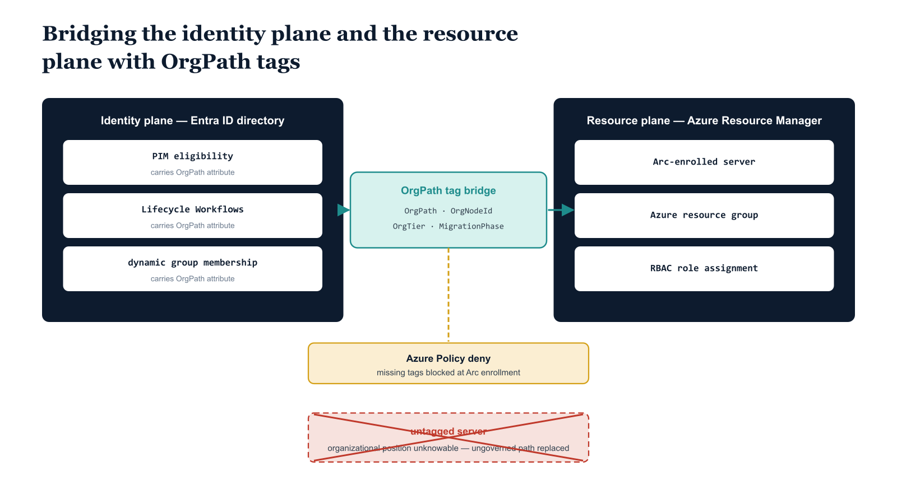

# Chapter 5 — Extending Structural Governance to the Resource Plane

::: {.callout-note}
## In this chapter
OrgPath governance has so far lived entirely on the identity plane; Azure RBAC and Arc-enrolled infrastructure live on a separate resource plane that shares an authentication boundary but no governance boundary. This chapter closes that gap by mirroring the four OrgPath attributes onto Azure resources as mandatory tags, enforcing their presence with an Azure Policy deny rule at Arc enrollment, and binding OrgPath-driven dynamic groups to Azure RBAC role assignments. The result is automatic, organizationally scoped resource access maintained by the same pipeline that governs the directory.
:::

## The Identity-Resource Plane Gap

The integrations in Chapters Two and Three operate entirely on the identity plane. PIM eligibility assignments, Lifecycle Workflows, and Entra ID group memberships are all directory constructs — they govern what an identity can do within the Microsoft identity stack. Azure RBAC operates on a different and distinct plane: the Azure Resource Manager, which governs what an identity can do to Azure resources and Arc-enrolled infrastructure. These two planes share an authentication boundary — they both require Entra ID authentication — but they do not share a governance boundary. An identity's Entra ID directory role and its Azure RBAC assignments are configured and maintained independently. The governance model built in Parts One through Four governs the directory plane thoroughly. This chapter extends that governance to the resource plane.

The resource plane gap is most visible in Arc-managed server environments. An Arc-enrolled server is a physical or virtual machine, running on-premises or in a third-party cloud, that has been registered with Azure Arc and now participates in Azure resource management. It carries an Azure resource identity — it appears in the Azure portal, can be targeted by Azure Policy, and participates in Azure RBAC. But it exists outside the Entra ID directory structure that OrgPath governs.

A server that sits in the Finance division's data center does not automatically have a Finance OrgPath value — it is an Azure resource with whatever tags were manually applied at enrollment time. Without a tag-based bridge, the server's organizational position is unknowable from the resource plane, and Azure RBAC assignments for that server cannot be automatically aligned to the organizational governance model.

{#fig-book-11-cpt-05-diagram-01 fig-alt="Engineering blueprint diagram on a white background showing two parallel governance planes joined by an OrgPath tag bridge. On the left, a federal navy (#1F3A5F) panel labeled Identity plane — Entra ID directory contains stacked monospace boxes PIM eligibility, Lifecycle Workflows, dynamic group membership, all carrying an OrgPath attribute. On the right, a federal navy panel labeled Resource plane — Azure Resource Manager contains monospace boxes Arc-enrolled server, Azure resource group, RBAC role assignment. A teal (#1A9E8F) horizontal bridge across the middle is labeled OrgPath tag bridge and carries four monospace tag chips OrgPath, OrgNodeId, OrgTier, MigrationPhase connecting the two planes. An amber (#D4A017) gate on the bridge is labeled Azure Policy deny — missing tags blocked at Arc enrollment. A red (#C0392B) dashed connector below the bridge is crossed out and labeled untagged server — organizational position unknowable, showing the ungoverned path that the bridge replaces. Monospace labels throughout, no human figures, 16:9 landscape." width="85%"}

## Tag Strategy: Bridging OrgPath to Azure Resource Manager

The bridge between OrgPath and the resource plane is implemented through a consistent resource tagging strategy. Every Arc-enrolled server and every Azure resource brought under the governance model carries four mandatory tags. These tags mirror the OrgPath attributes on directory objects, translating the directory-plane governance model into resource-plane metadata that Azure Policy, Azure RBAC, and the governance dashboard can all consume.

| **Tag Name** | **Value Format** | **Example** | **Purpose** |
|----|----|----|----|
| OrgPath | Full delimited path from root to assigned node | /Root/Finance/Accounting/ | Mirrors the OrgPath attribute value; enables node-and-lineage queries at the resource plane |
| OrgNodeId | Leaf node identifier from OrgTree registry | FIN-ACCT-001 | Enables precise node-level matching without string parsing; used in RBAC group membership rules |
| OrgTier | Tier designation: Tier0, Tier1, or Tier2 | Tier1 | Identifies control plane vs. server vs. workload; used for alert thresholds and access policy differentiation |
| MigrationPhase | Phase label from the modernization program | Phase2 | Tracks modernization progress by organizational segment in the governance dashboard |

> The OrgPath tag value must use exactly the same delimiter and root label as the OrgPath attribute values on directory objects — this is not a style preference but a functional requirement.

The dynamic group membership rules that use OrgPath values to compute group membership rely on exact string matching and prefix operations. If the tag value for a Finance accounting server is /Root/Finance/Accounting/ and the directory attribute value for Finance accounting users is /root/finance/accounting/, the prefix match will fail silently and the RBAC assignment pipeline will not link the server's organizational position to the corresponding user population. Enforce case consistency — lowercase throughout, or title-case throughout — as an organizational standard and validate it in the Azure Policy definition.

## Azure Policy: Enforcing Tag Presence at Arc Enrollment

The tag requirement is enforced by an Azure Policy definition assigned at the management group or subscription scope that governs Arc-enrolled machines. The policy mode is Indexed, which applies the policy to all resources that support tags and location. The effect is deny — the Arc registration API call fails if the required tags are absent, rather than registering the resource and attempting to remediate after the fact. Deny-on-missing is significantly more reliable than deploy-if-not-exists remediation for a tagging requirement, because it prevents the resource from entering a managed state without proper metadata rather than attempting to correct an already-registered resource that may have begun accumulating RBAC assignments under an untagged identity.

## Policy 5-A: Azure Policy Definition — Require OrgPath Tags on Arc-Connected Machines

```json
{
    "mode": "Indexed",
    "displayName": "Require OrgPath Governance Tags on Arc-Connected Machines",
    "description": "Denies Arc machine registration if any of the four required OrgPath governance tags are absent. Tags required: OrgPath, OrgNodeId, OrgTier, MigrationPhase.",
    "policyRule": {
        "if": {
            "allOf": [
                {
                    "field": "type",
                    "equals": "Microsoft.HybridCompute/machines"
                },
                {
                    "anyOf": [
                        {
                            "field": "tags['OrgPath']",
                            "exists": "false"
                        },
                        {
                            "field": "tags['OrgPath']",
                            "equals": ""
                        },
                        {
                            "field": "tags['OrgNodeId']",
                            "exists": "false"
                        },
                        {
                            "field": "tags['OrgNodeId']",
                            "equals": ""
                        },
                        {
                            "field": "tags['OrgTier']",
                            "exists": "false"
                        },
                        {
                            "field": "tags['OrgTier']",
                            "notIn": ["Tier0", "Tier1", "Tier2"]
                        },
                        {
                            "field": "tags['MigrationPhase']",
                            "exists": "false"
                        },
                        {
                            "field": "tags['MigrationPhase']",
                            "equals": ""
                        }
                    ]
                }
            ]
        },
        "then": {
            "effect": "deny"
        }
    },
    "parameters": {}
}
```

*This policy definition is deployed as a standalone assignment rather than as part of a policy initiative, so that it can be assigned at a scope that covers only Arc-connected machine resources. For organizations that also wish to enforce the tagging requirement on Azure virtual machines, add a second if condition block for Microsoft.Compute/virtualMachines resource type, or create a parallel policy definition. The OrgTier field uses notIn rather than exists to enforce valid enumerated values — an empty or misspelled tier designation is caught at enrollment time rather than propagating through the governance model.*

## Dynamic Group-to-RBAC Assignment Pattern

With tags in place at the resource level, the RBAC assignment pattern can be established. The pattern has two components: a dynamic Entra ID security group whose membership is defined by an OrgPath-based membership rule, and an Azure RBAC role assignment that grants that group a specific role at a specific scope. Together, these two components produce an RBAC assignment that is automatic for any user whose OrgPath places them in the correct organizational node, scoped to the resources whose OrgPath tag places them in the same node, maintained without manual intervention as users move between nodes.

The groups in this pattern follow the naming convention AZ-RBAC-{RoleShortName}-{NodeId}. For example, the group that provides Reader access to Finance Accounting resources is named AZ-RBAC-READER-FIN-ACCT-001, where FIN-ACCT-001 is the OrgTree node identifier for the Finance Accounting unit. The dynamic membership rule on this group is:

```
(user.extension_{AppIdWithoutHyphens}_OrgPath -startsWith "/Root/Finance/Accounting/")
// SUBSTITUTE: Replace extension_{AppIdWithoutHyphens}_OrgPath with the full schema
// extension attribute name for OrgPath in your tenant.
// Replace "/Root/Finance/Accounting/" with the correct OrgPath prefix for the node.
```

Any user whose OrgPath value starts with the Finance Accounting prefix is automatically a member of this group. The group is then assigned the Azure Reader role at the resource group or subscription scope where Finance Accounting-owned resources reside. The result: every Finance Accounting user gets Reader access to Finance Accounting resources automatically, through the structural position encoded in their OrgPath, without any manual RBAC assignment.

The same pattern scales to any role and any node. For write-access roles — Contributor, Virtual Machine Contributor, specific custom roles — the membership rule can be made more selective by requiring OrgPath membership and a job title attribute match, or by using a separate group that is populated by the Lifecycle Workflow mover pattern rather than by a dynamic rule, giving the governance team explicit control over who receives write access even within a node.

## Implementation: Set-AzRbacOrgPathGroups.ps1

The following script is the pipeline extension that creates and maintains the RBAC-linked dynamic groups and their Azure role assignments. It reads the same OrgTree registry used by the PIM synchronization script, creates a dynamic group for each active node, and assigns the specified Azure RBAC role to each group at the configured scope. It is designed to be invoked multiple times with different role and scope parameters to build out the complete RBAC assignment structure for a given organizational segment.

## Script 5-B: Set-AzRbacOrgPathGroups.ps1 — Dynamic RBAC Group Provisioning Pipeline Step

```powershell
#Requires -Version 7.4
#Requires -Modules Microsoft.Graph.Authentication, Microsoft.Graph.Groups, Az.Resources

<#
.SYNOPSIS
    Creates Azure AD dynamic groups and Azure RBAC role assignments
    scoped to OrgPath-based organizational nodes.

.DESCRIPTION
    For each active node in the OrgTree registry, this script ensures that:
      1. An Entra ID dynamic security group named AZ-RBAC-{RoleShortName}-{NodeId}
         exists with a membership rule based on the OrgPath extension attribute.
      2. The specified Azure RBAC role is assigned to that group at the
         configured Azure Resource Manager scope.
    Run for each role/scope combination that needs to be governed by OrgPath.

.PARAMETER RoleDefinitionName
    The Azure RBAC built-in or custom role name.
    SUBSTITUTE: Replace with the exact role name as it appears in Azure.
    Examples: "Reader", "Contributor", "Virtual Machine Contributor"
    For custom roles: use the exact custom role definition display name.

.PARAMETER RoleShortName
    Short label used in the dynamic group display name.
    Keep to 12 characters or fewer to avoid display name length issues.
    Examples: "READER", "CONTRIB", "VM-CONTRIB"

.PARAMETER Scope
    The Azure Resource Manager scope at which the role is assigned.
    SUBSTITUTE with the appropriate scope for your environment:
      Subscription:      /subscriptions/{SubscriptionId}
      Resource group:    /subscriptions/{SubscriptionId}/resourceGroups/{RgName}
      Management group:  /providers/Microsoft.Management/managementGroups/{MgId}

.PARAMETER OrgPathExtensionName
    Full schema extension attribute name for OrgPath.
    SUBSTITUTE: Replace {AppIdWithoutHyphens} with your schema extension app ID.
    Format: extension_{AppIdWithoutHyphens}_OrgPath

.PARAMETER OrgTreeRegistryPath
    Local path to the checked-out OrgTree registry JSON file.

.PARAMETER DryRun
    If $true, reports planned actions without creating groups or assignments.
#>
param(
    [string]$RoleDefinitionName   = "Reader",
    [string]$RoleShortName        = "READER",
    [string]$Scope                = "/subscriptions/{SubscriptionId}",
    [string]$OrgPathExtensionName = "extension_{AppIdWithoutHyphens}_OrgPath",
    [string]$OrgTreeRegistryPath  = "C:\governance\orgtree\registry.json",
    [bool]  $DryRun               = $false
)

Set-StrictMode -Version Latest
$ErrorActionPreference = "Stop"

# ---------------------------------------------------------------
# AUTHENTICATION
# ---------------------------------------------------------------
# Authenticate to Microsoft Graph (for Entra ID group management)
# In production, use Managed Identity or certificate-based SPN.
# The Managed Identity or SPN requires:
#   Microsoft Graph:  Directory.ReadWrite.All, Group.ReadWrite.All
#   Azure ARM:        Owner or User Access Administrator on target scope
Connect-MgGraph -Scopes "Directory.ReadWrite.All", "Group.ReadWrite.All" -NoWelcome

# Authenticate to Azure Resource Manager for RBAC assignments.
# Connect-AzAccount -Identity uses the Managed Identity of the automation runner.
# SUBSTITUTE: If running outside Azure, use:
#   Connect-AzAccount -ServicePrincipal -Credential $cred -Tenant "{TenantId}"
Connect-AzAccount -Identity

Write-Host "[$(Get-Date -Format 'yyyy-MM-dd HH:mm:ss')] Authentication complete."

# ---------------------------------------------------------------
# LOAD ORGTREE REGISTRY
# ---------------------------------------------------------------
if (-not (Test-Path $OrgTreeRegistryPath)) {
    throw "OrgTree registry not found at '$OrgTreeRegistryPath'."
}

$orgTree     = Get-Content $OrgTreeRegistryPath -Raw | ConvertFrom-Json
$activeNodes = $orgTree.nodes | Where-Object { $_.Status -eq "Active" }

Write-Host "[$(Get-Date -Format 'yyyy-MM-dd HH:mm:ss')] Loaded $($activeNodes.Count) active nodes from registry."

$results = @{ GroupsCreated = 0; GroupsExisting = 0; RbacAssigned = 0; Failed = 0 }

# ---------------------------------------------------------------
# PROCESS EACH ACTIVE ORGTREE NODE
# ---------------------------------------------------------------
foreach ($node in $activeNodes) {
    $groupName   = "AZ-RBAC-$RoleShortName-$($node.Id)"
    $mailNick    = ($groupName.ToLower() -replace "[^a-z0-9]", "-").TrimEnd("-")
    $description = "Azure RBAC '$RoleDefinitionName' — OrgPath: $($node.Path)"

    # Membership rule: all users whose OrgPath starts with this node's path.
    # The -startsWith operator on extension attributes is supported in
    # dynamic membership rules as of Entra ID dynamic groups API v2.
    $memberRule  = "(user.$OrgPathExtensionName -startsWith `"$($node.Path)`")"

    Write-Host ""
    Write-Host "Processing node: $($node.Name) [$($node.Id)] | Path: $($node.Path)"

    # -------------------------------------------------------
    # STEP 1: Ensure the dynamic group exists
    # -------------------------------------------------------
    $existingGroup = Get-MgGroup `
        -Filter "displayName eq '$groupName'" `
        -Property "Id,DisplayName,MembershipRule,MembershipRuleProcessingState" `
        -ErrorAction SilentlyContinue

    if (-not $existingGroup) {
        $groupBody = @{
            DisplayName                   = $groupName
            Description                   = $description
            MailEnabled                   = $false
            MailNickname                  = $mailNick
            SecurityEnabled               = $true
            GroupTypes                    = @("DynamicMembership")
            MembershipRule                = $memberRule
            MembershipRuleProcessingState = "On"
        }

        if ($DryRun) {
            Write-Host "  [DRYRUN] Would create group: $groupName"
            Write-Host "           Rule: $memberRule"
            $results.GroupsCreated++
            continue
        }

        try {
            $newGroup = New-MgGroup -BodyParameter $groupBody
            Write-Host "  [CREATED] Group: $groupName [$($newGroup.Id)]"
            $groupId = $newGroup.Id
            $results.GroupsCreated++
        }
        catch {
            Write-Warning "  [FAILED]  Could not create group '$groupName': $_"
            $results.Failed++
            continue
        }
    }
    else {
        $groupId = $existingGroup.Id
        Write-Host "  [EXISTS]  Group: $groupName [$groupId]"

        # Validate membership rule is current — update if the node's path has changed
        if ($existingGroup.MembershipRule -ne $memberRule) {
            Write-Host "  [UPDATE]  Membership rule updated for $groupName"
            if (-not $DryRun) {
                Update-MgGroup -GroupId $groupId -MembershipRule $memberRule
            }
        }
        $results.GroupsExisting++
    }

    # -------------------------------------------------------
    # STEP 2: Assign Azure RBAC role to the group at scope
    # -------------------------------------------------------
    $existingAssignment = Get-AzRoleAssignment `
        -ObjectId           $groupId `
        -RoleDefinitionName $RoleDefinitionName `
        -Scope              $Scope `
        -ErrorAction SilentlyContinue

    if (-not $existingAssignment) {
        if ($DryRun) {
            Write-Host "  [DRYRUN] Would assign '$RoleDefinitionName' at scope $Scope for $groupName"
            $results.RbacAssigned++
            continue
        }

        try {
            New-AzRoleAssignment `
                -ObjectId           $groupId `
                -RoleDefinitionName $RoleDefinitionName `
                -Scope              $Scope | Out-Null
            Write-Host "  [ASSIGNED] '$RoleDefinitionName' at $Scope for $groupName"
            $results.RbacAssigned++
        }
        catch {
            Write-Warning "  [FAILED]   RBAC assignment failed for $groupName at $Scope`: $_"
            $results.Failed++
        }
    }
    else {
        Write-Host "  [EXISTS]   RBAC assignment already in place for $groupName"
    }
}

# ---------------------------------------------------------------
# SUMMARY
# ---------------------------------------------------------------
Write-Host ""
Write-Host "================================================================"
Write-Host "  Azure RBAC OrgPath Group Provisioning — Complete"
Write-Host "================================================================"
Write-Host "  Groups created   : $($results.GroupsCreated)"
Write-Host "  Groups existing  : $($results.GroupsExisting)"
Write-Host "  RBAC assigned    : $($results.RbacAssigned)"
Write-Host "  Failed           : $($results.Failed)"
if ($DryRun) { Write-Host "  *** DRY RUN — no changes were made ***" }
Write-Host "================================================================"

Disconnect-MgGraph
```

## RBAC Scope Strategy

The Scope parameter accepts any valid Azure Resource Manager scope string, and the appropriate scope depends on how Azure resources are organized in the environment. Organizations that have structured their Azure resource hierarchy to mirror OrgTree — creating a dedicated resource group for each organizational unit's resources — should set the scope to the resource group corresponding to each node. At resource-group scope, the RBAC assignment grants the specified role only to resources within that group, which produces a tight, auditable, organizational-boundary-aligned access control boundary. The dynamic group provides the identity filtering; the resource group scope provides the resource filtering; together they form a precise two-dimensional access control specification.

Organizations with a flatter Azure resource organization — where resources from multiple organizational units coexist within the same resource group or subscription — should set the scope at the subscription or management group level and accept that the dynamic group provides the primary access boundary. In this model, all users in the Finance node receive Reader access to all resources in the subscription, not just Finance-owned resources.

This is a broader grant than the resource-group-scoped model, but it may be appropriate during the transition period before Azure resources are reorganized to mirror OrgTree. The pipeline is designed to accommodate scope changes without recreating groups: the scope parameter can be updated in the pipeline configuration, and the script will create new role assignments at the new scope without disturbing the dynamic group or its existing membership rule.

The two scope models can coexist within a single deployment. A single invocation of the script with a subscription-level scope provides broad coverage for all nodes. Subsequent invocations with resource-group scopes for specific high-sensitivity nodes layer more restrictive assignments on top of the broad baseline, because a more specific RBAC assignment at resource-group scope does not override or conflict with a broader assignment at subscription scope — RBAC in Azure ARM is additive within a scope hierarchy. The governance team can use this layering to implement a progressively refined access model as resource organization catches up to the OrgTree structure.

::: {.callout-note title="Pipeline Invocation Pattern for Multiple Roles"}
Run the script once per role definition per scope. A typical initial deployment for a single organizational segment might include three invocations: Reader at the subscription scope, Contributor at the node's dedicated resource group, and Virtual Machine Contributor at the resource group containing Arc-enrolled servers for that segment. The pipeline configuration file should enumerate all role/scope combinations and drive the script invocations in sequence. Adding a new role to the governance model requires adding a new entry to the pipeline configuration file and committing the change — the next pipeline run will create the new groups and assignments for all active nodes automatically.
:::
