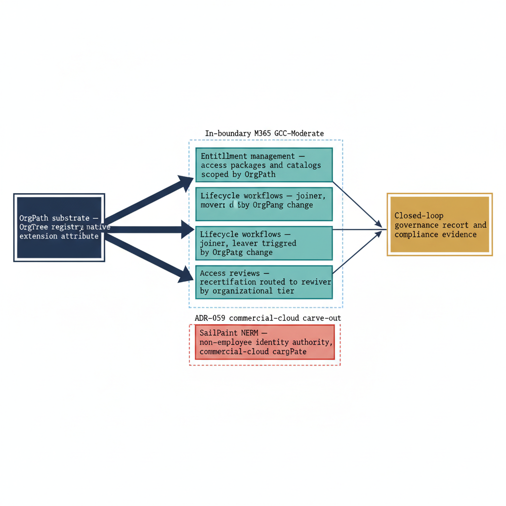

# Chapter 1 — The Identity Governance Plane — Beyond Privileged Access

::: {.callout-note}
## In this chapter
Book 11 governed *privileged* access — PIM eligibility, Azure RBAC, and the structural-mover alignment that keeps elevation tethered to organizational position. This supplement governs the layer beneath and around that: the full identity lifecycle, the entitlements that ordinary identities accumulate, the recertification that confirms those entitlements remain warranted, and the contractors and vendors that human resources never owned in the first place. This chapter names the gap the AD-era lifecycle left open, names the two systems that close it — Microsoft Entra ID Governance and SailPoint NERM — and establishes OrgPath as the single governing attribute that makes entitlement scoping, reviewer routing, and lifecycle triggering tractable across both. It closes by mapping the remaining five chapters onto that plane.
:::

## The Lifecycle the Directory Was Never Built to Govern

In the Active Directory era, identity governance was a sequence of manual handoffs dressed as a process. A new hire appeared in the human-resources system, and some days later — rarely the same day — a help-desk ticket produced an AD account. Access was group-based: the account was added to the security groups its manager named, or to the groups a peer in the same role already held, copied forward as a template. Periodic certification arrived quarterly or annually as a spreadsheet, and a manager confirmed, line by line, that each report still needed each group. On paper, this was a complete lifecycle — joiner, mover, leaver, and attestation. In practice, every joint in it leaked.

It leaked because nothing in the directory encoded *why* an account held what it held. A group membership recorded a fact — this user is in this group — but not the reason, not the organizational position that justified it, and not the date by which the justification should be revisited. So the lifecycle decayed in three predictable ways. Accounts orphaned: an employee left, the HR record closed, but the AD account lingered because deprovisioning depended on a ticket that no one filed.

Groups sprawled: every "copy this person's access" request widened the blast radius of a template that no one had reviewed in years, until a single group conferred access that no current member could explain. And certification became ritual: a manager facing two hundred rows of group names with no organizational context, no entitlement description, and no consequence for approving did the only economical thing — selected all, approved, signed. Rubber-stamp recertification is not a failure of diligence.

It is the rational response to a review that supplies no information on which to exercise diligence.

> The AD-era lifecycle did not lack steps. It lacked a governing attribute. Every step asked a human to supply, from memory, the organizational context the directory should have carried natively — and humans, asked to supply that context two hundred rows at a time, supply a signature instead.

## What Modernizes It, Named

Two systems replace that decayed lifecycle, and it is worth naming them precisely because they divide the work along a boundary that matters for the rest of this supplement.

The first is **Microsoft Entra ID Governance**, the identity-governance capability native to the Microsoft 365 tenant.

It contributes three constructs. *Entitlement management* replaces the copy-a-peer's-groups habit with **access packages** — curated bundles of groups, applications, and SharePoint sites, published in **catalogs**, that an identity requests and an owner approves, with the grant carrying an expiration and a recorded business justification from the moment it is issued. *Lifecycle workflows* replace the help-desk ticket with automation: joiner, mover, and leaver events fire scheduled tasks — enable the account, assign baseline access, notify the manager, revoke on departure — without a human initiating each one.

And *access reviews* replace the annual spreadsheet with scoped, recurring recertification that routes the right entitlements to the right reviewer and acts on the result, removing access the reviewer declines rather than merely logging the decline.

The second is **SailPoint NERM** — Non-Employee Risk Management — which governs the population Entra ID Governance structurally cannot, because that population does not originate in the HR system that feeds the tenant. Contractors, vendors, auditors, partner staff, seasonal labor, and machine-adjacent service relationships are identities the organization must provision, scope, review, and deprovision with the same rigor as employees, yet they have no HR record to drive a lifecycle workflow. NERM supplies the authoritative source of record for exactly that population, with its own sponsorship, its own attestation, and its own end-date enforcement — and it is the deliberate commercial-cloud carve-out this supplement develops in full in Chapter 5.

## Where This Sits Relative to Book 11

Book 11 and this supplement are not two passes over the same ground; they are two strata of one plane, and the relationship is precise. Book 11 governs *elevation* — the privileged access that a small fraction of identities hold for a bounded window, mediated by PIM and Azure RBAC, realigned the moment an OrgPath change signals a structural move.

This supplement governs *entitlement and lifecycle* — the standing access that every identity holds continuously, the recertification that confirms it, and the joiner-mover-leaver mechanics that bring identities into the estate and remove them from it. PIM is a *consumer* of this plane, not a peer of it: the structural-mover workflow Book 11 described is one lifecycle workflow among the family Chapter 3 develops, and the eligibility a mover loses is one entitlement among the many an access review can reach.

We will not re-explain PIM here; we will assume it, and build the broader fabric around it.

| Concern | Book 11 — Privileged Access | Book 11a — Identity Governance Plane |
|---|---|---|
| Population | The few who elevate | Every governed identity, plus non-employees |
| Access shape | Time-bound, just-in-time elevation | Standing entitlements and lifecycle state |
| Primary system | PIM, Azure RBAC | Entra ID Governance, SailPoint NERM |
| Core question | *Who may elevate, when, for how long?* | *Who holds what, why, until when — and who confirms it?* |
| Trigger | OrgPath change realigns eligibility | OrgPath change drives joiner/mover/leaver and review scope |

## OrgPath Is the Attribute That Makes It Tractable

The thread running through every chapter of this series is that each governed identity carries **OrgPath** — the org-hierarchy path drawn from the OrgTree registry — as a native directory attribute, stamped into an Entra extension attribute and resolved through dynamic-group membership. In the privileged-access layer, OrgPath determined eligibility. In the governance plane, it does more, because it is precisely the organizational context whose absence caused the AD-era lifecycle to decay.

{#fig-book-11a-cpt-01-diagram-01 fig-alt="Engineering blueprint diagram on a white background showing a single root box on the far left labeled OrgPath substrate — OrgTree registry, native extension attribute. An arrow fans rightward into a vertical cluster of four governance-construct boxes: Entitlement management — access packages and catalogs scoped by OrgPath; Lifecycle workflows — joiner, mover, leaver triggered by OrgPath change; Access reviews — recertification routed to reviewer by organizational tier; SailPoint NERM — non-employee identity authority, commercial-cloud carve-out. The first three boxes sit inside a bounding frame labeled In-boundary M365 GCC-Moderate, and the NERM box sits in a separate bounding frame labeled ADR-059 commercial-cloud carve-out. All four boxes converge rightward into one terminal box labeled Closed-loop governance record — audit and compliance evidence. Palette federal navy #1F3A5F for the substrate, teal #1A9E8F for the three in-boundary constructs, amber #D4A017 for the audit record terminus, red #C0392B for the carve-out frame, monospace labels for component names, no human figures, 16:9 landscape." width="85%"}

Consider what OrgPath supplies to each construct. Entitlement scoping derives from it: an access package need not enumerate eligible requesters by name when it can scope availability to an OrgPath subtree, so that the package offered to the field-operations directorate is automatically the package its members can request and no one else's to widen.

Reviewer routing derives from it: an access review need not be hand-addressed to a named manager when OrgPath resolves, from the registry, which organizational tier owns the identity under review and routes the decision there — and routes it with the organizational context, the entitlement description, and the justification that the AD-era spreadsheet withheld.

Lifecycle triggering derives from it: a mover is not a help-desk observation but an OrgPath write, and the change in that single attribute is the event a lifecycle workflow subscribes to, firing realignment, review, and notification without anyone filing a ticket. The same attribute that placed a user in a policy group in Part Four now scopes their entitlements, routes their recertification, and triggers their lifecycle — one value, governing the whole plane.

> The AD-era lifecycle decayed because organizational context lived in human memory. OrgPath relocates that context into a native attribute the governance systems can read — which is the difference between a review that informs a decision and a review that collects a signature.

## A Note on the Boundary

One distinction must be set down before the substance begins, because it shapes everything that follows. **Entra ID Governance is in-boundary.** Entitlement management, lifecycle workflows, and access reviews are native Microsoft 365 capabilities operating inside the GCC-Moderate authorization boundary; nothing in Chapters 2 through 4 leaves it. **SailPoint NERM is not.** It is a deliberate commercial-cloud carve-out, accepted under ADR-059, with its own boundary disposition and integration contract — and Chapter 5 develops that carve-out in full, including the AWS GovCloud caveat that governs how non-employee identity data crosses between the commercial control plane and the federal boundary.

Naming the boundary here, at the framing, prevents the easy error of treating the whole plane as a single homogeneous M365 capability. It is not. It is two systems, on two sides of a deliberate line, joined by one attribute.

## What the Rest of This Supplement Builds

From here the supplement walks the plane construct by construct. **Chapter 2** develops entitlement management — access packages and catalogs scoped to OrgPath subtrees, with the request-and-approval mechanics that replace copy-a-peer's-groups. **Chapter 3** develops lifecycle workflows — the joiner, mover, and leaver automation that subscribes to OrgPath change and fires realignment, baseline assignment, and deprovisioning without a ticket. **Chapter 4** develops access reviews — recertification scoped and routed by organizational tier so that the reviewer receives the context the AD-era spreadsheet withheld, and the decline is acted on rather than logged. **Chapter 5** develops SailPoint NERM — the non-employee identity authority, the ADR-059 carve-out, and the boundary mechanics that let it govern contractors and vendors without dragging commercial-cloud data across the federal line.

And **Chapter 6** closes the loop: it shows the four constructs producing a single, continuous, audit-grade governance record, and describes what the organization can now answer that the AD-era lifecycle never could — who holds what, why, until when, and who confirmed it — with OrgPath as the join key beneath every answer.
