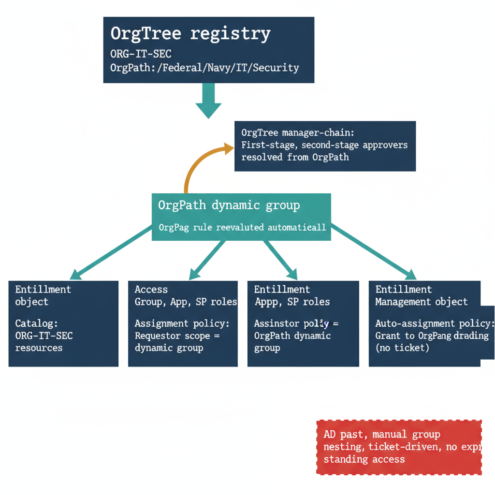

# Chapter 2 — Entitlement Management — Access Packages Scoped by OrgPath

::: {.callout-note}
## In this chapter
Entra ID Governance Entitlement Management replaces the ticket-driven, manually-nested access model of the Active Directory era with a request-and-approve lifecycle built on three objects: **catalogs** (containers of governed resources), **access packages** (bundles of resource roles a user can request), and **assignment policies** (who may request, how approval is routed, and when access expires). This chapter shows how every one of those objects derives its scope, its requestor population, its approval chain, and its automatic-assignment rule from **OrgPath** — so that joiners receive the right access by organizational structure rather than by raising a ticket, and standing access is removed by design rather than by audit.
:::

## From Nested Groups to Governed Packages

In the Active Directory world, access to a resource was access to a group, and access to a group was a manual act. An administrator added a user to a security group; that group was nested inside another group; that group granted a share permission or an application entitlement somewhere downstream. The chain was rarely documented end to end, it had no expiration, and the only record of *why* a user held an entitlement was a closed help-desk ticket — if that. Access accumulated. People changed roles and kept their old memberships. Nobody could answer "who can reach this resource, and on whose authority" without walking the nesting graph by hand.

Entra ID Governance **Entitlement Management** reframes the entire question. Instead of granting memberships, the governance team publishes *access packages* — curated bundles of the roles a person in a given organizational position legitimately needs. A user requests a package; a policy decides whether they may request it, who must approve, and how long the grant lasts. The resource roles are provisioned and de-provisioned by the platform, and every grant carries a justification, an approver of record, and an expiration. The standing-access problem and the ticket-queue problem dissolve together: access is requestable, time-bound, and auditable, and the bundle — not the individual nested group — becomes the unit of governance.

What Entitlement Management does not decide on its own is *which* resources belong in a package, *who* should be allowed to request it, and *whom* a request should route to for approval. Those are organizational questions, and OrgPath is the organizational answer. The binding invariant of this narrative — that every governed identity and resource carries its OrgPath, the org-hierarchy path drawn from the OrgTree registry, in a native Entra attribute and the dynamic-group rules built on it — is what turns Entitlement Management from a generic request portal into a structurally-governed access plane.

{#fig-book-11a-cpt-02-diagram-01 fig-alt="Engineering blueprint diagram on a white background showing a federal navy box at the top labeled OrgTree registry with a monospace node identifier ORG-IT-SEC and its OrgPath string. A single teal arrow descends to a teal box labeled OrgPath dynamic group, OrgPath rule re-evaluated automatically. From that dynamic group four labeled arrows fan out to four navy Entitlement Management object boxes arranged left to right: a Catalog box scoped to ORG-IT-SEC resources, an Access package box bundling that node's group, app, and SharePoint roles, an Assignment policy box whose requestor scope is the OrgPath dynamic group, and an Auto-assignment policy box that grants the package to the same dynamic group with no ticket. An amber approval-routing arrow loops from the assignment policy up to a navy OrgTree manager-chain box labeled first-stage and second-stage approvers resolved from OrgPath. A red side-note card at the lower right is labeled AD past, manual group nesting, ticket-driven, no expiry, standing access. Monospace labels for node, group, package, and policy names throughout, federal navy 1F3A5F, teal 1A9E8F, amber D4A017, red C0392B, no human figures, 16:9 landscape."  width="85%"}

## The Four Constructs and How OrgPath Drives Each

Entitlement Management exposes its objects under the Microsoft Graph `identityGovernance/entitlementManagement` namespace. Four constructs do the work, and each one binds to OrgPath at a specific point.

**Catalogs** (`accessPackageCatalog`) are the containers of governed resources. A catalog holds the groups, enterprise applications, SharePoint Online sites, and directory roles that may be packaged for a particular part of the organization. In an OrgPath-governed tenant, catalogs are scoped to org nodes: a catalog named for `ORG-IT-SEC` contains exactly the resources that belong to the IT Security node and its descendants. Resource ownership and delegated catalog administration follow the same boundary, so the team that owns a node owns the catalog for that node. This is the structural answer to the AD-era question of "who is allowed to grant access to this resource" — the catalog boundary *is* the org boundary.

**Access packages** (`accessPackage`) are the requestable bundles. A package draws resource roles from one catalog and presents them as a single unit: "Member of the IT-Security collaboration group, plus the Reader role on the IT-Security SharePoint site, plus the operator role in the security tooling application." Because the package is built from a node-scoped catalog, the package itself is implicitly scoped to that node. The unit a user requests is therefore the unit the organization governs — there is no longer a gap between the thing requested and the thing audited.

**Assignment policies** (`accessPackageAssignmentPolicy`) decide *who may request a package*, *how a request is approved*, and *how long an assignment lasts*. This is where OrgPath does most of its work. The policy's requestor scope is defined by an OrgPath-keyed dynamic group: only users whose OrgPath places them under the relevant node may even see the package.

Approval routing is resolved against the requestor's OrgTree manager chain — the first-stage approver is the requestor's manager as recorded in OrgTree, and the second-stage approver is the next node up the path — so approval authority tracks reporting structure rather than a hand-maintained approver list. The policy's expiration and review settings remove standing access by giving every grant a lifetime.

Separation-of-duties is enforced here too: a policy can name *incompatible access packages*, so that holding one package blocks a request for another, encoding conflict-of-interest rules that the AD model could express only as tribal knowledge.

**Auto-assignment policies** are the structural counterpart to request-based policies. Rather than waiting for a user to ask, an auto-assignment policy grants a package automatically to every member of an OrgPath dynamic group. When a joiner's OrgPath is written and they fall into the `ORG-IT-SEC` dynamic group, the auto-assignment policy provisions their baseline IT-Security package without a ticket, a request, or an approval — access arrives by structure. When that person moves out of the node, their OrgPath changes, they leave the dynamic group, and the auto-assignment is removed. The same mechanism that grants by structure also revokes by structure.

| Graph object (`identityGovernance/entitlementManagement`) | What it governs | OrgPath binding |
|---|---|---|
| `accessPackageCatalog` | Container of governed resources (groups, apps, SharePoint sites, roles) | Catalog scoped to one org node; resources and delegated catalog ownership follow the node boundary |
| `accessPackage` | Requestable bundle of resource roles | Built from a node-scoped catalog, so the package inherits the node's scope |
| `accessPackageAssignmentPolicy` (request-based) | Who may request, approval stages, lifecycle/expiration, incompatible-package rules | Requestor scope = OrgPath dynamic group; approval routed to the OrgTree manager chain; SoD via incompatible packages by node |
| `accessPackageAssignmentPolicy` (auto-assignment) | Automatic grant without a request | Target = OrgPath dynamic group; joiners assigned by structure, movers removed when OrgPath changes |
| Visibility / segregation controls | Whether a package is internal-only, externally requestable, hidden | Gated by **OrgTier** so that higher-tier packages are visible only to the appropriate org level |

## An Assignment Policy Keyed to an OrgPath Group

The binding is concrete in the policy body. The minimal Graph representation below defines a request-based assignment policy whose requestor scope is a specific OrgPath dynamic group, with a single approval stage and a time-bound assignment. The `groupId` is the OrgPath-keyed dynamic group for the node; everything else — who may request, who approves, when access ends — follows from it.

```json
{
  "displayName": "ORG-IT-SEC — Baseline access policy",
  "description": "Request-based policy for the IT Security node; requestor scope and approval derive from OrgPath.",
  "accessPackageId": "{accessPackageId}",
  "requestorSettings": {
    "scopeType": "SpecificDirectorySubjects",
    "acceptRequests": true,
    "allowedRequestors": [
      {
        "@odata.type": "#microsoft.graph.groupMembers",
        "groupId": "{orgPathDynamicGroupId}"
      }
    ]
  },
  "requestApprovalSettings": {
    "isApprovalRequired": true,
    "approvalStages": [
      {
        "approvalStageTimeOutInDays": 7,
        "primaryApprovers": [
          {
            "@odata.type": "#microsoft.graph.singleUser",
            "userId": "{orgTreeManagerUserId}"
          }
        ]
      }
    ]
  },
  "expiration": {
    "type": "afterDuration",
    "duration": "P180D"
  }
}
```

> The policy never names an individual requestor population by hand. `allowedRequestors` points at the OrgPath dynamic group, so the requestor set re-evaluates whenever OrgPath changes — the same self-healing property the dynamic group library gives every other governed surface. The approver is resolved from the requestor's OrgTree manager chain, and the `P180D` expiration guarantees the grant cannot become standing access.

The contrast with the Active Directory past is stark when laid side by side. There, access was a manual group membership with no expiry, granted by a ticket whose justification was lost the moment the ticket closed, and revoked only when someone happened to notice. Here, access is a requestable package whose scope, requestors, approvers, and lifetime are all computed from one organizational fact — the OrgPath value already written on every identity. The ticket queue disappears because joiners are auto-assigned by structure; standing access disappears because every grant expires; and the audit question "who can reach this, and on whose authority" is answered by the policy itself rather than by walking a nesting graph.

## Where This Leads

Scoping, requesting, approving, and auto-assigning describe how access is *granted* and *bounded*. They do not yet describe what happens at the organizational events that change a person's relationship to the structure — the joiner who must be provisioned, the mover whose entitlements must follow them across nodes, and the leaver whose access must be withdrawn. Those events are governed by **lifecycle workflows**, which translate OrgTree change into Entitlement Management action automatically. Chapter 3 takes up lifecycle workflows and shows how an OrgPath change becomes a provisioning, re-assignment, or de-provisioning event without a human in the loop.
