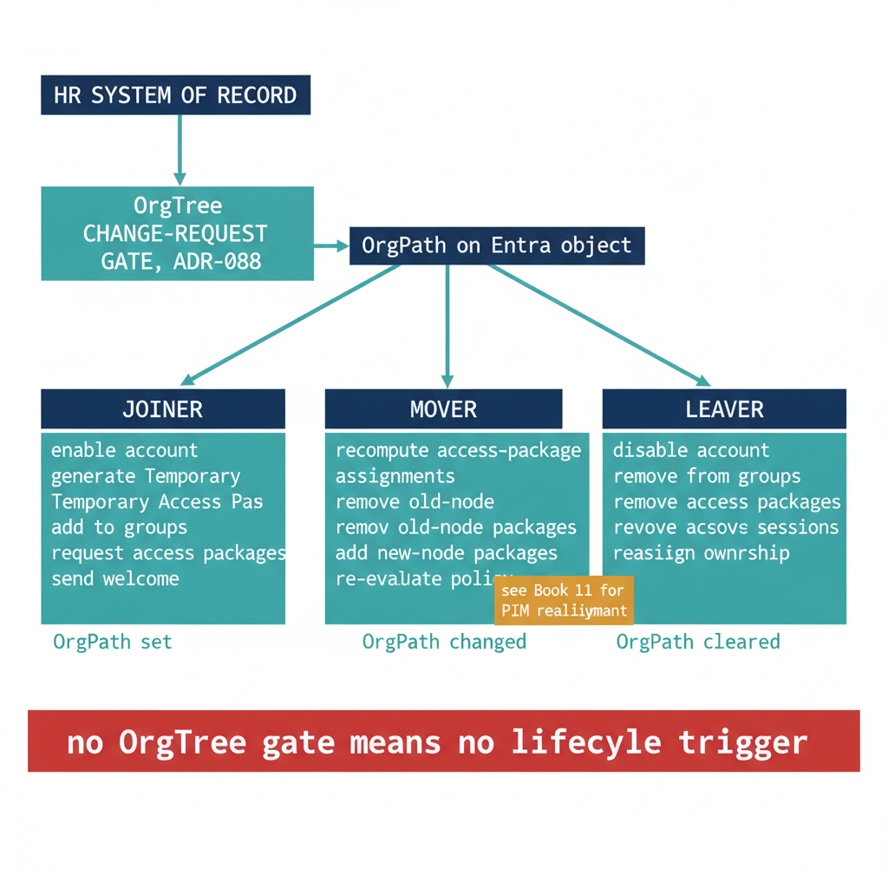

# Chapter 3 — Lifecycle Workflows — Joiner, Mover, Leaver Driven by OrgTree

::: {.callout-note}
## In this chapter
The access packages that Chapter 2 defined do not assign themselves. This chapter introduces Microsoft Entra ID Governance Lifecycle Workflows — the joiner, mover, and leaver automation that enables accounts, generates a Temporary Access Pass, joins groups, requests access packages, and tears all of it down on departure — and binds every workflow to OrgPath. A joiner is an identity stamped with its first OrgPath; a mover is precisely an OrgPath change; a leaver is an OrgPath cleared. HR is the upstream source of truth for the OrgTree (ADR-088), and the OrgTree change-request gate is the governance control over every HR delta. The chapter positions this entitlement-and-lifecycle realignment against Book 11's privileged realignment so that the two together form the complete mover response, and closes by handing the certification problem to Chapter 4's access reviews.
:::

## Lifecycle Workflows Pick Up Where Entitlement Management Stops

[Chapter 2](Book_11a_CPT_02.qmd) defined the entitlement-management surface: access packages bundled into catalogs, scoped by OrgPath, with policies that govern who may request what and who must approve it. Those packages describe the *shape* of access an identity should hold at a given organizational position. They do not, on their own, decide *when* an identity acquires that shape, when it must change, or when it must be removed. That timing is the work of lifecycle automation. Microsoft Entra ID Governance provides it through **Lifecycle Workflows**, a workflow engine that executes ordered task sequences against identity objects in response to time-based and attribute-based triggers. Lifecycle Workflows are exposed through the Microsoft Graph `identityGovernance/lifecycleWorkflows` resource — the `workflows` that define task sequences, the `tasks` drawn from a catalog of built-in templates, and the `runs` that record each execution against each user — and through a portal experience under Identity Governance.

The engine recognizes three workflow categories, mapped to the three canonical identity lifecycle events. A **joiner** workflow runs when a person arrives. A **mover** workflow runs when a person's organizational position changes. A **leaver** workflow runs when a person departs. In an OrgPath-backed environment, all three are defined relative to a single attribute. The joiner is the moment OrgPath is first stamped onto the directory object; the mover is a change to the OrgPath value; the leaver is the clearing of OrgPath when the account is offboarded. The OrgPath attribute is therefore not merely one input among many — it is the spine that the entire lifecycle hangs from.

{#fig-book-11a-cpt-03-diagram-01 fig-alt="Engineering blueprint diagram on a white background showing the joiner-mover-leaver lifecycle bound to OrgPath. At the top a federal navy 1F3A5F box labeled HR SYSTEM OF RECORD feeds a teal 1A9E8F box labeled OrgTree CHANGE-REQUEST GATE, ADR-088, which writes to a navy box labeled OrgPath on the Entra object. From the OrgPath box three teal arrows fan out to three columns. Left column header JOINER over a monospace task list reading enable account, generate Temporary Access Pass, add to groups, request access packages, send welcome, annotated OrgPath set. Center column header MOVER over a monospace task list reading recompute access-package assignments, remove old-node packages, add new-node packages, re-evaluate policy, annotated OrgPath changed, with an amber D4A017 callout tag reading see Book 11 for PIM realignment. Right column header LEAVER over a monospace task list reading disable account, remove from groups, remove access packages, revoke sessions, reassign ownership, annotated OrgPath cleared. A red C0392B note band along the bottom reads no OrgTree gate means no lifecycle trigger. Palette federal navy 1F3A5F for sources and structure, teal 1A9E8F for the lifecycle flows, amber D4A017 for the Book 11 cross-reference, red C0392B for the dependency warning, monospace labels throughout, no human figures, 16:9 landscape." width="85%"}

## The Joiner — Standing Up an Identity at Its OrgPath

A joiner workflow runs against a person who is arriving in the organization. Lifecycle Workflows schedule the joiner relative to the `employeeHireDate` attribute: a workflow can be configured to execute a defined number of days *before* the hire date — the pre-hire window, used to provision access ahead of day one — or *on* the hire date itself. The engine evaluates these scheduled conditions on a recurring tenant-wide cycle and queues every matching user for execution, so a joiner workflow does not require an external system to "call" it; it fires on the clock against the population the HR feed has provisioned.

The joiner task sequence draws on the built-in task templates and runs in a deliberate order. The account is **enabled**. A **Temporary Access Pass** is generated and delivered so the new arrival can complete their first passwordless or multifactor registration without a permanent credential ever being issued. The user is **added to groups** that correspond to their organizational position, which in an OrgPath environment means the dynamic groups whose membership rules already match the new OrgPath value. **Access packages are requested** on the user's behalf — the very packages Chapter 2 scoped to the user's OrgPath node — so that the entitlements approved for that position are placed into the request-and-approval pipeline automatically rather than waiting for the user to discover and ask for them. Finally a **welcome notification** is sent. The decisive point for this narrative is that every group and every access package in that sequence is selected by OrgPath. The joiner does not enumerate a hand-maintained list of resources; it resolves the new arrival's structural position and lets the OrgPath-scoped groups and access packages populate the rest.

## The Mover — An OrgPath Change Is the Trigger

A mover is the hardest of the three events, because the identity persists with uninterrupted access across the transition. There is no enable and no disable to bound the change; there is only an attribute that transitions from one OrgPath value to another. Lifecycle Workflows treat that transition as a first-class trigger: a mover workflow can fire on the attribute-change condition for the monitored OrgPath attribute, queuing the user the moment the new value is written, or — where the attribute-change trigger is not configured — on a scheduled evaluation that detects users whose OrgPath differs from the value recorded at the workflow's last run, at the cost of up to a day's lag. Either way, the engine's job is to detect that the person's organizational position moved and to **realign** the access that position confers.

The entitlement-side mover sequence recomputes access-package assignments against the new OrgPath. Packages tied to the old node are removed, packages scoped to the new node are requested, and the governing access-package policies are re-evaluated so that approval and separation-of-duties constraints are applied to the new entitlements rather than inherited silently from the old ones. This is what prevents the classic mover failure mode in which a person accumulates the union of their old and new access and carries it indefinitely.

> A mover does not lose access on its own — it only gains. Absent a workflow keyed to the OrgPath change, a structural move stacks the new position's entitlements on top of the old, and the combined privilege persists until something explicitly removes it.

This chapter is careful about a boundary. **It does not cover the privileged-access half of the mover response.** [Book 11, Chapter 3 — "When an Identity Moves: Automating Structural Access Realignment"](Book_11.qmd) designs the PIM and role-eligibility realignment that fires on the same OrgPath change: removing the user from the old node's PIM-eligible groups, creating eligibility at the new node, and opening the targeted mover access review. That chapter and this one are deliberately complementary. Book 11 handles **privileged** realignment through PIM; this chapter handles **entitlement-management** realignment through access packages and lifecycle tasks. Both subscribe to the identical trigger — a change to the OrgPath attribute — and run in parallel against the same event. Together they constitute the complete mover response; neither alone is sufficient, and neither duplicates the other.

## The Leaver — Tearing Down on OrgPath Clear

A leaver workflow runs against a departing person and is scheduled relative to the `employeeLeaveDateTime` attribute, with the same before/on/after offsets the joiner uses against the hire date — supporting both graceful pre-departure preparation and prompt post-departure cleanup — and is additionally available on demand for immediate involuntary terminations. The leaver task sequence is the inverse of the joiner. The account is **disabled**. The user is **removed from all groups**, which simultaneously removes the dynamic, OrgPath-driven memberships that conferred standing access. **Access-package assignments are removed**, returning every entitlement granted through entitlement management. **Sessions and refresh tokens are revoked** so that already-issued access does not survive the account disable. And **ownership of owned objects is reassigned** — groups, applications, and access packages the departing person owned are handed to a successor or to a governance queue rather than being orphaned. In OrgPath terms, the leaver is the clearing of the OrgPath value; with no organizational position, no dynamic group, access package, or eligibility resolves, and the identity's access surface collapses to nothing.

## The Closed Loop — HR to OrgTree Gate to OrgPath to Workflow

None of these three workflows is triggered by a workflow author deciding, by hand, that a person joined, moved, or left. Each is triggered by a state change on the directory object, and that state change has a governed provenance. The **workforce HR system of record is the authoritative source** for assigning persons to OrgTree nodes ([ADR-088](/docs/adr/adr-088-hr-as-orgtree-truth-source.html)). When HR records a hire, a transfer, or a separation, that delta does not flow straight to the directory. It passes through the **OrgTree change-request workflow**, which is the governance gate over HR deltas — the control point at which a proposed structural change is validated against the registry, approved, and committed. Only then does the propagation pipeline write the resulting OrgPath value onto the Entra object, and only then do the Lifecycle Workflows observe the attribute condition they are waiting on. The reliability of joiner, mover, and leaver automation is therefore exactly as good as the reliability of the HR-to-OrgTree integration and its change-request gate: if HR records a position change but the OrgTree gate does not commit it within the integration window, no OrgPath change is written and no workflow fires.

The table below summarizes the three workflow categories, their representative built-in tasks, and the OrgPath/OrgTree condition that drives each.

| Workflow | Schedule / trigger model | Representative built-in tasks | OrgPath / OrgTree trigger |
|---|---|---|---|
| **Joiner** | Days before / on `employeeHireDate`; on demand | Enable account; generate Temporary Access Pass; add to groups; request access packages; send welcome email | HR hire → OrgTree change-request gate → **OrgPath set** on the object |
| **Mover** | Attribute-change on OrgPath, or scheduled OrgPath-delta scan; on demand | Recompute access-package assignments; remove old-node packages; request new-node packages; re-evaluate policy (PIM realignment in Book 11) | HR transfer → OrgTree change-request gate → **OrgPath changed** |
| **Leaver** | Days before / on / after `employeeLeaveDateTime`; on demand | Disable account; remove from groups; remove access packages; revoke sessions and tokens; reassign ownership | HR separation → OrgTree change-request gate → **OrgPath cleared** |

::: {.callout-note title="Important: the OrgTree change-request gate is not optional"}
Lifecycle Workflows observe the OrgPath attribute, but they do not police how it changes. The integrity of joiner, mover, and leaver automation rests entirely on the governance gate upstream of the attribute write. Per [ADR-088](/docs/adr/adr-088-hr-as-orgtree-truth-source.html), HR is the authoritative source for OrgTree node assignment, and the OrgTree change-request workflow is the control that validates and approves each HR delta before it becomes an OrgPath value. Bypass the gate — by writing OrgPath directly, by hand or by an ungoverned script — and you trigger real lifecycle actions (account disables, package removals, session revocations) from an unaudited change. Validate the HR-to-OrgTree pipeline end-to-end, with the change-request gate in the path, before relying on these workflows for compliance-critical access changes. The provisioning architecture is detailed in Book 04, [Chapter 9A — HR-Driven OrgPath Provisioning](Book_04_CPT_09a.qmd).
:::

## Where the Loop Hands Off

Lifecycle Workflows close the gap between the access packages Chapter 2 defined and the moments when an identity should acquire, change, or surrender them. They make the joiner arrive fully provisioned at its OrgPath, the mover realign as its OrgPath changes, and the leaver collapse to nothing as its OrgPath clears — all keyed to a single attribute whose changes are governed by the HR-fed OrgTree change-request gate. What they do not do is *prove* that the resulting access is still correct over time. A joiner provisioned correctly on day one, a mover realigned on transfer, and a leaver torn down on departure still leave standing access in between that no event has touched — exception grants, manually adjusted memberships, and entitlements whose justification has quietly expired. Certifying that standing access remains appropriate is the work of access reviews. [Chapter 4 — Access Reviews and Recertification by Organizational Tier](Book_11a_CPT_04.qmd) takes up that recurring certification, again scoped and routed by OrgPath, and completes the governance plane this book describes.
