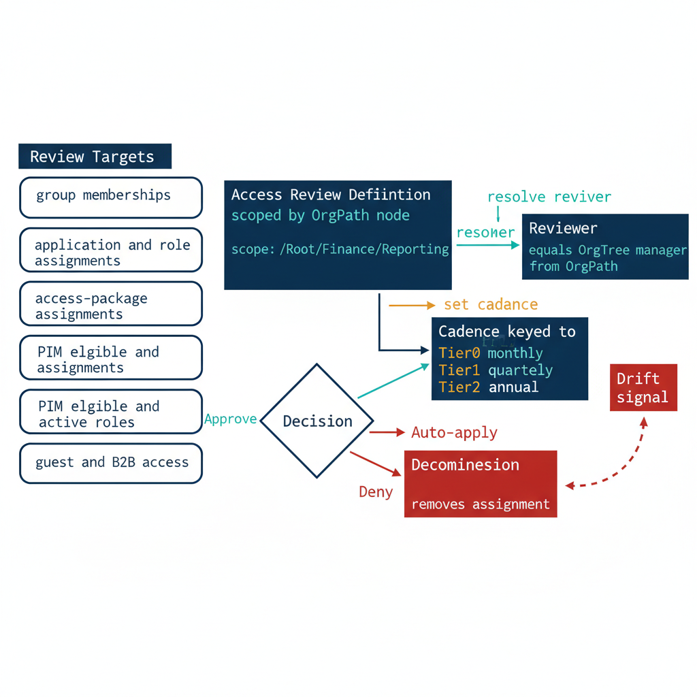

# Chapter 4 — Access Reviews and Recertification by Organizational Structure

::: {.callout-note}
## In this chapter
Lifecycle workflows (Chapter 3) grant access when a person joins, moves, or leaves; access reviews are the discipline that periodically asks whether the access that was granted is still warranted. This chapter shows how Entra ID Governance Access Reviews recertify the full identity surface — group memberships, application and role assignments, access-package assignments, PIM-eligible and PIM-active privileged roles, and guest/B2B access — and how OrgPath makes that recertification tractable: reviews are scoped and grouped by organizational node, the reviewer is the OrgTree manager resolved from OrgPath, recertification cadence is keyed to OrgTier, and a denied decision auto-applies into a decommission that feeds the drift signal. It closes by pointing to the non-employee identities (Chapter 5) that need review most.
:::

## From Granting Access to Recertifying It

Chapter 3 established that lifecycle workflows move access in lockstep with organizational reality: a joiner is provisioned against the access packages their OrgPath entitles them to, a mover sheds the entitlements of their former position and acquires those of their new one, and a leaver is deprovisioned cleanly. Those workflows are event-driven — they fire when the OrgTree registry records a change. But not every reason an entitlement should be removed announces itself as an OrgTree event. A project ends without anyone updating a node.

A temporary delegation outlives its purpose. An access package granted for a one-time task is never released. An account sits dormant while its owner is on extended leave. None of these produce a mover event, and so none of them are caught by the lifecycle workflow alone.

Access reviews are the periodic, point-in-time complement to the event-driven lifecycle. Where the lifecycle workflow asks *did something change?*, the access review asks *is this access still warranted, regardless of whether anything changed?* The two mechanisms are intentionally redundant: the lifecycle catches structural movement promptly, and the review catches the slow accumulation of access that structural movement never accounted for. Together they bound entitlement drift from both directions.

{#fig-book-11a-cpt-04-diagram-01 fig-alt="Engineering blueprint diagram on a white background showing the access review and recertification lifecycle scoped by OrgPath and paced by OrgTier. Left column titled Review Targets lists five boxes — group memberships, application and role assignments, access-package assignments, PIM eligible and active roles, guest and B2B access. A center box titled Access Review Definition shows it is scoped by OrgPath node, with a monospace label scope colon slash Root slash Finance slash Reporting. An arrow labeled resolve reviewer points to a box titled Reviewer equals OrgTree manager from OrgPath. A second arrow labeled set cadence points to a box titled Cadence keyed to OrgTier, with monospace rows Tier0 monthly, Tier1 quarterly, Tier2 annual. A Decision box shows Approve and Deny outcomes; the Deny outcome flows through an Auto-apply box into a Decommission box that removes the assignment, and a dashed arrow from Decommission feeds back to a Drift signal box at far right. Federal navy number 1F3A5F for primary boxes, teal number 1A9E8F for OrgPath-scoped routing, amber number D4A017 for cadence and auto-apply, red number C0392B for the deny and decommission path, monospace labels, no human figures, 16:9 landscape." width="85%"}

## What Entra ID Governance Can Review

Microsoft Entra ID Governance Access Reviews can recertify nearly every form of standing access that a person can hold, and the OrgPath substrate makes each of them addressable by organizational segment. The reviewable surface spans the full identity plane built up across this book.

Group memberships are the most common review target — both assigned groups and the dynamic OrgPath-derived groups, though dynamic membership is recomputed from attributes rather than removed by a reviewer. Application and directory role assignments can be reviewed to confirm that a person still requires an enterprise application or a delegated administrative role. Access-package assignments — the entitlement-management bundles introduced in Chapter 2 — can be reviewed as a unit, so a reviewer recertifies a coherent bundle of resources rather than a scatter of individual grants.

The privileged surface from Book 11 is reviewable directly: PIM-eligible and PIM-active role assignments can be placed under recurring review so that eligibility itself, not merely each activation, is recertified on a schedule. And guest/B2B access — the external collaborators introduced through cross-tenant collaboration — can be reviewed to confirm that an invited guest still has a sponsor and a reason to remain.

Each review is created as an **access review definition** and produces a series of **instances** on a recurring schedule, with **decisions** recorded per reviewed principal. Through Microsoft Graph these are exposed under `identityGovernance/accessReviews` (definitions, instances, and decisions), which means review creation, scoping, and outcome collection can be automated by the same pipelines that maintain OrgTree and the access-package catalog.

Reviewers are configurable per definition. A review may be assigned to the reviewed users themselves (self-attestation), to each user's manager, to a specific named reviewer or panel, or to the owners of the group or package under review. Reviews can be configured to **auto-apply** their results when an instance closes — so a denial does not wait for a manual administrative action — and Entra surfaces **recommendations** to reviewers based on sign-in activity and last-activity data, flagging a principal who has not used the access in the configured window as a recommended removal.

## How OrgPath Makes Reviews Tractable

The hardest problem in any large recertification program is not the mechanics of recording decisions — it is making the decisions meaningful. A reviewer handed a flat, unreadable dump of a thousand group memberships across the entire tenant cannot exercise real judgment; the rational response to an overwhelming list is to approve everything, which defeats the purpose of the review. OrgPath converts that flat list into a structured, scoped, and routable task.

**Reviews are scoped and grouped by organizational node.** Instead of reviewing the tenant as one undifferentiated population, the governance team creates review definitions whose scope is an OrgPath prefix — `/Root/Finance/Reporting/`, for instance. The reviewer sees only the access held by people in that segment, in the context of that segment. The list is short enough to reason about, and every entry shares an organizational context the reviewer actually understands.

**The reviewer is the OrgTree manager resolved from OrgPath.** Rather than assigning every review to a central administrator who has no basis for judging another division's access, the review routes to the manager who owns the node. That manager is resolved deterministically from OrgPath against the OrgTree registry — the same resolution used to route lifecycle approvals in Chapter 3. The person making the recertification decision is the person with the organizational knowledge to make it correctly.

> A review is only as good as the judgment of the person making it. OrgPath ensures that judgment is exercised by the manager who owns the organizational node, over a scoped list short enough to reason about — not by a central administrator approving a thousand rows they have no way to evaluate.

**Recertification cadence is keyed to OrgTier.** Not all access carries the same risk, and not all of it warrants the same review frequency. The OrgTier value attached to each node sets the cadence. Tier 0 — the most sensitive infrastructure and security segments — is reviewed most frequently, on a monthly cadence. Mid-tier business segments are reviewed quarterly. Lower-tier general-population segments are reviewed annually. The cadence is a property of organizational position, so it follows a person automatically: someone who moves into a Tier 0 node inherits the monthly review cadence the moment their OrgPath changes, with no separate configuration.

## The Decommission Loop and the Drift Signal

A review that records denials but never acts on them is theater. The recertification model in this book closes the loop by binding denial to decommission and decommission to the drift substrate.

When a reviewer denies a decision and the review instance is configured to auto-apply, Entra ID Governance removes the access automatically as the instance closes. A denied access-package assignment is released — which, through the entitlement-management machinery of Chapter 2, removes the underlying group memberships and resource grants the package provisioned. A denied group membership is removed directly. A denied PIM eligibility is revoked, removing not just an active session but the standing right to activate. The reviewer's judgment becomes an enforced change in directory state, not a note in a report that someone is supposed to action later.

That enforced change is, by design, also a **drift signal**. Removing an assignment is a write to the same identity surface that the OrgPath drift-detection pipeline monitors. A denial-driven decommission therefore registers in the same telemetry that tracks divergence between directory state and registry state — the governance team sees that an entitlement was removed, by which review, for which principal, in which organizational segment.

Over time the volume and distribution of denial-driven decommissions becomes a posture metric in its own right: a segment that consistently produces a high denial rate is a segment whose access provisioning is too generous, and that is a finding worth feeding back into the access-package design. The recertification loop does not merely remove stale access; it tells the governance program where stale access is being generated, and routes that knowledge back to the OrgPath substrate where it can be acted on structurally.

## Reference: Review Targets, Reviewers, Cadence, and Auto-Apply

The table below consolidates the model. Each review target is scoped by OrgPath, routed to the reviewer resolved from organizational position, paced by the OrgTier of the node under review, and configured for an auto-apply behavior appropriate to the risk of the target.

| Review target | Reviewer (resolved by OrgPath) | Cadence (keyed by OrgTier) | Auto-apply behavior |
| :--- | :--- | :--- | :--- |
| **Group memberships** (assigned) | OrgTree manager of the node | Tier 0 monthly · Tier 1 quarterly · Tier 2 annual | Auto-remove on deny; feeds drift signal |
| **Access-package assignments** (Ch 2) | Access-package owner, fallback OrgTree manager | Quarterly (Tier 0 monthly) | Auto-release package on deny; cascades to grants |
| **Application / directory role assignments** | OrgTree manager of the node | Tier 0 monthly · others quarterly | Auto-remove on deny |
| **PIM-eligible role assignments** (Book 11) | OrgTree manager + security reviewer | Monthly for Tier 0; quarterly elsewhere | Auto-revoke eligibility on deny |
| **PIM-active role assignments** (Book 11) | Security reviewer | Monthly | Auto-deactivate on deny; eligibility re-reviewed |
| **Guest / B2B access** (Ch on collaboration) | Sponsoring node's OrgTree manager | Quarterly | Auto-remove guest access on deny or no-response |

Two configuration conventions make this table operational. First, the **no-response default** for higher-tier and guest reviews is *deny*, not approve — a reviewer who ignores a Tier 0 or guest review is treated as having declined to vouch for the access, and the access is removed when the instance closes. Lower-tier reviews may default to *no change* to avoid removing legitimate access through reviewer inattention; the governance team sets this per definition against the risk of the segment.

Second, **recommendations are advisory, not authoritative**: Entra's last-activity recommendation to remove a dormant grant is surfaced to the reviewer, but the decision remains the manager's. The OrgPath context is what lets that manager override a misleading recommendation correctly — knowing, for instance, that a person in their node is on a long detail and will need the access on return.

## Where Recertification Matters Most

The recertification model described here applies to the entire identity surface, but it does not apply evenly. Employee access is already bounded on two sides — by the joiner/mover/leaver lifecycle of Chapter 3 and by the periodic reviews of this chapter — and the OrgTree manager who reviews an employee's access has a direct reporting relationship that anchors the judgment. The population where recertification carries the most weight is the one where the lifecycle is weakest and the reporting relationship is thinnest: the non-employee identities.

Contractors, vendors, partners, and service accounts frequently lack a clean leaver event — a contract ends without anyone filing a termination, a vendor engagement winds down without a deprovisioning trigger, a service account outlives the system it was created for. For exactly these identities, the periodic access review is often the *only* control that will ever revoke standing access, because no event-driven workflow is watching for them to depart. Chapter 5 takes up this population directly, examining **SailPoint NERM** as the non-employee identity authority — the ADR-059 commercial-cloud carve-out — and how OrgPath remains the join key that scopes, routes, and paces the recertification of identities that no employee lifecycle ever owned.

::: {.callout-tip}
## Continue the series

[← Previous: Chapter 3 — Lifecycle Workflows Driven by OrgTree Change](Book_11a_CPT_03.qmd) · [Book 11a](Book_11a.qmd) · [Next: Chapter 5 — SailPoint NERM and the Non-Employee Identity Authority →](Book_11a_CPT_05.qmd)
:::
