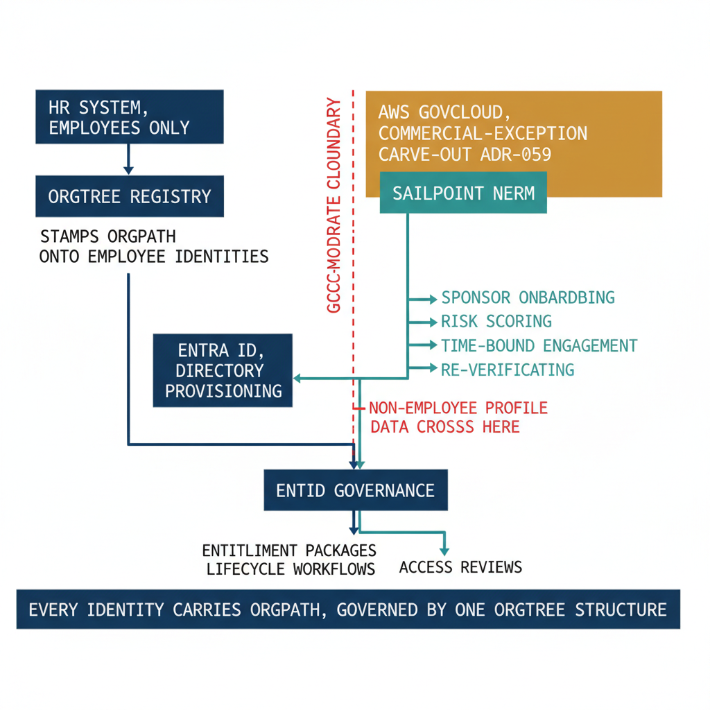

# Chapter 5 — SailPoint NERM — Governing Non-Employee Identity Across the Boundary

::: {.callout-note}
## In this chapter
Chapter 4 showed that access reviews and recertification — the recurring re-attestation of who should still hold what — are where standing access is finally pruned by organizational tier. Those reviews assume something this book has quietly relied on since the first page: that every identity has an authoritative lifecycle source. For employees, that source is HR feeding the OrgTree registry. For the **non-employee population** — contractors, vendors, business partners, seasonal and affiliate workers, and the bots and service identities that are nobody's direct report — there is no HR record, no joiner-mover-leaver feed, and therefore no native answer to "who owns this identity and when does it expire." This chapter introduces **SailPoint Non-Employee Risk Management (NERM)** as the authoritative system of record and lifecycle engine for those identities, shows how a NERM profile is bound to an **OrgPath** so the non-employee is governed by the same OrgTree structure as employees, and states precisely — and prominently — the one place where this differs from everything else in the book: NERM runs on **AWS GovCloud, outside UIAO's GCC-Moderate Microsoft-365 boundary**, as the second named commercial-cloud carve-out under **ADR-059**.
:::

## The Non-Employee Gap

Every governance mechanism this book has described so far rests on a single upstream assumption: that an identity arrives with an authoritative lifecycle behind it. The joiner is hired, HR writes the record, the OrgTree registry assigns the org node, OrgPath is stamped onto the Entra identity, and from that moment the entitlement packages of Chapter 2, the lifecycle workflows of Chapter 3, and the access reviews of Chapter 4 all engage automatically. The structure works because HR *owns* the employee — it knows when they joined, when they moved, and when they left, and it tells the rest of the system.

HR owns employees. It does not own anyone else. Per **ADR-088**, HR is the truth source for the OrgTree, but its authoritative reach stops at the employment relationship. The contractor working a six-month engagement is not in the HR system. Neither is the vendor's support engineer with a federated login, the business partner who needs read access to a shared SharePoint site, the seasonal worker who returns every filing season, the affiliate from a sister agency, or the service identity a system owner stood up for an integration two years ago. These identities are real, they hold access, and they are governed by *nothing* — because the one system that drives lifecycle for everyone else has no record of them.

This is precisely the orphan-and-stale-access problem the rest of this book solved for employees, reappearing for a population the solution never reached. A non-employee identity with no authoritative source has no joiner event to trigger provisioning, no mover event to re-scope entitlements, and — most damaging — no leaver event to revoke access. The contractor's engagement ends; the badge is returned; the laptop is wiped; and the identity, with its accumulated access, persists in the directory because nothing told the directory the relationship was over. Access reviews can *find* such an identity, but a review that surfaces an account nobody can attest to is a symptom, not a cure. The cure is an authoritative lifecycle source for the non-employee — which is what NERM provides.

{#fig-book-11a-cpt-05-diagram-01 fig-alt="Engineering blueprint diagram on a white background showing two source lanes feeding one shared governance plane. On the left, a federal navy box labeled HR system, employees only, feeds an OrgTree registry box that stamps OrgPath onto employee identities. On the right, separated by a vertical red dashed boundary line labeled GCC-Moderate cloud boundary, an amber box labeled AWS GovCloud, commercial-exception carve-out ADR-059 contains a teal SailPoint NERM box; from NERM a teal lane shows the non-employee lifecycle stages in monospace, sponsor onboarding then risk scoring then time-bound engagement then re-verification then offboarding. A teal arrow crosses the red boundary line from NERM into a navy Entra ID box labeled directory provisioning, and the crossing point is marked with a small red label non-employee profile data crosses here. Below Entra, a single navy box labeled Entra ID Governance receives both the employee lane and the non-employee lane and shows three shared outputs in monospace, entitlement packages, lifecycle workflows, access reviews. A bottom band reads every identity carries OrgPath, governed by one OrgTree structure. Federal navy 1F3A5F, teal 1A9E8F, amber D4A017, red C0392B, monospace labels for stage and system names, no human figures, 16:9 landscape." width="85%"}

## SailPoint NERM as the Non-Employee System of Record

**SailPoint Non-Employee Risk Management (NERM)** is purpose-built to be the authoritative lifecycle source the non-employee population lacks. Where HR is the system of record for employees, NERM is the system of record for everyone else — and it provides, for non-employees, the same things HR provides for employees: a defined onboarding event, authoritative attributes, an owner accountable for the relationship, and an explicit end.

A non-employee enters NERM through **profile-based onboarding**. Rather than a generic account request, NERM creates a structured *profile* for the identity, and that profile is anchored by two things the orphan account always lacked: a **sponsor or owner** — a named, accountable employee who vouches for the non-employee and answers for their continued access — and a **defined engagement** with a start and, critically, an **expiration**. The profile collects the attributes the relationship requires (the contracting company, the engagement's purpose, the data and systems the non-employee may touch), and NERM applies **risk scoring** to that attribute set, so a high-risk engagement — broad data access, a sensitive system, a vendor with elevated privileges — is flagged and routed for stronger oversight from the outset.

From there the profile drives a full lifecycle. The **time-bound engagement** means access has an expiration by construction, not by audit: when the engagement date arrives, NERM acts rather than waiting for someone to notice. Before that point, NERM drives **re-verification** — the sponsor is periodically asked to re-attest that the non-employee still needs the access and the relationship still holds — so a long engagement does not silently become standing access. When the engagement ends, or the sponsor declines re-verification, NERM executes **offboarding**: the authoritative end-event that the orphan account never had.

Crucially, NERM does not govern the non-employee in isolation. It **feeds Entra** — provisioning the non-employee into the directory as a governed identity — so that once a non-employee exists in Entra, they flow through exactly the same Entra ID Governance machinery this book has already described. The non-employee receives entitlement packages (Chapter 2), is subject to lifecycle workflows (Chapter 3), and appears in access reviews (Chapter 4) on the same terms as an employee. NERM supplies the missing front end — the authoritative source and the lifecycle decisions — and Entra ID Governance supplies the shared back end. The two halves meet at the directory.

## OrgPath Mapping: Governing Non-Employees by the Same Structure

Feeding a non-employee into Entra is necessary but not sufficient. An identity in the directory with no organizational anchor is still ungoverned by *structure* — it has no node, so the OrgPath-keyed dynamic groups, the node-scoped catalogs, and the tier-based reviews that govern employees have nothing to bind to. The binding invariant of this narrative resolves this directly: **every identity carries OrgPath**, and that includes the non-employee.

When NERM creates a profile, the engagement is assigned a **sponsoring org node** — the OrgTree node of the sponsor's organization, or the specific node the engagement serves. That node's OrgPath is mapped onto the non-employee profile and carried through into the Entra identity NERM provisions. The effect is that the contractor is governed by the **same OrgTree structure as the employees of that node**.

They fall into the node's OrgPath dynamic group; the node's auto-assignment policy can grant them a scoped baseline package; the node's access reviews surface them alongside its employees; and OrgTree-driven drift detection treats their access by the same rules. The non-employee is not a special case bolted onto the side of the governance plane — they are a member of an org node who happens to have a different lifecycle source. OrgPath is the join key that makes that true.

> The sponsor relationship and the OrgPath assignment reinforce each other. The sponsor is *who* is accountable; the OrgPath is *where in the organization* the access is governed. A non-employee whose sponsor leaves, or whose sponsoring node is dissolved, is exactly the kind of identity that re-verification and OrgTree-driven review are built to catch — and because the non-employee carries OrgPath, that catch happens through the same mechanism that governs everyone else, not through a separate, hand-maintained contractor process.

## The Boundary Caveat — AWS GovCloud and ADR-059

Everything else in this book lives inside UIAO's stated cloud boundary: GCC-Moderate, Microsoft 365 SaaS. SailPoint NERM does not, and this must be stated plainly because it is the one architecturally consequential exception in the identity governance plane.

> **Boundary caveat — read this before integrating.** SailPoint Identity Security Cloud and its FedRAMP-Moderate add-ons, **including NERM, run on AWS GovCloud**. AWS GovCloud is FedRAMP Moderate, but it is **not** the Microsoft-365 GCC-Moderate substrate that defines UIAO's published cloud boundary. NERM is therefore **outside UIAO's GCC-Moderate / Microsoft-365 cloud boundary**. Per **ADR-059**, SailPoint NERM is the **second named commercial-cloud carve-out** — after Amazon Connect — registered as the boundary value `commercial-exception-sailpoint-nerm`. This is a **deliberate, governed exception, not an oversight**, and it is scoped to this one named product. It does **not** relax the boundary in general.

The reason for the carve-out is functional, and ADR-059 records it precisely. The Microsoft ecosystem does not provide a FedRAMP-Moderate, FICAM-aligned non-employee lifecycle product; Entra ID Governance covers the workforce branch only. NERM is the leading FedRAMP-Moderate-authorized commercial substrate for the non-employee gap (FedRAMP Moderate authorization 2025-03-04, as an add-on to SailPoint Identity Security Cloud), and its sponsorship, proofing, risk-scoring, and lifecycle-state model map directly onto UIAO's Customer Identity Record bindings. ADR-059 chose the **smallest possible cloud-boundary-expansion blast radius**: a single named-product exception, added in lockstep with the ADR that authorizes it, rather than a general relaxation that would admit AWS GovCloud as a class.

For an assessor, three implications follow and should be documented in the integration's own activation artifacts:

* **Data residency — what crosses the boundary.** Non-employee profile data — identifying attributes, sponsor relationships, engagement metadata, and risk attributes — is held in NERM on AWS GovCloud and provisioned across the boundary into Entra. The crossing is the provisioning path from NERM to Entra; the assessor-facing question is *which* non-employee attributes leave the M365 boundary, where they reside at rest in GovCloud, and under what FedRAMP authorization. The answer is bounded by NERM's own FedRAMP Moderate package and by the named-exception scope.
* **The named-exception convention is auditable.** Because each commercial exception is a distinct named enum value (`commercial-exception-amazon-connect`, `commercial-exception-sailpoint-nerm`), an assessor can enumerate every place UIAO leaves its primary boundary by listing exactly two values. There is no implicit or class-based admission of commercial clouds; every crossing is one inspectable, ADR-traceable carve-out.
* **The carve-out is per-named-product.** ADR-059 admits NERM specifically. It does not admit the broader SailPoint Identity Security Cloud family, SailPoint Data Access Security, or AWS GovCloud generally — those remain outside the boundary and would each require their own ADR with their own justification. The next carve-out, if there is one, must argue against the slippery slope explicitly; the precedent narrows the boundary debate to one product at a time rather than widening it.

The discipline here is the point. UIAO does not pretend NERM is inside the M365 boundary, and it does not quietly expand the boundary to make NERM fit. It names the exception, scopes it to one product, ties it to an authorizing decision record, and makes the crossing inspectable — so that the one place the identity governance plane reaches outside GCC-Moderate is also the most precisely documented.

## Reference: Non-Employee Types, Lifecycle, and Boundary Crossings

The following table maps the principal non-employee identity types onto their sponsor model, their NERM lifecycle stage, their OrgPath assignment, and the point at which their data crosses the boundary. In every row the OrgPath assignment is what brings the identity under the same OrgTree governance as employees; in every row the boundary crossing is the NERM-to-Entra provisioning path on AWS GovCloud.

| Non-employee type | Sponsor / owner | NERM lifecycle stage | OrgPath assignment | Where it crosses the boundary |
|---|---|---|---|---|
| **Contractor (fixed engagement)** | Engaging employee / contract manager | Profile onboarded → risk-scored → time-bound to contract end → re-verified → offboarded at expiry | Sponsoring node's OrgPath; governed by that node's packages and reviews | NERM (AWS GovCloud) provisions the contractor identity into Entra; profile + engagement attributes cross at provisioning |
| **Vendor support / integration staff** | Vendor-relationship owner | Profile onboarded with elevated-access risk flag → re-verified on a tighter cadence → offboarded when contract or need ends | OrgPath of the node owning the vendor relationship; elevated-access reviews apply | NERM holds vendor and engagement data on GovCloud; identity + risk attributes cross to Entra on provisioning |
| **Business partner (federated)** | Partnership / program owner | Profile onboarded → scoped to shared resources → periodic re-verification → offboarded at program end | OrgPath of the sponsoring program node; scoped to that node's shared catalogs | NERM-managed profile crosses to Entra; federated sign-in is brokered through Entra, profile attributes reside in GovCloud |
| **Seasonal / recurring worker** | Hiring manager for the seasonal function | Profile onboarded each season → reactivated rather than re-created → offboarded at season end | OrgPath of the seasonal function's node; rejoins the node's dynamic group on reactivation | Reactivation re-provisions the identity from NERM (GovCloud) into Entra; recurring engagement metadata held in GovCloud |
| **Affiliate / inter-agency worker** | Sponsoring internal node owner | Profile onboarded with affiliate classification → re-verified per reciprocity terms → offboarded when affiliation ends | OrgPath of the sponsoring node; governed alongside that node's staff | NERM provisions the affiliate into Entra; affiliation + sponsor data reside on GovCloud, cross at provisioning |
| **Bot / service / non-human identity** | Named system owner (accountable employee) | Profile onboarded with a human owner of record → risk-scored for scope → re-verified by the owner → offboarded when the system is retired | OrgPath of the owning system's node; treated as a member of that node for review | NERM records the non-human identity and its human owner on GovCloud; binding + owner attributes cross to Entra |

The shape of every row is the same: a non-employee with no HR record is given an authoritative source in NERM, an accountable human owner, a lifecycle with a real end, and an OrgPath that places it inside the org structure — and the only architectural seam is the single, named, governed crossing onto AWS GovCloud that ADR-059 authorizes.

## Closing the Loop

With NERM in place, the identity governance plane finally covers everyone. The employee arrives from HR through OrgTree; the non-employee arrives from NERM with a sponsor and an expiration; and at the directory the two streams converge, each carrying an OrgPath, each governed by the same entitlement packages, lifecycle workflows, and access reviews. The orphan-and-stale-access problem is no longer solved for one population and left open for the other — it is closed for both, by the same structure, with the one boundary crossing named and documented.

Chapter 6 draws that closed loop in full: the complete circuit across *all* identity types — employees and non-employees, human and non-human, inside the boundary and across the one governed exception — and shows how OrgPath is the single thread that runs through every segment of it, turning a collection of governance mechanisms into one coherent, auditable identity governance plane.
