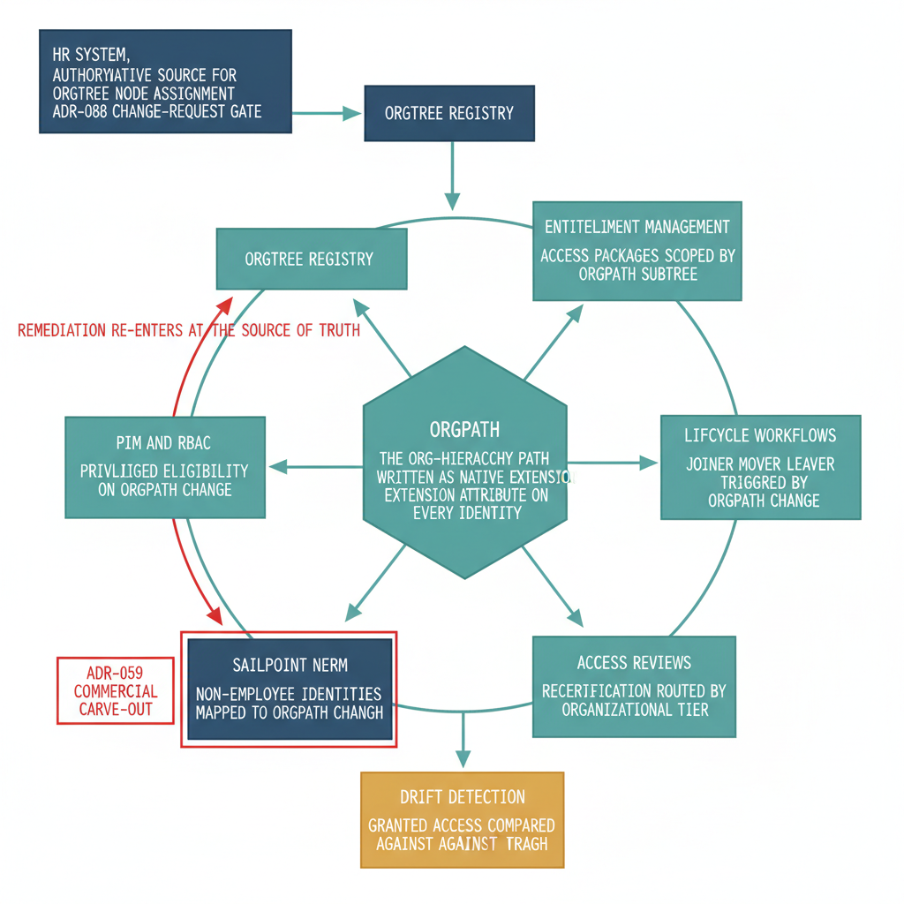

# Chapter 6 — The Closed Loop — OrgPath as the Identity-Governance Join Key

::: {.callout-note}
## In this chapter
The supplement has walked the identity-governance plane one construct at a time: entitlement management (Chapter 2), lifecycle workflows (Chapter 3), access reviews (Chapter 4), and the SailPoint NERM non-employee authority (Chapter 5), each sitting above the privileged-access surface that Book 11 governs. This capstone shows that those constructs are not four parallel systems but one closed loop, and that the thing closing it is a single attribute. **OrgPath** — the org-hierarchy path drawn from the OrgTree registry, set by HR under the ADR-088 change-request gate — is the join key across every surface: it scopes entitlements, triggers lifecycle, routes reviews, maps non-employees, realigns privilege, and defines drift. The loop runs HR and OrgTree to OrgPath, OrgPath into entitlement, lifecycle, review, NERM, and PIM, those surfaces into drift detection, and drift back to OrgTree — and it closes because every identity type answers the same organizational question through its own native interface, with no cross-system lookup. That is the thing no single product delivers alone.
:::

## What the Supplement Has Been Building Toward

Each preceding chapter argued the same point in a different register. Chapter 2 showed that an access package need not enumerate its requestors when an OrgPath subtree defines them. Chapter 3 showed that a joiner, mover, or leaver is not a help-desk observation but an OrgPath write, and that lifecycle workflows subscribe to that write. Chapter 4 showed that an access review need not be hand-addressed to a named manager when OrgPath resolves the owning tier from the registry.

Chapter 5 showed that even the contractors and vendors who never had an HR record can be mapped onto the same coordinate system, so that the non-employee population is governed by the same structure as the workforce. Book 11, beneath all of this, showed that privileged eligibility realigns the instant an OrgPath change signals a structural move.

Read in isolation, those are five competent integrations. Read together, they are one design decision applied five times: route the organizational question to the place where the organizational answer already lives. The AD-era estate could not do this because the organizational answer lived nowhere durable — it lived in a manager's memory, a closed ticket, a copied template, a spreadsheet row. OrgPath relocates that answer into a native attribute every governance surface can read. The supplement has been building toward the observation that once the answer is native, the surfaces stop being separate.

> A join key is the column two tables share so that a row in one can find its match in the other without a lookup table in between. OrgPath is that column for identity governance: every surface carries it, so any surface can join to any other on organizational position alone.

{#fig-book-11a-cpt-06-diagram-01 fig-alt="Engineering blueprint diagram on a white background showing a closed governance loop drawn as a clockwise cycle. At the top a federal navy box labeled HR system, authoritative source for OrgTree node assignment, ADR-088 change-request gate, feeds a navy box labeled OrgTree registry. A single teal arrow descends from OrgTree to a central teal hub box labeled OrgPath, the org-hierarchy path written as a native extension attribute on every identity. From the hub five teal arrows fan outward to five governance-surface boxes arranged around the loop: Entitlement management, access packages scoped by OrgPath subtree; Lifecycle workflows, joiner mover leaver triggered by OrgPath change; Access reviews, recertification routed by organizational tier; SailPoint NERM, non-employee identities mapped to OrgPath, ADR-059 commercial carve-out shown in a separate red bounding frame; and PIM and RBAC, privileged eligibility realigned on OrgPath change. All five surface boxes feed downward into one amber box labeled Drift detection, granted access compared against OrgPath. A red return arrow runs from drift detection back up the left side to OrgTree registry, closing the loop and labeled remediation re-enters at the source of truth. Monospace labels for every component name, federal navy 1F3A5F for HR and OrgTree, teal 1A9E8F for OrgPath and the in-boundary surfaces, amber D4A017 for drift detection, red C0392B for the carve-out frame and the remediation return arrow, no human figures, 16:9 landscape." width="85%"}

## The Source of the Key — HR and OrgTree

A join key is only as trustworthy as the authority that sets it, and OrgPath has exactly one. Under ADR-088, the human-resources system is the authoritative source for a person's OrgTree node assignment: where someone sits in the organization is an HR fact before it is a directory fact, and the directory inherits it rather than inventing it. The change-request workflow is the governance gate on that inheritance. A node assignment does not change because an administrator edits an attribute; it changes because an HR-originated change request is raised, reviewed, and approved, and only then is the new OrgTree node — and the OrgPath string it yields — written down the identity surfaces.

This matters to the loop because it fixes the direction of authority. Every downstream surface reads OrgPath; none of them writes it. An access package cannot grant its way into a different organizational position, a lifecycle workflow cannot relocate a person by firing, a PIM assignment cannot promote someone up the tree. They consume the key. The single writer is HR, through the gate, into OrgTree — which is what makes the loop closeable at all. A loop with many writers has no source of truth to return to; a loop with one writer has a definite place where remediation re-enters.

## How the Key Joins Each Surface

The binding is the same shape on every surface, and the table below states it plainly: each surface holds OrgPath, and each surface answers one organizational question by reading it. What changes from row to row is only the question the surface needs answered — never the key it reads, and never the registry the key comes from.

| Governance surface | Product | OrgPath binding | The question it answers |
|---|---|---|---|
| Entitlement management | Entra ID Governance | Catalog and access-package scope, requestor population, and auto-assignment target are OrgPath subtrees | *What standing access does an identity in this organizational position legitimately hold?* |
| Lifecycle workflows | Entra ID Governance | Joiner, mover, and leaver workflows subscribe to the OrgPath write as their trigger event | *What must happen to an identity's access when its organizational position changes?* |
| Access reviews | Entra ID Governance | Review scope and reviewer routing resolve from the OrgTier the OrgPath identifies | *Who owns this identity's recertification, and with what organizational context?* |
| Non-employee identities | SailPoint NERM | Contractor and vendor identities are mapped to an OrgPath at sponsorship; the carve-out runs in commercial cloud (ADR-059, AWS GovCloud boundary) | *What organizational context governs a non-employee the HR system never owned?* |
| Privileged access | PIM, Azure RBAC | Eligibility is realigned the moment an OrgPath change signals a structural move | *Who may elevate here, given their current organizational position?* |
| Drift detection | Across all surfaces | Granted access is compared against what OrgPath warrants; disagreement is drift | *Does this identity's actual access still match its organizational position?* |

Notice what the rightmost column has in common. Every question is a variation on a single underlying one — *what organizational context does this identity belong to?* — and every surface answers it by reading the same attribute. An employee answers it through an Entra extension attribute resolved in a dynamic group. A contractor answers it through a NERM profile field carrying the same OrgPath value. A privileged administrator answers it through the eligibility their OrgPath qualifies them for.

A machine or service identity answers it through the OrgPath stamped on the workload it serves. Four identity types — employee, non-employee, privileged, machine — each interrogated through its own native interface, each returning an answer drawn from the same coordinate system. No cross-system lookup, no reconciliation job, no mapping table maintained by hand between the contractor directory and the employee directory and the privileged-access store. The join is structural because the key is shared.

## Drift Is the Disagreement Between Access and OrgPath

Once every surface reads the same key, a precise definition of drift becomes available, and it is the definition the AD era could never write down. Drift is any state in which an identity's *granted* access disagrees with the access its *OrgPath* warrants. A user who moved nodes last month but still holds the prior node's access package is in drift. A contractor whose sponsorship lapsed but whose NERM-mapped entitlements persist is in drift. A privileged eligibility that survives a structural move is in drift. A machine identity tagged for a directorate that no longer owns its workload is in drift.

The AD estate had all of these conditions and no language for any of them, because there was no warranted state to compare against — access simply was whatever had accumulated. With OrgPath as the join key, the warranted state is computable: it is the access that OrgPath, read across the entitlement, lifecycle, review, NERM, and PIM surfaces, says the identity should hold. Drift detection is the comparison of the two, and it is the surface where the loop reveals whether it is actually closing.

> Drift is not an error in any one surface. It is a disagreement between a surface and the source of truth. That is why drift detection does not patch the surface in place — it re-enters at OrgTree, so that the correction propagates back out through every surface the same way the original assignment did.

## Closing the Loop

The loop now states itself end to end. HR sets the OrgTree node through the ADR-088 change-request gate, and OrgTree yields the OrgPath. OrgPath propagates to every governance surface: it scopes entitlement, triggers lifecycle, routes reviews, maps non-employees in NERM, and realigns privilege in PIM. Those surfaces, each reading the same key, expose their granted access to comparison. Drift detection performs the comparison — granted access against OrgPath-warranted access — and where they disagree, remediation does not edit the offending surface directly.

It returns to the source: the discrepancy is resolved at OrgTree, through the same gate, so the corrected OrgPath flows back out and every surface realigns from the authoritative value rather than from a local patch. HR and OrgTree to OrgPath; OrgPath to entitlement, lifecycle, reviews, NERM, and PIM; those surfaces to drift detection; drift back to OrgTree. The loop is closed, and it is closed at the source of truth.

This is the capability no single product on the plane delivers alone, and it is worth saying exactly why. Entra ID Governance closes a loop over employees inside the M365 boundary, but it does not own contractors. SailPoint NERM owns the non-employee population, but it runs in commercial cloud under the ADR-059 carve-out and does not govern the federal tenant's privileged surface. PIM aligns elevation, but only for the few who elevate and only over privileged roles.

Each product closes its own small loop, in its own population, on its own internal key — and where two products meet, the AD-era answer was a reconciliation job and a hand-kept mapping table. OrgPath is what lets the small loops compose into one. Because the contractor in NERM, the employee in Entra, the administrator in PIM, and the workload identity in the directory all carry the same org-hierarchy path drawn from the same registry, the boundary between any two surfaces becomes a join rather than a translation.

The whole-estate loop exists not because one vendor built it, but because every surface was made to read the same key.

> The AD-era lifecycle decayed because organizational context lived in human memory and had to be re-supplied, by hand, at every joint. The closed loop holds because organizational context lives in one attribute, written by one authority, read by every surface, and returned to one source when it drifts. That single fact — that every identity answers the same organizational question through its own native interface, and answers it with OrgPath — is the join key, and the join key is what makes the governance plane a loop rather than a list.
