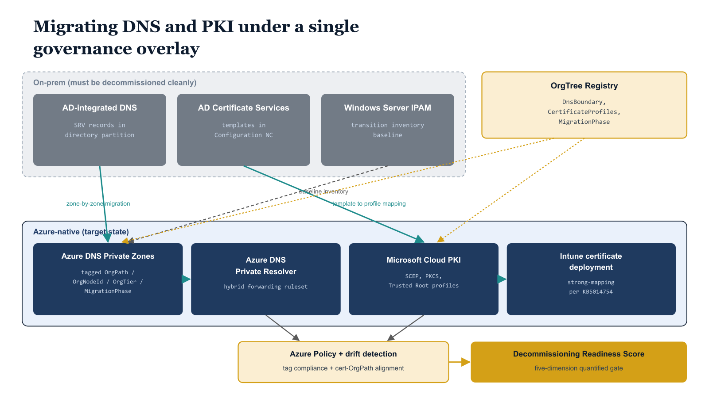

# Chapter 1 — THE FINAL SURFACES

## DNS and PKI — The Infrastructure Backbone That Holds Everything Together

## Why DNS and PKI Complete the Model in a Specific Way

The previous six integration chapters — covering Privileged Identity Management, Lifecycle Workflows, Microsoft Sentinel, Azure RBAC, Intune, and the full Microsoft Defender suite — each addressed a surface where governance operates on objects whose organizational position is encoded in the OrgPath attribute: users, devices, and server resources. In each case, the governance model works because the object carries the coordinate, and every downstream control — policy targeting, eligibility assignment, group membership, alert enrichment — reads that coordinate to determine what applies. The model is elegant precisely because the coordinate is universal. The same attribute, in the same format, against the same registry, drives every surface.

DNS and PKI are different. They are not objects that OrgPath governs. They are services that every identity, device, and server that OrgPath does govern depends upon without exception. DNS is the service locator for the entire enterprise — without it, no device can find a domain controller, no application can resolve an endpoint, and no Azure resource can be reached by name. PKI is the trust anchor for authentication and encryption — without it, no device can complete certificate-based authentication, no application can validate a TLS session, and no user can satisfy a Conditional Access policy that requires a compliant device certificate. They sit beneath the governance model, not within it. They are the substrate beneath the substrate.

This distinction is what makes their integration the logical final step. OrgPath cannot govern a user's authentication experience if DNS cannot locate the services that authentication depends on. OrgPath cannot govern a device's compliance posture if the device cannot obtain the certificate that satisfies the compliance requirement. Extending the governance model to cover DNS and PKI does not mean treating DNS zones or certificate templates as identity objects — it means ensuring that the name resolution and certificate issuance infrastructure is itself organized according to the same OrgTree structure, tagged with the same OrgPath metadata, and validated by the same governance pipeline that governs every other surface. The governance model does not own DNS and PKI; it depends on them and must therefore account for them.

## The Architectural Coupling That Makes Migration Dangerous

Active Directory DNS and AD Certificate Services were not incidentally integrated with Active Directory — they were architecturally coupled to it at a level that makes their migration a specific, sequenced engineering problem, not a configuration exercise. Understanding this coupling precisely is a precondition for migrating it correctly.

Active Directory-integrated DNS stores forward and reverse lookup zones in the domain directory partition, which replicates to every domain controller that carries that partition. There is no separate DNS infrastructure to manage: the zones live in the directory, they replicate with directory replication, and the health of DNS is directly coupled to the health of the domain controllers that host the partition. The Netlogon service on every domain controller automatically registers SRV records in these zones — \_kerberos.\_tcp, \_ldap.\_tcp, \_gc.\_tcp, and related records — that serve as the service location mechanism for every Kerberos, LDAP, and Global Catalog operation in the domain. Every domain-joined client resolves every name — internal and external — against the domain's DNS servers, because the domain DNS servers are configured as the primary resolver for every domain-joined machine by Group Policy or DHCP option. When a domain controller is decommissioned, it deregisters its SRV records. When all domain controllers for a domain are decommissioned, those SRV records cease to exist. Any client that still requires them fails.

The coupling of AD Certificate Services to Active Directory is equally deep. Certificate templates are published as objects in the Configuration naming context of the forest — the CN=Certificate Templates,CN=Public Key Services,CN=Services,CN=Configuration,DC=... container — making them visible to every domain-joined computer and user in the forest through LDAP queries against the Configuration partition. Auto-enrollment operates through Group Policy: a certificate auto-enrollment policy setting linked to an Organizational Unit causes every computer or user in that OU to query AD for available templates, evaluate which templates their security principal is entitled to enroll, and automatically submit requests to the enterprise CA. The CA evaluates each request against the template's security descriptor, which is stored in AD, and issues or denies the certificate accordingly. Certificate Revocation List Distribution Points are published as LDAP URIs pointing to the AD schema. The Network Device Enrollment Service uses an Enrollment Agent certificate whose validity is tied to the CA's publication in AD. When AD is decommissioned, every one of these mechanisms — template publication, auto-enrollment discovery, CRL distribution, NDES enrollment, and CA location — disappears simultaneously.

Organizations that have not methodically migrated each of these mechanisms before decommissioning discover their failures not in a test environment but in production, at the moment a domain controller goes offline for the last time. A device that has not yet received a certificate from Cloud PKI cannot authenticate. A workload that still resolves an on-premises name against an AD-integrated DNS zone that has been decommissioned cannot reach its dependency. A client that expects a CRL from an LDAP distribution point that no longer exists will either fail certificate validation outright or, worse, will silently succeed with revocation checking disabled. These are not edge cases. They are the predictable consequences of decommissioning without a readiness framework. This document builds that framework for both surfaces.

## The Two Additions This Document Makes to the Governance Model

This document makes two additions to the OrgPath governance model, both of which complete coverage of the infrastructure layer that the previous seven parts left unaddressed.

The first addition is DNS governance. Azure DNS Private Zones and Azure DNS Private Resolver Forwarding Rulesets are tagged with OrgPath metadata using the same four-tag schema — OrgPath, OrgNodeId, OrgTier, and MigrationPhase — applied to Arc-enabled servers and Azure resources in Part Five. A governance pipeline script creates and tags Private Zones for each OrgTree node designated as a DNS boundary. Azure Policy enforces tag compliance at resource creation time, denying the creation of any Private DNS Zone that lacks the required tags. The Windows Server IPAM role — a built-in feature of Windows Server, not a third-party product — provides the inventory of all on-premises DNS zones, DHCP scopes, and IP address assignments during the transition period, and that inventory is exported to the governance repository as the baseline against which migration progress is measured. The DNS record inventory also feeds the Decommissioning Readiness Score described in Chapter Five.

The second addition is PKI governance. OrgTree node metadata is extended with a CertificateProfiles array that identifies which Intune certificate profiles apply to devices and users in each organizational node. A governance pipeline script reads this metadata and assigns SCEP, PKCS, and Trusted Root profiles to the corresponding OrgPath branch groups. Drift detection monitors for certificate-OrgPath misalignment — devices whose enrolled certificate profile does not correspond to their current organizational position — and for SCEP profiles that lack the strong mapping configuration required by KB5014754. Both additions use Azure-native tooling exclusively: Azure DNS Private Zones, Azure DNS Private Resolver, Azure Policy for tag enforcement, Windows Server DHCP and the Windows Server IPAM role for on-premises address management during the transition, and Microsoft Cloud PKI with Intune certificate deployment.

{#fig-12-orgpath-in-infrastructure-services-diagram-01 fig-alt="Top band labeled \"On-prem (must be decommissioned cleanly)\" contains three boxes: AD-integrated DNS (SRV records in directory partition); AD Certificate Services (templates in Configuration NC); Windows Server IPAM role (transition inventory baseline). Bottom band labeled \"Azure-native (target state)\" contains four boxes: Azure DNS Private Zones (tagged OrgPath / OrgNodeId / OrgTier / MigrationPhase); Azure DNS Private Resolver (hybrid forwarding ruleset); Microsoft Cloud PKI (SCEP, PKCS, Trusted Root profiles); Intune certificate deployment (strong-mapping per KB5014754). Migration arrows: AD-integrated DNS → Azure DNS Private Zones (labeled \"zone-by-zone migration\"); IPAM → Azure DNS Private Zones dashed (labeled \"baseline inventory\"); ADCS → Cloud PKI (labeled \"template to profile mapping\"); Cloud PKI → Intune cert deployment; Azure DNS → Private Resolver. A separate top-right governance box \"OrgTree Registry (DnsBoundary, CertificateProfiles, MigrationPhase)\" feeds Azure DNS Private Zones and Cloud PKI. A bottom-right policy box \"Azure Policy + drift detection (tag compliance + cert-OrgPath alignment)\" is fed by Azure DNS and Cloud PKI, and itself feeds a final terminus \"Decommissioning Readiness Score (five-dimension quantified gate)\". Engineering blueprint style, fading slate fill on the top \"on-prem\" band to indicate decommissioning, federal navy (#1F3A5F) for Azure-native, amber (#D4A017) for the governance and gate boxes, 16:9 landscape." width="85%"}
