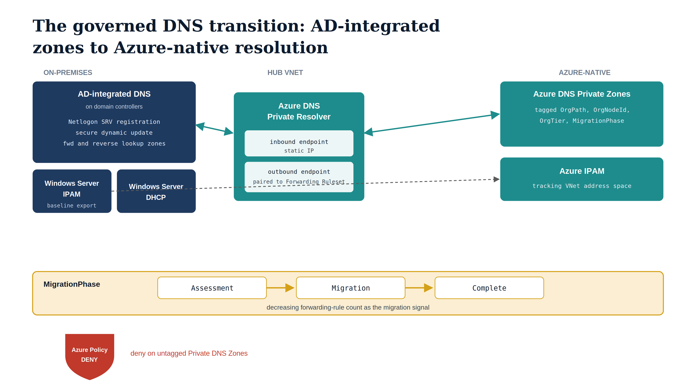

# Chapter 2 — DNS GOVERNANCE

::: {.callout-note}
## In this chapter
The source environment runs AD-integrated DNS; the target replaces it with three Azure-native components — Private Zones, Private Resolver, and a Forwarding Ruleset — while Windows Server IPAM and DHCP persist through the transition. This chapter walks the migration zone by zone: how IPAM supplies the on-premises baseline, how Private Zones inherit the four OrgPath governance tags, how the Private Resolver forwards in both directions, and how a decreasing forwarding-rule count signals DNS migration progress. It closes with the Azure Policy that denies any untagged Private DNS Zone, forcing zone creation through the governance pipeline.
:::

## From AD-Integrated DNS to Azure DNS — A Governed Migration

## The DNS Architecture the Governance Model Must Transition From and To

The source DNS architecture is fully integrated with Active Directory. Forward and reverse lookup zones are stored in the domain directory partition and replicate with AD replication to every domain controller in the domain. The Netlogon service on every DC automatically registers and deregisters SRV records, A records, and AAAA records to maintain service locator accuracy without administrator intervention.

Windows Server DHCP servers are authorized in AD and perform dynamic DNS updates on behalf of DHCP clients using Kerberos-authenticated secure dynamic update, which means that every client IP address assignment results in an authenticated A and PTR record registered against the AD-integrated DNS zone. Every domain-joined machine's primary DNS servers are the domain controllers, configured via DHCP option 006 or Group Policy, ensuring that every name query — including queries for external internet names — passes through the domain DNS infrastructure first.

The target architecture replaces this with three Azure-native components operating in concert. Azure DNS Private Zones provide authoritative name resolution for all internal namespaces: the organization's private domain names, application endpoint names, and the private DNS names required by Azure Private Link for platform services including Azure Storage, Azure Key Vault, Azure SQL Database, and the Microsoft Graph API. Azure DNS Private Resolver is deployed in the hub virtual network of the organization's Azure network topology.

Its inbound endpoint — a static IP address allocated from the hub VNet — serves as the forwarding target for on-premises DNS servers that need to resolve Azure-hosted names. Its outbound endpoint, paired with a Forwarding Ruleset, forwards queries from Azure-hosted workloads for on-premises names to the Windows Server DNS infrastructure that remains authoritative during the transition. Windows Server DHCP retains responsibility for IP address assignment during the transition period, continuing to perform dynamic DNS updates against the on-premises DNS zones.

The Windows Server IPAM role provides a centralized management and inventory interface across the entire on-premises estate during this period.

The transition between these two architectures is not instantaneous. It proceeds zone by zone, scope by scope, as each on-premises DNS zone is migrated to an Azure DNS Private Zone and each DHCP scope is either migrated to Azure or retained in an on-premises scope pending workload modernization. The governance pipeline tracks this progression through the MigrationPhase tag on every Private Zone and through the migration status field in the IPAM export committed to the governance repository. The completeness of migration — as measured by the percentage of on-premises zones with a corresponding Azure Private Zone and a MigrationPhase tag of Complete — is one of the five dimensions in the Decommissioning Readiness Score described in Chapter Five.

{#fig-book-12-cpt-02-diagram-01 fig-alt="Engineering blueprint diagram on a white background showing the governed DNS migration from on-premises to Azure. On the left, a federal navy (#1F3A5F) box AD-integrated DNS on domain controllers, with monospace child labels Netlogon SRV registration, secure dynamic update, and forward and reverse lookup zones, plus a navy box Windows Server IPAM exporting the baseline inventory and a navy box Windows Server DHCP. In the center, a teal (#1A9E8F) Azure DNS Private Resolver in the hub VNet with an inbound endpoint static IP and an outbound endpoint paired to a Forwarding Ruleset, bidirectional arrows bridging on-premises and Azure. On the right, teal boxes Azure DNS Private Zones tagged OrgPath, OrgNodeId, OrgTier, MigrationPhase and Azure IPAM tracking VNet address space. An amber (#D4A017) progress band along the bottom labeled MigrationPhase Assessment to Migration to Complete with a decreasing forwarding-rule count as the migration signal. A red (#C0392B) shield marks an Azure Policy deny on untagged Private DNS Zones. Monospace labels for zones, tags, and endpoints, no human figures, 16:9 landscape." width="100%"}

## The Windows Server IPAM Role During Transition

Windows Server IPAM is a built-in server role available in Windows Server 2016, 2019, and 2022 that provides a centralized management interface for IP address space, DHCP scope administration, and DNS zone management across the on-premises environment. It is a Microsoft-provided role, installed through the Add Roles and Features Wizard or Server Manager, and it does not require any third-party licensing. The IPAM server role discovers DHCP servers and DNS servers in the domain through AD-based discovery and collects their configuration and utilization data into a local database. The management plane — accessible through the IPAM console in Server Manager or through PowerShell using the IpamServer module — provides address space views, scope utilization metrics, DNS record inventories, and audit trail data.

> During the AD transition, Windows Server IPAM performs a specific and bounded function in the governance model: it provides the authoritative on-premises inventory from which the migration baseline is constructed.

The IPAM database contains every allocated IP address, every DHCP scope and its utilization, and every DNS zone hosted on the on-premises DNS infrastructure. The governance pipeline exports this inventory to JSON during the assessment phase and commits it to the governance repository, where it serves as the before-state against which migration progress is measured. As zones are migrated to Azure DNS Private Zones and addresses are migrated to Azure Virtual Network address space, the corresponding IPAM entries are updated with a migration status field, and subsequent pipeline runs show the delta.

The PowerShell module installed with the IPAM role exposes the full IPAM database through structured cmdlets:

| Cmdlet | What it returns |
| :--- | :--- |
| `Get-IpamDnsZone` | All DNS zones known to IPAM, including their zone type, record count, and associated update policy |
| `Get-IpamDhcpScope` | All DHCP scopes with their address range, utilization percentages, and the DHCP server that owns each scope |
| `Get-IpamRange` | All IP address ranges defined in the address space registry |
| `Get-IpamAddress` | Individual address assignments with client identifiers, host names, and assignment types |

The export script below calls each of these in sequence and writes the output as structured JSON committed to the governance repository.

```powershell
#Requires -Version 5.1
<#
.SYNOPSIS
    Exports the Windows Server IPAM inventory to JSON for governance
    repository commitment.

.DESCRIPTION
    Queries the Windows Server IPAM role for all DNS zones, DHCP scopes,
    IP ranges, and address assignments. Exports each collection as a
    structured JSON file to a local output directory for subsequent
    Git commit to the governance repository.

    This export establishes the on-premises infrastructure baseline used
    to measure DNS and IP address migration progress toward Azure.

    Designed to run during the Assessment phase of the OrgPath migration
    pipeline and on each subsequent weekly pipeline run to capture delta.

.PARAMETER OutputPath
    Directory path where JSON export files will be written before Git commit.
    Example: "C:\governance\assessment\ipam"
    The directory will be created if it does not exist.

.PARAMETER IpamServer
    FQDN or NetBIOS name of the IPAM server hosting the IPAM database.
    Defaults to localhost for execution directly on the IPAM server.
    Example: "ipam01.corp.contoso.com"   <-- substitute your IPAM server

.NOTES
    Requirements:
      - Windows Server 2019 or 2022 with the IPAM Server role installed.
      - PowerShell module IpamServer (installed automatically with the role).
      - The executing account must hold the IPAM Administrator or IPAM ASM
        Administrator role in the IPAM database.
      - IPAM database must be populated via scheduled IPAM discovery and
        audit tasks (configured in IPAM Server Tasks in Server Manager).

    Output files:
      ipam-dns-zones.json    -- All DNS zones known to IPAM
      ipam-dhcp-scopes.json  -- All DHCP scopes with utilization data
      ipam-ranges.json       -- All IP address ranges in the space registry
      ipam-addresses.json    -- All individual address assignments

    After this script completes, run the following from the governance
    repository root to commit the export:
      git add assessment/ipam/
      git commit -m "chore: IPAM baseline export $(Get-Date -f 'yyyy-MM-dd')"
      git push
#>
param(
    [Parameter(Mandatory = $false)]
    [string]$OutputPath = "C:\governance\assessment\ipam",

    [Parameter(Mandatory = $false)]
    [string]$IpamServer = "localhost"    # <-- substitute your IPAM server FQDN
)

Set-StrictMode -Version Latest
$ErrorActionPreference = "Stop"

#region --- Preflight -----------------------------------------------------------

# Verify the IpamServer module is available (installed with the IPAM role)
if (-not (Get-Module -ListAvailable -Name IpamServer)) {
    throw "Module IpamServer not found. Confirm the IPAM Server role is installed " +
          "on this machine or run this script on the designated IPAM server."
}

Import-Module IpamServer -ErrorAction Stop

# Create output directory if it does not exist
New-Item -ItemType Directory -Path $OutputPath -Force | Out-Null
Write-Host "[$(Get-Date -f 'HH:mm:ss')] Output directory: $OutputPath"

# Establish CIM session to IPAM server
Write-Host "[$(Get-Date -f 'HH:mm:ss')] Connecting to IPAM server: $IpamServer"
$session = New-CimSession -ComputerName $IpamServer -ErrorAction Stop
Write-Host "[$(Get-Date -f 'HH:mm:ss')] Connected."

#endregion

#region --- DNS Zones -----------------------------------------------------------

Write-Host "[$(Get-Date -f 'HH:mm:ss')] Exporting IPAM DNS zones..."

$dnsZones = Get-IpamDnsZone -CimSession $session |
    Select-Object `
        Name,
        ZoneType,          # Primary, Secondary, Stub, Forwarder
        ZoneCategory,      # Forward, Reverse
        AssociatedDhcpServer,
        UpdateStatus,      # Secure, Unsecure, None
        RecordCount,
        LastModifiedTime

$dnsZones | ConvertTo-Json -Depth 5 |
    Set-Content -Path "$OutputPath\ipam-dns-zones.json" -Encoding UTF8

Write-Host "[$(Get-Date -f 'HH:mm:ss')]   Zones exported: $($dnsZones.Count)"

#endregion

#region --- DHCP Scopes ---------------------------------------------------------

Write-Host "[$(Get-Date -f 'HH:mm:ss')] Exporting DHCP scopes..."

$dhcpScopes = Get-IpamDhcpScope -CimSession $session |
    Select-Object `
        ScopeId,
        SubnetId,
        Name,
        StartRange,
        EndRange,
        PercentUtilized,
        TotalAddresses,
        InUseAddresses,
        FreeAddresses,
        AssociatedServer   # The DHCP server that owns this scope

$dhcpScopes | ConvertTo-Json -Depth 5 |
    Set-Content -Path "$OutputPath\ipam-dhcp-scopes.json" -Encoding UTF8

Write-Host "[$(Get-Date -f 'HH:mm:ss')]   Scopes exported: $($dhcpScopes.Count)"

#endregion

#region --- IP Ranges -----------------------------------------------------------

Write-Host "[$(Get-Date -f 'HH:mm:ss')] Exporting IP address ranges..."

$ipRanges = Get-IpamRange -CimSession $session |
    Select-Object `
        NetworkId,
        StartAddress,
        EndAddress,
        Owner,
        AssignedAddresses,
        PercentUtilized,
        Description

$ipRanges | ConvertTo-Json -Depth 5 |
    Set-Content -Path "$OutputPath\ipam-ranges.json" -Encoding UTF8

Write-Host "[$(Get-Date -f 'HH:mm:ss')]   Ranges exported: $($ipRanges.Count)"

#endregion

#region --- Address Assignments -------------------------------------------------

Write-Host "[$(Get-Date -f 'HH:mm:ss')] Exporting address assignments..."

$addresses = Get-IpamAddress -CimSession $session |
    Select-Object `
        IpAddress,
        MacAddress,
        HostName,
        ClientId,
        AssignmentType,    # Static, Dynamic, VIP, Reserved
        AssignedDate,
        DeviceType,        # Host, NetworkDevice, Printer, VirtualMachine, etc.
        Description

$addresses | ConvertTo-Json -Depth 5 |
    Set-Content -Path "$OutputPath\ipam-addresses.json" -Encoding UTF8

Write-Host "[$(Get-Date -f 'HH:mm:ss')]   Addresses exported: $($addresses.Count)"

#endregion

#region --- Cleanup and Summary -------------------------------------------------

Remove-CimSession $session

Write-Host ""
Write-Host "=== IPAM Export Complete ==="
Write-Host "  DNS Zones      : $($dnsZones.Count)"
Write-Host "  DHCP Scopes    : $($dhcpScopes.Count)"
Write-Host "  IP Ranges      : $($ipRanges.Count)"
Write-Host "  Address Records: $($addresses.Count)"
Write-Host "  Output path    : $OutputPath"
Write-Host ""
Write-Host "Next step: commit the output directory to the governance repository."
Write-Host "  git add assessment/ipam/"
Write-Host "  git commit -m `"chore: IPAM baseline export $(Get-Date -f 'yyyy-MM-dd')`""
Write-Host "  git push"

#endregion
```

## Azure DNS Private Zone Architecture and OrgPath Tagging

Each OrgTree node that represents a geographic site, a network segment, or an application domain boundary receives a corresponding Azure DNS Private Zone when its DnsBoundary property is set to true in the registry. The zone naming convention follows the organizational hierarchy expressed in the node identifier: a node with ID finance under the base domain internal.contoso.com receives a zone named finance.internal.contoso.com. The node ID is taken directly from the OrgTree registry, ensuring that zone names are stable across organizational restructuring — a node whose display name changes does not change its ID, so the DNS zone is unaffected by display-layer renames.

Every Private Zone is tagged with the four standard OrgPath governance tags immediately upon creation. The tagging schema is identical to the schema used for Arc-enabled servers and Azure resources in Part Five:

| Tag | What it carries |
| :--- | :--- |
| `OrgPath` | The full slash-delimited organizational path of the governing node |
| `OrgNodeId` | The node's identifier |
| `OrgTier` | The Tier designation (T0, T1, T2, or T3) |
| `MigrationPhase` | The current migration phase for the zone (Assessment, Migration, or Complete) |

These tags make every Private Zone a queryable governance object in Azure Resource Graph — a DNS zone can be located by its OrgPath, its tier, or its migration phase using the same ARG queries that locate Arc-enrolled servers and Azure resources.

Each zone is linked to the hub virtual network in the organization's Azure network topology with registration disabled. Registration is disabled because record management is performed explicitly — through the governance pipeline and through the DNS record migration tooling — rather than through automatic registration of Azure resources. Auto-registration is appropriate only for scenarios where Azure VMs should register themselves against the private zone; in the OrgPath governance model, record creation is a governed operation driven by the migration pipeline, not an automatic side effect of resource deployment.

The Microsoft Azure IPAM open-source tool, available at github.com/Azure/ipam, supplements the Private Zone infrastructure by providing a management plane for the Azure IP address space that parallels the function the Windows Server IPAM role provides for on-premises address space. Azure IPAM tracks the allocation of VNet address spaces, subnet assignments, and used versus available address blocks across Azure subscriptions, providing the Azure-side address inventory that the governance pipeline uses when calculating the overall IP space migration progress. During the transition, the governance repository holds both inventories — the IPAM export for on-premises address space and the Azure IPAM state for cloud address space — and the pipeline computes migration percentages from their comparison.

The following script creates and tags Azure DNS Private Zones for each active OrgTree node designated as a DNS boundary. It runs as part of the weekly governance pipeline and is idempotent — zones that already exist are tagged but not recreated. The script also links each zone to the hub VNet if the link does not already exist.

```powershell
#Requires -Version 5.1
<#
.SYNOPSIS
    Creates and tags Azure DNS Private Zones for each active OrgTree node
    designated as a DNS governance boundary.

.DESCRIPTION
    Reads the OrgTree registry and creates an Azure DNS Private Zone for each
    node whose DnsBoundary property is true and whose Status is Active.
    Tags each zone with the four OrgPath governance tags. Links each zone to
    the designated hub virtual network.

    This script is idempotent: zones that already exist are tagged and linked
    if they are not already; they are not recreated. Existing tags are
    overwritten to reflect any OrgTree registry changes (e.g., Tier promotion,
    MigrationPhase advancement).

    Triggered by OrgTree registry commits as part of the governance propagation
    pipeline. Also runs as a scheduled weekly job to catch drift.

.PARAMETER OrgTreeRegistryPath
    Local path to the OrgTree registry JSON file checked out from the
    governance repository.
    Example: "C:\governance\orgtree\registry.json"

.PARAMETER ResourceGroupName
    Name of the Azure Resource Group where all Private DNS Zones are managed.
    All zones created by this script are placed in this resource group.
    Example: "rg-governance-dns"    <-- substitute your RG name

.PARAMETER HubVNetResourceId
    Full Azure resource ID of the hub virtual network to which all Private DNS
    Zones are linked for resolution.
    Format:
      /subscriptions/{subscriptionId}/resourceGroups/{rg}/
      providers/Microsoft.Network/virtualNetworks/{vnetName}
    Example:
      "/subscriptions/00000000-0000-0000-0000-000000000000/
       resourceGroups/rg-network-hub/
       providers/Microsoft.Network/virtualNetworks/vnet-hub-eastus"
                                      <-- substitute all three values

.PARAMETER BaseDomainSuffix
    The base DNS suffix appended to node IDs to form zone names.
    Example: "internal.contoso.com"    <-- substitute your internal domain
    Resulting zone example: "finance.internal.contoso.com"

.NOTES
    Required PowerShell modules:
      Az.PrivateDns  (Install-Module Az.PrivateDns)
      Az.Network     (Install-Module Az.Network)
    Authenticate before running: Connect-AzAccount
    The automation service principal requires:
      - DNS Zone Contributor on the DNS resource group
      - Network Contributor on the hub VNet resource group
    Run after OrgTree registry has been validated and committed.
#>
param(
    [Parameter(Mandatory = $false)]
    [string]$OrgTreeRegistryPath = "C:\governance\orgtree\registry.json",

    [Parameter(Mandatory = $false)]
    [string]$ResourceGroupName = "rg-governance-dns",       # <-- substitute

    [Parameter(Mandatory = $false)]
    [string]$HubVNetResourceId =
        "/subscriptions/{subscriptionId}/resourceGroups/{vnetRg}" +
        "/providers/Microsoft.Network/virtualNetworks/{hubVNetName}",
                                                            # <-- substitute all three

    [Parameter(Mandatory = $false)]
    [string]$BaseDomainSuffix = "internal.contoso.com"      # <-- substitute
)

Set-StrictMode -Version Latest
$ErrorActionPreference = "Stop"

#region --- Preflight -----------------------------------------------------------

foreach ($mod in @('Az.PrivateDns', 'Az.Network')) {
    if (-not (Get-Module -ListAvailable -Name $mod)) {
        throw "Required module not found: $mod. Run: Install-Module $mod"
    }
}

if (-not (Test-Path $OrgTreeRegistryPath)) {
    throw "OrgTree registry not found at: $OrgTreeRegistryPath"
}

$registry = Get-Content $OrgTreeRegistryPath -Raw | ConvertFrom-Json

# Select nodes that are Active and marked as DNS boundaries
$dnsNodes = $registry.nodes | Where-Object {
    $_.Status      -eq "Active" -and
    $_.DnsBoundary -eq $true
}

Write-Host "[$(Get-Date -f 'HH:mm:ss')] DNS boundary nodes found: $($dnsNodes.Count)"

$results = @{ Created = 0; Tagged = 0; Skipped = 0; Linked = 0; Errors = 0 }

#endregion

#region --- Zone Creation, Tagging, and Linking ---------------------------------

foreach ($node in $dnsNodes) {

    $zoneName = "$($node.Id.ToLower()).$BaseDomainSuffix"
    $linkName = "link-hub-$($node.Id.ToLower())"

    try {
        #-- Step 1: Create the zone if it does not exist ----------------------
        $zone = Get-AzPrivateDnsZone `
            -ResourceGroupName $ResourceGroupName `
            -Name              $zoneName `
            -ErrorAction       SilentlyContinue

        if (-not $zone) {
            Write-Host "  [CREATE] $zoneName"
            $zone = New-AzPrivateDnsZone `
                -ResourceGroupName $ResourceGroupName `
                -Name              $zoneName
            $results.Created++
        } else {
            Write-Host "  [EXISTS] $zoneName — verifying tags and link..."
            $results.Skipped++
        }

        #-- Step 2: Apply OrgPath governance tags (overwrite to catch drift) --
        $tags = @{
            OrgPath        = $node.Path          # e.g. "/Org/Finance"
            OrgNodeId      = $node.Id            # e.g. "finance"
            OrgTier        = $node.Tier          # T0 | T1 | T2 | T3
            MigrationPhase = $node.MigrationPhase # Assessment | Migration | Complete
        }

        Update-AzPrivateDnsZone `
            -ResourceGroupName $ResourceGroupName `
            -Name              $zoneName `
            -Tag               $tags | Out-Null

        $results.Tagged++

        #-- Step 3: Link to hub VNet if not already linked --------------------
        $existingLink = Get-AzPrivateDnsVirtualNetworkLink `
            -ResourceGroupName $ResourceGroupName `
            -ZoneName          $zoneName `
            -Name              $linkName `
            -ErrorAction       SilentlyContinue

        if (-not $existingLink) {
            New-AzPrivateDnsVirtualNetworkLink `
                -ResourceGroupName $ResourceGroupName `
                -ZoneName          $zoneName `
                -Name              $linkName `
                -VirtualNetworkId  $HubVNetResourceId `
                -EnableRegistration $false | Out-Null
            # EnableRegistration = false: record management is governed, not automatic

            Write-Host "  [LINKED] $zoneName linked to hub VNet"
            $results.Linked++
        }
    }
    catch {
        Write-Warning "  [ERROR] $zoneName : $_"
        $results.Errors++
    }
}

#endregion

#region --- Summary -------------------------------------------------------------

Write-Host ""
Write-Host "=== DNS Zone Synchronization Complete ==="
Write-Host "  Created : $($results.Created)"
Write-Host "  Tagged  : $($results.Tagged)"
Write-Host "  Linked  : $($results.Linked)"
Write-Host "  Skipped : $($results.Skipped)"
Write-Host "  Errors  : $($results.Errors)"

if ($results.Errors -gt 0) {
    Write-Warning "Errors occurred. Review output above and rerun after remediation."
    exit 1
}

#endregion
```

## Azure DNS Private Resolver and Forwarding Ruleset Configuration

The Azure DNS Private Resolver is deployed in the hub virtual network and serves as the bidirectional bridge between Azure-hosted name resolution and the on-premises Windows Server DNS infrastructure during the transition period. Its inbound endpoint is allocated a static IP address from a dedicated /28 subnet within the hub VNet — this IP address is configured on the on-premises Windows Server DNS servers as a conditional forwarder target for the internal Azure domain names, allowing on-premises clients to resolve Azure DNS Private Zone records without requiring any changes to the clients themselves. The outbound endpoint is allocated from a separate dedicated subnet and is associated with a Forwarding Ruleset.

The Forwarding Ruleset contains one forwarding rule per on-premises DNS zone that Azure-hosted workloads must resolve during the transition. Each rule maps a DNS zone name suffix to the IP addresses of the on-premises Windows Server DNS servers that are authoritative for that zone. For example, a rule for corp.contoso.com. forwards queries from Azure-hosted workloads to the IP addresses of the on-premises domain controllers hosting the AD-integrated DNS zone for that domain. The Forwarding Ruleset is linked to the hub VNet, making it effective for all DNS queries originating from Azure resources in any VNet peered to or connected through the hub.

The migration signal embedded in the Forwarding Ruleset is operationally significant. As each AD-integrated DNS zone is migrated to an Azure DNS Private Zone, the corresponding forwarding rule in the ruleset is disabled and eventually removed. The complete removal of forwarding rules for a domain is the DNS-side indicator that the zone migration for that domain is complete — Azure-hosted workloads are now resolving names for that domain against the Azure Private Zone, not against the on-premises DNS servers. The governance pipeline tracks the count of active forwarding rules and includes it in the weekly DNS governance review report.

> A decreasing forwarding rule count is the operational metric for DNS migration progress.

::: {.callout-note title="Private Resolver Subnet Requirements"}
The Azure DNS Private Resolver requires dedicated subnets that cannot contain any other resources. The inbound endpoint subnet requires a minimum of /28 (16 addresses). The outbound endpoint subnet requires a minimum of /28. Both subnets must be delegated to Microsoft.Network/dnsResolvers before the resolver endpoints can be created. Plan these subnets during hub VNet design — they cannot be delegated after other resources have been deployed into them.
:::

## Policy Enforcement: Denying Untagged Private DNS Zones

The Azure Policy definition below is assigned at the subscription or management group scope that contains the DNS resource group. It enforces the governance model at the resource creation plane by denying the creation or update of any Azure DNS Private Zone that does not carry all four required OrgPath governance tags. This prevents ad-hoc zone creation outside the governance pipeline — if a network administrator creates a zone manually through the portal or through an uncontrolled automation script, the policy blocks it, and the zone can only be created by supplying the governance tags. This drives zone creation through the Sync-OrgPathDnsZones.ps1 script, which creates zones with correct tags by construction.

```json
{
  "properties": {
    "displayName": "OrgPath — Require governance tags on Private DNS Zones",
    "description": "Denies creation or update of Azure DNS Private Zones that do not
      carry all four required OrgPath governance tags: OrgPath, OrgNodeId,
      OrgTier, and MigrationPhase. Assign at subscription or management group
      scope covering the DNS resource group. Excludes the governance pipeline
      service principal from the deny effect via an exclusion parameter if needed.",
    "mode": "Indexed",
    "parameters": {},
    "policyRule": {
      "if": {
        "allOf": [
          {
            "field": "type",
            "equals": "Microsoft.Network/privateDnsZones"
          },
          {
            "anyOf": [
              {
                "field": "tags['OrgPath']",
                "exists": "false"
              },
              {
                "field": "tags['OrgNodeId']",
                "exists": "false"
              },
              {
                "field": "tags['OrgTier']",
                "exists": "false"
              },
              {
                "field": "tags['MigrationPhase']",
                "exists": "false"
              }
            ]
          }
        ]
      },
      "then": {
        "effect": "deny"
      }
    }
  }
}
```

The policy uses the Indexed mode, which evaluates only resources that support tags and location — all Private DNS Zone resources qualify. The anyOf condition in the policy rule means the zone is denied if any one of the four tags is absent, not only if all four are absent. This prevents partial tagging, which would pass a simpler existence check for a single tag while leaving the zone ungoverned on the remaining three dimensions.
