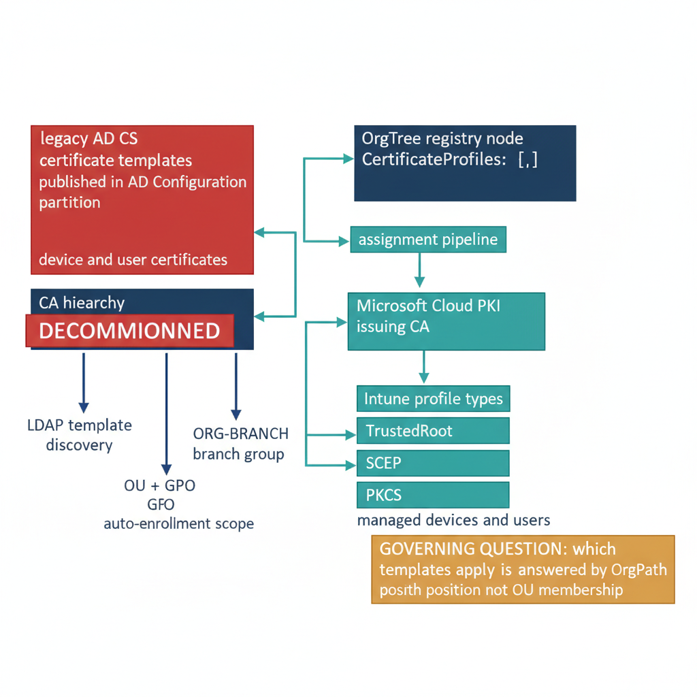

# Chapter 3 — CERTIFICATE SERVICES

::: {.callout-note}
## In this chapter
How OrgPath governs certificate coverage once Active Directory Certificate Services is retired. This chapter maps the AD CS auto-enrollment model onto its cloud-native replacement in Microsoft Cloud PKI and Intune, extends the OrgTree node schema with a CertificateProfiles property so coverage follows organizational position, and walks the idempotent pipeline that assigns Intune certificate profiles to OrgPath branch groups. It closes with the KB5014754 strong-mapping requirement and the verification script that keeps SCEP profiles compliant.
:::

## Certificate Governance — Mapping Template Coverage to Organizational Position

## The AD CS Architecture Being Replaced

Active Directory Certificate Services publishes certificate templates as objects in the Configuration naming context of the AD forest. The templates are stored under CN=Certificate Templates,CN=Public Key Services,CN=Services,CN=Configuration,DC=... and replicate to every domain controller in the forest through Configuration partition replication. Every domain-joined computer and user can discover available templates by performing an LDAP query against this container — the query returns all templates for which the calling security principal has Enroll or AutoEnroll permission on the template's security descriptor. This LDAP-based template discovery is the mechanism through which auto-enrollment operates: the Windows Certificate Client on each machine queries the directory for available templates, compares the result to the auto-enrollment policy received from Group Policy, and automatically requests any templates that are available and eligible.

The scope of auto-enrollment is governed entirely by OU placement and group membership. A certificate auto-enrollment policy setting linked to an OU causes every computer and user object in that OU — and in every child OU below it — to participate in auto-enrollment. The templates a given computer or user receives are determined by the intersection of the auto-enrollment policy scope (OU membership) and the Enroll and AutoEnroll permission on each template's ACL (group membership). The CA issues certificates based on the same group membership validation.

The CRL Distribution Points for each issued certificate point to LDAP URIs constructed from the AD schema path of the CRL object, meaning that CRL validation for any certificate issued by an AD-integrated CA depends on LDAP connectivity to the AD forest. All of these mechanisms disappear when the CA is decommissioned and the AD forest is retired.

In the cloud-native model, each mechanism is replaced by Intune. Trusted Root certificate profiles distribute the root and issuing CA certificates to all managed devices, replacing the AD-based NTAuth store and the certificate chain publication in the Configuration partition. SCEP profiles replace auto-enrollment GPOs for device certificates, using the Simple Certificate Enrollment Protocol to deliver certificates from Microsoft Cloud PKI to Intune-managed devices. PKCS profiles replace legacy PKCS#12 import-based certificate delivery for user certificates and scenarios where SCEP is not appropriate.

Cloud PKI hosted in Microsoft Intune replaces the on-premises CA hierarchy entirely — it provides root and issuing CA functionality as a managed service, without requiring the organization to operate CA servers, manage CRL Distribution Points, or publish OCSP responders. Profile assignment to OrgPath-derived branch groups replaces OU-based auto-enrollment scope. The governing question for each device — which certificate templates apply to it — is no longer answered by OU membership and GPO; it is answered by OrgPath position and group membership in the OrgPath branch group library.

{#fig-book-12-cpt-03-diagram-01 fig-alt="Engineering blueprint diagram on a white background contrasting two certificate-delivery models. On the left, a red #C0392B box labeled legacy AD CS shows certificate templates published in the AD Configuration partition, with arrows for LDAP template discovery and OU plus GPO auto-enrollment scope feeding a federal navy #1F3A5F box CA hierarchy that issues device and user certificates; a red banner marks this whole column decommissioned. On the right, a federal navy #1F3A5F box OrgTree registry node carries a CertificateProfiles array in monospace, feeding a teal #1A9E8F box assignment pipeline that maps profiles to a teal box ORG-BRANCH branch group. Arrows lead to teal boxes for a Microsoft Cloud PKI issuing CA and three Intune profile types TrustedRoot, SCEP, and PKCS, which deliver certificates to managed devices and users. An amber #D4A017 callout reads governing question which templates apply is answered by OrgPath position not OU membership. Monospace labels for profile and group names, no human figures, 16:9 landscape." width="85%"}

## OrgTree Metadata Extension for PKI Governance

The OrgTree registry node schema is extended with a CertificateProfiles property to support PKI governance. This property is an array of profile mapping objects, where each object identifies a certificate profile that must be assigned to the devices or users in that organizational node. The extension is additive — nodes that do not require any node-specific certificate coverage beyond the organization-wide baseline carry an empty array or omit the property entirely. The governance pipeline treats an absent or empty CertificateProfiles array as an indication that the organization-wide Trusted Root profile and any domain-wide SCEP or PKCS baselines are sufficient for devices in that node.

Each entry in the CertificateProfiles array carries four fields:

| Field | What it holds |
| :--- | :--- |
| **ProfileDisplayName** | The Intune certificate profile's exact display name, using the naming convention established during the initial Cloud PKI build — typically CERT-SCEP-{PURPOSE}-{NODEID} for SCEP profiles and ROOT-{ISSUERNAME} for Trusted Root profiles |
| **Type** | The profile type: TrustedRoot, SCEP, or PKCS |
| **Purpose** | The target: Device, User, or Both |
| **TemplateReplaces** | The AD CS template name that this profile replaces, providing the traceability link between the legacy on-premises certificate infrastructure and the cloud-native replacement |

The TemplateReplaces field is used by the Decommissioning Readiness Score to verify that every AD CS template that issued certificates has a corresponding Cloud PKI replacement.

An example node entry in the registry JSON, showing the extended schema:

```json
{
  "Id": "finance",
  "Path": "/Org/Finance",
  "Tier": "T1",
  "Status": "Active",
  "MigrationPhase": "Migration",
  "DnsBoundary": true,
  "CertificateProfiles": [
    {
      "ProfileDisplayName": "ROOT-CloudPKI-Issuing",
      "Type": "TrustedRoot",
      "Purpose": "Device",
      "TemplateReplaces": null
    },
    {
      "ProfileDisplayName": "CERT-SCEP-WIFI-FINANCE",
      "Type": "SCEP",
      "Purpose": "Device",
      "TemplateReplaces": "WorkstationAuthentication"   // <-- AD CS template name
    },
    {
      "ProfileDisplayName": "CERT-SCEP-VPN-FINANCE",
      "Type": "SCEP",
      "Purpose": "Device",
      "TemplateReplaces": "IPSecIntermediateOffline"    // <-- AD CS template name
    }
  ]
}
```

## Certificate Profile Assignment Pipeline

The certificate profile assignment pipeline script reads the OrgTree registry, identifies nodes with CertificateProfiles metadata, retrieves the named profiles from Intune through the Microsoft Graph API, and assigns each profile to the corresponding OrgPath branch group. The script is idempotent — profiles already assigned to the correct group are detected and skipped without modification, so the script can be run repeatedly as part of the weekly pipeline without creating duplicate assignments. Profiles that cannot be found in Intune — because they have not yet been created — are logged as missing and counted in the summary, prompting the PKI team to create them before the next pipeline run.

```powershell
#Requires -Version 5.1
<#
.SYNOPSIS
    Assigns Intune certificate profiles to OrgPath branch groups based on
    CertificateProfiles metadata in the OrgTree registry.

.DESCRIPTION
    For each active OrgTree node carrying a non-empty CertificateProfiles
    metadata array, this script retrieves the named Intune certificate
    configuration profiles and assigns them to the corresponding
    ORG-BRANCH-{NodeId} device group in Entra ID.

    Profiles must already exist in Intune before this script runs.
    This script manages assignments only — it does not create profiles.
    Profile creation is performed by the PKI team using the Cloud PKI
    console in the Intune admin center.

    This script is idempotent. Re-running it on an already-correct
    environment makes no changes and completes cleanly.

.PARAMETER OrgTreeRegistryPath
    Local path to the OrgTree registry JSON file.
    Example: "C:\governance\orgtree\registry.json"

.PARAMETER TenantId
    Azure AD / Entra ID Tenant ID.
    Example: "00000000-0000-0000-0000-000000000000"   <-- substitute

.NOTES
    Required Microsoft Graph scopes:
      DeviceManagementConfiguration.ReadWrite.All
      Group.Read.All
    Authentication: Run under the OrgPath automation service account.
    The account must have the Intune Administrator or Policy and Profile
    Manager role in Intune.

    Profile naming conventions assumed by this script:
      SCEP profiles  : display name starts with "CERT-"
      PKCS profiles  : display name starts with "PKCS-"
      Root profiles  : display name starts with "ROOT-"
    Adjust the $filter queries below if your naming convention differs.
#>
param(
    [Parameter(Mandatory = $false)]
    [string]$OrgTreeRegistryPath = "C:\governance\orgtree\registry.json",

    [Parameter(Mandatory = $false)]
    [string]$TenantId = "00000000-0000-0000-0000-000000000000"  # <-- substitute
)

Set-StrictMode -Version Latest
$ErrorActionPreference = "Stop"

#region --- Authentication ------------------------------------------------------

Connect-MgGraph `
    -TenantId $TenantId `
    -Scopes "DeviceManagementConfiguration.ReadWrite.All", "Group.Read.All" `
    -NoWelcome

Write-Host "[$(Get-Date -f 'HH:mm:ss')] Connected to Microsoft Graph."

#endregion

#region --- Load OrgTree and Select Nodes with Certificate Metadata -------------

if (-not (Test-Path $OrgTreeRegistryPath)) {
    throw "OrgTree registry not found: $OrgTreeRegistryPath"
}

$registry = Get-Content $OrgTreeRegistryPath -Raw | ConvertFrom-Json
$nodes    = $registry.nodes | Where-Object {
    $_.Status -eq "Active" -and
    $_.CertificateProfiles -and
    $_.CertificateProfiles.Count -gt 0
}

Write-Host "[$(Get-Date -f 'HH:mm:ss')] Nodes with certificate profile metadata: $($nodes.Count)"

#endregion

#region --- Cache Intune Certificate Profiles -----------------------------------
# Cache all relevant profiles to avoid N*M Graph API calls.
# Retrieve SCEP, PKCS, and TrustedRoot profiles using naming convention filters.

$allProfiles = @{}

$profileQueries = @(
    "https://graph.microsoft.com/v1.0/deviceManagement/deviceConfigurations" +
        "?`$filter=startsWith(displayName,'CERT-')",
    "https://graph.microsoft.com/v1.0/deviceManagement/deviceConfigurations" +
        "?`$filter=startsWith(displayName,'PKCS-')",
    "https://graph.microsoft.com/v1.0/deviceManagement/deviceConfigurations" +
        "?`$filter=startsWith(displayName,'ROOT-')"
)

foreach ($query in $profileQueries) {
    $response = Invoke-MgGraphRequest -Method GET -Uri $query
    foreach ($profile in $response.value) {
        $allProfiles[$profile.displayName] = $profile
    }
}

Write-Host "[$(Get-Date -f 'HH:mm:ss')] Certificate profiles cached from Intune: $($allProfiles.Count)"

#endregion

#region --- Assignment Loop -----------------------------------------------------

$stats = @{
    Assigned        = 0
    AlreadyAssigned = 0
    MissingProfile  = 0
    MissingGroup    = 0
    Failed          = 0
}

foreach ($node in $nodes) {

    $branchGroupName = "ORG-BRANCH-$($node.Id)"

    # Retrieve the branch group from Entra ID
    $branchGroup = Get-MgGroup `
        -Filter "displayName eq '$branchGroupName'" `
        -Property "Id,DisplayName" |
        Select-Object -First 1

    if (-not $branchGroup) {
        Write-Warning "  Branch group not found in Entra ID: $branchGroupName" +
                      " — run device group library sync (Part Four) first."
        $stats.MissingGroup++
        continue
    }

    foreach ($certMeta in $node.CertificateProfiles) {

        $profileName = $certMeta.ProfileDisplayName

        if (-not $allProfiles.ContainsKey($profileName)) {
            Write-Warning "  Profile not found in Intune: '$profileName'" +
                          " (node: $($node.Id)) — create this profile in Cloud PKI first."
            $stats.MissingProfile++
            continue
        }

        $profile = $allProfiles[$profileName]

        # Check existing assignments for this profile to maintain idempotency
        $existingAssignmentsResponse = Invoke-MgGraphRequest `
            -Method GET `
            -Uri "https://graph.microsoft.com/v1.0/deviceManagement" +
                 "/deviceConfigurations/$($profile.id)/assignments"

        $alreadyAssigned = $existingAssignmentsResponse.value | Where-Object {
            $_.target.groupId -eq $branchGroup.Id
        }

        if ($alreadyAssigned) {
            Write-Host "  [SKIP]   $profileName already assigned to $branchGroupName"
            $stats.AlreadyAssigned++
            continue
        }

        # Build the assignment request body
        $assignBody = @{
            assignments = @(
                @{
                    target = @{
                        "@odata.type" = "#microsoft.graph.groupAssignmentTarget"
                        groupId       = $branchGroup.Id
                    }
                }
            )
        } | ConvertTo-Json -Depth 10

        try {
            Invoke-MgGraphRequest `
                -Method      POST `
                -Uri         "https://graph.microsoft.com/v1.0/deviceManagement" +
                             "/deviceConfigurations/$($profile.id)/assign" `
                -Body        $assignBody `
                -ContentType "application/json" | Out-Null

            Write-Host "  [OK]     $profileName → $branchGroupName"
            $stats.Assigned++
        }
        catch {
            Write-Warning "  [FAIL]   $profileName → $branchGroupName : $_"
            $stats.Failed++
        }
    }
}

#endregion

#region --- Summary and Disconnect ----------------------------------------------

Write-Host ""
Write-Host "=== Certificate Profile Assignment Complete ==="
Write-Host "  Assigned            : $($stats.Assigned)"
Write-Host "  Already Assigned    : $($stats.AlreadyAssigned)"
Write-Host "  Missing Profiles    : $($stats.MissingProfile)"
Write-Host "  Missing Groups      : $($stats.MissingGroup)"
Write-Host "  Failed              : $($stats.Failed)"

Disconnect-MgGraph

#endregion
```

## Strong Mapping and KB5014754 Compliance

Microsoft Security Update KB5014754, introduced in May 2022 with enforcement phases extending through subsequent years, changed the behavior of the Windows Kerberos Key Distribution Center when evaluating certificate-based authentication requests. Under the new behavior, the KDC requires that the certificate used for authentication contain a Subject Alternative Name extension that includes the user's or device's security identifier (SID) in a form the KDC can cryptographically bind to the requesting principal. Certificates that do not meet this requirement are either rejected outright in Full Enforcement mode or logged as warnings in Compatibility mode, depending on the registry configuration of the domain controllers.

For Intune SCEP profiles targeting device certificate authentication, the strong mapping requirement is satisfied by including the {{onPremisesSecurityIdentifier}} variable in the Subject Alternative Name field of the SCEP profile configuration. This variable, resolved by the Intune SCEP gateway at enrollment time, inserts the device's on-premises SID (obtained from the synchronized Entra ID device object) into the SAN extension of the issued certificate. The KDC can then verify the binding between the certificate and the requesting device account by comparing the SID in the certificate to the SID of the device account in the directory.

The governance pipeline must verify that every SCEP profile in the OrgPath certificate profile registry has this SAN variable configured correctly before the profile is assigned to a branch group.

> A SCEP profile that lacks the {{onPremisesSecurityIdentifier}} SAN will issue certificates that pass enrollment silently but fail KDC validation at the moment a device attempts certificate-based authentication after the KB5014754 enforcement date.

The verification script queries each SCEP profile's configuration through the Graph API and flags non-compliant profiles for remediation.

```powershell
#Requires -Version 5.1
<#
.SYNOPSIS
    Verifies that all SCEP profiles in the OrgPath certificate registry
    have KB5014754-compliant strong mapping SAN configuration.

.DESCRIPTION
    Queries Intune for all SCEP profiles whose display names appear in any
    node's CertificateProfiles metadata. For each SCEP profile, retrieves
    the subjectAlternativeNameType and customSubjectAlternativeName settings
    and verifies that the onPremisesSecurityIdentifier variable is present
    in the SAN configuration.

    Non-compliant profiles are written to a compliance report JSON committed
    to the governance repository. Profiles flagged as non-compliant must be
    remediated before they are assigned to branch groups.

.PARAMETER OrgTreeRegistryPath
    Path to the OrgTree registry JSON.

.PARAMETER OutputPath
    Path for the compliance report JSON output.
    Example: "C:\governance\reports\pki"

.NOTES
    Required Graph scope: DeviceManagementConfiguration.Read.All
    Strong mapping SAN requirement: KB5014754 (enforced post May 2025 patch)
    The {{onPremisesSecurityIdentifier}} variable requires device objects to
    have a valid onPremisesSecurityIdentifier in Entra ID, which requires
    Entra Connect hybrid join sync or a manually synchronized SID attribute.
#>
param(
    [string]$OrgTreeRegistryPath = "C:\governance\orgtree\registry.json",
    [string]$OutputPath          = "C:\governance\reports\pki"
)

Set-StrictMode -Version Latest
$ErrorActionPreference = "Stop"

New-Item -ItemType Directory -Path $OutputPath -Force | Out-Null

Connect-MgGraph `
    -Scopes "DeviceManagementConfiguration.Read.All" `
    -NoWelcome

$registry    = Get-Content $OrgTreeRegistryPath -Raw | ConvertFrom-Json
$scepProfiles = @{}

# Collect all SCEP profile names referenced in registry CertificateProfiles metadata
foreach ($node in $registry.nodes) {
    if ($node.CertificateProfiles) {
        foreach ($cp in $node.CertificateProfiles) {
            if ($cp.Type -eq "SCEP") {
                $scepProfiles[$cp.ProfileDisplayName] = $true
            }
        }
    }
}

Write-Host "[$(Get-Date -f 'HH:mm:ss')] SCEP profiles to verify: $($scepProfiles.Count)"

$report      = @{ AssessedAt = (Get-Date -f 'o'); Profiles = @() }
$compliant   = 0
$nonCompliant = 0

foreach ($profileName in $scepProfiles.Keys) {

    $graphUri = "https://graph.microsoft.com/v1.0/deviceManagement" +
                "/deviceConfigurations?`$filter=displayName eq '$profileName'"

    $response = Invoke-MgGraphRequest -Method GET -Uri $graphUri
    $profile  = $response.value | Select-Object -First 1

    if (-not $profile) {
        Write-Warning "  Profile not found in Intune: $profileName"
        continue
    }

    # Retrieve full profile details (OData type contains SCEP-specific properties)
    $fullProfile = Invoke-MgGraphRequest `
        -Method GET `
        -Uri "https://graph.microsoft.com/v1.0/deviceManagement" +
             "/deviceConfigurations/$($profile.id)"

    # Check for onPremisesSecurityIdentifier in customSubjectAlternativeNames
    $sans = $fullProfile.customSubjectAlternativeNames
    $hasSidSan = $false

    if ($sans) {
        $hasSidSan = ($sans | Where-Object {
            $_.sanType -eq "onPremisesUserPrincipalName" -or
            # Graph API exposes the SID SAN variable as onPremisesSecurityIdentifier
            # in the customSubjectAlternativeName sanType field
            $_.sanType -contains "onPremisesSecurityIdentifier"
        }).Count -gt 0
    }

    $entry = @{
        ProfileName = $profileName
        ProfileId   = $profile.id
        HasSidSan   = $hasSidSan
        Compliant   = $hasSidSan
        Remediation = if (-not $hasSidSan) {
            "Add onPremisesSecurityIdentifier to customSubjectAlternativeNames in the SCEP profile."
        } else { $null }
    }

    $report.Profiles += $entry

    if ($hasSidSan) {
        Write-Host "  [OK]    $profileName — SID SAN present"
        $compliant++
    } else {
        Write-Warning "  [FAIL]  $profileName — SID SAN missing (KB5014754 non-compliant)"
        $nonCompliant++
    }
}

$report | ConvertTo-Json -Depth 10 |
    Set-Content -Path "$OutputPath\scep-strongmapping-compliance.json" -Encoding UTF8

Write-Host ""
Write-Host "=== SCEP Strong Mapping Compliance Report ==="
Write-Host "  Compliant     : $compliant"
Write-Host "  Non-Compliant : $nonCompliant"
Write-Host "  Report written: $OutputPath\scep-strongmapping-compliance.json"

Disconnect-MgGraph
```
