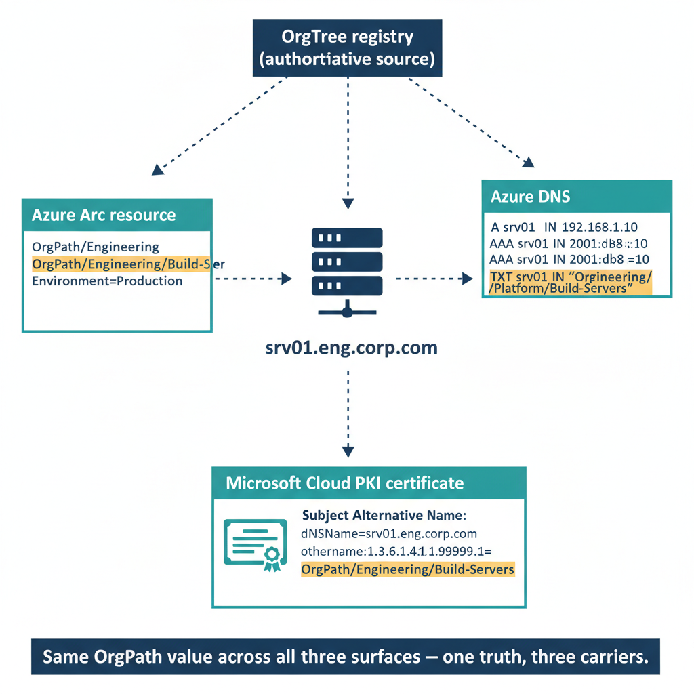

# Chapter 4 — CROSS-SURFACE DRIFT DETECTION FOR INFRASTRUCTURE SERVICES

::: {.callout-note}
## In this chapter
Infrastructure surfaces extend the identity-object drift framework with three new drift categories the governance pipeline must monitor: DNS zone tag drift, certificate profile assignment drift, and certificate-OrgPath misalignment. This chapter gives the scheduled KQL and Azure Resource Graph queries that detect each, and the remediation pathway for a device whose certificate no longer matches its current organizational position.
:::

## Keeping DNS and PKI Coverage Aligned with the Governance Model

{#fig-12-orgpath-in-infrastructure-services-diagram-02 fig-alt="Single-server topology showing OrgPath presence across three infrastructure surfaces. Center: a single server icon labeled srv01.eng.corp.com. Three arms radiate outward to three carrier boxes. Right arm to \"Azure DNS\" box: shows standard A and AAAA records alongside a TXT record OrgPath=/Engineering/Platform/Build-Servers. Bottom arm to \"Microsoft Cloud PKI\" certificate box: shows a sample certificate with Subject Alternative Name: dNSName=srv01.eng.corp.com, otherName:1.3.6.1.4.1.99999.1=OrgPath:/Engineering/Platform/Build-Servers. Left arm to \"Azure Arc resource\" box: shows resource tags OrgPath=/Engineering/Platform/Build-Servers and Environment=Production. All three carrier boxes have dashed arrows pointing back upward to a single shared box at the top labeled \"OrgTree registry (authoritative source)\". A note bar at the bottom reads \"Same OrgPath value across all three surfaces — one truth, three carriers.\" Engineering blueprint style, white background, federal navy (#1F3A5F) for the registry, teal (#1A9E8F) for each of the three infrastructure surface boxes, amber (#D4A017) for the OrgPath value text in each carrier, monospace for record and tag syntax, no human figures, 16:9 landscape." width="100%"}

## The New Infrastructure Drift Categories

The drift detection framework built in Part Four defined four categories of OrgPath attribute drift on identity objects: users without an OrgPath value, users whose OrgPath does not match any active OrgTree node, devices without an OrgPath value, and devices whose OrgPath-derived group membership has not been updated after an OrgPath change. Each category has a remediation pathway in the governance pipeline — either an attribute derivation run, a registry validation correction, or a group membership synchronization.

> Identity objects are not the only surfaces that drift. DNS zones and certificates carry OrgPath too, and each can fall out of alignment with the registry in ways the identity-object framework was never designed to catch.

Infrastructure surfaces introduce three additional drift categories that the governance pipeline must monitor, each representing a specific class of misalignment between the governance registry and the live environment:

1. **DNS zone drift:** Private DNS Zones that lack one or more OrgPath governance tags, or whose tag values reference an OrgNodeId that does not correspond to any active node in the OrgTree registry. This indicates either that a zone was created outside the governance pipeline (which Azure Policy should prevent, but which can occur if the policy was temporarily disabled or excluded), or that an OrgTree node was archived without the corresponding zone being updated.

2. **Certificate profile assignment drift:** profiles that are assigned to Entra ID groups other than the designated OrgPath branch groups, indicating that manual assignment has created coverage outside the registry-governed scope. Manual assignments created through the Intune console are not reflected in the OrgTree registry, making them invisible to the pipeline and ungoverned from the audit perspective.

3. **Certificate-OrgPath misalignment:** devices that hold valid certificates issued under a profile associated with a different OrgPath node than their current OrgPath value. This occurs when a device is moved from one organizational unit to another — its OrgPath is updated by the pipeline, but the certificate it holds was issued for its old position. The certificate remains valid and the device continues to use it, but the certificate no longer reflects the device's current organizational position and may grant it access to resources scoped to its former segment.

## DNS Zone Tag Drift Detection

The KQL query below is scheduled as a weekly Log Analytics alert rule against the Azure Resource Graph connector. It returns all Private DNS Zones in the governance subscription that are missing any of the four required OrgPath tags. A result count greater than zero triggers an alert, generating an incident in Microsoft Sentinel and an email notification to the DNS governance distribution group. The alert cadence matches the weekly pipeline run — DNS zones that fail the policy deny effect because the policy was briefly disabled will be caught by this query on the next scheduled run.

```kql
// ---------------------------------------------------------------
// Drift Detection: Azure DNS Private Zones Without Valid OrgPath Tags
// Source: Azure Resource Graph via ARG connector in Log Analytics
// Schedule: Weekly (Sunday 22:00 UTC) — alert on result count > 0
// Severity: Medium (policy misconfiguration or out-of-band creation)
// ---------------------------------------------------------------

arg("").Resources
| where type == "microsoft.network/privatednszones"
| extend
    OrgPath        = tostring(tags['OrgPath']),
    OrgNodeId      = tostring(tags['OrgNodeId']),
    OrgTier        = tostring(tags['OrgTier']),
    MigrationPhase = tostring(tags['MigrationPhase'])
| extend
    MissingOrgPath        = isempty(OrgPath),
    MissingOrgNodeId      = isempty(OrgNodeId),
    MissingOrgTier        = isempty(OrgTier),
    MissingMigrationPhase = isempty(MigrationPhase)
| extend
    AnyTagMissing = MissingOrgPath or MissingOrgNodeId
                    or MissingOrgTier or MissingMigrationPhase
| where AnyTagMissing == true
| project
    ZoneName              = name,
    ResourceGroup         = resourceGroup,
    SubscriptionId        = subscriptionId,
    OrgPath,
    OrgNodeId,
    MissingOrgPath,
    MissingOrgNodeId,
    MissingOrgTier,
    MissingMigrationPhase,
    CreatedTime           = tostring(properties.provisioningState)
| order by ZoneName asc
```

The Azure Resource Graph query below complements the KQL query by cross-referencing the OrgNodeId tag on each DNS zone against the active node list from the governance repository. Zones whose OrgNodeId tag value does not correspond to any active OrgTree node represent orphaned zones — they were created for a node that has since been archived or had its ID changed. Orphaned zones are not deleted automatically; they are flagged in the drift report for manual review, because they may contain DNS records that are still in use by workloads that have not yet been migrated.

```kql
// ---------------------------------------------------------------
// Azure Resource Graph: Orphaned DNS Zones (OrgNodeId Mismatch)
// Run via: Search-AzGraph -Query ...
// Use to identify zones whose OrgNodeId tag does not match any
// active node in the OrgTree registry.
// ---------------------------------------------------------------

Resources
| where type == "microsoft.network/privatednszones"
| extend OrgNodeId = tostring(tags['OrgNodeId'])
| where isnotempty(OrgNodeId)
| project
    ZoneName      = name,
    ResourceGroup = resourceGroup,
    OrgNodeId,
    OrgPath = tostring(tags['OrgPath']),
    MigrationPhase = tostring(tags['MigrationPhase'])
| order by ZoneName asc
// Post-process in PowerShell: compare OrgNodeId values against the
// active node IDs from the governance repository registry.json
// to identify mismatched (orphaned) zones.
```

## Certificate-OrgPath Misalignment Detection

The KQL query below joins device OrgPath values from the Entra ID audit log against certificate enrollment events from the Intune audit log to identify devices whose most recently enrolled certificate profile is associated with a different OrgPath node than their current OrgPath value. The query assumes the naming convention established in the OrgPath certificate profile assignment script: SCEP profile names contain the node ID as the final hyphen-delimited segment (e.g., CERT-SCEP-WIFI-FINANCE, where FINANCE is the node ID). Organizations using a different naming convention must adjust the CertNodeId extraction logic accordingly.

```kql
// ---------------------------------------------------------------
// Certificate Drift: Devices with Certificates Misaligned to OrgPath
// Source: AuditLogs (Entra ID + Intune unified audit log)
// Schedule: Weekly — alert when result count > 0
// Severity: Medium (certificate coverage does not match current position)
// Remediation: Re-run certificate profile assignment pipeline; the
//   device will receive a new SCEP certificate from the correct profile
//   on its next Intune check-in (typically within 8 hours).
// ---------------------------------------------------------------

// Step 1: Capture the most recent OrgPath value for each device
//   from Entra ID audit log device update events.
let DeviceOrgPaths = AuditLogs
| where TimeGenerated >= ago(14d)
| where Category == "Device" and OperationName == "Update device"
| mv-expand Props = AdditionalDetails
| where tostring(Props.displayName) contains "OrgPath"
| extend
    DeviceId = tostring(TargetResources[0].id),
    OrgPath  = tostring(Props.newValue)
| where isnotempty(OrgPath)
| summarize arg_max(TimeGenerated, OrgPath) by DeviceId
| project DeviceId, CurrentOrgPath = OrgPath;

// Step 2: Capture the most recently enrolled certificate profile
//   for each device from the Intune certificate enrollment audit events.
let CertEnrollments = AuditLogs
| where TimeGenerated >= ago(30d)
| where OperationName == "Create deviceConfigurationDeviceStatus"
| extend
    DeviceId    = tostring(TargetResources[0].id),
    ProfileName = tostring(TargetResources[0].displayName)
| where ProfileName startswith "CERT-" or ProfileName startswith "PKCS-"
| summarize LastCertProfile = arg_max(TimeGenerated, ProfileName) by DeviceId
| project DeviceId, LastCertProfile;

// Step 3: Join and identify misaligned devices.
//   Naming convention: CERT-SCEP-{PURPOSE}-{NODEID}
//   Extract the NODEID as the last hyphen-delimited segment of the profile name.
//   Extract the OrgPath leaf node as the last slash-delimited segment.
DeviceOrgPaths
| join kind=inner CertEnrollments on DeviceId
| extend
    CertNodeId = toupper(tostring(split(LastCertProfile, "-")[-1])),
    OrgNodeId  = toupper(tostring(split(CurrentOrgPath, "/")[-1]))
| where CertNodeId != OrgNodeId
| extend
    RemediationAction = strcat(
        "Verify OrgPath branch group membership for device ",
        DeviceId,
        ". Re-run certificate profile assignment pipeline to issue new CERT-SCEP-*-",
        OrgNodeId,
        " profile."
    )
| project
    DeviceId,
    CurrentOrgPath,
    OrgNodeId,
    LastCertProfile,
    CertNodeId,
    RemediationAction
| order by CurrentOrgPath asc
```

::: {.callout-note title="Remediation Pathway for Certificate-OrgPath Drift"}
When a device appears in the certificate-OrgPath drift query, the remediation sequence is straightforward. First, confirm that the device's OrgPath value in Entra ID is correct and reflects an intentional move, not an erroneous attribute update. Second, verify that the correct SCEP profile for the device's new OrgPath node is assigned to the corresponding branch group. Third, trigger an Intune synchronization on the device (through the Intune admin center or via the Sync-MgDeviceManagementManagedDevice cmdlet). The device will evaluate its profile assignments on the next check-in and begin the SCEP enrollment process for the new profile. The old certificate remains valid until it expires — it is not revoked automatically. If the old certificate grants access to resources scoped to the device's former organizational segment, those resources should be reviewed to confirm that continued access by the migrated device is appropriate.
:::
