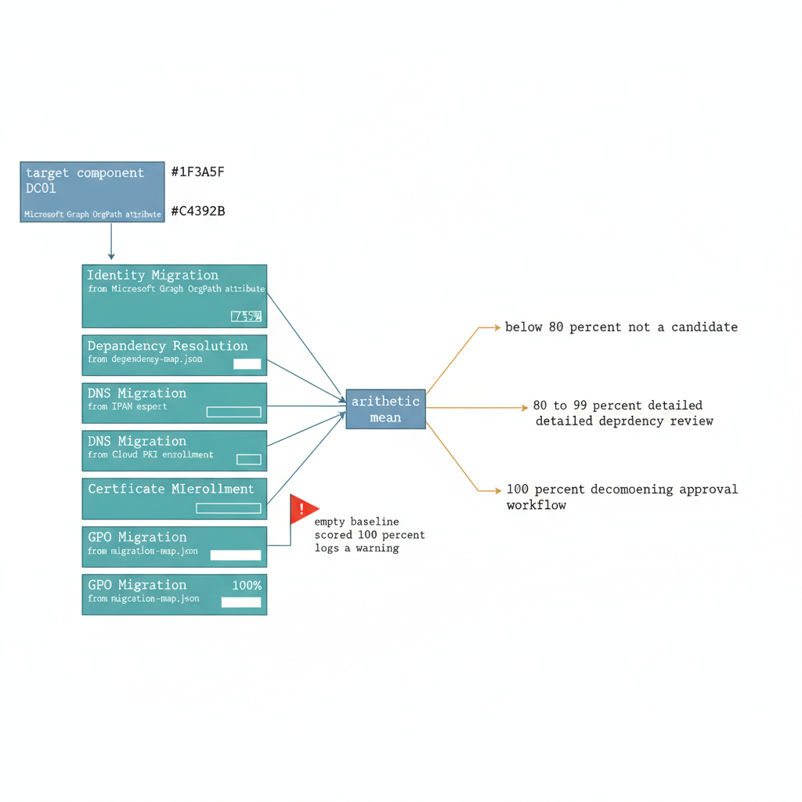

# Chapter 5 — THE DECOMMISSIONING READINESS SCORE

::: {.callout-note}
## In this chapter
The most dangerous moment in an AD modernization program is the irreversible shutdown of a domain controller — because it reveals unresolved dependencies in production rather than before the decision. This chapter introduces the Decommissioning Readiness Score: a five-dimension, per-component measure of how much known work remains, the PowerShell pipeline that computes it from the governance registries, and the tiered operational response and three-party sign-off workflow it drives.
:::

## When Is It Safe to Decommission? A Quantified Answer

## The Specific Risk This Score Is Designed to Eliminate

The most dangerous moment in any Active Directory modernization program is the moment a domain controller is permanently shut down. The risk is not that the shutdown is difficult to execute — it is not. The risk is that the shutdown reveals, in production and irreversibly, that a workload dependency was not known, not tracked, or not resolved before the decision to decommission was made. A domain controller that goes offline takes with it its DNS SRV records, its Kerberos ticket issuance capacity for the local site, its SYSVOL share for GPO application, its LDAP service for any application using directory-bound authentication, and — if it is the last DC for a site — the site's entire service locator infrastructure. Every one of these failures is invisible before decommissioning and catastrophic after it.

{#fig-book-12-cpt-05-diagram-01 fig-alt="Engineering blueprint diagram on a white background showing the Decommissioning Readiness Score as a weighted average of five dimension scores. On the left, a single federal navy (#1F3A5F) box labeled target component DC01 with monospace text. Five teal (#1A9E8F) dimension boxes stack in a column, each with a monospace label and its data source in smaller monospace text: Identity Migration from Microsoft Graph OrgPath attribute, Dependency Resolution from dependency-map.json, DNS Migration from IPAM export, Certificate Migration from Cloud PKI enrollment, GPO Migration from migration-map.json. Each dimension box shows a horizontal percent fill bar. Arrows from all five feed into a navy averaging node labeled arithmetic mean. From the averaging node, three amber (#D4A017) outcome bands branch to the right, labeled below 80 percent not a candidate, 80 to 99 percent detailed dependency review, and 100 percent decommissioning approval workflow. A small red (#C0392B) warning flag annotation points at a dimension box noting empty baseline scored 100 percent logs a warning. Monospace labels throughout, no human figures, 16:9 landscape." width="85%"}

The Decommissioning Readiness Score is designed to make the readiness question answerable before the action, not discoverable after it. It quantifies, per infrastructure component — per domain controller, per DNS zone, per CA — the percentage of known dependent workloads and infrastructure services that have been fully migrated. A score of one hundred percent means that every known dependency has been resolved and the component can be safely decommissioned. Anything less means dependencies remain and decommissioning will cause failures.

> The score does not eliminate the possibility of *unknown* dependencies — no automated tool can enumerate what has not been recorded. What it establishes is a governance norm in which dependency recording is a required activity and readiness is a measurable property of the environment, not an administrator's judgment.

## The Five Scoring Dimensions

The Decommissioning Readiness Score is composed of five dimensions, each calculated independently and then averaged to produce the overall score. The dimensions are designed to cover every category of dependency that a domain controller can carry.

| **Dimension** | **What It Measures** | **Data Source** | **100% Condition** |
|----|----|----|----|
| **Identity Migration** | Percentage of user and device objects whose OrgPath is stamped and whose authentication method has been assessed for migration readiness | Microsoft Graph API (Entra ID directory objects with OrgPath extension attribute) | All user and device objects carry a valid OrgPath referencing an active OrgTree node |
| **Dependency Resolution** | Percentage of recorded dependencies on the target domain controller that are in the Resolved state in the dependency registry | Governance repository: registries/server/dependency-map.json | Every dependency entry whose Provider field identifies the target DC has Status: Resolved |
| **DNS Migration** | Percentage of on-premises DNS zones (from IPAM export) that have been migrated to Azure DNS Private Zones with MigrationStatus: Complete | Governance repository: IPAM export with migration status annotations | Every forward lookup zone in the IPAM export carries MigrationStatus: Complete |
| **Certificate Migration** | Percentage of AD CS certificate templates in the TemplateReplaces registry that have a corresponding Cloud PKI profile with confirmed device enrollment | OrgTree CertificateProfiles metadata (TemplateReplaces field); Intune device enrollment status | Every legacy template listed in any node's TemplateReplaces field has a deployed Cloud PKI profile with confirmed enrollments |
| **GPO Migration** | Percentage of Group Policy settings in the GPO migration registry that have been mapped to Intune configuration profiles and marked as Deployed | Governance repository: registries/gpo/migration-map.json | Every GPO setting entry for GPOs linked to OUs served by the target DC has MigrationStatus: Deployed |

Each dimension score is computed as a simple percentage: items in a resolved or complete state divided by total items in scope, multiplied by one hundred. The overall Decommissioning Readiness Score is the arithmetic mean of the five dimension scores. A dimension with no items in scope — for example, a domain controller that has no recorded GPO dependencies because it serves a site where GPO migration is not yet tracked — is scored at one hundred percent for that dimension, but the pipeline logs a warning indicating that the dimension score reflects an empty baseline rather than confirmed migration completion. This prevents artificially elevated scores on components that have not yet been assessed.

## Readiness Score Calculation Script

```powershell
#Requires -Version 5.1
<#
.SYNOPSIS
    Calculates and reports the Decommissioning Readiness Score for a
    specified domain controller.

.DESCRIPTION
    Queries the governance repository registries, the Entra ID directory,
    and the Intune compliance data to compute a multi-dimensional
    readiness score for the target domain controller.

    Outputs a structured JSON report committed to the governance repository
    as a versioned assessment artifact, and writes a console summary.

    The readiness score is the arithmetic mean of five dimension scores:
      1. Identity Migration Score
      2. Dependency Resolution Score
      3. DNS Migration Score
      4. Certificate Migration Score (simplified: template coverage)
      5. GPO Migration Score

.PARAMETER TargetDC
    FQDN of the domain controller being evaluated.
    Example: "dc01.corp.contoso.com"    <-- substitute

.PARAMETER DomainName
    DNS name of the domain the target DC serves.
    Example: "corp.contoso.com"         <-- substitute

.PARAMETER RegistryBasePath
    Local path to the governance repository registries directory.
    Example: "C:\governance\registries"

.PARAMETER OutputPath
    Directory path where the readiness report JSON will be written.
    Example: "C:\governance\reports\decommission"

.PARAMETER AppId
    Application (client) ID of the Entra ID app registration used to
    construct the OrgPath extension attribute name.
    The extension attribute name is: extension_{AppIdNoHyphens}_OrgPath
    Example: "a1b2c3d4-e5f6-a1b2-c3d4-e5f6a1b2c3d4"   <-- substitute

.NOTES
    Required modules: Az, Microsoft.Graph, ActiveDirectory
    Run from a domain-joined management workstation.
    The executing account requires:
      - User.Read.All and Device.Read.All on Microsoft Graph
      - Read access to the governance repository registries
#>
param(
    [Parameter(Mandatory = $false)]
    [string]$TargetDC = "dc01.corp.contoso.com",           # <-- substitute

    [Parameter(Mandatory = $false)]
    [string]$DomainName = "corp.contoso.com",              # <-- substitute

    [Parameter(Mandatory = $false)]
    [string]$RegistryBasePath = "C:\governance\registries",

    [Parameter(Mandatory = $false)]
    [string]$OutputPath = "C:\governance\reports\decommission",

    [Parameter(Mandatory = $false)]
    [string]$AppId = "a1b2c3d4-e5f6-a1b2-c3d4-e5f6a1b2c3d4"  # <-- substitute
)

Set-StrictMode -Version Latest
$ErrorActionPreference = "Stop"

New-Item -ItemType Directory -Path $OutputPath -Force | Out-Null

Connect-MgGraph -Scopes "User.Read.All", "Device.Read.All" -NoWelcome

$report = @{
    TargetDC            = $TargetDC
    Domain              = $DomainName
    AssessedAt          = (Get-Date).ToUniversalTime().ToString("o")
    Scores              = @{}
    Warnings            = @()
    OverallReadinessScore = 0
    ReadyToDecommission = $false
}

$appIdNoHyphens = $AppId -replace '-', ''
$orgPathAttr    = "extension_${appIdNoHyphens}_OrgPath"

#region --- Score 1: Identity Migration ----------------------------------------
Write-Host "[$(Get-Date -f 'HH:mm:ss')] Scoring identity migration..."

$allUsers    = Get-MgUser -All -Property "id,displayName,$orgPathAttr"
$totalUsers  = ($allUsers | Measure-Object).Count
$positioned  = ($allUsers | Where-Object {
    $_.AdditionalProperties[$orgPathAttr] -ne $null -and
    $_.AdditionalProperties[$orgPathAttr] -ne ""
} | Measure-Object).Count

if ($totalUsers -eq 0) {
    $identityScore = 100
    $report.Warnings += "IdentityMigration: No user objects found — verify Graph permissions."
} else {
    $identityScore = [math]::Round(($positioned / $totalUsers) * 100, 1)
}

$report.Scores["IdentityMigration"] = @{
    Score        = $identityScore
    Total        = $totalUsers
    Positioned   = $positioned
    Unpositioned = ($totalUsers - $positioned)
    Note         = if ($totalUsers -eq 0) { "Empty baseline" } else { $null }
}
Write-Host "  Identity Migration Score: $identityScore%"

#endregion

#region --- Score 2: Dependency Resolution -------------------------------------
Write-Host "[$(Get-Date -f 'HH:mm:ss')] Scoring dependency resolution..."

$depMapPath = "$RegistryBasePath\server\dependency-map.json"
if (-not (Test-Path $depMapPath)) {
    $depScore = 100
    $report.Warnings += "DependencyResolution: dependency-map.json not found. " +
                        "Run Part Five dependency mapping before scoring."
} else {
    $depRegistry  = Get-Content $depMapPath -Raw | ConvertFrom-Json
    $dcDeps       = $depRegistry.dependencies | Where-Object {
        $_.Provider -eq $TargetDC
    }
    $totalDeps    = $dcDeps.Count
    $resolvedDeps = ($dcDeps | Where-Object { $_.Status -eq "Resolved" }).Count

    if ($totalDeps -eq 0) {
        $depScore = 100
        $report.Warnings += "DependencyResolution: No dependencies recorded for $TargetDC. " +
                            "Confirm the dependency discovery pass has been completed."
    } else {
        $depScore = [math]::Round(($resolvedDeps / $totalDeps) * 100, 1)
    }

    $report.Scores["DependencyResolution"] = @{
        Score    = $depScore
        Total    = $totalDeps
        Resolved = $resolvedDeps
        Pending  = ($totalDeps - $resolvedDeps)
    }
}
Write-Host "  Dependency Resolution Score: $depScore%"

#endregion

#region --- Score 3: DNS Migration ---------------------------------------------
Write-Host "[$(Get-Date -f 'HH:mm:ss')] Scoring DNS migration..."

$ipamZonesPath = "$RegistryBasePath\dns\ipam-dns-zones.json"
if (-not (Test-Path $ipamZonesPath)) {
    $dnsScore = 0
    $report.Warnings += "DnsMigration: ipam-dns-zones.json not found. " +
                        "Run IPAM export script before scoring."
} else {
    $ipamZones = Get-Content $ipamZonesPath -Raw | ConvertFrom-Json |
        Where-Object { $_.ZoneCategory -ne "ReverseZone" }   # Forward zones only

    $totalZones    = $ipamZones.Count
    $migratedZones = ($ipamZones | Where-Object {
        $_.MigrationStatus -eq "Complete"
    }).Count

    if ($totalZones -eq 0) {
        $dnsScore = 100
        $report.Warnings += "DnsMigration: No forward zones found in IPAM export."
    } else {
        $dnsScore = [math]::Round(($migratedZones / $totalZones) * 100, 1)
    }

    $report.Scores["DnsMigration"] = @{
        Score    = $dnsScore
        Total    = $totalZones
        Migrated = $migratedZones
        Pending  = ($totalZones - $migratedZones)
    }
}
Write-Host "  DNS Migration Score: $dnsScore%"

#endregion

#region --- Score 4: Certificate Migration -------------------------------------
Write-Host "[$(Get-Date -f 'HH:mm:ss')] Scoring certificate migration..."

$certReportPath = "$RegistryBasePath\..\reports\pki\scep-strongmapping-compliance.json"
if (-not (Test-Path $certReportPath)) {
    $certScore = 0
    $report.Warnings += "CertMigration: SCEP compliance report not found. " +
                        "Run the strong mapping verification script first."
} else {
    $certReport    = Get-Content $certReportPath -Raw | ConvertFrom-Json
    $totalProfiles = $certReport.Profiles.Count
    $compliant     = ($certReport.Profiles | Where-Object { $_.Compliant -eq $true }).Count

    if ($totalProfiles -eq 0) {
        $certScore = 100
        $report.Warnings += "CertMigration: No SCEP profiles found in compliance report."
    } else {
        $certScore = [math]::Round(($compliant / $totalProfiles) * 100, 1)
    }

    $report.Scores["CertificateMigration"] = @{
        Score         = $certScore
        TotalProfiles = $totalProfiles
        Compliant     = $compliant
        NonCompliant  = ($totalProfiles - $compliant)
    }
}
Write-Host "  Certificate Migration Score: $certScore%"

#endregion

#region --- Score 5: GPO Migration ---------------------------------------------
Write-Host "[$(Get-Date -f 'HH:mm:ss')] Scoring GPO migration..."

$gpoMapPath = "$RegistryBasePath\gpo\migration-map.json"
if (-not (Test-Path $gpoMapPath)) {
    $gpoScore = 100
    $report.Warnings += "GpoMigration: gpo/migration-map.json not found — scored as 100% " +
                        "with empty-baseline warning. Create the GPO migration map."
} else {
    $gpoMap      = Get-Content $gpoMapPath -Raw | ConvertFrom-Json
    $totalGpoSettings = ($gpoMap.settings | Measure-Object).Count
    $deployedSettings = ($gpoMap.settings | Where-Object {
        $_.MigrationStatus -eq "Deployed"
    } | Measure-Object).Count

    if ($totalGpoSettings -eq 0) {
        $gpoScore = 100
        $report.Warnings += "GpoMigration: No GPO settings found in migration map."
    } else {
        $gpoScore = [math]::Round(($deployedSettings / $totalGpoSettings) * 100, 1)
    }

    $report.Scores["GpoMigration"] = @{
        Score    = $gpoScore
        Total    = $totalGpoSettings
        Deployed = $deployedSettings
        Pending  = ($totalGpoSettings - $deployedSettings)
    }
}
Write-Host "  GPO Migration Score: $gpoScore%"

#endregion

#region --- Overall Score and Report -------------------------------------------

$allDimensionScores = @($identityScore, $depScore, $dnsScore, $certScore, $gpoScore)
$overallScore = [math]::Round(
    ($allDimensionScores | Measure-Object -Average).Average, 1
)

$report["OverallReadinessScore"] = $overallScore
$report["ReadyToDecommission"]   = ($overallScore -eq 100 -and $report.Warnings.Count -eq 0)

$safeDate = Get-Date -f 'yyyyMMdd'
$reportFileName = "$($TargetDC -replace '\.', '-')-$safeDate-readiness.json"
$reportFilePath = "$OutputPath\$reportFileName"

$report | ConvertTo-Json -Depth 10 |
    Set-Content -Path $reportFilePath -Encoding UTF8

Write-Host ""
Write-Host "=== Decommissioning Readiness Report — $TargetDC ==="
Write-Host ("  Identity Migration   : " + $identityScore + "%")
Write-Host ("  Dependency Resolution: " + $depScore + "%")
Write-Host ("  DNS Migration        : " + $dnsScore + "%")
Write-Host ("  Certificate Migration: " + $certScore + "%")
Write-Host ("  GPO Migration        : " + $gpoScore + "%")
Write-Host ("  ─────────────────────────────────────────")
Write-Host ("  OVERALL SCORE        : " + $overallScore + "%")
Write-Host ("  Safe to Decommission : " + $report.ReadyToDecommission)

if ($report.Warnings.Count -gt 0) {
    Write-Host ""
    Write-Host "  Warnings:"
    foreach ($w in $report.Warnings) { Write-Warning "    $w" }
}

Write-Host ""
Write-Host "  Report written: $reportFilePath"
Write-Host "  Commit to governance repository before the weekly review meeting."

Disconnect-MgGraph

#endregion
```

## Operational Use of the Score

The Decommissioning Readiness Score report is committed to the governance repository on each pipeline run. Because the repository is version-controlled, the history of score files for a given domain controller shows the progression of readiness over time — each pipeline execution after a migration activity produces a measurable improvement in one or more dimension scores. The governance team reviews the current score in the weekly infrastructure governance meeting and annotates the repository commit with the outcome of the review.

The operational response to the score follows a tiered framework, keyed to three score bands:

| **Score band** | **Interpretation** | **Operational response** |
|----|----|----|
| **Below 80%** | The component is in active assessment or early migration. | Not a candidate for decommissioning planning in the current quarter. |
| **80%–99%** | Most dependencies resolved; a measurable remainder blocks a perfect score. | Triggers a detailed dependency review: the specific items preventing a perfect score — unresolved dependency map entries, forward zones still in migration, SCEP profiles still non-compliant — are assigned to named engineers with a target resolution date that fits within the current migration phase. |
| **100%** | Every known dependency resolved, no warnings. | Initiates the formal decommissioning approval workflow. |

The formal decommissioning approval workflow requires sign-off from three parties:

- the **infrastructure lead**, who confirms that the score reflects current environment state and that no out-of-band changes have been made that are not captured in the registries;
- the **security team**, who confirms that the decommissioning does not introduce any gap in monitoring, authentication, or certificate validation coverage; and
- the **application owners** of any services that previously carried dependency map entries against the target component, who confirm that their workloads are operating correctly against the migrated infrastructure.

Sign-offs are recorded as commits to the governance repository, creating an auditable record of the approval decision. The target component is decommissioned only after all three sign-offs are committed.
