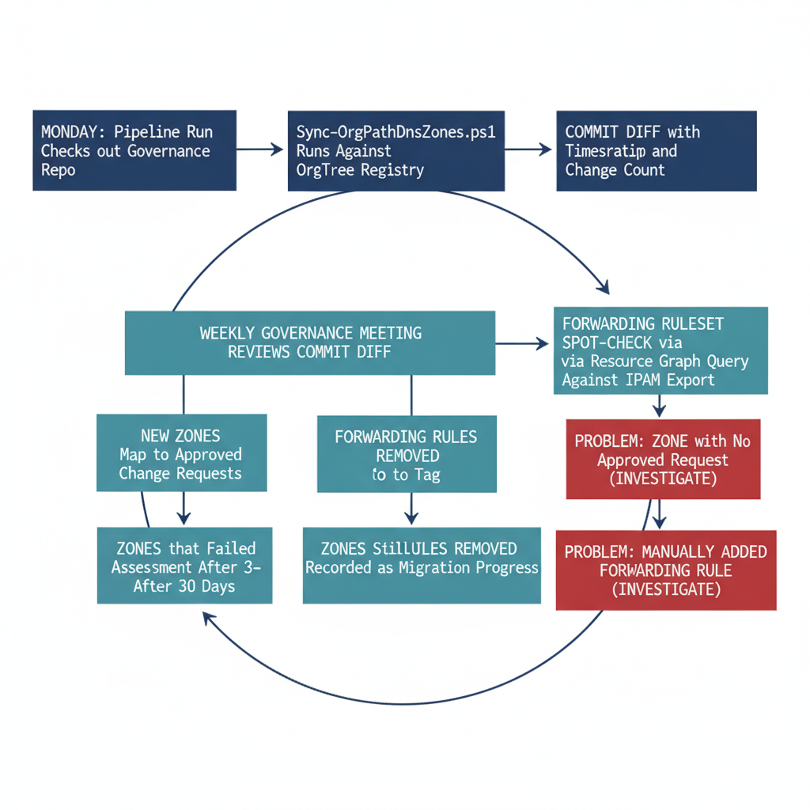

# Chapter 6 — OPERATIONAL PROCEDURES

::: {.callout-note}
## In this chapter
The recurring procedures that keep the DNS and PKI surfaces in a governed
state: the weekly DNS governance review that runs as part of the Monday
pipeline, the quarterly certificate profile review that proactively validates
configured state, and the extended OrgTree change request process that folds
DNS boundary and certificate profile considerations into every node addition
and removal.
:::

## Day-to-Day Governance of the DNS and PKI Surfaces

## Weekly DNS Governance Review

The weekly DNS governance review is the primary recurring operational procedure for maintaining the DNS surface in a governed state. It runs every Monday morning as part of the broader weekly pipeline execution. The pipeline checks out the latest version of the governance repository, runs Sync-OrgPathDnsZones.ps1 against the current OrgTree registry, and commits any changes — new zones created, tag values updated, VNet links established — back to the repository with a standardized commit message that includes the execution timestamp and a machine-readable count of changes.

{#fig-book-12-cpt-06-diagram-01 fig-alt="Engineering blueprint diagram on a white background showing the weekly DNS and PKI governance loop as a closed cycle of monospace-labelled boxes. A federal navy box reads Monday pipeline run checks out governance repo and an arrow leads to a navy box Sync-OrgPathDnsZones.ps1 runs against OrgTree registry, then to a navy box Commit diff with timestamp and change count. A teal box weekly governance meeting reviews the commit diff branches into four teal review items new zones map to approved change requests, zones that failed to tag, forwarding rules removed recorded as migration progress, and zones still in Assessment after thirty days. A teal box Forwarding Ruleset spot-check via Resource Graph query compares against IPAM export. Two red boxes mark problems a zone with no approved change request and a manually added forwarding rule, each flagged for investigation. An arrow closes the loop from the review meeting back to the next Monday pipeline run. Monospace labels, no human figures, 16:9 landscape." width="85%"}

The team reviews the commit diff in the weekly governance meeting. The review agenda covers four items:

1. **New zones created during the run.** These should correspond to OrgTree change requests approved since the previous run, and the team verifies that each new zone corresponds to an approved change request in the change management system. A new zone that does not correspond to an approved request indicates either a registry entry added outside the change process or a script defect, and either requires investigation.
2. **Zones that failed to tag correctly.** Reported in the script's error count, these are reviewed and remediated before the next run.
3. **Forwarding rules removed from the Private Resolver Forwarding Ruleset since the previous run.** These are recorded as DNS migration progress events; the team updates the migration status of the corresponding IPAM zone entries to Complete.
4. **Zones whose MigrationPhase tag is still set to Assessment after thirty days.** These are escalated: the assessment phase for any zone should complete within one monthly sprint cycle, and zones stuck in Assessment indicate that the zone migration has stalled and requires active intervention.

The weekly DNS review also includes a spot-check of the Azure DNS Private Resolver's Forwarding Ruleset to verify that no rules have been added manually since the previous run. Rules added manually — outside the governance pipeline — represent out-of-band changes that are not reflected in the governance repository and that may persist after the zones they forward for have been migrated to Azure. The spot-check uses a simple Resource Graph query to enumerate the active rules in the Forwarding Ruleset and compares the result to the expected rule set derived from the IPAM zone export.

## Quarterly Certificate Profile Review

Certificate profiles are reviewed quarterly against the OrgTree registry. The quarterly review serves a different purpose than the weekly drift detection run: where drift detection identifies misalignments that have already occurred, the quarterly review proactively validates that the configured state is correct before problems arise. The review has three components.

The first component is an assignment audit: every node in the OrgTree registry with a non-empty CertificateProfiles array is cross-referenced against the Intune assignment inventory to confirm that each named profile is actually assigned to the correct branch group. The certificate profile assignment script is re-run in audit mode — reviewing without modifying — and its output is compared against the registry. Any discrepancy between the registry and the live assignment state is remediated by a full pipeline run.

The second component is a certificate expiration sweep. The pipeline queries Intune for all managed devices whose certificates — issued under any profile in the OrgPath profile registry — expire within the next sixty days. Devices in this set whose SCEP profiles have auto-renewal configured at the standard twenty-percent-remaining threshold will renew automatically: for a one-year certificate with a 365-day lifetime, twenty percent corresponds to seventy-three days remaining, which means the renewal window opens before the sixty-day sweep threshold. Devices identified in the sweep whose profiles do not have auto-renewal configured, or whose renewal threshold is set below the sweep threshold, are flagged for manual remediation — the PKI team must either configure auto-renewal on the profile or manually trigger re-enrollment through the Intune console.

The third component is a TemplateReplaces coverage audit. Every entry in every node's CertificateProfiles array that carries a non-null TemplateReplaces value is reviewed to confirm that the corresponding AD CS template has been deactivated or had its Security permissions removed to prevent new issuance. A legacy AD CS template that remains issuable alongside its Cloud PKI replacement creates two parallel certificate issuance paths for the same purpose — one governed by OrgPath and one not. The quarterly review drives the deactivation of legacy templates as their replacement profiles achieve full enrollment coverage.

## OrgTree Change Request Process for DNS and PKI

The OrgTree change request process, established in Part Three, is extended to cover DNS and PKI considerations for every node addition or removal. The change request form includes two additional fields beyond the standard node properties:

- **DnsBoundary** — a boolean indicating whether the new node requires a dedicated Azure DNS Private Zone.
- **CertificateProfiles** — an array of profile mapping objects defining any node-specific certificate profiles that must be assigned.

These fields are reviewed by the DNS and PKI teams as part of the standard change request review cycle before the request is approved.

For node additions, the DNS team reviews the DnsBoundary field to determine whether the new zone will require any Forwarding Ruleset entries during the transition period. If the node represents an organizational boundary that corresponds to an existing on-premises DNS zone, the DNS team adds the corresponding forwarding rule to the Resolver Forwarding Ruleset as part of the change implementation, ensuring that Azure-hosted workloads can resolve names in the new zone's namespace immediately.

The PKI team reviews the CertificateProfiles array to verify that the named profiles exist in Intune or that they are scheduled for creation before the change is approved. A change request that references a profile that does not yet exist in Intune is either deferred until the profile is created or approved conditionally with a tracking dependency on the profile creation work item.

For node removals — when a department is dissolved, merged into another unit, or reorganized out of the OrgTree — the DNS and PKI handling is deliberately conservative.

> The corresponding Azure DNS Private Zone is not deleted at the time of node removal. Instead, its MigrationPhase tag is updated to Decommissioning, and the zone is held for a minimum of ninety days.

During this period, the DNS team monitors the query log for the zone to determine whether any workloads are still resolving names against it. If queries continue after thirty days, the dependent workloads are identified and their owners are notified of the impending zone deletion. The ninety-day hold period gives application teams time to update their configurations before the zone is removed.

Certificate profiles assigned to the archived node's branch group are reviewed at the time of node removal: any device that is a member of the archived branch group is migrated to its new node's branch group through the standard OrgPath update and group synchronization pipeline, and the new branch group's certificate profiles are evaluated to determine whether the migrating devices require certificates beyond those already provided by their new node's profile set.
