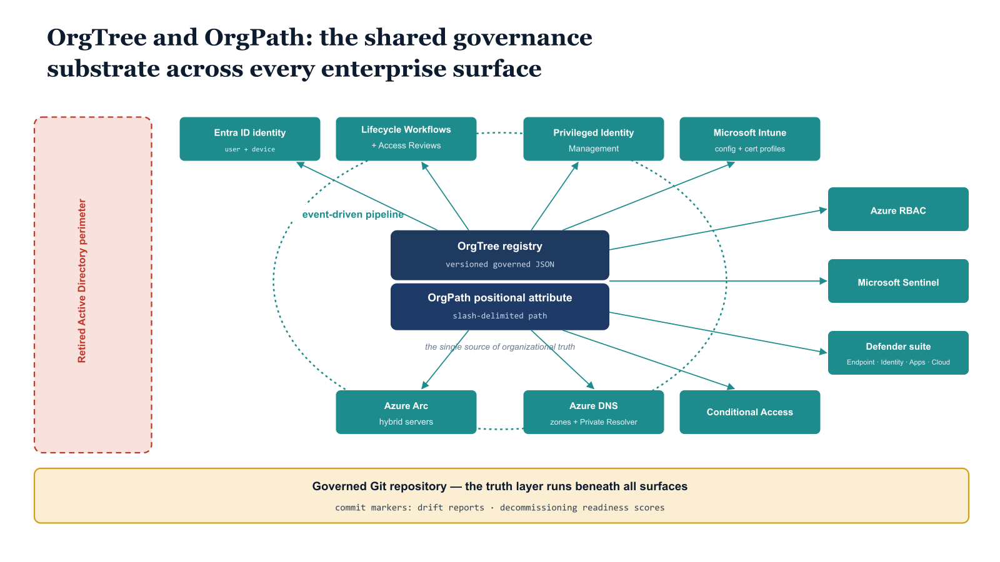

# Chapter 7 — SERIES SYNTHESIS (FINAL)

::: {.callout-note}
## In this chapter
This chapter closes the series. It introduces no new implementation components. Instead it describes — with precision and completeness — what the organization has once the full OrgPath governance model is operational: the problem it solves, how each part of the series contributed to solving it, and why the solution is structurally sound.
:::

## What Has Been Built — The Governance Substrate in Full

> This chapter closes an eight-part series. It does not introduce new implementation components. It describes, with precision and completeness, what the organization has when the full OrgPath governance model is operational — what problem it solves, how each part of the series contributed to solving it, and why the solution is structurally sound.

{#fig-book-12-cpt-07-diagram-01 fig-alt="Engineering blueprint diagram on a white background showing the complete OrgPath governance model as a hub-and-spoke synthesis. At the center, a federal navy (#1F3A5F) box stacks two layers — a top box OrgTree registry versioned governed JSON and a lower box OrgPath positional attribute slash-delimited path — labeled the single source of organizational truth. A teal (#1A9E8F) propagation ring labeled event-driven pipeline encircles the center, with monospace arrows fanning outward to ten governed surface boxes arranged around the perimeter — Entra ID user and device identity, Lifecycle Workflows and Access Reviews, Privileged Identity Management, Microsoft Intune configuration and certificate profiles, Azure RBAC, Microsoft Sentinel, the Defender suite Endpoint Identity Cloud Apps and Cloud, Azure Arc hybrid servers, Azure DNS zones and Private Resolver, and Conditional Access. Each surface box carries a monospace OrgPath path token to show the shared vocabulary. Below the hub, an amber (#D4A017) horizontal band labeled governed Git repository — the truth layer runs beneath all surfaces, with commit markers for drift reports and decommissioning readiness scores. A red (#C0392B) dashed boundary on the far left marks the retired Active Directory perimeter dependency and attack surface being replaced. Monospace labels throughout, no human figures, 16:9 landscape." width="85%"}

## The Problem That Required a Substrate

Part One of this series opened with a statement of the governance gap in the Microsoft cloud identity stack. It is worth returning to that gap now, precisely, because the model built across these eight parts is only legible against the problem it was built to solve.

Active Directory was a unified governance substrate. It was not perfect. Its perimeter dependency — the requirement that every governed device be domain-joined, every governed user be connected to a domain controller — made it architecturally incompatible with a cloud-first world where users work from anywhere and devices are enrolled through vendor management rather than domain join.

Its attack surface — the Kerberos protocol, the SYSVOL share, the LDAP interface, the privileged service accounts — was the most reliably exploited surface in enterprise security for two decades and remains so today. Its opacity to programmatic audit — the absence of a native versioned change history for the directory, the difficulty of asserting the complete governance state of the environment at a specific point in time — made compliance demonstration a labor-intensive exercise in log reconstruction.

But Active Directory provided something that the Microsoft cloud stack does not natively provide: a single, coherent model of organizational structure that drove identity governance, policy application, resource delegation, DNS, and PKI from one authoritative source. The Organizational Unit was not merely an administrative container — it was the governance coordinate. OU placement determined which Group Policies applied. OU placement determined the scope of auto-enrollment. OU placement determined the RBAC delegation boundaries. OU placement determined the auto-enrollment policy for certificates. Every governance action in Active Directory was, at its foundation, a statement about where an object sat in the organizational hierarchy, and the hierarchy was encoded in the directory itself.

When organizations migrate from AD to the Microsoft cloud stack, they leave this unified model behind. Entra ID does not have Organizational Units. It has groups — flat, manually maintained, or dynamically membered based on attribute predicates. Azure RBAC has management groups and subscriptions, but those are billing and policy containers, not representations of organizational structure. Intune has assignment groups, but those are Entra ID groups and carry the same limitation. Microsoft Sentinel has RBAC workspaces, but workspace boundaries are not organizational boundaries. The cloud tools are individually capable — more capable, in many respects, than their on-premises predecessors. But collectively they lack the one thing that made AD governable: a single, authoritative representation of organizational structure that every tool reads from the same source.

Without that representation, governance degrades. Policy targeting is based on manually maintained groups that drift from the actual organizational structure. Access reviews are scoped by groups whose membership does not accurately reflect the scope of the organization's governance boundaries. Certificate profiles are assigned to flat groups that do not express which organizational segment a device belongs to. Security operations analysts have visibility scoped to resource groups rather than to the organizational segments they are responsible for. The tools are present. The governance is not.

## What OrgTree and OrgPath Restore

OrgTree is the governed registry of the organization's structure. It is the authoritative record of the organization's divisions, departments, units, and operational segments — maintained as a versioned JSON artifact in a governed Git repository, reviewed and approved through a formal change management process, never modified without a commit that produces an audit trail, and validated against a schema that enforces the structural invariants the governance model depends on. OrgTree is not a mirror of Active Directory's OU tree. It is the organizational structure defined on its own terms, in a format that every cloud tool can read, in a repository that every governance pipeline can query, under change control that every auditor can inspect.

OrgPath is the positional attribute — the structured, validated, machine-readable coordinate that every user, every device, and every server carries to express its location in the OrgTree. It is a slash-delimited path string stored as an Entra ID directory extension attribute on user and device objects and as an Azure resource tag on Arc-enrolled servers and Azure resources. Its format is consistent across every surface it appears on: /Division/Department/Unit. Every tool that reads it — whether it is an Intune assignment filter, a Sentinel alert rule, an Azure Policy initiative, or a Conditional Access policy — reads the same vocabulary from the same authoritative source.

Together, OrgTree and OrgPath restore what Active Directory provided: a single, coherent model of organizational structure that drives governance on every surface. They do not replace the cloud tools. They give the cloud tools the organizational context they need to govern correctly. The model does not impose an on-premises architecture on the cloud. It builds a cloud-native artifact — a versioned registry — that provides the same structural information the OU tree provided, in a form that the cloud stack can consume, with governance properties that the OU tree never had: version history, change attribution, schema validation, and automated propagation.

## The Complete Surface Map

The following table summarizes every governance surface the complete model covers, the part of the series in which each surface was implemented, and what the model achieves on each surface.

| **Surface** | **Part** | **What OrgPath Governance Achieves** |
|----|----|----|
| **Entra ID — User Identity** | Parts Three & Four | Every user carries an OrgPath value derived from the OrgTree and validated against the registry. The OrgPath attribute is the input to every downstream governance action on the user object. |
| **Entra ID — Device Identity** | Parts Three & Four | Every managed device carries an OrgPath value stamped at Autopilot enrollment and maintained by the governance pipeline. Device OrgPath drives branch group membership, configuration profile targeting, and compliance policy scope. |
| **Entra ID Governance — Lifecycle Workflows** | Part Five | Joiner, Mover, and Leaver workflows are triggered by OrgPath changes on user objects. Mover workflows revoke eligibilities for the former organizational position and request eligibilities for the new position, ensuring that access rights track organizational movement automatically. |
| **Entra ID Governance — Access Reviews** | Part Five | Access Reviews for privileged roles and sensitive resources are scoped to OrgPath-derived user groups, ensuring that review scope reflects actual organizational boundaries rather than arbitrary group membership. |
| **Privileged Identity Management** | Part Five | PIM eligibility assignments are synchronized with organizational position. Every user's eligible roles are derived from the CriticalRoles metadata on their OrgTree node. Role eligibility is removed when a user moves to a different node and re-derived from the new node's metadata. |
| **Microsoft Intune — Configuration** | Part Six | Configuration profiles, compliance policies, endpoint security settings, and application deployments are assigned to OrgPath branch groups. Every device's applicable policy set is determined by its OrgPath value, not by manual group assignment. |
| **Microsoft Intune — Certificate Profiles** | Part Eight (this document) | SCEP, PKCS, and Trusted Root profiles are assigned to OrgPath branch groups based on CertificateProfiles metadata in the OrgTree registry. Certificate coverage reflects organizational position. Drift detection identifies devices whose enrolled certificate no longer matches their current OrgPath. |
| **Azure RBAC** | Part Six | Role assignments for infrastructure resources are scoped by OrgPath resource tags through Azure Policy initiatives and custom role definitions. RBAC delegation boundaries align with OrgTree node boundaries, not with arbitrary subscription or resource group structures. |
| **Microsoft Sentinel** | Part Five | Alert rules are enriched with the OrgPath of affected identities and devices. Alerts involving T0 or T1 segment objects are automatically escalated. Analytic rules use OrgPath values in KQL queries to scope anomaly detection to the behavioral norms of each organizational segment. |
| **Defender for Endpoint** | Part Seven | Device groups in MDE align with OrgPath, giving SOC analysts visibility scoped to their organizational responsibility boundaries. RBAC scoping in the Defender portal reflects OrgTree node boundaries. Alert enrichment surfaces the OrgPath of every affected device in MDE incidents. |
| **Defender for Identity** | Part Seven | Sensitive entity tagging is driven by OrgPath Tier values. Users and devices in T0 and T1 segments are tagged as sensitive entities in MDI, triggering escalated alert handling and reduced detection thresholds for lateral movement and privilege escalation indicators. |
| **Defender for Cloud Apps** | Part Seven | Session control policies and anomaly detection thresholds are scoped to OrgPath-derived user groups, so that behavioral baselines reflect the distinct access patterns of each organizational segment rather than a single enterprise-wide baseline. |
| **Defender for Cloud / Defender for Servers** | Part Seven | Security plan assignments — including the Defender for Servers plan tier — are governed by OrgPath resource tags on Azure and Arc-enrolled resources. Infrastructure in higher OrgTier segments receives commensurately stronger protection plans automatically. |
| **Azure Arc — Hybrid Servers** | Part Six | Every Arc-enrolled server carries OrgPath as an Azure resource tag in the same vocabulary as user and device objects. Azure Policy initiatives enforce OrgPath tag requirements. The dependency map records every relationship between Arc servers and their dependent workloads, enabling safe, sequenced decommissioning. |
| **Azure DNS Private Zones** | Part Eight (this document) | Private DNS Zones are tagged with OrgPath metadata, aligning name resolution infrastructure with organizational structure. Azure Policy denies creation of untagged zones. Drift detection identifies zones with missing or orphaned tags. The DNS zone inventory feeds the Decommissioning Readiness Score. |
| **Azure DNS Private Resolver** | Part Eight (this document) | The Forwarding Ruleset's rule count is the migration progress metric for DNS zone migration. Decreasing rule count indicates zones being migrated from on-premises to Azure. Rule removal for a zone is the DNS-side decommissioning readiness indicator for that zone. |
| **Conditional Access** | Parts Three, Four & Six | Conditional Access policies are scoped to OrgPath-derived named locations and user groups. Policies that require compliant devices or specific authentication strengths are targeted to OrgPath segments that require them, rather than applied universally or maintained as manually scoped policy sets. |

## The Governance Repository as Audit Record

The version-controlled governance repository is not an implementation convenience. It is the organization's governance record — the authoritative, auditable, time-stamped history of every governance decision and every governance state the organization has been in since the model was deployed.

Every change to the OrgTree registry is a commit. Every commit carries an author identity, a timestamp, and a commit message that describes the change. Every commit was preceded by a pull request that required approval from at least one designated reviewer. The diff between any two commits shows exactly what changed in the organizational structure between those two points in time. The complete commit history of the OrgTree registry is the complete history of the organization's structural changes under governance — every department that was added, every unit that was merged, every node whose Tier classification was elevated, every node that was archived.

Every drift detection report, every decommissioning readiness score, every IPAM export, every SCEP compliance report, every certificate profile assignment log — all committed to the repository as versioned artifacts. An auditor who asks, "What was the governance state of the Finance department's devices on the fifteenth of last month?" can answer that question by checking out the repository at that date's commit hash and reading the drift report, the device group membership log, and the certificate profile assignment state from the corresponding artifacts. The answer is not reconstructed from log fragments and manual interviews. It is read directly from the governance record.

This auditability is a structural property of the model, not a feature added to satisfy a compliance requirement. It is a consequence of the architectural decision — made in Part Three and executed consistently across every subsequent part — to store all governance state as versioned artifacts in a governed repository rather than as configuration in individual tools.

> The tools are the enforcement layer. The repository is the truth layer. Auditors examine the truth layer. Operators work in both layers simultaneously, and the pipeline keeps them synchronized.

## Automation and Coherence: The Two Properties That Make It Sustainable

The complete OrgPath governance model has two properties that distinguish it from governance models that are technically sound but operationally unsustainable: automation and coherence. Both are structural properties, not operational disciplines, and both are maintained by design rather than by effort.

Automation means that every operation the governance substrate performs is triggered by events, not by manual administrator action. OrgPath derivation is triggered by the OrgTree change pipeline or by the Lifecycle Workflow joiner trigger. Dynamic group maintenance is triggered by changes to the OrgPath extension attribute. PIM eligibility synchronization is triggered by the OrgPath change event in the Lifecycle Workflow. Certificate profile assignment is triggered by OrgTree registry changes and runs as a scheduled weekly job. Drift detection runs on a schedule and commits its findings without human intervention.

Decommissioning readiness scores are calculated on each weekly pipeline run. The governance posture of the organization tracks its actual structure not because a team of administrators runs reports and applies changes on a schedule, but because the pipeline runs continuously and the governance state follows the organizational state automatically.

When a user moves from one department to another, the governance model updates every surface they touch — their PIM eligibilities, their Conditional Access group memberships, their Intune assignment group, their SOC visibility scope — without requiring a single manual action from a governance team member. The accuracy of the governance model does not degrade over time as organizational changes accumulate without corresponding governance updates, because there are no corresponding governance updates to defer. The pipeline applies them.

Coherence means that the same vocabulary — the same OrgTree registry, the same OrgPath format, the same four-tag schema, the same branch group naming convention — appears on every surface the model covers. A user's OrgPath attribute and a server's OrgPath resource tag use the same format, reference the same registry, and are validated against the same schema. A DNS zone's OrgPath tag and a PIM eligibility assignment's scope both express organizational position in the same vocabulary.

Any tool that can read any one of these surfaces can reason about the organization's structure using the same language as any other tool. A KQL query that reads the OrgPath tag from a DNS zone can be compared directly to a KQL query that reads the OrgPath attribute from a user object, because the format is identical and the authority is the same.

This coherence eliminates the translation problem that plagues multi-tool governance environments: the problem of determining which group in Tool A corresponds to which resource group in Tool B corresponds to which policy in Tool C. In the OrgPath model, there is no translation.

> Every surface speaks the same language, because they all read from the same dictionary.

## Closing Statement

When the full OrgPath governance model is operational, the organization has something specific and valuable that the Microsoft cloud stack does not provide natively and that no individual cloud tool provides on its own. It has a governance substrate that spans every major surface of the enterprise technology estate — from the identity of a user authenticating to a cloud application, to the certificate on a server managed through Azure Arc, to the DNS zone that resolves the application's endpoint, to the PIM eligibility that governs who may administer the server, to the Sentinel alert rule that detects lateral movement toward it.

It has a single authoritative registry of organizational structure that drives policy targeting on every one of those surfaces automatically, so that the governance model's accuracy is bounded by the accuracy of the registry, not by the timeliness of manual updates across a dozen independent tools.

It has a drift detection capability that monitors every surface continuously, identifies every category of misalignment between the registry and the live environment, and commits its findings to an auditable version-controlled record — so that the organization's governance posture is not an assertion that administrators make but a measurement that the pipeline produces.

It has a decommissioning readiness framework that tells the infrastructure team, in quantitative and specific terms, when it is safe to retire each element of the on-premises infrastructure it is leaving behind — and what specifically must be completed before safety is achieved — so that decommissioning decisions are made on the basis of a calculated score, not on the basis of incomplete memory and optimistic assumptions.

And it has all of this without depending on any native Microsoft capability that does not exist. The OrgPath governance model does not wait for the platform to provide a structural governance layer. It builds that layer from the platform's existing primitives: directory extension attributes, resource tags, dynamic groups, Azure Policy, versioned Git repositories, the Microsoft Graph API, KQL queries, and PowerShell automation. The substrate is assembled from components the platform provides. The structural intelligence those components express is provided by OrgTree and OrgPath.

The eight parts of this series trace the construction of that substrate from proposal to completion. Part One named the gap. Part Two specified the requirements. Parts Three and Four built the foundation — the OrgTree registry and the OrgPath attribute — and proved that the foundation was sound by implementing it against a real directory. Parts Five through Eight extended the foundation across every surface the enterprise governance model must cover: PIM, Lifecycle Workflows, Sentinel, Azure RBAC, Intune, the Defender suite, Azure Arc, DNS, and PKI. Each part added a surface. Each surface added a dimension of governance that the model could not have expressed without it. The result, at Part Eight, is a complete model.

It is more auditable than any OU tree ever was, because its state is versioned and its changes are attributed. It is more automatable than any GPO-driven governance model ever was, because its enforcement is event-driven and its scope is expressed in machine-readable attributes rather than in directory-container proximity. It is more precisely aligned with the organization's actual structure than any static group library ever was, because its source of truth is a governed registry that tracks organizational changes and propagates them automatically to every surface the model covers.

The organization that operates this model has exchanged the structural governance of Active Directory — and the perimeter dependency, attack surface, and audit opacity that came with it — for a cloud-native governance posture that provides the same structural coverage, with none of those liabilities, and with auditability and automation properties that the on-premises model could never have achieved. That is what this series set out to build. It is built.

## Appendix: Script and Query Reference

The following table provides a consolidated reference to all scripts, KQL queries, and policy definitions introduced in this document, with the chapter where each is defined and the pipeline stage in which it executes.

| **Artifact** | **Type** | **Chapter** | **Pipeline Stage** | **Trigger** |
|----|----|----|----|----|
| Export-IpamInventory.ps1 | PowerShell | 2 | Assessment | Weekly / on-demand |
| Sync-OrgPathDnsZones.ps1 | PowerShell | 2 | Propagation | OrgTree commit / weekly |
| OrgPath DNS Tag Policy (deny) | Azure Policy JSON | 2 | Enforcement | Resource Create/Update |
| Sync-OrgPathCertProfiles.ps1 | PowerShell | 3 | Propagation | OrgTree commit / weekly |
| Test-ScepStrongMapping.ps1 | PowerShell | 3 | Compliance Verification | Weekly / before profile assignment |
| DNS Zone Tag Drift (KQL) | KQL (ARG) | 4 | Drift Detection | Scheduled weekly alert |
| Certificate-OrgPath Drift (KQL) | KQL (AuditLogs) | 4 | Drift Detection | Scheduled weekly alert |
| Get-DecommissionReadinessScore.ps1 | PowerShell | 5 | Readiness Assessment | Weekly pipeline / on-demand |

## Appendix: Series Index

| **Part** | **Title** | **Primary Contribution** |
|----|----|----|
| One | The Governance Gap | Named the structural gap in the Microsoft cloud identity stack left by Active Directory decommissioning |
| Two | Requirements for a Governance Substrate | Specified the functional and structural requirements that a cloud-native governance substrate must satisfy |
| Three | The OrgTree and OrgPath Proposal | Defined the OrgTree registry structure, the OrgPath attribute format, and the governance model design |
| Four | Building the Substrate | Implemented OrgTree registry schema, OrgPath extension attribute provisioning, dynamic group library, and initial drift detection framework |
| Five | PIM, Lifecycle Workflows, and Sentinel Integration | Extended OrgPath to privileged access management, identity lifecycle automation, and security operations alert enrichment |
| Six | Azure RBAC, Intune, and Azure Arc | Extended OrgPath to RBAC delegation, device governance, and hybrid server enrollment with dependency mapping |
| Seven | The Defender Suite | Extended OrgPath to Defender for Endpoint, Identity, Cloud Apps, and Cloud — completing the security operations surface coverage |
| **Eight** | **DNS Governance, Cloud PKI, and the Complete Governance Model** | **Extended OrgPath to DNS and PKI infrastructure; delivered the Decommissioning Readiness Score framework; synthesized the complete model across all eight surfaces** |

## — End of Part Eight — End of Series —
