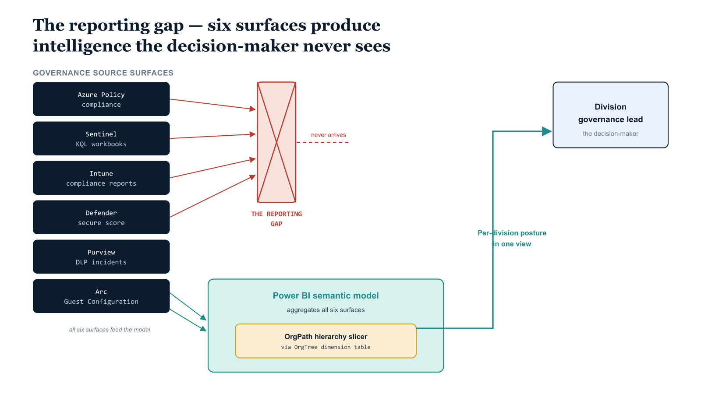

# Chapter 1 — The Reporting Gap: Governance Intelligence Without an Audience

::: {.callout-note}
## In this chapter
Twelve parts of this series built an OrgPath-aware governance substrate that now produces continuous, multi-dimensional governance intelligence — but that intelligence is scattered across six or more engineering surfaces in formats only analysts can read. This chapter names the resulting reporting gap, explains why Power BI is the correct aggregation layer for an organization already in the Microsoft cloud, and shows how OrgPath becomes the universal slicer that lets a division head read their entire governance posture in a single view. It closes by mapping the remaining chapters of this book.
:::

## What the Substrate Already Produces

Twelve parts of this series have been devoted to construction. The labor has been architectural and methodical: establishing a registry that knows the organizational hierarchy, creating an attribute that carries organizational position on every managed object, and propagating that attribute across every surface that the Microsoft cloud estate exposes to governance control. The result is a substrate. It is thorough, and it is real.

That substrate now stamps OrgPath on every governed surface and derives policy from it on each one:

| Surface | What OrgPath drives |
| :--- | :--- |
| **Entra ID** | Every identity carries an OrgPath extension attribute encoding its position in the hierarchy |
| **Intune** | Every managed device is governed by a compliance policy derived from that position |
| **PIM** | Every privileged role assignment is bounded by eligibility rules that respect the organizational segment to which the assignee belongs |
| **Azure Arc** | Every Arc-enrolled server is tagged with OrgPath and evaluated against a Guest Configuration baseline keyed to that tag |
| **Sentinel** | Every detection rule that fires enriches its alert with OrgPath context, and every alert is correlated to the organizational segment from which it originated |
| **Purview** | DLP policies scope to OrgPath labels |
| **Cloud PKI** | Certificate profiles are assigned by OrgPath group membership |
| **Drift detection** | Runs continuously, comparing current state to OrgPath-derived policy intent, committing every discovered variance to an auditable repository |

The governance pipeline is running. The governance data is flowing.

{#fig-book-13-cpt-01-diagram-01 fig-alt="Engineering blueprint diagram on a white background depicting the governance reporting gap and its resolution. On the left, a federal navy column of six stacked source boxes with monospace labels — Azure Policy compliance, Sentinel KQL workbooks, Intune compliance reports, Defender secure score, Purview DLP incidents, Arc Guest Configuration — each emitting an arrow rightward. In the center, a red colored hashmark band labeled THE REPORTING GAP in monospace blocks those arrows from reaching a navy figure on the far right labeled Division governance lead. Below the gap band, a teal aggregation layer box labeled Power BI semantic model gathers the same six arrows and routes them through an amber slicer element labeled OrgPath hierarchy slicer using the OrgTree dimension table. From the slicer a single clean teal arrow reaches the division governance lead figure region, labeled Per division posture in one view. Monospace labels throughout, navy 1F3A5F for sources, teal 1A9E8F for the aggregation layer, amber D4A017 for the slicer, red C0392B only on the gap band, no human figures, 16:9 landscape." width="85%"}

## The Reporting Gap

The problem is that none of this data has a meaningful audience at the level where governance decisions are made. Each source surface is an engineering tool, optimized for the analyst or operator who lives inside it — not for the leader who must steer posture:

- **Azure Policy compliance blade.** Shows policy compliance states, but it is an engineering surface. It requires navigation, it requires knowledge of which policy initiative corresponds to which governance concern, and it provides no native mechanism for slicing compliance results by the organizational hierarchy that was so carefully constructed.

- **Sentinel workspace.** Exposes KQL query surfaces and workbooks, but workbooks are analyst tools — they require the user to understand the data model, to write or modify KQL, and to interpret raw query results.

- **Intune compliance reports.** Provide device-level compliance data, but they do not aggregate by organizational division, and they do not correlate device compliance with the other dimensions of governance posture that the organization has instrumented.

- **Defender for Cloud secure score dashboard.** A capable security assessment tool, but it does not understand organizational divisions as the governance framework defines them, and it cannot be sliced by OrgPath hierarchy.

This is the reporting gap. The organization has invested significantly in building a coherent, OrgPath-aware governance substrate. The substrate produces continuous, authoritative, multi-dimensional governance intelligence. But that intelligence is distributed across six or more engineering surfaces, expressed in formats designed for analysts and engineers, and entirely inaccessible to the people whose role is to steer organizational governance posture.

> The intelligence exists; the audience cannot reach it. The divisional governance lead, the business-unit CISO, the governance board that must answer to audit, and the department head who needs to understand in forty seconds whether their division is within tolerance — none of them can read it where it lives.

## Why Power BI Is the Correct Aggregation Layer

Power BI is the correct aggregation layer for this problem. It is not the only possible aggregation layer, but it is the most appropriate one for an organization whose governance substrate already lives in the Microsoft cloud ecosystem. Four of its capabilities map directly onto the four failures of the source surfaces:

- **Semantic model.** What the product previously called a dataset and now labels more precisely as a semantic model abstracts the complexity of multi-source data retrieval behind a single, queryable model that Power BI report pages consume uniformly.

- **DAX measure library.** Data Analysis Expressions translate raw fact data — counts of non-compliant devices, counts of drift events, counts of PIM activations — into the governance KPIs that a division head or a governance board member can read without understanding the underlying data sources.

- **Visual canvas.** Produces the per-division governance posture dashboard and the executive Red-Amber-Green summary that governance leadership needs to understand organizational risk posture quickly and accurately.

- **REST API-driven refresh pipeline.** Keeps the semantic model current, ensuring that the dashboard reflects the most recent export from the governance data pipeline rather than a snapshot from a previous cycle.

## OrgPath Is the Slicer That Makes It Work

OrgPath is the slicer that makes all of this work. Every measure in the semantic model is designed to respond to OrgPath filter context. Every visual on every report page filters by OrgPath division, branch, or node, using the OrgTree dimension table as the shared organizational spine that links every fact table to a consistent, authoritative representation of the hierarchy.

> A Finance division head opens the governance portal embedded in the organization's SharePoint intranet, selects the Finance node in the OrgPath hierarchy slicer, and sees the Finance division's current compliance percentage, its drift event count for the trailing seven days, its PIM activation rate, its open Defender assessment findings, its DLP incident count, its Guest Configuration compliance rate, its certificate risk profile, and its guest account count — all scoped to the Finance organizational segment, all current within the most recent refresh cycle, all in a single view that requires no engineering knowledge to interpret.

## How This Book Is Organized

This document covers the complete implementation of that reporting layer. The remaining chapters proceed from data ingestion through to stakeholder distribution:

| Chapter | Scope |
| :--- | :--- |
| **Chapter Two** | The data source architecture and the export pipeline that moves governance data from the six source surfaces into staging files the Power BI semantic model can consume |
| **Chapter Three** | The Power BI semantic model structure, including the Power Query M definitions for each data table and the relationship model that makes OrgPath the universal slicer |
| **Chapter Four** | The full DAX measure library for governance KPIs, including the Red-Amber-Green status measures that drive the executive scorecard |
| **Chapter Five** | The report page designs for the per-division posture dashboard, the executive summary, and the trend analysis page |
| **Chapter Six** | The automated refresh pipeline using the Power BI REST API |
| **Chapter Seven** | Stakeholder distribution through Microsoft Teams and SharePoint embedding |
| **Chapter Eight** | Closes the series |
