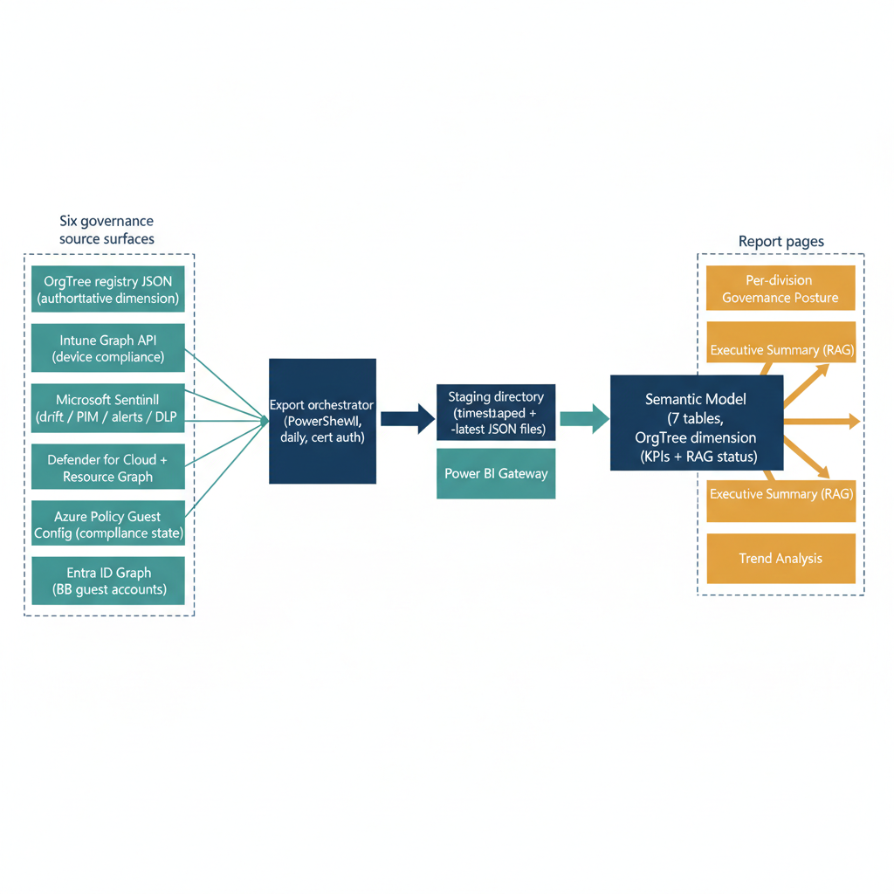

# Chapter 2 — Data Source Architecture and Export Pipeline

{#fig-13-orgpath-and-power-bi-reporting-diagram-01 fig-alt="Far-left labeled cluster \"Six governance source surfaces\" stacks six boxes: OrgTree registry JSON (authoritative dimension); Intune Graph API (device compliance); Microsoft Sentinel (drift / PIM / alerts / DLP); Defender for Cloud + Resource Graph; Azure Policy Guest Config (compliance state); Entra ID Graph (B2B guest accounts). All six sources converge into a single middle box \"Export orchestrator (PowerShell, daily, cert auth)\". From there a linear chain progresses rightward: Staging directory (timestamped + -latest JSON files) → Power BI Gateway → Semantic Model (7 tables, OrgTree dimension as spine) → DAX measure library (KPIs + RAG status). The DAX library fans into a right-side labeled cluster \"Report pages\" with three boxes: Per-division Governance Posture, Executive Summary (RAG), Trend Analysis. Engineering blueprint style, neutral slate, federal navy (#1F3A5F) for orchestrator and model, teal (#1A9E8F) for the six sources, amber (#D4A017) for the three report pages, monospace file/API names, 16:9 landscape." width="85%"}

The semantic model consumes data from six distinct sources, each representing a governance surface that the preceding parts of this series instrumented with OrgPath awareness. These sources do not share a common query interface, a common data format, or a common authentication model, which is precisely why an export pipeline layer exists between them and the Power BI semantic model. The pipeline normalizes heterogeneous source data into a consistent set of JSON files that the semantic model's Power Query M definitions can load and shape uniformly.

The six sources are, in the order they appear in the export orchestrator: the OrgTree registry itself, which provides the authoritative organizational dimension table that all other tables join against; the Microsoft Intune managed device compliance API, accessed via the Microsoft Graph deviceManagement/managedDevices endpoint; Microsoft Sentinel, queried via the Azure Monitor Log Analytics query API using KQL queries that target the custom drift log table, the Entra audit log, the Security Alert table, and the Purview DLP activity table; Microsoft Defender for Cloud, accessed via Azure Resource Graph for the resource inventory and the Azure Security Assessment API for per-resource assessment results; Azure Policy Guest Configuration, accessed via Azure Resource Graph against the GuestConfigurationResources resource type; and the Entra ID B2B guest account list, retrieved via the Microsoft Graph Users API filtered to guest-type accounts. Each source requires specific Microsoft Graph or Azure RBAC permissions, all of which are granted to a single app registration that the export orchestrator authenticates as using a certificate-based credential — client secrets are not acceptable for a production governance pipeline.

The export pipeline architecture is deliberately simple. Simplicity in a governance pipeline is a governance property, not a design compromise: a pipeline that fails silently, that has complex retry dependencies, or that requires manual intervention when an upstream API is temporarily unavailable degrades the reliability of the governance dashboard that depends on it. The pipeline is a single PowerShell orchestrator script that runs on a schedule — daily at 06:00 UTC by default, though the schedule is configurable — and writes each data source's output to a JSON file in a local or UNC-accessible staging directory. The Power BI Gateway, installed on a server that has access to that staging directory, reads the files at the next semantic model refresh. In environments with a Microsoft Fabric capacity or Power BI Premium, the pipeline can alternatively write to a Lakehouse delta table or a Dataflow Gen2 output, but the staged file approach via a gateway is the correct and broadly applicable pattern for environments operating at Power BI Pro license tier.

Each export file is named with the surface identifier and a UTC datestamp, so that historical exports are retained in the staging directory for audit purposes and a separate archival process can move older files to long-term storage. The semantic model's Power Query M definitions reference the latest version of each file using a symlink or a file naming convention that the pipeline updates after each successful export run. The design principle is that the Power BI Gateway always reads a file that was successfully produced by a completed pipeline run — partial or failed exports never replace the current latest file.

::: {.callout-note title="Environment Parameter Convention"}
All code blocks in this document mark environment-specific values with the comment # ENV-PARAM. Every value carrying this marker must be substituted with the correct value for your organization's environment before the script is placed in production. No ENV-PARAM value should be committed to a source repository without substitution. Store sensitive values — client secrets, certificate thumbprints — in Azure Key Vault and retrieve them at runtime using the Az.KeyVault module.
:::

The following script constitutes the complete export orchestrator. It is designed to be placed under source control alongside the OrgPath propagation pipeline scripts established in prior parts of this series and invoked by the same scheduled task infrastructure — a Windows Task Scheduler task or an Azure Automation runbook, per the deployment model in your environment.

```powershell
#Requires -Modules Microsoft.Graph.Authentication, Microsoft.Graph.DeviceManagement, Microsoft.Graph.Users
#Requires -Modules Az.Accounts, Az.OperationalInsights, Az.Security, Az.ResourceGraph
<#
.SYNOPSIS
    Exports governance data from all OrgPath surfaces for Power BI semantic model consumption.
.DESCRIPTION
    Runs on a schedule (e.g., daily at 06:00 UTC) and writes JSON exports to a staging
    directory read by the Power BI Gateway data source configuration.
    Each export file is named with the surface and a UTC datestamp for versioning.
    On successful completion of each export, the pipeline updates a "-latest" symlink
    so that Power BI Gateway always reads a fully completed export.
.PARAMETER StagingPath
    Local or UNC path where export files are written for Power BI Gateway pickup.
.PARAMETER TenantId
    Entra ID tenant ID.
.PARAMETER ClientId
    App registration client ID with appropriate permissions across all surfaces.
.PARAMETER CertificateThumbprint
    Certificate thumbprint for app-only authentication (recommended over client secret).
    The certificate must be present in the LocalMachine\My store on the export host.
.PARAMETER SentinelWorkspaceId
    Log Analytics workspace ID for the Microsoft Sentinel workspace.
.PARAMETER SentinelResourceGroup
    Resource group of the Sentinel workspace.
.PARAMETER SubscriptionId
    Azure subscription ID containing Sentinel, Defender for Cloud, etc.
.PARAMETER OrgTreeRegistryPath
    Path to the authoritative OrgTree JSON registry file. This is the same registry
    file that the OrgPath propagation pipeline reads. Do not use a copy — reference
    the single authoritative file so the Power BI dimension table always reflects
    the current registry state.
.NOTES
    ENV-PARAM markers indicate environment-specific values that must be substituted.
    Required module permissions for the app registration:
      Microsoft Graph delegated/app permissions:
        DeviceManagementManagedDevices.Read.All
        SecurityEvents.Read.All
        AuditLog.Read.All
        Directory.Read.All
      Azure RBAC role assignments (on the subscription or workspace):
        Log Analytics Reader (on the Sentinel workspace)
        Security Reader (on the subscription)
        Reader (on the subscription, for Resource Graph queries)
    The service principal must not have write permissions on any governed surface.
    This is a read-only export process.
#>
param(
    [string]$StagingPath           = "C:\GovernanceExports\PowerBI",        # ENV-PARAM
    [string]$TenantId              = "YOUR-TENANT-ID",                       # ENV-PARAM
    [string]$ClientId              = "YOUR-APP-CLIENT-ID",                   # ENV-PARAM
    [string]$CertificateThumbprint = "YOUR-CERT-THUMBPRINT",                 # ENV-PARAM
    [string]$SentinelWorkspaceId   = "YOUR-SENTINEL-WORKSPACE-ID",           # ENV-PARAM
    [string]$SentinelResourceGroup = "rg-sentinel",                          # ENV-PARAM
    [string]$SubscriptionId        = "YOUR-SUBSCRIPTION-ID",                 # ENV-PARAM
    [string]$OrgTreeRegistryPath   = "C:\governance\orgtree\registry.json"   # ENV-PARAM
)

Set-StrictMode -Version Latest
$ErrorActionPreference = "Stop"

New-Item -ItemType Directory -Path $StagingPath -Force | Out-Null
$ts = Get-Date -Format "yyyyMMdd-HHmmss" -AsUTC

function Set-LatestLink {
    param([string]$TargetFile, [string]$LinkName)
    $link = Join-Path $StagingPath $LinkName
    if (Test-Path $link) { Remove-Item $link -Force }
    Copy-Item $TargetFile $link -Force
}

Write-Host "=== OrgPath Governance Export Pipeline — $ts ==="
Write-Host "Staging path: $StagingPath"

# ---- Authenticate: Microsoft Graph (app-only, certificate) ----
Write-Host "Authenticating to Microsoft Graph..."
Connect-MgGraph `
    -TenantId            $TenantId `
    -ClientId            $ClientId `
    -CertificateThumbprint $CertificateThumbprint `
    -NoWelcome

# ---- Authenticate: Azure (service principal, certificate) ----
Write-Host "Authenticating to Azure..."
Connect-AzAccount `
    -TenantId            $TenantId `
    -ApplicationId       $ClientId `
    -CertificateThumbprint $CertificateThumbprint `
    -ServicePrincipal

Set-AzContext -Subscription $SubscriptionId | Out-Null

# ============================================================
# Export 1: OrgTree Registry (organizational dimension table)
# ============================================================
Write-Host "[1/6] Exporting OrgTree registry..."
$orgTreeOut = Join-Path $StagingPath "orgtree-registry-$ts.json"
Copy-Item $OrgTreeRegistryPath $orgTreeOut -Force
Set-LatestLink $orgTreeOut "orgtree-registry-latest.json"
Write-Host "  Done. Registry copied from authoritative source."

# ============================================================
# Export 2: Intune Device Compliance by OrgPath
# ============================================================
Write-Host "[2/6] Exporting Intune device compliance..."

# ENV-PARAM: Replace extension_YOURAPPID_OrgPath with your actual
# extension attribute name as registered in your Entra ID tenant.
# Format: extension_{AppId without hyphens}_OrgPath
$orgPathAttr = "extension_YOURAPPID_OrgPath"   # ENV-PARAM

$devices = Get-MgDeviceManagementManagedDevice -All `
    -Property "id,deviceName,complianceState,lastSyncDateTime,userPrincipalName,managedDeviceOwnerType" |
    Where-Object { $_.ManagedDeviceOwnerType -eq "company" }

$complianceExport = foreach ($device in $devices) {
    $orgPathValue = "/UNKNOWN"
    if ($device.UserPrincipalName) {
        try {
            $user = Get-MgUser -UserId $device.UserPrincipalName `
                -Property "id,userPrincipalName,$orgPathAttr" `
                -ErrorAction SilentlyContinue
            if ($user -and $user.AdditionalProperties.ContainsKey($orgPathAttr)) {
                $orgPathValue = $user.AdditionalProperties[$orgPathAttr]
            }
        } catch { $orgPathValue = "/UNKNOWN" }
    }
    [PSCustomObject]@{
        DeviceId        = $device.Id
        DeviceName      = $device.DeviceName
        ComplianceState = $device.ComplianceState
        LastSync        = $device.LastSyncDateTime
        UserUPN         = $device.UserPrincipalName
        OrgPath         = $orgPathValue
        IsCompliant     = if ($device.ComplianceState -eq "compliant") { 1 } else { 0 }
    }
}

$complianceOut = Join-Path $StagingPath "intune-compliance-$ts.json"
$complianceExport | ConvertTo-Json -Depth 3 | Out-File $complianceOut -Encoding utf8
Set-LatestLink $complianceOut "intune-compliance-latest.json"
Write-Host "  Exported $($complianceExport.Count) device compliance records."

# ============================================================
# Export 3: Sentinel KQL — Drift, PIM, Alerts, and DLP Summaries
# ============================================================
Write-Host "[3/6] Exporting Sentinel governance summaries..."

# Each query is designed to run against a 30-day window for trend data.
# The OrgPath_s column in OrgPathDriftLog_CL is written by the drift detection
# engine documented in Part Five of this series. The OrgPath enrichment in
# SecurityAlert and AuditLogs is applied by the Sentinel Analytics Rules
# documented in Part Six of this series.

$sentinelQueries = [ordered]@{
    "sentinel-drift"  = @"
OrgPathDriftLog_CL
| where TimeGenerated > ago(30d)
| summarize DriftCount = count()
    by OrgPath = OrgPath_s,
       Category = DriftCategory_s,
       Date = bin(TimeGenerated, 1d)
| project Date, OrgPath, Category, DriftCount
| order by Date desc
"@
    "sentinel-pim"    = @"
AuditLogs
| where TimeGenerated > ago(30d)
| where OperationName has_any ("Activate eligible assignment", "PIM activation")
| extend OrgPath = tostring(AdditionalDetails[0].value)
| where isnotempty(OrgPath) and OrgPath startswith "/"
| summarize PIMActivations = count()
    by OrgPath,
       Date = bin(TimeGenerated, 1d)
| project Date, OrgPath, PIMActivations
| order by Date desc
"@
    "sentinel-alerts" = @"
SecurityAlert
| where TimeGenerated > ago(30d)
| extend OrgPath = tostring(ExtendedProperties["OrgPath"])
| where isnotempty(OrgPath) and OrgPath startswith "/"
| summarize AlertCount      = count(),
             HighSeverity    = countif(AlertSeverity == "High"),
             MediumSeverity  = countif(AlertSeverity == "Medium")
    by OrgPath,
       Date = bin(TimeGenerated, 1d)
| project Date, OrgPath, AlertCount, HighSeverity, MediumSeverity
| order by Date desc
"@
    "sentinel-dlp"    = @"
PurviewDLPActivity
| where TimeGenerated > ago(30d)
| extend OrgPath = tostring(AdditionalFields.OrgPath)
| where isnotempty(OrgPath) and OrgPath startswith "/"
| summarize DLPIncidents = count(),
             HighSeverityDLP = countif(Severity == "High")
    by OrgPath,
       Date = bin(TimeGenerated, 1d)
| project Date, OrgPath, DLPIncidents, HighSeverityDLP
| order by Date desc
"@
}

foreach ($qName in $sentinelQueries.Keys) {
    Write-Host "  Running query: $qName"
    try {
        $result = Invoke-AzOperationalInsightsQuery `
            -WorkspaceId $SentinelWorkspaceId `
            -Query       $sentinelQueries[$qName] `
            -Timespan    (New-TimeSpan -Days 30) `
            -ErrorAction Stop

        if ($result -and $result.Results) {
            $outFile = Join-Path $StagingPath "$qName-$ts.json"
            $result.Results | ConvertTo-Json -Depth 3 | Out-File $outFile -Encoding utf8
            Set-LatestLink $outFile "$qName-latest.json"
            Write-Host "    $($result.Results.Count) rows exported."
        } else {
            Write-Warning "    $qName returned no results. Latest file not updated."
        }
    } catch {
        Write-Warning "    $qName query failed: $($_.Exception.Message). Latest file not updated."
    }
}

# ============================================================
# Export 4: Defender for Cloud — Assessment Health by OrgPath
# ============================================================
Write-Host "[4/6] Exporting Defender for Cloud assessment data..."

# Resource Graph query targets Arc-enrolled machines tagged with OrgPath.
# Arc tag population is documented in Part Eight of this series.
$arcResources = Search-AzGraph -Query @"
Resources
| where type =~ 'microsoft.hybridcompute/machines'
| extend OrgPath  = tostring(tags['OrgPath'])
| extend OrgTier  = tostring(tags['OrgTier'])
| where isnotempty(OrgPath)
| project id, name, OrgPath, OrgTier, location, resourceGroup, subscriptionId
"@ -ErrorAction Stop

Write-Host "  Retrieved $($arcResources.Count) Arc-enrolled machines."

# Retrieve all security assessments across the subscription.
# For large environments with many subscriptions, iterate $SubscriptionId array.
$allAssessments = Get-AzSecurityAssessment -ErrorAction SilentlyContinue

$defenderExport = foreach ($resource in $arcResources) {
    $matched = $allAssessments | Where-Object {
        $_.ResourceDetails.Id -and
        $_.ResourceDetails.Id.ToLower() -eq $resource.id.ToLower()
    }
    [PSCustomObject]@{
        ResourceId       = $resource.id
        ResourceName     = $resource.name
        OrgPath          = $resource.OrgPath
        OrgTier          = $resource.OrgTier
        Location         = $resource.location
        AssessmentCount  = $matched.Count
        UnhealthyCount   = ($matched | Where-Object { $_.Status.Code -eq "Unhealthy" }).Count
        HealthyCount     = ($matched | Where-Object { $_.Status.Code -eq "Healthy" }).Count
        NotApplicable    = ($matched | Where-Object { $_.Status.Code -eq "NotApplicable" }).Count
    }
}

$defenderOut = Join-Path $StagingPath "defender-posture-$ts.json"
$defenderExport | ConvertTo-Json -Depth 3 | Out-File $defenderOut -Encoding utf8
Set-LatestLink $defenderOut "defender-posture-latest.json"
Write-Host "  Exported $($defenderExport.Count) Arc resource assessment records."

# ============================================================
# Export 5: Azure Policy Guest Configuration Compliance by OrgPath
# ============================================================
Write-Host "[5/6] Exporting Guest Configuration compliance..."

# GuestConfigurationResources in Resource Graph exposes the compliance
# state of each Guest Configuration assignment on each Arc machine.
# The OrgPath is retrieved from the parent machine's tags.
$gcData = Search-AzGraph -Query @"
GuestConfigurationResources
| extend machineId = tostring(split(id, '/providers/Microsoft.GuestConfiguration/')[0])
| join kind=leftouter (
    Resources
    | where type =~ 'microsoft.hybridcompute/machines'
    | project machineId = id, OrgPath = tostring(tags['OrgPath']), machineName = name
  ) on machineId
| extend ComplianceState = tostring(properties.complianceStatus)
| extend PolicyName      = tostring(properties.guestConfiguration.name)
| extend PolicyVersion   = tostring(properties.guestConfiguration.version)
| where isnotempty(OrgPath)
| project id, machineName, OrgPath, PolicyName, PolicyVersion, ComplianceState
"@ -ErrorAction SilentlyContinue

if ($gcData) {
    $gcOut = Join-Path $StagingPath "guestconfig-compliance-$ts.json"
    $gcData | ConvertTo-Json -Depth 3 | Out-File $gcOut -Encoding utf8
    Set-LatestLink $gcOut "guestconfig-compliance-latest.json"
    Write-Host "  Exported $($gcData.Count) Guest Configuration compliance records."
} else {
    Write-Warning "  Guest Configuration query returned no results. Latest file not updated."
}

# ============================================================
# Export 6: B2B Guest Accounts with OrgPath Stub
# ============================================================
Write-Host "[6/6] Exporting B2B guest account list..."

# ENV-PARAM: Replace YOURAPPID with your app registration client ID (no hyphens).
# The OrgPath attribute on guests is set by the Lifecycle Workflows integration
# documented in Part Four of this series. Guests that have not been processed
# through the joiner workflow will carry the /EXTERNAL/UNREGISTERED sentinel value.
$guestOrgPathAttr = "extension_YOURAPPID_OrgPath"  # ENV-PARAM

$guests = Get-MgUser `
    -Filter "userType eq 'Guest'" `
    -All `
    -Property "id,userPrincipalName,displayName,createdDateTime,accountEnabled,$guestOrgPathAttr"

$guestExport = foreach ($guest in $guests) {
    $guestOrgPath = "/EXTERNAL/UNREGISTERED"
    if ($guest.AdditionalProperties.ContainsKey($guestOrgPathAttr)) {
        $val = $guest.AdditionalProperties[$guestOrgPathAttr]
        if ($val -and $val.ToString().StartsWith("/")) { $guestOrgPath = $val.ToString() }
    }
    [PSCustomObject]@{
        UserId         = $guest.Id
        UPN            = $guest.UserPrincipalName
        DisplayName    = $guest.DisplayName
        OrgPath        = $guestOrgPath
        Created        = $guest.CreatedDateTime
        AccountEnabled = $guest.AccountEnabled
    }
}

$guestOut = Join-Path $StagingPath "guests-$ts.json"
$guestExport | ConvertTo-Json -Depth 3 | Out-File $guestOut -Encoding utf8
Set-LatestLink $guestOut "guests-latest.json"
Write-Host "  Exported $($guestExport.Count) guest account records."

Write-Host ""
Write-Host "=== Export pipeline completed at $(Get-Date -Format 'yyyy-MM-dd HH:mm:ss') UTC ==="
Write-Host "All latest files written to: $StagingPath"
Write-Host "Power BI Gateway will consume updated files at next scheduled refresh."
```

Once the export pipeline has run successfully, the staging directory contains six latest JSON files — one per governance surface — and the OrgTree registry copy. The Power BI Gateway's data source configuration points to this staging directory. The gateway does not require any inbound network ports to the export host; it initiates outbound connections to the Power BI service and reads local file system paths. This means the export host can sit on a management network segment without external exposure, which is the correct placement for a host that holds governance data exports.
