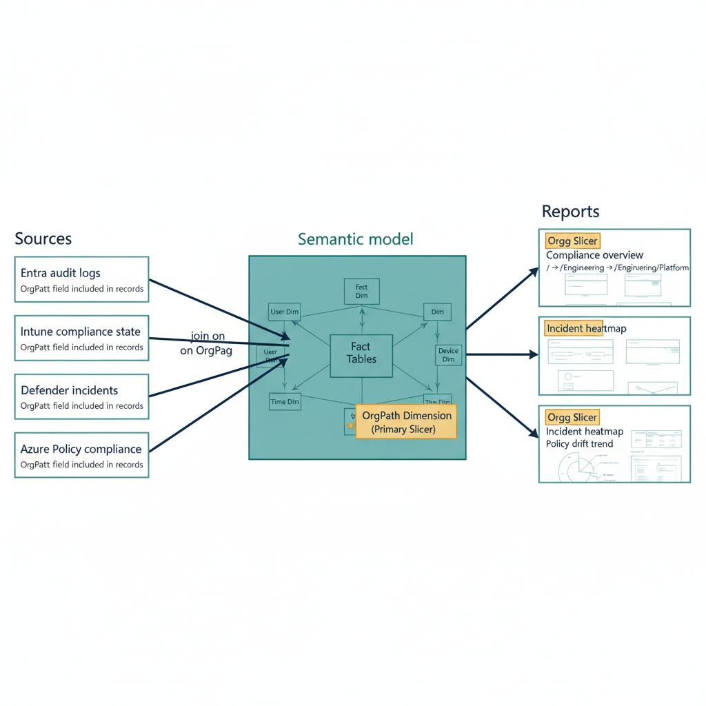

# Chapter 3 — The Power BI Semantic Model

::: {.callout-note}
## In this chapter
The semantic model is the architectural center of the reporting layer — the
component that turns six heterogeneous governance exports into one coherent,
queryable model. This chapter presents the Power Query M definitions for the
shared OrgTree dimension and the six fact tables, the `/UNKNOWN` sentinel
convention that keeps unresolved rows visible, and the relationship
configuration that makes OrgPath the universal slicer across every report page.
:::

{#fig-13-orgpath-and-power-bi-reporting-diagram-02 fig-alt="Left-to-right reporting pipeline with OrgPath as the join key, three labeled columns. Left column \"Sources\" stacks four data source boxes vertically: Entra audit logs; Intune compliance state; Defender incidents; Azure Policy compliance. Each source emits records that include an OrgPath field; arrows from each source point rightward into the center column. Center column \"Semantic model\" contains a single large box labeled \"Power BI semantic model\" containing a star-schema sketch — central fact tables surrounded by dimension tables, with the OrgPath dimension highlighted as the primary slicer (a small star icon next to it). Joins are shown as labeled lines from each of the four left-column sources to the center fact tables. Right column \"Reports\" stacks three report page mockups vertically: Compliance overview; Incident heatmap; Policy drift trend. Each report page shows the same OrgPath slicer at the top with sample drill paths displayed in monospace: / → /Engineering → /Engineering/Platform. Arrows from the semantic model fan rightward to all three report pages. Engineering blueprint style, white background, federal navy (#1F3A5F) for the four sources, teal (#1A9E8F) for the semantic model, amber (#D4A017) for the OrgPath slicer overlays on each report page, monospace OrgPath drill values, no human figures, 16:9 landscape." width="85%"}

The semantic model is the architectural center of the reporting layer. It is the component that translates the six heterogeneous JSON exports produced by the pipeline into a single, coherent, queryable model that Power BI report pages consume uniformly. The model has seven tables: six fact tables, one per governance surface, and one shared dimension table — the OrgTree dimension — derived from the authoritative OrgTree registry JSON.

> All six fact tables join to the OrgTree dimension on the OrgPath column. OrgPath is therefore the universal slicer: selecting any OrgPath value or range of values in the hierarchy slicer on any report page automatically filters every fact table to the rows whose OrgPath value falls within the selected organizational segment.

The Power Query M definitions presented in this chapter are written to be pasted directly into the Power BI Desktop Advanced Editor for each table. The file paths in each definition reference the `-latest.json` symlink files that the export pipeline maintains, not the timestamped archive files. This ensures that the semantic model always loads the most recently completed export for each surface. In environments using a Fabric Lakehouse, replace the `File.Contents` source with the appropriate `Lakehouse.Contents` or `Table.FromRows` call against the Lakehouse delta table.

## OrgTree Dimension Table

The OrgTree dimension table is the organizational spine of the entire semantic model. It must be derived from the same authoritative registry file that the OrgPath propagation pipeline uses as its source of truth — not a separately maintained copy that might drift from the operational registry.

The M query performs four transformations in sequence:

1. **Read and expand** the registry JSON, projecting each node record into columns.
2. **Type** the columns — `Tier` as integer to support slicer ordering and hierarchy-depth visuals, `Active` as logical, and `EffectiveDate` as date for time-bounded filtering.
3. **Filter to active nodes only**, so that decommissioned OrgPath values do not appear in slicers.
4. **Add computed columns** — a `DisplayName` combining the node label and OrgPath value for use in report slicers and scorecard cards, and a readable `TierLabel`.

> Retired nodes are excluded from the dimension deliberately. Historical fact data referencing a retired OrgPath value shows as unmatched (blank) in the dimension join — which correctly signals that the organizational position no longer exists.

```
let
    // ENV-PARAM: Update the file path to match your staging directory.
    // In Fabric environments, replace File.Contents with Lakehouse.Contents
    // pointing to the orgtree-registry-latest table.
    Source = Json.Document(
        File.Contents("\\governance-server\PowerBIExports\orgtree-registry-latest.json")
    ),

    // The OrgTree registry JSON is an array of node objects.
    // Each node has: NodeId, Path, Tier, Label, ParentNodeId, Active, EffectiveDate
    ConvertToTable = Table.FromList(
        Source,
        Splitter.SplitByNothing(),
        null, null,
        ExtraValues.Error
    ),

    ExpandNode = Table.ExpandRecordColumn(
        ConvertToTable, "Column1",
        {"NodeId", "Path", "Tier", "Label", "ParentNodeId", "Active", "EffectiveDate"},
        {"NodeId", "OrgPath", "Tier", "Label", "ParentNodeId", "Active", "EffectiveDate"}
    ),

    // Parse Tier as integer for slicer ordering and hierarchy depth visuals.
    // Parse Active as logical and EffectiveDate as date for time-bounded filtering.
    TypedColumns = Table.TransformColumnTypes(ExpandNode, {
        {"Tier",          Int64.Type},
        {"Active",        type logical},
        {"EffectiveDate", type date}
    }),

    // The semantic model dimension table contains only active nodes.
    // Retired nodes are excluded so that decommissioned OrgPath values
    // do not appear in slicers. Historical fact data referencing retired
    // OrgPath values will show as unmatched (blank) in the dimension join,
    // which correctly signals that the organizational position no longer exists.
    ActiveNodes = Table.SelectRows(TypedColumns, each [Active] = true),

    // DisplayName is used in report slicers and the executive scorecard cards.
    // Format: "Finance (/COMM/FIN/)" for readable identification.
    AddDisplayName = Table.AddColumn(
        ActiveNodes,
        "DisplayName",
        each [Label] & " (" & [OrgPath] & ")",
        type text
    ),

    // TierLabel provides a readable depth indicator for hierarchy slicers.
    AddTierLabel = Table.AddColumn(
        AddDisplayName,
        "TierLabel",
        each "Tier " & Text.From([Tier]),
        type text
    )
in
    AddTierLabel
```

## Intune Compliance Table

The Intune compliance table represents the most granular fact table in the model — one row per managed device. The `IsCompliant` column added by the export pipeline (a numeric 1 or 0) enables straightforward DAX `SUM` aggregation without requiring `CALCULATE` with a filter expression in every measure that counts compliant devices.

> The OrgPath null-replacement step ensures that devices whose primary user has no OrgPath attribute — typically newly provisioned devices that have not yet been processed by the Lifecycle Workflows joiner task — appear in the model with the sentinel value `/UNKNOWN` rather than as null-key rows that would be excluded from OrgTree dimension joins.

```
let
    // ENV-PARAM: Update file path to staging directory or Lakehouse location.
    Source = Json.Document(
        File.Contents("\\governance-server\PowerBIExports\intune-compliance-latest.json")
    ),

    ToTable = Table.FromList(
        Source,
        Splitter.SplitByNothing(),
        null, null,
        ExtraValues.Error
    ),

    Expand = Table.ExpandRecordColumn(
        ToTable, "Column1",
        {"DeviceId", "DeviceName", "ComplianceState", "LastSync",
         "UserUPN", "OrgPath", "IsCompliant"},
        {"DeviceId", "DeviceName", "ComplianceState", "LastSync",
         "UserUPN", "OrgPath", "IsCompliant"}
    ),

    // Type the columns. LastSync is exported as ISO 8601 datetimezone string.
    TypedColumns = Table.TransformColumnTypes(Expand, {
        {"LastSync",    type datetimezone},
        {"IsCompliant", Int64.Type}
    }),

    // Replace null OrgPath values with the /UNKNOWN sentinel.
    // This preserves these rows in the fact table while making clear
    // in visuals that the device's organizational position is not yet resolved.
    CleanOrgPath = Table.ReplaceValue(
        TypedColumns,
        null,
        "/UNKNOWN",
        Replacer.ReplaceValue,
        {"OrgPath"}
    ),

    // Add a LastSyncDate column (date only) for day-level filtering
    // without time component, consistent with Sentinel date columns.
    AddSyncDate = Table.AddColumn(
        CleanOrgPath,
        "LastSyncDate",
        each Date.From([LastSync]),
        type date
    )
in
    AddSyncDate
```

## Sentinel Drift Summary Table

The Sentinel drift table carries one row per OrgPath per drift category per day, as produced by the KQL aggregation in the export pipeline. The `Category` column identifies the type of drift detected — for example, PIM eligibility scope drift, compliance policy assignment drift, or extension attribute value drift — and is used in the drift category breakdown clustered bar chart on the per-division posture dashboard page.

```
let
    // ENV-PARAM: Update file path.
    Source = Json.Document(
        File.Contents("\\governance-server\PowerBIExports\sentinel-drift-latest.json")
    ),

    ToTable = Table.FromList(
        Source,
        Splitter.SplitByNothing(),
        null, null,
        ExtraValues.Error
    ),

    Expand = Table.ExpandRecordColumn(
        ToTable, "Column1",
        {"Date", "OrgPath", "Category", "DriftCount"},
        {"Date", "OrgPath", "Category", "DriftCount"}
    ),

    TypedColumns = Table.TransformColumnTypes(Expand, {
        {"Date",       type date},
        {"DriftCount", Int64.Type}
    }),

    // Replace null OrgPath with /UNKNOWN, consistent with all fact tables.
    CleanOrgPath = Table.ReplaceValue(
        TypedColumns, null, "/UNKNOWN",
        Replacer.ReplaceValue, {"OrgPath"}
    )
in
    CleanOrgPath
```

## Sentinel PIM Activations Table

The PIM activations table carries one row per OrgPath per day.

> PIM activation volume relative to organizational segment size is a governance signal: an unusually high activation rate in a particular division may indicate credential compromise, inappropriate role assignment breadth, or a process failure in which users with standing access are activating PIM roles unnecessarily.

The trend measure in Chapter Four quantifies this signal as a week-over-week percentage change.

```
let
    // ENV-PARAM: Update file path.
    Source = Json.Document(
        File.Contents("\\governance-server\PowerBIExports\sentinel-pim-latest.json")
    ),

    ToTable = Table.FromList(
        Source,
        Splitter.SplitByNothing(),
        null, null,
        ExtraValues.Error
    ),

    Expand = Table.ExpandRecordColumn(
        ToTable, "Column1",
        {"Date", "OrgPath", "PIMActivations"},
        {"Date", "OrgPath", "PIMActivations"}
    ),

    TypedColumns = Table.TransformColumnTypes(Expand, {
        {"Date",           type date},
        {"PIMActivations", Int64.Type}
    }),

    CleanOrgPath = Table.ReplaceValue(
        TypedColumns, null, "/UNKNOWN",
        Replacer.ReplaceValue, {"OrgPath"}
    )
in
    CleanOrgPath
```

## Defender Posture Table

The Defender posture table carries one row per Arc-enrolled resource. The `AssessmentCount`, `UnhealthyCount`, `HealthyCount`, and `NotApplicable` columns enable the Defender Health Rate percentage measure without requiring the DAX measure to perform a row-level calculation across individual assessment records. The `OrgTier` column, drawn from the resource tag, supports tier-level aggregation in the executive scorecard: an organization may choose to display Defender posture at division tier (Tier 1) for the executive view and at branch tier (Tier 2) for the operational view.

```
let
    // ENV-PARAM: Update file path.
    Source = Json.Document(
        File.Contents("\\governance-server\PowerBIExports\defender-posture-latest.json")
    ),

    ToTable = Table.FromList(
        Source,
        Splitter.SplitByNothing(),
        null, null,
        ExtraValues.Error
    ),

    Expand = Table.ExpandRecordColumn(
        ToTable, "Column1",
        {"ResourceId", "ResourceName", "OrgPath", "OrgTier",
         "AssessmentCount", "UnhealthyCount", "HealthyCount", "NotApplicable"},
        {"ResourceId", "ResourceName", "OrgPath", "OrgTier",
         "AssessmentCount", "UnhealthyCount", "HealthyCount", "NotApplicable"}
    ),

    TypedColumns = Table.TransformColumnTypes(Expand, {
        {"OrgTier",         Int64.Type},
        {"AssessmentCount", Int64.Type},
        {"UnhealthyCount",  Int64.Type},
        {"HealthyCount",    Int64.Type},
        {"NotApplicable",   Int64.Type}
    }),

    CleanOrgPath = Table.ReplaceValue(
        TypedColumns, null, "/UNKNOWN",
        Replacer.ReplaceValue, {"OrgPath"}
    )
in
    CleanOrgPath
```

## Guest Configuration Compliance Table

The Guest Configuration table carries one row per in-guest policy assignment on each Arc-enrolled machine. An `Int64` `GCIsCompliant` column is derived from the textual `ComplianceState`, mirroring the Intune table's numeric-flag convention so that compliance counts aggregate through DAX `SUM` rather than per-row evaluation.

```
let
    // ENV-PARAM: Update file path.
    Source = Json.Document(
        File.Contents("\\governance-server\PowerBIExports\guestconfig-compliance-latest.json")
    ),

    ToTable = Table.FromList(
        Source,
        Splitter.SplitByNothing(),
        null, null,
        ExtraValues.Error
    ),

    Expand = Table.ExpandRecordColumn(
        ToTable, "Column1",
        {"id", "machineName", "OrgPath", "PolicyName",
         "PolicyVersion", "ComplianceState"},
        {"ResourceId", "MachineName", "OrgPath", "PolicyName",
         "PolicyVersion", "ComplianceState"}
    ),

    // Add a numeric IsCompliant column for SUM-based DAX aggregation.
    AddIsCompliant = Table.AddColumn(
        Expand,
        "GCIsCompliant",
        each if [ComplianceState] = "Compliant" then 1 else 0,
        Int64.Type
    ),

    CleanOrgPath = Table.ReplaceValue(
        AddIsCompliant, null, "/UNKNOWN",
        Replacer.ReplaceValue, {"OrgPath"}
    )
in
    CleanOrgPath
```

## B2B Guest Accounts Table

The B2B guest accounts table carries one row per external (guest) identity. Guests without an OrgPath are assigned the `/EXTERNAL/UNREGISTERED` sentinel by the export pipeline; the `CleanOrgPath` step here handles any residual nulls so that no guest row is dropped from the dimension join.

```
let
    // ENV-PARAM: Update file path.
    Source = Json.Document(
        File.Contents("\\governance-server\PowerBIExports\guests-latest.json")
    ),

    ToTable = Table.FromList(
        Source,
        Splitter.SplitByNothing(),
        null, null,
        ExtraValues.Error
    ),

    Expand = Table.ExpandRecordColumn(
        ToTable, "Column1",
        {"UserId", "UPN", "DisplayName", "OrgPath", "Created", "AccountEnabled"},
        {"UserId", "UPN", "DisplayName", "OrgPath", "Created", "AccountEnabled"}
    ),

    TypedColumns = Table.TransformColumnTypes(Expand, {
        {"Created",        type date},
        {"AccountEnabled", type logical}
    }),

    // The /EXTERNAL/UNREGISTERED sentinel is already set by the export pipeline
    // for guests without OrgPath. This step handles any residual nulls.
    CleanOrgPath = Table.ReplaceValue(
        TypedColumns, null, "/EXTERNAL/UNREGISTERED",
        Replacer.ReplaceValue, {"OrgPath"}
    )
in
    CleanOrgPath
```

## Semantic Model Relationship Configuration

The relationship model connects the OrgTree dimension table to each of the six fact tables via the OrgPath column. In Power BI Desktop's Model view, each relationship is configured with the same four settings:

| Setting | Value |
| :--- | :--- |
| **One-side key** | OrgTree table's `OrgPath` column |
| **Many-side key** | Fact table's `OrgPath` column |
| **Cardinality** | One-to-many (OrgTree → fact) |
| **Cross-filter direction** | Single (dimension → fact) |

> The single cross-filter direction is deliberate. Bidirectional cross-filtering between dimension and fact tables introduces ambiguous filter propagation paths in models with multiple fact tables sharing a single dimension, and it produces incorrect measure results when a measure on one fact table is used as a filter for another fact table that shares the same dimension.

All six relationships are active. The use of inactive relationships with `USERELATIONSHIP` in DAX is not required in this model because no two fact tables need to relate to the OrgTree dimension via different keys. Every fact table uses the same OrgPath column as its foreign key, so all six relationships are active and all six respond identically to OrgPath slicer context on any report page.

The OrgTree dimension also contains a `ParentNodeId` column, which Power BI Desktop uses to define the parent-child hierarchy for the hierarchy slicer visual. In the Model view, configure a hierarchy on the OrgTree table using the `Tier` and `Label` columns in ascending tier order to enable the expand-and-collapse behavior in the report's OrgPath hierarchy slicer. This is the mechanism by which selecting the Finance branch node in the slicer automatically includes all Finance child nodes in the filter context applied to every fact table.
