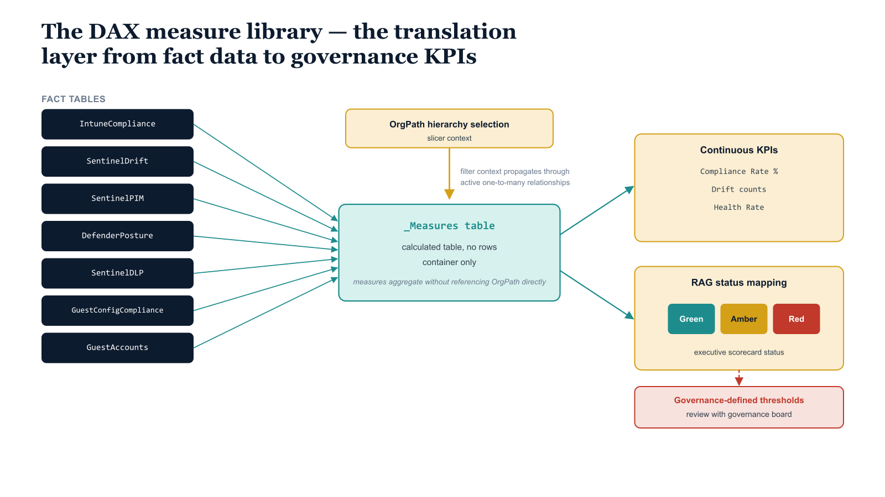

# Chapter 4 — The DAX Measure Library

::: {.callout-note}
## In this chapter
The DAX measure library is the translation layer between raw fact data and the governance KPIs the report pages display. This chapter explains why every measure lives in a single dedicated container table, how each measure responds to OrgPath slicer context with no special handling, and how the executive RAG measures convert continuous KPI values into Red/Amber/Green status. The full library — organized into nine sections from device compliance through rolling-average trend lines — is reproduced verbatim, ready to paste into Power BI Desktop.
:::

## The Measures Table and Its Filter Behavior

DAX measures are the translation layer between raw fact data and the governance KPIs that report pages display. All measures in this model are housed in a dedicated measures table — a calculated table with no rows, created in Power BI Desktop using the expression \_Measures = {BLANK()} and used purely as an organizational container for measures. Housing all measures in a single container table rather than distributing them across the fact tables from which they derive makes the model easier to navigate, simplifies documentation, and prevents the accumulation of measures in the fact tables themselves, which interferes with the automatic aggregation behavior that Power BI applies to numeric columns in fact tables.

{#fig-book-13-cpt-04-diagram-01 fig-alt="Engineering blueprint diagram on a white background showing the DAX measure library as a translation layer. On the left, six federal navy boxes labeled in monospace IntuneCompliance, SentinelDrift, SentinelPIM, DefenderPosture, SentinelDLP, GuestConfigCompliance and GuestAccounts feed arrows into a central teal box labeled _Measures table, calculated table with no rows, container only. Above the central box, a teal slicer chip labeled OrgPath hierarchy selection sends a downward arrow labeled filter context propagates through active one-to-many relationships, illustrating that measures aggregate without referencing OrgPath directly. On the right, the measure library emits two amber output groups labeled continuous KPIs, Compliance Rate percent, Drift counts, Health Rate and labeled RAG status mapping, Green Amber Red. A small red callout marks the threshold note governance-defined thresholds, review with board. Monospace labels throughout, no human figures, 16:9 landscape." width="100%"}

Every measure in this library is designed to respond correctly to OrgPath slicer context without any special handling inside the measure definition. This is a direct consequence of the relationship model described in Chapter Three: because all fact tables join to the OrgTree dimension via an active one-to-many relationship on OrgPath, any filter applied to the OrgTree dimension table — including the selection of a node in the OrgPath hierarchy slicer — automatically propagates to all six fact tables in a single filter context evaluation.

> The measures do not need to explicitly reference OrgPath in their CALCULATE filter arguments; they simply aggregate their fact table columns, and the filter context supplied by the slicer does the rest.

The RAG status measures at the end of the library translate continuous KPI values into the Red, Amber, and Green categorical status values that the executive scorecard page displays. The thresholds embedded in these measures are governance-defined and must be reviewed and adjusted to match the specific governance SLAs and risk tolerance of the organization.

> The thresholds are not universal standards — they are defaults that represent a reasonable starting point for a well-governed enterprise environment, intended to be refined through the governance board's initial dashboard review sessions.

## The Library at a Glance

The library is organized into nine sections, grouped by source fact table and by purpose. The first seven sections produce the continuous KPI values; Section 8 maps those KPIs onto executive RAG status; Section 9 supplies the rolling-average measures that overlay trend lines on the time-series report page.

| Section | Purpose | Source table |
| :--- | :--- | :--- |
| 1 | Intune device compliance | IntuneCompliance |
| 2 | Drift detection | SentinelDrift |
| 3 | PIM activation | SentinelPIM |
| 4 | Defender for Cloud assessment | DefenderPosture |
| 5 | DLP incidents | SentinelDLP |
| 6 | Guest Configuration compliance | GuestConfigCompliance |
| 7 | Guest accounts | GuestAccounts |
| 8 | Executive RAG status | (derived from Sections 1–7) |
| 9 | Trend (30-day rolling averages) | SentinelDrift, SentinelPIM |

## The Complete Measure Library

```
-- ============================================================
-- Measures Table: _Measures
-- Create in Power BI Desktop: New Table, expression = {BLANK()}
-- Add all measures below to this table via Home > New Measure.
-- ============================================================


-- ============================================================
-- SECTION 1: Intune Device Compliance Measures
-- Source table: IntuneCompliance
-- ============================================================

-- Total count of corporate-owned managed devices in filter context.
[Total Devices] =
COUNTROWS(IntuneCompliance)

-- Count of devices whose compliance state is "compliant".
-- IsCompliant = 1 is set by the export pipeline for compliant devices.
[Compliant Devices] =
CALCULATE(
    COUNTROWS(IntuneCompliance),
    IntuneCompliance[IsCompliant] = 1
)

-- Compliance Rate as a percentage. DIVIDE handles zero-denominator safely.
[Compliance Rate %] =
DIVIDE(
    [Compliant Devices],
    [Total Devices],
    0
) * 100

[Non-Compliant Devices] =
[Total Devices] - [Compliant Devices]

-- Devices that have not synced in the trailing 7 days.
-- Stale sync is a governance risk independent of compliance state.
[Stale Sync Devices (7d)] =
CALCULATE(
    COUNTROWS(IntuneCompliance),
    IntuneCompliance[LastSyncDate] < TODAY() - 7
)


-- ============================================================
-- SECTION 2: Drift Detection Measures
-- Source table: SentinelDrift
-- ============================================================

[Total Drift Events (30d)] =
CALCULATE(
    SUM(SentinelDrift[DriftCount]),
    SentinelDrift[Date] >= TODAY() - 30
)

[Drift Events (7d)] =
CALCULATE(
    SUM(SentinelDrift[DriftCount]),
    SentinelDrift[Date] >= TODAY() - 7
)

[Drift Events (24h)] =
CALCULATE(
    SUM(SentinelDrift[DriftCount]),
    SentinelDrift[Date] = TODAY() - 1
)

-- Week-over-week drift change. Positive values indicate increasing drift.
-- BLANK() is returned if the prior week had no drift (no trend to compute).
[Drift WoW Change %] =
VAR ThisWeek = [Drift Events (7d)]
VAR LastWeek =
    CALCULATE(
        SUM(SentinelDrift[DriftCount]),
        SentinelDrift[Date] >= TODAY() - 14,
        SentinelDrift[Date] <  TODAY() - 7
    )
RETURN
    IF(
        LastWeek = 0, BLANK(),
        DIVIDE(ThisWeek - LastWeek, LastWeek) * 100
    )


-- ============================================================
-- SECTION 3: PIM Activation Measures
-- Source table: SentinelPIM
-- ============================================================

[PIM Activations (24h)] =
CALCULATE(
    SUM(SentinelPIM[PIMActivations]),
    SentinelPIM[Date] = TODAY() - 1
)

[PIM Activations (7d)] =
CALCULATE(
    SUM(SentinelPIM[PIMActivations]),
    SentinelPIM[Date] >= TODAY() - 7
)

[PIM Activations (30d)] =
CALCULATE(
    SUM(SentinelPIM[PIMActivations]),
    SentinelPIM[Date] >= TODAY() - 30
)

-- Week-over-week PIM activation trend.
-- A significant positive trend warrants investigation of role assignment breadth.
[PIM Activation Trend WoW %] =
VAR Last7  =
    CALCULATE(
        SUM(SentinelPIM[PIMActivations]),
        SentinelPIM[Date] >= TODAY() - 7
    )
VAR Prev7  =
    CALCULATE(
        SUM(SentinelPIM[PIMActivations]),
        SentinelPIM[Date] >= TODAY() - 14,
        SentinelPIM[Date] <  TODAY() - 7
    )
RETURN
    IF(Prev7 = 0, BLANK(), DIVIDE(Last7 - Prev7, Prev7) * 100)


-- ============================================================
-- SECTION 4: Defender for Cloud Assessment Measures
-- Source table: DefenderPosture
-- ============================================================

[Arc Resources Assessed] =
COUNTROWS(DefenderPosture)

[Total Assessments] =
SUM(DefenderPosture[AssessmentCount])

[Unhealthy Assessments] =
SUM(DefenderPosture[UnhealthyCount])

[Healthy Assessments] =
SUM(DefenderPosture[HealthyCount])

-- Defender Health Rate: percentage of applicable assessments that are healthy.
-- NotApplicable assessments are excluded from the denominator because they do
-- not represent a remediation opportunity and would deflate the health rate.
[Defender Health Rate %] =
DIVIDE(
    [Healthy Assessments],
    [Healthy Assessments] + [Unhealthy Assessments],
    1
) * 100


-- ============================================================
-- SECTION 5: DLP Incident Measures
-- Source table: SentinelDLP (produced from sentinel-dlp export)
-- ============================================================

[DLP Incidents (7d)] =
CALCULATE(
    SUM(SentinelDLP[DLPIncidents]),
    SentinelDLP[Date] >= TODAY() - 7
)

[DLP Incidents (30d)] =
CALCULATE(
    SUM(SentinelDLP[DLPIncidents]),
    SentinelDLP[Date] >= TODAY() - 30
)

[High Severity DLP (7d)] =
CALCULATE(
    SUM(SentinelDLP[HighSeverityDLP]),
    SentinelDLP[Date] >= TODAY() - 7
)


-- ============================================================
-- SECTION 6: Guest Configuration Compliance Measures
-- Source table: GuestConfigCompliance
-- ============================================================

[GC Total Assessments] =
COUNTROWS(GuestConfigCompliance)

[GC Compliant Assignments] =
SUM(GuestConfigCompliance[GCIsCompliant])

[GC Compliance Rate %] =
DIVIDE(
    [GC Compliant Assignments],
    [GC Total Assessments],
    1
) * 100


-- ============================================================
-- SECTION 7: Guest Account Measures
-- Source table: GuestAccounts
-- ============================================================

[Total Guest Accounts] =
COUNTROWS(GuestAccounts)

[Unregistered Guests] =
CALCULATE(
    COUNTROWS(GuestAccounts),
    GuestAccounts[OrgPath] = "/EXTERNAL/UNREGISTERED"
)

[Registered Guests] =
[Total Guest Accounts] - [Unregistered Guests]

[Guests Added (30d)] =
CALCULATE(
    COUNTROWS(GuestAccounts),
    GuestAccounts[Created] >= TODAY() - 30
)

[Disabled Guest Accounts] =
CALCULATE(
    COUNTROWS(GuestAccounts),
    GuestAccounts[AccountEnabled] = FALSE()
)


-- ============================================================
-- SECTION 8: Executive RAG Status Measures
-- Thresholds are governance-defined. Review with governance board
-- at initial dashboard rollout and revise to match organizational SLAs.
-- ============================================================

-- Compliance RAG:
--   Green  = Compliance Rate >= 95%
--   Amber  = Compliance Rate >= 80% and < 95%
--   Red    = Compliance Rate < 80%
[Compliance RAG] =
VAR Rate = [Compliance Rate %]
RETURN
    IF(Rate >= 95, "Green",
    IF(Rate >= 80, "Amber",
    "Red"))

-- Drift RAG:
--   Green  = 7-day drift events <= 5
--   Amber  = 7-day drift events <= 20
--   Red    = 7-day drift events > 20
[Drift RAG] =
VAR DriftRecent = [Drift Events (7d)]
RETURN
    IF(DriftRecent <= 5,  "Green",
    IF(DriftRecent <= 20, "Amber",
    "Red"))

-- Defender RAG:
--   Green  = Health Rate >= 90%
--   Amber  = Health Rate >= 75%
--   Red    = Health Rate < 75%
[Defender RAG] =
VAR HealthRate = [Defender Health Rate %]
RETURN
    IF(HealthRate >= 90, "Green",
    IF(HealthRate >= 75, "Amber",
    "Red"))

-- Guest RAG:
--   Green  = 0 unregistered guests
--   Amber  = 1-5 unregistered guests
--   Red    = more than 5 unregistered guests
[Guest RAG] =
VAR Unreg = [Unregistered Guests]
RETURN
    IF(Unreg = 0,  "Green",
    IF(Unreg <= 5, "Amber",
    "Red"))

-- DLP RAG:
--   Green  = 0 high-severity DLP incidents in trailing 7 days
--   Amber  = 1-3 high-severity DLP incidents
--   Red    = more than 3 high-severity DLP incidents
[DLP RAG] =
VAR HighDLP = [High Severity DLP (7d)]
RETURN
    IF(HighDLP = 0,  "Green",
    IF(HighDLP <= 3, "Amber",
    "Red"))

-- GC RAG:
--   Green  = GC Compliance Rate >= 95%
--   Amber  = GC Compliance Rate >= 80%
--   Red    = GC Compliance Rate < 80%
[GC RAG] =
VAR GCRate = [GC Compliance Rate %]
RETURN
    IF(GCRate >= 95, "Green",
    IF(GCRate >= 80, "Amber",
    "Red"))

-- Overall Governance RAG:
--   Red    if any dimension RAG is Red
--   Amber  if any dimension RAG is Amber (and none are Red)
--   Green  if all dimension RAGs are Green
-- Uses a table constructor to aggregate all dimension RAG values.
-- Expand the table constructor to add new governance dimensions as the
-- substrate is extended to additional surfaces.
[Overall Governance RAG] =
VAR RagValues =
    {
        [Compliance RAG],
        [Drift RAG],
        [Defender RAG],
        [Guest RAG],
        [DLP RAG],
        [GC RAG]
    }
VAR RedCount =
    COUNTROWS(FILTER(RagValues, [Value] = "Red"))
VAR AmberCount =
    COUNTROWS(FILTER(RagValues, [Value] = "Amber"))
RETURN
    IF(RedCount   > 0, "Red",
    IF(AmberCount > 0, "Amber",
    "Green"))


-- ============================================================
-- SECTION 9: Trend Measures for Trend Analysis Report Page
-- ============================================================

-- 30-day rolling average compliance rate, computed at each date point.
-- Used as the trend line overlay on the Compliance Rate time-series chart.
[Compliance Rate 30d Rolling Avg] =
AVERAGEX(
    DATESINPERIOD(
        SentinelDrift[Date],
        LASTDATE(SentinelDrift[Date]),
        -30,
        DAY
    ),
    [Compliance Rate %]
)

-- 30-day rolling average drift count for the trend line overlay.
[Drift 30d Rolling Avg] =
AVERAGEX(
    DATESINPERIOD(
        SentinelDrift[Date],
        LASTDATE(SentinelDrift[Date]),
        -30,
        DAY
    ),
    SUM(SentinelDrift[DriftCount])
)

-- 30-day rolling average PIM activations for the trend line overlay.
[PIM Activations 30d Rolling Avg] =
AVERAGEX(
    DATESINPERIOD(
        SentinelPIM[Date],
        LASTDATE(SentinelPIM[Date]),
        -30,
        DAY
    ),
    SUM(SentinelPIM[PIMActivations])
)
```

## The Completed Semantic Model

With the measure library defined, the semantic model is complete. Every report page in the workbook reads from this single model, ensuring that all visuals reflect the same data, the same OrgPath filter context, and the same governance KPI definitions. Changes to KPI thresholds — for example, raising the Compliance RAG Green threshold from ninety-five to ninety-seven percent — are made once in the measure library and take effect across every report page and every embedded view of the report simultaneously.
