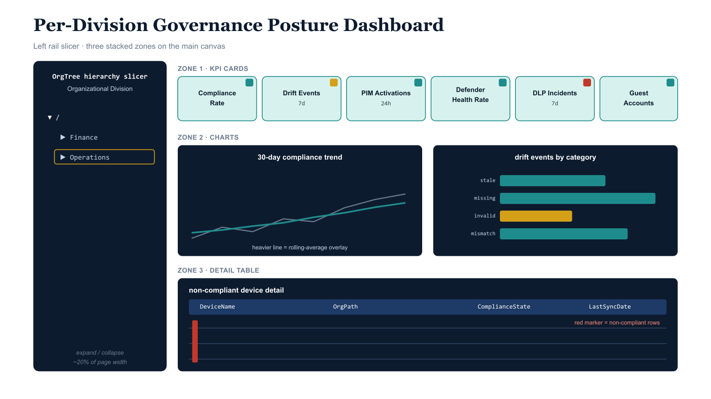

# Chapter 5 — Report Page Design

::: {.callout-note}
## In this chapter
The Power BI workbook ships three report pages over one shared semantic model — an operational Per-Division Governance Posture Dashboard, a single-screen Executive Summary heatmap, and a ninety-day Trend Analysis view. This chapter walks the layout of each: their zones, slicers, KPI cards, and visuals; the measures and conditional-formatting rules behind them; and the design discipline that keeps each page answering one primary question at a glance.
:::

The Power BI workbook contains three report pages, each designed for a distinct audience and review context. The pages share a single semantic model but differ in layout, visual density, and interactivity level. The design philosophy across all three pages is deliberate constraint:

> Governance dashboards that present too much information simultaneously fail their audience just as thoroughly as dashboards that present too little.

Each page is designed to answer one primary question at a glance, with supporting detail available to those who need to drill further.

## Per-Division Governance Posture Dashboard

The Per-Division Governance Posture Dashboard is the primary operational view of the reporting layer. It is the page that a divisional governance lead, a security operations manager, or an identity architect opens when they need to understand the current governance posture of their organizational segment. The page is designed for an audience that has governance context — they know what compliance rate means, they know what a drift event is, and they can interpret a PIM activation count — but who should not need to navigate multiple engineering surfaces to assemble that picture themselves.

{#fig-book-13-cpt-05-diagram-01 fig-alt="Engineering blueprint diagram on a white background depicting the layout of a Power BI governance dashboard page in 16:9 landscape. A full-height left rail occupying about twenty percent of the width is a federal navy rectangle labeled in monospace OrgTree hierarchy slicer — Organizational Division, with an expand-collapse tree showing Finance and Operations child nodes. The main canvas to the right is divided into three stacked horizontal zones. The top zone is a single row of six teal KPI cards labeled in monospace Compliance Rate, Drift Events 7d, PIM Activations 24h, Defender Health Rate, DLP Incidents 7d, and Guest Accounts; small amber and red corner badges on several cards indicate RAG conditional formatting. The middle zone holds two side-by-side navy chart frames, the left a line chart labeled 30-day compliance trend with a heavier rolling-average overlay line, the right a horizontal clustered bar chart labeled drift events by category. The bottom zone is a wide navy table frame labeled non-compliant device detail with monospace column headers DeviceName, OrgPath, ComplianceState, LastSyncDate, and a small red marker flagging non-compliant rows. Monospace labels throughout, no human figures, 16:9 landscape." width="100%"}

The page layout is structured in three horizontal zones. The left rail, occupying approximately twenty percent of the canvas width, contains a single full-height hierarchy slicer bound to the OrgTree dimension table. The slicer is configured to display nodes in a tree structure using the ParentNodeId column to define parent-child relationships, enabling expand-and-collapse navigation of the organizational hierarchy. The slicer's default selection is the root node, which causes all measures to return organization-wide values.

When a user selects a division node such as Finance or Operations, all six fact tables are filtered to OrgPath values that match that node or fall beneath it in the hierarchy, and every visual on the canvas updates accordingly. The slicer header is labeled "Organizational Division" and the display field is the DisplayName column from the OrgTree dimension, which presents values in the human-readable "Finance (/COMM/FIN/)" format.

The top zone of the main canvas contains six KPI card visuals arranged in a single row. From left to right:

| KPI card | Measure displayed | RAG conditional formatting |
| :--- | :--- | :--- |
| **Compliance Rate** | Compliance Rate % | Background color driven by the Compliance RAG measure — green for Green, amber for Amber, red for Red |
| **Drift Events (7d)** | Drift Events (7d) count | Background from the Drift RAG measure |
| **PIM Activations (24h)** | PIM Activations (24h) count | None — PIM activation volume is context-dependent, and a fixed RAG threshold would be misleading without division-relative normalization |
| **Defender Health Rate** | Defender Health Rate % | Background from the Defender RAG measure |
| **DLP Incidents (7d)** | DLP Incidents (7d) count | Background from the DLP RAG measure |
| **Guest Accounts** | Total Guest Accounts count, with an Unregistered Guests sub-label in parentheses | Guest RAG measure applied to the sub-label color rather than the card background, since total guest count is not itself a RAG signal |

The middle zone of the canvas contains two chart visuals side by side. The left chart is a line chart displaying the thirty-day compliance rate trend for the selected OrgPath segment, using dates on the X axis and the Compliance Rate % measure on the Y axis, with the Compliance Rate 30d Rolling Avg measure overlaid as a secondary line.

This chart allows the divisional governance lead to see whether a current compliance rate below the Green threshold represents a stable, established condition or a recent decline that requires urgent attention. The right chart is a clustered bar chart displaying drift event counts by category over the trailing thirty days, using the Category column from the SentinelDrift table on the Y axis and the Total Drift Events (30d) measure on the X axis.

This chart identifies which drift categories are driving the total drift count for the selected division — whether the drift is concentrated in PIM eligibility scope drift, compliance policy assignment drift, or extension attribute value drift — giving the governance lead a starting point for remediation prioritization.

The bottom zone of the canvas contains a table visual displaying non-compliant device detail for the selected OrgPath segment. The table is filtered by a visual-level filter to show only rows where ComplianceState is not equal to "compliant." The columns displayed are DeviceName, OrgPath, ComplianceState, and LastSyncDate.

> This table bridges the gap between the aggregate KPI view and the device-level action that remediation requires.

A governance lead who sees a compliance rate below threshold can scroll the non-compliant device table, identify the specific devices driving the deficit, and hand off a specific remediation list to the device engineering team. The table is paginated and supports export to Excel for offline remediation tracking.

## Executive Summary Page

The Executive Summary page is designed for a brief read at a governance board meeting or an executive briefing. Its audience does not interact with the slicer — the page is designed to present the complete organizational governance posture in a single screen without requiring the reader to make any selections. The page does not have a hierarchy slicer. All visuals on this page are unfiltered, displaying organization-wide values, or are filtered by a page-level filter to a specific top-level OrgTree node.

The primary visual on the Executive Summary page is a matrix visual configured as a governance posture heatmap. Its structure is straightforward:

- **Rows** are the top-level OrgTree division nodes — the Tier 1 branches such as Commercial, Operations, Infrastructure, and any additional top-level divisions the organization has defined.
- **Columns** are the six governance dimensions: Device Compliance, Drift, Defender Health, DLP, Guest Configuration, and Guest Accounts.
- **Cells** each display the RAG status string for that dimension and division combination, with conditional formatting applied to color the cell background green, amber, or red accordingly.
- **Summary column** on the right side is driven by the Overall Governance RAG measure, providing the board with the single-dimension aggregate posture for each division.

The matrix visual's grand total row is suppressed:

> An organization-wide RAG aggregate would be misleading because it would average across divisions of very different sizes and risk profiles.

Above the heatmap matrix, a row of large KPI cards displays the organization-wide values for each governance dimension, giving context for interpreting the per-division heatmap. These cards use the same measure definitions as the per-division dashboard but are unfiltered, returning values across all OrgPath nodes in the OrgTree dimension. The page title includes a "Data as of" annotation using a card visual bound to a measure that returns the maximum LastSyncDate from the IntuneCompliance table, which serves as a proxy for the most recent refresh timestamp visible to the reader.

## Trend Analysis Page

The Trend Analysis page presents ninety-day time-series views of the three governance dimensions that are most meaningfully tracked over time: compliance rate, drift event count, and PIM activation volume. This page is used in monthly governance leadership meetings where the question being answered is not "what is our current posture?" but "is our governance posture improving, stable, or degrading over time, and does any division show a trend that requires structural attention?" The page retains the full-height OrgPath hierarchy slicer from the per-division dashboard, allowing a governance leader to isolate a specific division's trend lines for the monthly review discussion.

Each of the three trend charts is a line chart with dual series: the daily measure value as a thin line, and the thirty-day rolling average — computed by the corresponding rolling average measure from Section 9 of the DAX library — as a heavier overlay line. The rolling average smooths day-to-day noise in the daily figures, which can be significant for small-population divisions where a single non-compliant device represents a large percentage movement in the compliance rate, and makes the underlying directional trend visible. Each chart's Y axis is fixed rather than auto-scaled, so that the visual impression of a trend line's slope is comparable across divisions of different sizes. The fixed-axis convention differs by dimension:

| Trend chart | Fixed Y-axis range |
| :--- | :--- |
| **Compliance Rate** | 0–100% |
| **Drift Events** | A maximum configurable by the governance team |
| **PIM Activations** | Fixed relative to the division's population, requiring a per-division normalization that governance teams can configure after initial deployment |
