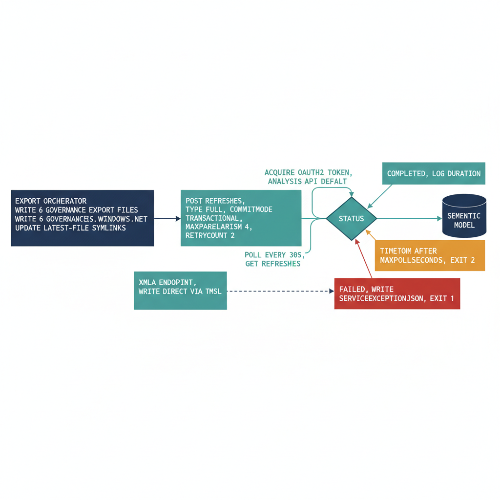

# Chapter 6 — Automated Refresh Pipeline

::: {.callout-note}
## In this chapter
A governance dashboard is only as trustworthy as the data behind it, so the
semantic model must refresh the instant the export pipeline finishes. This
chapter walks through the service-principal authentication and tenant settings
the Power BI REST API requires, the enhanced full-refresh trigger-and-poll
script that runs as the orchestrator's final step, the options for invoking it
across separate service contexts, and the XMLA-endpoint architecture that
collapses refresh latency to near zero on Premium and Fabric capacity.
:::

## Why Currency Drives the Refresh Design

The governance value of the dashboard is directly proportional to its currency. A compliance rate displayed on a governance dashboard that reflects last Tuesday's data cannot drive a Friday governance decision.

> A dashboard's authority is measured in hours, not features: a stale number is not a smaller truth, it is a different one.

The semantic model must be refreshed immediately after the export pipeline completes, so that the dashboard reflects the most recent state of every governance surface. The refresh pipeline uses the Power BI REST API to trigger and monitor a full semantic model refresh, and is invoked as the final step of the export orchestrator — after all six export files have been successfully written and their latest-file symlinks updated.

{#fig-book-13-cpt-06-diagram-01 fig-alt="Engineering blueprint diagram on a white background showing the automated refresh pipeline as a left-to-right flow. On the left a federal navy (#1F3A5F) box labeled export orchestrator writes six governance export files and updates latest-file symlinks, then hands off to a navy box labeled acquire OAuth2 token, scope analysis.windows.net powerbi api default. An arrow leads to a teal (#1A9E8F) box labeled POST refreshes, type full, commitMode transactional, maxParallelism 4, retryCount 2. From there a teal loop labeled poll every 30s, GET refreshes returns to a decision diamond labeled status. Three branches leave the diamond: a teal branch to Completed, log duration; an amber (#D4A017) branch to timeout after MaxPollSeconds, exit 2; and a red (#C0392B) branch to Failed, write serviceExceptionJson, exit 1. A separate teal box at the bottom labeled XMLA endpoint, write direct via TMSL bypasses the gateway with a dashed arrow straight to a navy semantic model cylinder. Monospace labels throughout, no human figures, 16:9 landscape." width="85%"}

## Service Principal Authentication and Tenant Settings

The Power BI REST API requires OAuth 2.0 authentication using a service principal. Two prerequisites must both be satisfied, or authentication fails:

| Prerequisite | Where it is configured | Failure mode if missing |
| :--- | :--- | :--- |
| **Workspace membership** — the service principal (the same app registration used for the governance data exports, or a separate registration dedicated to Power BI operations) granted the **Contributor or Admin** role | The Power BI workspace's **Access** settings in the Power BI Service | Service principal cannot see or refresh the dataset |
| **Tenant-level enablement** — "Allow service principals to use Power BI APIs" turned on | Power BI Admin portal → **Tenant Settings → Developer Settings** | API returns a **403 error** regardless of workspace membership |

The enhanced refresh API endpoint used in the following script supports table-level and partition-level refresh targets, parallel table refresh, and retry logic. For the governance semantic model, a full refresh of all tables is appropriate because the export pipeline replaces all data in each file on every run — there is no incremental export, and therefore no incremental refresh.

> If the export pipeline is ever extended to produce incremental exports — appending only the current day's drift events rather than replacing the full thirty-day window — the refresh script can be updated to target specific tables or partitions using the `objects` array parameter.

## The Refresh Trigger-and-Poll Script

The script below authenticates as the service principal, triggers an enhanced full refresh of the OrgPath governance semantic model, polls for completion, and reports the outcome. It proceeds in four steps:

1. **Acquire** an OAuth2 bearer token scoped to the Power BI REST API.
2. **Trigger** an enhanced full refresh in transactional commit mode.
3. **Poll** the refresh history every 30 seconds until the status leaves `Unknown`.
4. **Report** the final status — completion, failure (with the service exception detail written to the error stream for alerting), or timeout.

```powershell
#Requires -Version 5.1
<#
.SYNOPSIS
    Triggers and monitors a Power BI semantic model refresh via the Power BI REST API.
.DESCRIPTION
    Invoked as the final step of the governance export pipeline after all export files
    have been successfully written. Authenticates as a service principal, triggers an
    enhanced full refresh of the OrgPath governance semantic model, and polls for
    completion. On failure, writes the Power BI service exception detail to the error
    stream so that the calling pipeline can capture it for alerting.
.PARAMETER TenantId
    Entra ID tenant ID.
.PARAMETER ClientId
    App registration client ID. The service principal must be a member of the
    Power BI workspace with Contributor or Admin role, and the tenant must have
    "Allow service principals to use Power BI APIs" enabled.
.PARAMETER ClientSecret
    Client secret for the service principal.
    PRODUCTION GUIDANCE: Do not store this value in the script or in a scheduled
    task parameter. Retrieve it at runtime from Azure Key Vault using:
        $ClientSecret = (Get-AzKeyVaultSecret -VaultName "YOUR-KV" `  # ENV-PARAM
                            -Name "pbi-refresh-secret" -AsPlainText)
.PARAMETER WorkspaceId
    Power BI workspace (group) GUID containing the semantic model.
    Retrieved from the Power BI Service workspace URL.
.PARAMETER DatasetId
    Power BI semantic model (dataset) GUID.
    Retrieved from the Power BI Service dataset settings URL or via:
        GET https://api.powerbi.com/v1.0/myorg/groups/{workspaceId}/datasets
.PARAMETER MaxPollSeconds
    Maximum seconds to wait for refresh completion before giving up.
    Default: 900 (15 minutes). Increase for large semantic models.
.NOTES
    ENV-PARAM markers indicate values that must be substituted per environment.
#>
param(
    [string]$TenantId        = "YOUR-TENANT-ID",        # ENV-PARAM
    [string]$ClientId        = "YOUR-APP-CLIENT-ID",     # ENV-PARAM
    [string]$ClientSecret    = "YOUR-CLIENT-SECRET",     # ENV-PARAM: use Key Vault in production
    [string]$WorkspaceId     = "YOUR-WORKSPACE-GUID",    # ENV-PARAM
    [string]$DatasetId       = "YOUR-DATASET-GUID",      # ENV-PARAM
    [int]   $MaxPollSeconds  = 900
)

Set-StrictMode -Version Latest
$ErrorActionPreference = "Stop"

Write-Host "=== Power BI Refresh Trigger — $(Get-Date -Format 'yyyy-MM-dd HH:mm:ss') UTC ==="

# ---- Step 1: Acquire OAuth2 bearer token for the Power BI REST API ----
Write-Host "Acquiring OAuth2 token for Power BI REST API..."
$tokenUri  = "https://login.microsoftonline.com/$TenantId/oauth2/v2.0/token"
$tokenBody = @{
    grant_type    = "client_credentials"
    client_id     = $ClientId
    client_secret = $ClientSecret
    scope         = "https://analysis.windows.net/powerbi/api/.default"
}

$tokenResponse = Invoke-RestMethod -Method POST -Uri $tokenUri -Body $tokenBody
$accessToken   = $tokenResponse.access_token

$headers = @{
    Authorization  = "Bearer $accessToken"
    "Content-Type" = "application/json"
}

Write-Host "Token acquired. Expiry: $([DateTimeOffset]::FromUnixTimeSeconds($tokenResponse.expires_in + [DateTimeOffset]::UtcNow.ToUnixTimeSeconds()))"

# ---- Step 2: Trigger enhanced refresh ----
# The enhanced refresh API (POST .../refreshes) is the v2 refresh endpoint.
# It supports transactional commit mode (all tables succeed or all roll back),
# configurable parallelism, and automatic retry.
$refreshBody = @{
    type           = "full"       # Full refresh: replace all data in all tables
    commitMode     = "transactional" # Roll back all tables if any table fails
    maxParallelism = 4             # Number of tables refreshed in parallel
    retryCount     = 2             # Automatic retries on transient failure
    objects        = @()           # Empty array = refresh all tables and partitions
} | ConvertTo-Json -Depth 5

$refreshUri = "https://api.powerbi.com/v1.0/myorg/groups/$WorkspaceId/datasets/$DatasetId/refreshes"

Write-Host "Triggering full semantic model refresh..."
$triggerResponse = Invoke-RestMethod `
    -Method  POST `
    -Uri     $refreshUri `
    -Headers $headers `
    -Body    $refreshBody

Write-Host "Refresh triggered successfully."
if ($triggerResponse.PSObject.Properties['requestId']) {
    Write-Host "  Request ID: $($triggerResponse.requestId)"
}

# ---- Step 3: Poll for refresh completion ----
# The Power BI API returns status "Unknown" while a refresh is in progress.
# Poll every 30 seconds until status changes to Completed or Failed.
Write-Host "Polling for refresh completion (max $MaxPollSeconds seconds)..."
$elapsed    = 0
$pollResult = $null

do {
    Start-Sleep -Seconds 30
    $elapsed += 30

    $statusResponse = Invoke-RestMethod `
        -Method  GET `
        -Uri     $refreshUri `
        -Headers $headers

    # The refreshes endpoint returns a list of refresh history entries.
    # The most recent is first. We monitor only the entry we just triggered.
    $pollResult = $statusResponse.value |
        Sort-Object -Property startTime -Descending |
        Select-Object -First 1

    Write-Host "  [$elapsed`s] Status: $($pollResult.status) | Started: $($pollResult.startTime)"

} while ($pollResult.status -eq "Unknown" -and $elapsed -lt $MaxPollSeconds)

# ---- Step 4: Report final status ----
switch ($pollResult.status) {
    "Completed" {
        Write-Host "Refresh completed successfully."
        Write-Host "  End time: $($pollResult.endTime)"
        $duration = [datetime]$pollResult.endTime - [datetime]$pollResult.startTime
        Write-Host "  Duration: $([math]::Round($duration.TotalSeconds)) seconds"
    }
    "Failed" {
        $errDetail = $pollResult.serviceExceptionJson | ConvertFrom-Json
        Write-Error "Refresh FAILED. Code: $($errDetail.errorCode). Detail: $($errDetail.parameters)"
        exit 1
    }
    default {
        Write-Warning "Refresh did not complete within $MaxPollSeconds seconds."
        Write-Warning "Last observed status: $($pollResult.status)"
        Write-Warning "Check the Power BI Service refresh history for dataset ID: $DatasetId"
        exit 2
    }
}
```

## Invoking the Refresh Across Service Contexts

The refresh script is invoked at the end of the export orchestrator script by appending a call block that passes the relevant parameters. In environments where the export orchestrator and the refresh trigger run under different service contexts — for example, where the export host runs under a managed identity and the Power BI refresh requires a separate service principal credential — two decoupled invocation patterns are available:

- **Task Scheduler dependency** — invoke the refresh script as a separate scheduled task that triggers after the export task completes, via Task Scheduler dependency configuration.

- **Azure Automation runbook** — invoke the refresh as a separate runbook that the export runbook calls using an inline job submission.

## XMLA Endpoint: Collapsing Refresh Latency to Near Zero

Power BI Premium and Fabric capacity environments support XMLA endpoint access, which enables the export pipeline to write data directly to the semantic model's tables using Tabular Model Scripting Language commands, bypassing the file-based gateway entirely and eliminating the refresh API call as a separate step. This architecture reduces end-to-end latency between export completion and dashboard currency to near zero.

The XMLA endpoint approach requires the semantic model to be deployed to a Premium or Fabric workspace, and requires the service principal to be granted the Analysis Services Administrator role on the XMLA endpoint.

> For organizations that have made this investment, the XMLA pattern is strongly preferred over the file-and-gateway pattern for a governance dashboard where currency is a primary requirement.
