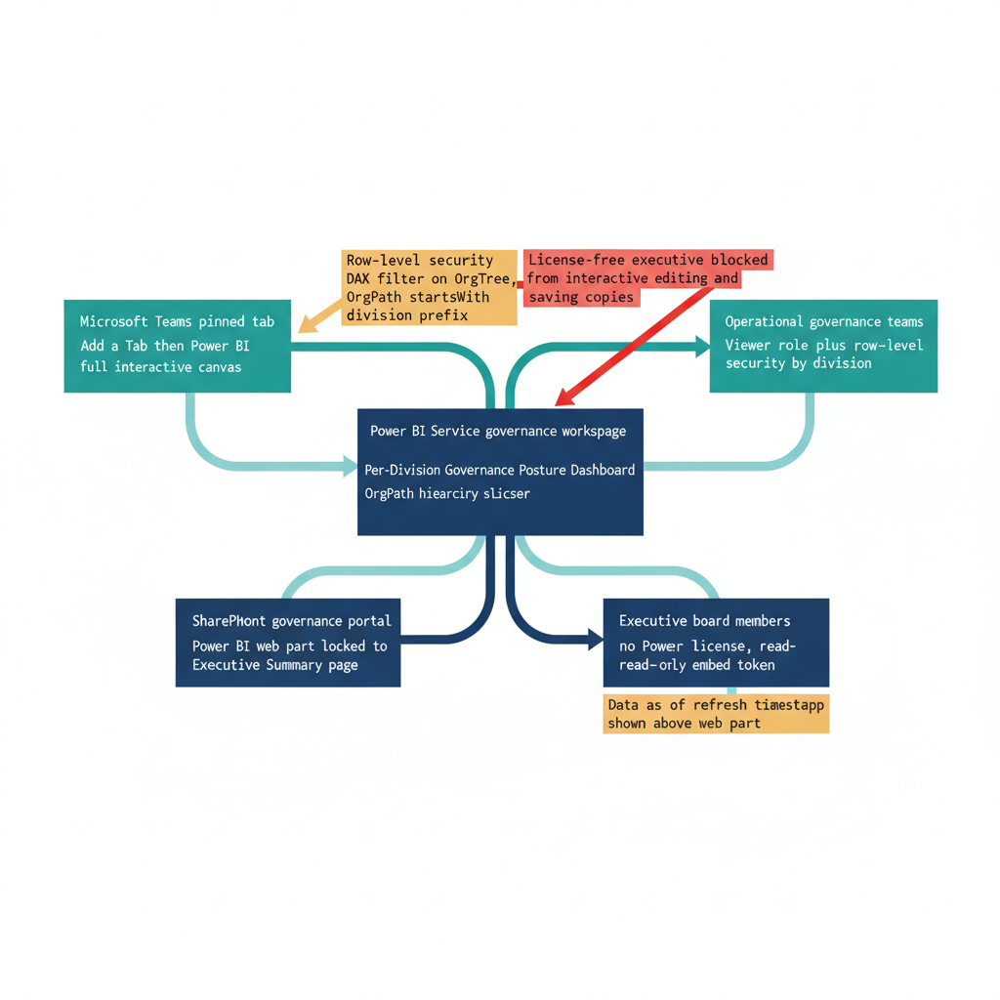

# Chapter 7 — Stakeholder Distribution via Teams and SharePoint

::: {.callout-note}
## In this chapter
A governance dashboard reaches its audience only where that audience already works. This chapter describes the two-channel distribution architecture for the reporting layer: Microsoft Teams for operational governance teams who need full interactivity and divisional row-level security, and a SharePoint executive portal for read-only stakeholders who have no Power BI licenses. It closes by mapping both channels to a three-cadence governance review model — daily in Teams, weekly in SharePoint, monthly in the Power BI Service.
:::

A governance dashboard that lives only in the Power BI Service, navigable only by users who know it exists and who have Power BI Pro licenses, has a stakeholder reach problem. The organizational governance leads, divisional CISOs, and executive board members who are the intended audience of this reporting layer are not, in general, Power BI users. They do not have bookmarked URLs in the Power BI Service. They will not navigate to the governance dashboard unless it is surfaced where they already work — in Microsoft Teams, in the SharePoint intranet, or in a governance portal that their organization has established as the canonical location for governance information.

> A dashboard that the audience must go out of its way to find is, for governance purposes, a dashboard that does not exist. Distribution is not a deployment afterthought — it is the difference between a report and a governance instrument.

The distribution architecture for this reporting layer has two channels that serve two distinct audiences:

| Channel | Audience | What they need |
| :--- | :--- | :--- |
| **Microsoft Teams** | Operational governance teams — identity architects, security engineers, divisional governance leads | Full interactive capability: hierarchy slicer navigation, visual drill-through, regular hands-on use |
| **SharePoint** | Executive stakeholders and governance board members | A read-only, always-current governance posture view without navigating the Power BI interface |

## Teams Integration

The Power BI Teams app provides native embedding of Power BI reports as pinned tabs within Teams channels. The governance Teams channel — which may already exist as the communication hub for the identity engineering and governance team — receives the Per-Division Governance Posture Dashboard as a pinned tab through a short configuration sequence:

1. In the channel, use the **Add a Tab** function.
2. Select **Power BI**.
3. Choose the governance workspace and report.

The pinned tab renders the full Power BI report canvas within the Teams window, including the OrgPath hierarchy slicer and all interactive visuals. Users who have been granted the Viewer role on the governance workspace in the Power BI Service can interact with the report within Teams without leaving the Teams application.

{#fig-book-13-cpt-07-diagram-01 fig-alt="Engineering blueprint diagram on a white background showing how one governance report fans out to two audiences. At center, a federal navy #1F3A5F box labeled Power BI Service governance workspace, Per-Division Governance Posture Dashboard, holds the OrgPath hierarchy slicer. From it two channels branch outward. The upper channel is a teal #1A9E8F box labeled Microsoft Teams pinned tab, Add a Tab then Power BI, full interactive canvas, feeding a teal box labeled Operational governance teams, Viewer role plus row-level security by division. An amber #D4A017 callout reads Row-level security DAX filter on OrgTree, OrgPath startsWith division prefix. The lower channel is a navy box labeled SharePoint governance portal, Power BI web part locked to Executive Summary page, feeding a navy box labeled Executive board members, no Power BI license, read-only embed token. A small amber note reads Data as of refresh timestamp shown above web part. A red #C0392B crossed connector shows a license-free executive blocked from interactive editing and from saving copies. Monospace labels for workspace, group, and page names, no human figures, 16:9 landscape." width="85%"}

For divisional governance leads who need access scoped to their own division, the Power BI Teams integration can be supplemented with **row-level security** on the semantic model. Row-level security is defined in Power BI Desktop using DAX filter expressions on the OrgTree dimension table. A role named after each division node filters the OrgTree table to rows where the OrgPath column starts with the division's OrgPath prefix, which then propagates through the active relationships to all six fact tables. Divisional leads assigned to their corresponding role see only their division's data regardless of what slicer selection they make — they cannot navigate the slicer to other divisions.

Row-level security role assignments are managed in the Power BI Service workspace through the Dataset Security settings, which map Entra ID user or group identities to model roles. The OrgPath groups established in prior parts of this series — the Entra ID security groups whose membership corresponds to each OrgPath node — can be assigned directly to their corresponding row-level security roles, making role membership management a consequence of existing OrgPath group governance rather than a separate manual process.

## SharePoint Executive Portal Embedding

The Executive Summary report page is embedded in a SharePoint Online governance portal page using the Power BI web part. The Power BI web part is available in the SharePoint page editing experience under the Media and Content section. When configured, it connects to the Power BI Service, allows the page editor to select a report and a specific page within that report, and renders the report in an embedded iframe within the SharePoint page.

The embedding requirements differ sharply by viewer license state:

| Viewer license state | Embedding requirement |
| :--- | :--- |
| **Power BI Pro or Fabric licensed** | Embedded report is fully interactive with no additional capacity |
| **No Power BI license** (common for executive board members not on Microsoft 365 productivity) | Requires either a Fabric capacity with a Fabric or Power BI Embedded license, or use of the embed token API to generate a temporary read-only access token per session |

The following script generates an embed token for the Executive Summary report page, scoped to read-only access, for use in a license-free viewer embedding configuration. The embed token has a one-hour validity period, so the script must be called on a scheduled basis by an Azure Function or an Azure Automation runbook, with the resulting token stored in an Azure Key Vault secret or a SharePoint list property that the SharePoint embedding configuration reads at page load time.

```powershell
#Requires -Version 5.1
<#
.SYNOPSIS
    Generates a Power BI embed token for read-only SharePoint portal embedding.
.DESCRIPTION
    Creates a read-only embed token scoped to the Executive Summary page of the
    OrgPath Governance dashboard. Token is valid for 1 hour. Intended to be called
    by an Azure Function or Azure Automation runbook on a recurring schedule
    (e.g., every 50 minutes) to ensure a valid token is always available for the
    SharePoint web part configuration.

    The token is written to a target (Azure Key Vault secret or SharePoint list
    property) that the SharePoint embedding mechanism reads at page load.
.PARAMETER TenantId
    Entra ID tenant ID.                                              # ENV-PARAM
.PARAMETER ClientId
    App registration client ID.                                      # ENV-PARAM
.PARAMETER ClientSecret
    Client secret. Retrieve from Key Vault in production.           # ENV-PARAM
.PARAMETER WorkspaceId
    Power BI workspace GUID.                                         # ENV-PARAM
.PARAMETER ReportId
    Power BI report GUID for the OrgPath Governance report.         # ENV-PARAM
.PARAMETER PageName
    The internal page name of the Executive Summary page.
    Retrieve via: GET .../groups/{workspaceId}/reports/{reportId}/pages  # ENV-PARAM
.NOTES
    Requires Fabric capacity (F SKU) or Power BI Embedded (A SKU) for
    license-free viewer embedding. Power BI Pro license does not support
    embed-for-your-customers scenarios.
    ENV-PARAM markers indicate values that must be substituted per environment.
#>
param(
    [string]$TenantId    = "YOUR-TENANT-ID",          # ENV-PARAM
    [string]$ClientId    = "YOUR-APP-CLIENT-ID",       # ENV-PARAM
    [string]$ClientSecret = "YOUR-CLIENT-SECRET",      # ENV-PARAM
    [string]$WorkspaceId  = "YOUR-WORKSPACE-GUID",     # ENV-PARAM
    [string]$ReportId     = "YOUR-REPORT-GUID",        # ENV-PARAM
    [string]$PageName     = "ExecutiveSummary"          # ENV-PARAM: internal page name
)

Set-StrictMode -Version Latest
$ErrorActionPreference = "Stop"

# ---- Acquire OAuth2 token ----
$tokenBody = @{
    grant_type    = "client_credentials"
    client_id     = $ClientId
    client_secret = $ClientSecret
    scope         = "https://analysis.windows.net/powerbi/api/.default"
}
$token = (Invoke-RestMethod `
    -Method POST `
    -Uri    "https://login.microsoftonline.com/$TenantId/oauth2/v2.0/token" `
    -Body   $tokenBody).access_token

$headers = @{
    Authorization  = "Bearer $token"
    "Content-Type" = "application/json"
}

# ---- Generate embed token ----
# The allowSaveAs flag is explicitly false to prevent viewers from saving
# modified copies of the executive report, which would create uncontrolled
# report versions outside the governance workspace.
$embedBody = @{
    reports = @(
        @{
            id          = $ReportId
            pageName    = $PageName   # Locks the embed to the Executive Summary page
            allowEdit   = $false
        }
    )
    accessLevel  = "View"
    allowSaveAs  = $false
    identities   = @()               # Empty = no row-level security applied on this token;
                                     # the executive page is unfiltered by design.
} | ConvertTo-Json -Depth 5

$embedTokenUri = "https://api.powerbi.com/v1.0/myorg/groups/$WorkspaceId/reports/$ReportId/GenerateToken"

$embedResponse = Invoke-RestMethod `
    -Method  POST `
    -Uri     $embedTokenUri `
    -Headers $headers `
    -Body    $embedBody

$embedToken   = $embedResponse.token
$tokenExpiry  = $embedResponse.expiration

Write-Host "Embed token generated. Expiry: $tokenExpiry"
Write-Host "Token (first 40 chars): $($embedToken.Substring(0, [Math]::Min(40, $embedToken.Length)))..."

# ---- Write token to target store ----
# Option A: Azure Key Vault (recommended)
# Uncomment and configure if using Key Vault as the token store.
# Connect-AzAccount -TenantId $TenantId -ApplicationId $ClientId `
#                   -CertificateThumbprint "YOUR-CERT-THUMBPRINT" `  # ENV-PARAM
#                   -ServicePrincipal
# $secureToken = ConvertTo-SecureString $embedToken -AsPlainText -Force
# Set-AzKeyVaultSecret -VaultName "YOUR-KV-NAME" `             # ENV-PARAM
#                      -Name     "pbi-exec-embed-token" `
#                      -SecretValue $secureToken | Out-Null
# Write-Host "Token written to Azure Key Vault."

# Option B: Output to stdout for consuming process (Azure Automation, Function)
Write-Output $embedToken
```

The SharePoint governance portal page is configured with the Power BI web part set to the governance workspace and report, with the page locked to the Executive Summary page via the web part settings. The SharePoint page itself is permissioned to the governance board distribution group in Entra ID, ensuring that only board members and designated governance stakeholders can access the page. A SharePoint page announcement block above the web part displays the "Data as of" date derived from the most recent refresh timestamp, giving executive readers a clear indication of the data currency without requiring them to interpret Power BI refresh metadata.

## Governance Review Cadence

The distribution architecture maps directly to a three-cadence governance review model that the organization should establish alongside the technical deployment.

> The two channels are not redundant copies of the same report — each is tuned to a distinct review rhythm. Distribution and governance cadence are the same design decision viewed from two sides.

| Cadence | Channel | Reviewer and activity |
| :--- | :--- | :--- |
| **Daily** | Teams tab | Divisional governance leads review their OrgPath segment's Per-Division Governance Posture Dashboard each morning, scope to their division with the hierarchy slicer, and escalate any Red RAG indicators to the appropriate engineering team for same-day attention |
| **Weekly** | SharePoint executive portal | The weekly governance board briefing references the Executive Summary heatmap page; each division's Overall Governance RAG status is a standing agenda item, with narrative commentary from the divisional lead for any Amber or Red dimensions |
| **Monthly** | Trend Analysis page (Power BI Service) | Governance leadership reviews ninety-day trend lines for each division and makes structural governance decisions — adjusting policy thresholds, initiating remediation programs, or revising OrgTree structure — based on directional evidence rather than point-in-time snapshots |
