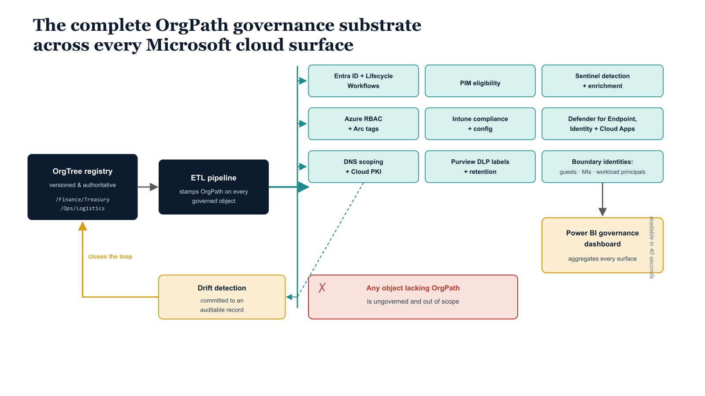

# Chapter 8 — Series Close: The Governance Substrate, Complete

::: {.callout-note}
## In this chapter
A reckoning with the full arc of the series rather than a summary: the problem of organizationally blind cloud tools (Part One), the requirement for an external authoritative definition (Part Two), the OrgTree-and-OrgPath proposal (Part Three), and the surface-by-surface proof of applicability across Parts Four through Twelve. It closes by naming the architectural principle the series establishes — organizational position as a first-class, durable governance attribute — and the operational maturity that follows implementation.
:::

It is worth pausing, at the conclusion of this final document, to account for what has actually been built across thirteen parts of this series. The accounting is not a summary in the ordinary sense — a summary would compress the work into bullet points, which would strip it of the thing that makes it meaningful. The meaning is in the sequence: each part of this series depended on the parts that preceded it, and the substrate it constructed was not complete until every surface had been addressed. What follows is a brief reckoning with the full arc of that construction, and a reflection on what it represents.

{#fig-book-13-cpt-08-diagram-01 fig-alt="Engineering blueprint diagram on a white background showing the complete OrgPath governance substrate. At the center-left a federal navy box labeled OrgTree registry, versioned and authoritative, with monospace node paths, feeds an arrow into a navy box labeled ETL pipeline stamps OrgPath on every governed object. From that pipeline a teal spine fans out to the right into stacked teal surface boxes, each labeled in monospace for one part of the series — Entra ID and Lifecycle Workflows, PIM eligibility, Sentinel detection and enrichment, Azure RBAC and Arc tags, Intune compliance and config, Defender for Endpoint Identity and Cloud Apps, DNS scoping and Cloud PKI, Purview DLP labels and retention, and boundary identities for guests managed identities and workload principals. A continuous amber feedback arrow runs back from a box labeled drift detection committed to an auditable record toward the OrgTree registry, closing the loop. On the far right a single amber box labeled Power BI governance dashboard, readable in forty seconds, aggregates every surface. A small red marker flags any object lacking OrgPath as ungoverned and out of scope. Monospace labels throughout, no human figures, 16:9 landscape." width="85%"}

Part One established the problem with the precision it deserved. A modern Microsoft cloud estate is not a single system. It is a federation of capable but organizationally blind tools — Entra ID knows about users and groups, Intune knows about devices and compliance policies, Sentinel knows about alerts and incidents, Purview knows about data classification and policy matches — and each of these tools carries its own implicit model of what organizational structure means. Entra ID infers organizational position from group membership and manager chain.

Intune derives policy scope from dynamic group queries that approximate organizational segments. Sentinel enriches alerts with the user and device attributes it can retrieve, but has no authoritative source of organizational context to draw from. The consequence of this fragmentation is that governance is performed by tools that each understand the organization differently, and the resulting policy landscape is inconsistent, difficult to audit, and impossible to report on in aggregate.

An auditor who asks "show me the governance posture of the Finance division" receives, at best, a collection of screenshots from six different engineering consoles. At worst, the organization cannot answer the question at all, because "Finance division" means something different to each tool.

Part Two named the requirement that follows from this problem. If the tools cannot agree on what organizational structure means, then something external to the tools must define it authoritatively and make that definition available to every tool that needs it. That something must be versioned, so that changes to organizational structure are traceable. It must be machine-readable, so that policy derivation can be automated. It must be auditable, so that the governance record reflects not just the current state of the hierarchy but every state it has been in.

And it must be capable of being projected as an attribute onto every managed object — user, device, server, application, network resource — so that each object carries its own organizational context wherever it goes, rather than relying on the consuming tool to infer that context from membership in a group or position in a directory tree.

Part Three made the proposal concrete: OrgTree as the registry, OrgPath as the attribute. OrgTree is a JSON document representing the organizational hierarchy as a directed tree of nodes, each node carrying a unique path string, a tier designation, a label, and an effective date range. OrgPath is that path string, stamped as an extension attribute on every governed object.

Together they constitute a pattern, not a product — a way of encoding organizational position that is independent of any specific vendor API, any specific compliance framework, or any specific organizational taxonomy. The pattern is deliberately minimal: it makes no assumptions about how deep the hierarchy is, what the tier labels mean, or how many nodes exist. It provides structure without imposing interpretation, which is what makes it applicable across every surface the Microsoft cloud ecosystem exposes.

Parts Four through Twelve are the proof of applicability — the surface-by-surface demonstration that a single organizational attribute can govern every plane the Microsoft cloud ecosystem exposes:

| Part | Surface | What OrgPath governs there |
| :--- | :--- | :--- |
| **Four** | Entra ID and Lifecycle Workflows | OrgPath propagation, plus the joiner task that stamps OrgPath at hire time |
| **Five** | Privileged Identity Management | PIM eligibility as a function of organizational position rather than a manually maintained assignment list |
| **Six** | Microsoft Sentinel | Detection and enrichment that attaches OrgPath to every alert, making organizational context a native property of the SecOps workflow |
| **Seven** | Azure resource plane | Azure RBAC scope derivation and the Arc tag propagation pipeline |
| **Eight** | Microsoft Intune | Compliance policy assignments and device configuration profiles derived from the attribute on each device's primary user |
| **Nine** | Defender suite | Enriching the investigation and alert surface of Defender for Endpoint, Defender for Identity, and Defender for Cloud Apps with OrgPath context |
| **Ten** | DNS and Cloud PKI | DNS scoping and certificate profile assignment, making both network identity and cryptographic identity organizational-position-aware |
| **Eleven** | Microsoft Purview | Scoping DLP policies, sensitivity label publishing, and retention policies to organizational segments |
| **Twelve** | Boundary identities | Governing B2B guest accounts, managed identities, service principals, and workload identities — the objects that do not fit the standard user-device model but must be governed within the organizational framework nonetheless |

The transformation that this substrate represents is not primarily technical. It is organizational. Before OrgPath, governance in a complex Microsoft cloud estate was performed by specialists who each understood one surface deeply, coordinated imperfectly at the boundaries between surfaces, and produced governance reports by assembling data manually from incompatible sources. The governance board received a picture of the organization's security and compliance posture that was always slightly stale, always slightly inconsistent, and never fully trustworthy as a basis for confident risk decisions. The specialists doing the work knew this.

The board knew this. The auditors knew this. The substrate does not eliminate that problem by decree — it eliminates it by construction.

When organizational position is a first-class attribute on every governed object, when every policy surface derives its scope from that attribute, when drift from the intended state is detected continuously and committed to an auditable record, and when the resulting intelligence is surfaced in a governance dashboard that any stakeholder can read in forty seconds, the problem of disconnected governance tools is not worked around — it is resolved at the architectural level.

> **Organizational position is the most durable and most broadly applicable dimension of identity governance** — more durable than group membership, more broadly applicable than role assignment, and more meaningful as an organizing principle than geographic location.

The architectural principle that this series establishes is worth naming precisely, because it will outlast any specific version of any specific tool. The principle is that organizational position is the most durable and most broadly applicable dimension of identity governance. It is more durable than group membership, which changes constantly and is managed inconsistently across surfaces. It is more broadly applicable than role assignment, which is surface-specific and cannot serve as a cross-surface correlator.

It is more meaningful than geographic location, which is a useful governance dimension but not the organizing principle around which policy responsibility, audit scope, and risk accountability are structured in most organizations. Encoding organizational position as a first-class attribute on every governed object, and deriving policy from that attribute consistently and automatically, enables a category of deterministic, auditable, organizationally-aware governance that is structurally impossible when organizational position is implicit, inferred separately by each tool, and never written down in a form that all tools can read.

The work that follows this series — for organizations that have implemented the substrate described across these thirteen parts — is operational maturity. The registry will need to be maintained as the organization evolves: divisions merge, business units are restructured, new OrgPath nodes are created and old ones retired. The drift detection thresholds will need to be tuned as the operational team learns which drift categories are genuinely anomalous and which reflect normal organizational churn.

The Power BI governance review cadence will need to be embedded in the governance calendar so that the investment in the reporting layer is actually exercised, rather than being a technical capability that exists but is not used. New Microsoft cloud surfaces will be introduced over time, and each will need to be evaluated against the OrgPath pattern to determine whether it can be made organizational-position-aware — and the pattern documented in this series provides a clear template for making that determination and executing that integration.

The substrate makes all of this ongoing work tractable. What was previously a manual, inconsistent, audit-period scramble is now a continuous, measurable, organizationally-aware governance operation with a clear source of truth, an automated enforcement pipeline, and an audience for its intelligence.

That is a meaningful change. It does not happen by accident, and it does not happen in one sprint. It happens by doing the architectural work carefully, surface by surface, in a sequence that builds on itself — which is what this series set out to document, and what, across thirteen parts and one supplement, it has done.

::: {.callout-note title="Series Progression — Final"}
This document is <strong>Part Thirteen of Thirteen</strong> in the OrgTree and OrgPath Governance Architecture series. It is the final and capstone document of the series. No additional parts are planned.

The complete series is available as a document set from <strong>Part One</strong> through <strong>Part Thirteen</strong>, with <strong>Supplement 8S</strong> covering third-party DDI (DNS, DHCP, IPAM) integration for environments that use non-Microsoft DDI platforms alongside Cloud PKI and OrgPath-scoped DNS policy.

Each document in the series is a standalone implementation guide and may be referenced independently. The series is designed to be implemented in part-order, as each part's implementation depends on the infrastructure established by its predecessors. Organizations that have completed Parts One through Twelve and implemented the reporting layer described in this document have a complete, operational OrgPath governance substrate.
:::
