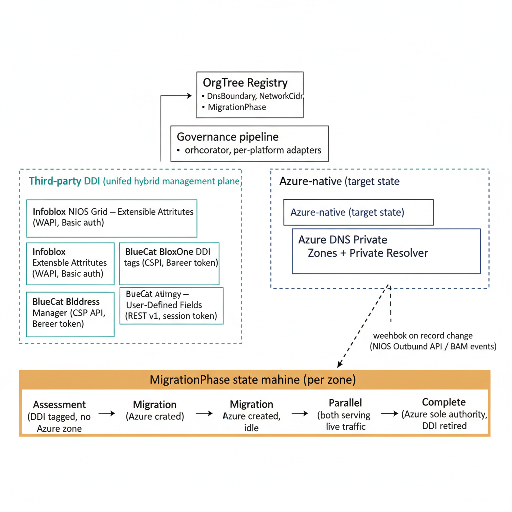

# Chapter 1 — The Case for Infoblox and BlueCat as the DDI Control Plane

::: {.callout-note}
## In this chapter
Why a hybrid estate runs on two uncoordinated address-management planes — Azure DNS Private Zones and the Windows Server IPAM role — and what that split costs operationally. This chapter names the three predictable failure modes that follow, shows how a unified DDI control plane (Infoblox NIOS, Infoblox BloxOne, or BlueCat Address Manager) provides the single management plane that prevents them, and describes how OrgPath governance extends to the DDI API. It also draws the boundary that the rest of this book turns on: the MigrationPhase state machine carries each *DNS zone* from Assessment to Complete as authority moves to Azure, but DHCP and IPAM have no such migration — Infoblox remains the permanent authority for both, as Chapters Six and Seven detail.
:::

## The View From Two Screens

The most direct way to describe what Infoblox and BlueCat provide that Azure-native tooling does not is to describe the view from the operations center during an active hybrid migration. On one screen, an administrator has the Azure portal open, displaying the DNS Private Zones blade for the hub subscription — a list of zones, some populated with records, some still empty stubs waiting for their on-premises counterparts to be migrated. On a second screen, the same administrator has a Windows Server IPAM console open, displaying the DHCP scopes and DNS zones managed by the on-premises domain controllers.

> These are two distinct management planes. They share no query interface, no audit trail, and no change workflow.

A query against one does not produce results from the other. An audit log entry in Azure Monitor tells the administrator what changed in Azure DNS; a Windows Event Log entry on the IPAM server tells the administrator what changed on-premises. The two logs are not correlated, and there is no native mechanism to correlate them.

Each plane is capable in isolation. Azure DNS Private Zones manages cloud-hosted private namespaces with precision and at scale. The Windows Server IPAM role manages the on-premises DHCP and DNS estate through a Microsoft-native interface that integrates cleanly with Active Directory and with the DHCP and DNS roles on Windows Server.

What neither provides is a single unified management plane that spans both surfaces simultaneously — a console where an administrator can query every subnet, every DHCP scope, every DNS zone, and every IP address allocation across both on-premises and Azure, side by side, using a single query language, producing a single audit trail, and enforcing a single change workflow.

This is the capability gap that a dedicated DDI control plane fills, and it is a gap that becomes operationally significant the moment an organization begins moving workloads between environments at any meaningful pace. It does not close when the migration ends. Azure native tooling will, in time, take full authority for DNS; it offers no scope-based DHCP service and no authoritative hybrid IPAM, so the unified plane that spans both surfaces remains necessary long after the last DNS zone has cut over.

{#fig-14-orgpath-with-third-party-ddi-diagram-01 fig-alt="Top-center pair: OrgTree Registry (DnsBoundary, NetworkCidr, MigrationPhase) → Governance pipeline (orchestrator, per-platform adapters). The pipeline fans down into two parallel labeled clusters. Left cluster \"Third-party DDI (unified hybrid management plane)\" contains three platform boxes side-by-side: Infoblox NIOS Grid — Extensible Attributes (WAPI, Basic auth); Infoblox BloxOne DDI — tags (CSP API, Bearer token); BlueCat Address Manager — User-Defined Fields (REST v1, session token). Right cluster \"Azure-native (DNS target state)\" contains a single box: Azure DNS Private Zones + Private Resolver. Below both clusters, a horizontal state-machine band labeled \"MigrationPhase state machine (DNS surface only, per zone)\" shows four sequential states connected left-to-right by solid arrows: Assessment (DDI tagged, no Azure zone) → Migration (Azure zone created, idle) → Parallel (both serving live traffic) → Complete (Azure sole DNS authority, Grid keeps running). A small caption beneath the band reads \"DHCP and IPAM: no migration, Infoblox permanent (Ch 6 and 7)\". A dashed arrow from the \"Parallel\" state upward to the Azure-native cluster's Private Zones box, labeled \"webhook on record change (NIOS Outbound API / BAM events)\". Engineering blueprint style, white background, teal (#1A9E8F) for third-party DDI, federal navy (#1F3A5F) for Azure-native, amber (#D4A017) for the state-machine band, 16:9 landscape." width="100%"}

## Three Failure Modes of Two Uncoordinated Address Spaces

The consequences of managing two uncoordinated address spaces are concrete and predictable. They are sharpest during an active hybrid transition, but they do not disappear once it ends — a steady-state hybrid estate still runs DHCP and IPAM that Azure cannot natively govern. Three failure modes recur, and each is hard to diagnose precisely because neither plane reports the problem:

| Failure mode | What goes wrong | Why it is hard to diagnose |
| :--- | :--- | :--- |
| **IP address conflicts** | On-premises ranges collide with cloud-allocated virtual network address spaces, causing connectivity failures | Neither side reports the conflict — each system believes its allocations are authoritative; the failure manifests only when a packet attempts to route to an address claimed by both environments |
| **DNS mismatches** | Zones still authoritative on on-premises domain controllers diverge from zones being built out in Azure DNS Private Zones | Name resolution fails for specific client populations only: Azure-hosted workloads resolve from Azure DNS and may see an incomplete or divergent zone, while on-premises clients resolve from domain controller DNS and see the original zone in full |
| **DHCP stale leases** | Partially migrated scopes — some addresses managed on-premises, others implicitly allocated by Azure Virtual Network — produce stale leases on both sides | On-premises DHCP servers offer addresses Azure may have already assigned to a VM NIC, and Azure offers address ranges that on-premises DHCP scopes have not been told to exclude |

A dedicated DDI control plane — Infoblox NIOS, Infoblox BloxOne, or BlueCat Address Manager — provides the unified view that prevents these failures, and it does so permanently rather than only for the duration of the transition. All three platforms are designed specifically for the problem of managing heterogeneous network address and DNS infrastructure from a single management plane. They maintain a master record of every allocated subnet, every DHCP scope and its lease history, and every DNS zone and its record set, regardless of where those objects physically reside.

An administrator working in the Infoblox Grid Manager or the BlueCat Address Manager interface can query the entire IP space with a single search and see, in a single result set, subnets allocated to on-premises VLANs and subnets assigned to Azure virtual networks. A change to a DNS zone travels through the DDI platform's change workflow — approval, audit, rollback — before being committed to the authoritative name server, whether that name server is an on-premises domain controller DNS or a BlueCat-managed DNS server.

> The unified audit trail that the platform produces satisfies operational governance requirements that two disconnected audit logs do not.

## The Architecture This Document Describes

The integration architecture described in this document positions the DDI control plane as the system of record for IP address management. It also holds DNS authority during the hybrid transition — but that DNS role is the one part of the platform's mandate that is genuinely transitional. DHCP and IPAM authority are not: Azure has no scope-based DHCP service to receive them and no authoritative hybrid IPAM to replace them, so they stay in Infoblox permanently. This is not a parallel or shadow system — it is the primary management interface through which network and DNS changes are made, reviewed, and approved.

The OrgPath governance pipeline extends to include the DDI platform's REST API as a target alongside the Entra ID directory, the Intune endpoint management plane, and Azure Resource Manager. When an OrgTree node is created, modified, or retired in the governance repository, the pipeline propagates the change to every downstream system in a single run:

| Downstream system | What the pipeline propagates |
| :--- | :--- |
| **Entra ID** | Updated dynamic group membership rules |
| **Intune** | Updated compliance policy assignments |
| **Azure Resource Manager** | Updated resource tags on Arc-enrolled servers and Azure workloads |
| **DDI platform** | Updated extensible attributes on the DNS zones and IP networks that correspond to the changed node |

The organizational context — the OrgPath identifier, the node ID, the management tier, the migration phase — is stamped on every object in every system simultaneously by the same pipeline run.

## The MigrationPhase State Machine

The MigrationPhase state machine governs the **DNS surface only**. It tracks the movement of *DNS authority* — zone by zone — from the DDI platform to Azure DNS Private Zones backed by the Azure DNS Private Resolver. It does not govern DHCP or IPAM, and it is important to be precise about why: there is no Azure-native target for those two functions to migrate *to*. Azure VNet DHCP is platform-managed and exposes no administrable, scope-based service; Azure Virtual Network Manager's IPAM is cloud-only and is not authoritative for on-premises address space. DHCP and IPAM therefore have no MigrationPhase, no "Complete" state, and no exit — they remain in Infoblox permanently, as Chapters Six and Seven describe in full.

For DNS, each zone object in the DDI platform carries a `MigrationPhase` attribute that moves through four states:

1. **Assessment** — the zone exists in the DDI platform and has been tagged with OrgPath attributes but has no corresponding Azure DNS Private Zone.
2. **Migration** — an Azure DNS Private Zone has been created but is not yet serving live resolution traffic.
3. **Parallel** — both the DDI platform zone and the Azure DNS Private Zone are active and serving resolution for their respective client populations. This is the steady state during the main body of the transition.
4. **Complete** — the Azure DNS Private Zone is the sole authoritative source for that zone, all clients have been redirected, and DNS *authority* for the zone now rests with Azure. The DDI platform stops serving that zone's resolution; it does not stop running.

> When every DNS zone carries a `MigrationPhase` of Complete, the cutover criteria described in Chapter Five are met and DNS authority can move to Azure. The Grid is not retired: DHCP and IPAM remain in Infoblox as the permanent authority (Chapters Six and Seven), and the platform keeps running for both.
