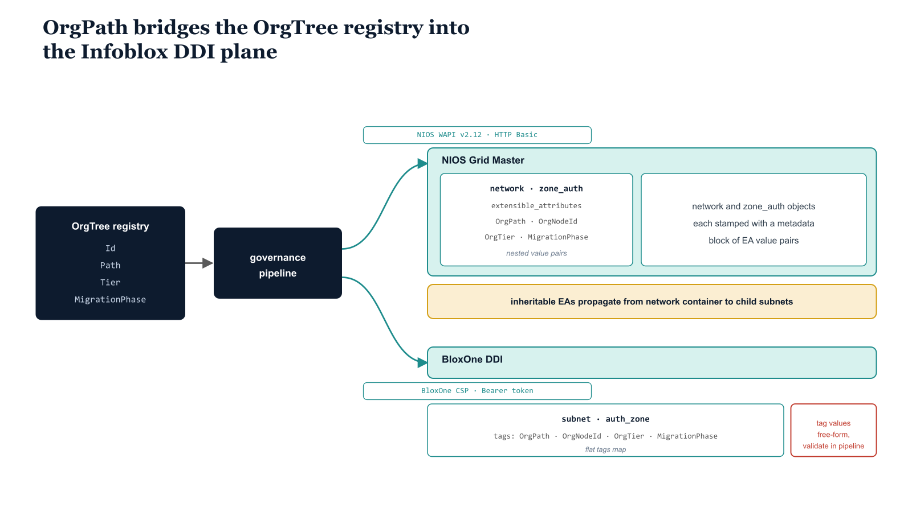

# Chapter 2 — Infoblox — Extensible Attributes as the OrgPath Bridge

::: {.callout-note}
## In this chapter
Infoblox exposes organizational context the same way every other governed surface does — as metadata stamped on its objects. This chapter covers the two relevant deployment models (the on-premises NIOS Grid and the cloud-native BloxOne DDI), the four Extensible Attribute definitions that carry OrgPath into the Grid, the idempotent registration and synchronization scripts that stamp them on networks and zones, and the BloxOne tag model that mirrors the same intent under a different authentication scheme and metadata structure.
:::

## Two Deployment Models, One Integration Pattern

Infoblox offers two deployment models that are relevant to this integration, and the choice between them is typically determined by what an organization already has in place rather than by a fresh architectural decision.

| Deployment model | What it is | Management surface | Authentication |
| :--- | :--- | :--- | :--- |
| **NIOS** | On-premises Grid — physical or virtual appliances (Grid Members and a Grid Master). The dominant enterprise DDI platform for more than a decade; most large enterprise Infoblox deployments run NIOS in some form. | NIOS web interface and the WAPI REST API | HTTP Basic against the Grid Master |
| **BloxOne DDI** | Cloud-native SaaS successor, delivered as a managed service. Can coexist with a NIOS Grid or operate independently; organizations migrating from NIOS may run both simultaneously during the transition. | Infoblox Cloud Services Portal at `csp.infoblox.com` | Bearer token |

Both platforms expose a REST API surface for network, zone, and object management, and the OrgPath integration pattern is identical in concept on both. NIOS WAPI calls are directed to the base URL `https://{gridmaster-fqdn}/wapi/v2.12/`, where `v2.12` corresponds to NIOS 8.x builds; earlier NIOS versions use earlier WAPI versions and the version component in the URL should be adjusted accordingly. BloxOne API calls are directed to `https://csp.infoblox.com/api/ddi/v1/` and authenticated with a Bearer token rather than HTTP Basic credentials.

{#fig-book-14-cpt-02-diagram-01 fig-alt="Engineering blueprint diagram on a white background showing how OrgPath bridges the OrgTree registry into the Infoblox DDI plane. On the left a federal navy #1F3A5F box labeled OrgTree registry with monospace node entries Id, Path, Tier, MigrationPhase feeds a navy box labeled governance pipeline. From the pipeline two parallel teal #1A9E8F branches fan to the right. The upper branch labeled NIOS WAPI v2.12 HTTP Basic leads to a teal box labeled NIOS Grid Master, which contains network and zone_auth objects each stamped with a metadata block extensible_attributes nested value pairs for OrgPath, OrgNodeId, OrgTier, MigrationPhase. The lower branch labeled BloxOne CSP Bearer token leads to a teal box labeled BloxOne DDI, which contains subnet and auth_zone objects each stamped with a flat tags map for the same four keys. An amber #D4A017 callout band across the bottom labeled inheritable EAs propagate from network container to child subnets points up at the NIOS container. A small red #C0392B note labeled tag values free-form, validate in pipeline marks the BloxOne branch. All object and field labels in monospace, no human figures, 16:9 landscape." width="100%"}

Beyond the authentication model and the base URL, the structural intent of the API calls is the same: network objects, DNS zones, and DHCP scope objects carry OrgPath values as metadata — Extensible Attributes in the NIOS model, tags in the BloxOne model — and the governance pipeline reads and writes those metadata values through the respective API endpoints.

> The downstream effect, from the OrgPath model's perspective, is identical: every object in the DDI system expresses the same organizational context that every object in Entra ID, Intune, and Azure Resource Manager expresses.

## Infoblox Extensible Attributes — Structure and Definition

Extensible Attributes are custom metadata fields that Infoblox administrators define globally in the NIOS system and then assign to any object type — networks, zones, hosts, fixed addresses, DHCP scopes, and DNS records. An EA definition has a name, a data type, and optionally a list of allowed values for Enum-type attributes. Once defined, an EA is available across the entire Grid and can be set on any supported object.

The **inheritance flag** on an EA definition controls whether child objects — subnets within a network container, zones within a parent zone — automatically inherit the EA value from their parent unless explicitly overridden.

> Inheritance is what makes the integration efficient: setting the OrgPath EA on a top-level network container automatically propagates the value to all subnets within it, without requiring the governance pipeline to enumerate and tag every child object individually.

### The Four Required EA Definitions

For OrgPath integration, four EA definitions are required in the NIOS Grid:

| EA name | Type | Inheritable | Purpose |
| :--- | :--- | :--- | :--- |
| **OrgPath** | String | Yes | The full hierarchy path from the OrgTree root to the governing node, in standard OrgPath path notation (e.g. `/root/operations/infrastructure/network`). Child objects in a tagged container inherit the path unless a more specific value is assigned at a lower level. |
| **OrgNodeId** | String | Yes | The leaf node identifier from the OrgTree registry — the short, stable identifier used as the primary key for lookups in the governance pipeline. |
| **OrgTier** | Enum | Yes | The management tier classification applied to the node in the OrgTree registry. Allowed values: `Tier0`, `Tier1`, `Tier2`, `Unclassified`. All objects within a `Tier0` network container are treated as `Tier0` by default. |
| **MigrationPhase** | Enum | No | The migration state of an individual zone or network. Not inheritable, because migration phase is a property of individual objects, not one that should cascade from a container to every child automatically. |

The `MigrationPhase` Enum carries four values, each marking a distinct point in a zone's transition from NIOS-authoritative to Azure DNS:

| Value | Meaning |
| :--- | :--- |
| `Assessment` | Tagged; no Azure DNS counterpart yet |
| `Migration` | Azure DNS zone created; not yet serving live traffic |
| `Parallel` | Both NIOS and Azure DNS active simultaneously |
| `Complete` | Fully migrated; NIOS zone retired |

These four EA definitions are created once as a setup step, before any governance pipeline synchronization runs against the Grid. The following PowerShell function performs this registration via the NIOS WAPI REST API. It is idempotent: it checks for the existence of each EA definition before attempting to create it, so it can be run safely against a Grid where some or all of the definitions already exist.

```powershell
#
# Register-NiosOrgPathAttributes.ps1
#
# .SYNOPSIS
#     Creates the four OrgPath Extensible Attribute definitions in an
#     Infoblox NIOS Grid via the WAPI REST API.
#
# .DESCRIPTION
#     Extensible Attributes must be defined globally in NIOS before they can
#     be applied to individual network, zone, or host objects. Run this
#     function once against the Grid Master before running any OrgPath
#     synchronization script. The function is idempotent and safe to re-run.
#
# .PARAMETER GridMasterFqdn
#     Fully qualified domain name of the NIOS Grid Master.
#     ENVIRONMENT VALUE — replace with your Grid Master hostname.
#     Example: "gridmaster.corp.contoso.com"
#
# .PARAMETER Credential
#     PSCredential with NIOS API access. Use a dedicated API-only service
#     account rather than a shared admin credential.
#     Obtain with: $cred = Get-Credential
#
# .NOTES
#     NIOS WAPI version: v2.12 (NIOS 8.x).
#     Adjust the version segment in $baseUri for older Grid builds:
#       NIOS 7.x = wapi/v2.5
#       NIOS 8.2 = wapi/v2.10
#       NIOS 8.5 = wapi/v2.12
#     TLS: Uses the system certificate trust store. In lab environments with
#     a self-signed Grid Master certificate, add -SkipCertificateCheck to
#     each Invoke-RestMethod call (PowerShell 7.1+) or set a bypass callback.
#     API reference: POST /wapi/v{version}/extensibleattributedef
#

function Register-NiosOrgPathAttributes {
    param(
        [Parameter(Mandatory = $true)]
        [string]      $GridMasterFqdn,   # ENVIRONMENT VALUE

        [Parameter(Mandatory = $true)]
        [PSCredential]$Credential
    )

    $baseUri  = "https://$GridMasterFqdn/wapi/v2.12"
    $headers  = @{ "Content-Type" = "application/json" }
    $authArgs = @{
        Credential     = $Credential
        Authentication = "Basic"
    }

    # Define the four required OrgPath EA definitions.
    # Each entry maps to one POST /wapi/v2.12/extensibleattributedef call.
    $attributeDefinitions = @(
        @{
            name    = "OrgPath"
            comment = "OrgPath governance substrate — full hierarchy path from root to this object node"
            type    = "STRING"
            flags   = "I"   # I = inheritable; child objects inherit if not explicitly overridden
        },
        @{
            name    = "OrgNodeId"
            comment = "Leaf node identifier from the OrgTree registry (primary key for pipeline lookups)"
            type    = "STRING"
            flags   = "I"   # Inheritable — propagates from network containers to child subnets
        },
        @{
            name    = "OrgTier"
            comment = "Management tier classification — Tier0 (highest), Tier1, Tier2, or Unclassified"
            type    = "ENUM"
            flags   = "I"   # Inheritable — objects within a Tier0 network inherit Tier0 by default
            listValues = @(
                @{ value = "Tier0" },
                @{ value = "Tier1" },
                @{ value = "Tier2" },
                @{ value = "Unclassified" }
            )
        },
        @{
            name    = "MigrationPhase"
            comment = "Current migration state of this network or zone object"
            type    = "ENUM"
            flags   = ""    # NOT inheritable — migration phase is per-object, not per-container
            listValues = @(
                @{ value = "Assessment" },   # Tagged; no Azure DNS counterpart yet
                @{ value = "Migration" },    # Azure DNS zone created; not yet serving live traffic
                @{ value = "Parallel" },     # Both NIOS and Azure DNS active simultaneously
                @{ value = "Complete" }      # Fully migrated; NIOS zone retired
            )
        }
    )

    foreach ($attrDef in $attributeDefinitions) {

        # Check whether the EA definition already exists to keep this idempotent.
        # The NIOS API returns an array; an empty array means the EA does not exist.
        $checkUri = "$baseUri/extensibleattributedef?name=$($attrDef.name)"
        $existing = Invoke-RestMethod `
            -Uri      $checkUri `
            -Method   GET `
            @authArgs `
            -Headers  $headers

        if ($existing.Count -gt 0) {
            Write-Host "  [EXISTS]   EA definition already present: $($attrDef.name)"
            continue
        }

        # Serialize and POST the new EA definition.
        # The WAPI returns the object reference (_ref) of the new definition.
        $body   = $attrDef | ConvertTo-Json -Depth 5
        $result = Invoke-RestMethod `
            -Uri     "$baseUri/extensibleattributedef" `
            -Method  POST `
            -Body    $body `
            @authArgs `
            -Headers $headers

        Write-Host "  [CREATED]  EA definition registered: $($attrDef.name) — ref: $result"
    }

    Write-Host ""
    Write-Host "OrgPath EA definitions registered in NIOS Grid: $GridMasterFqdn"
}

# Invocation example — run interactively or from the pipeline with stored credentials:
#   $cred = Get-Credential -Message "NIOS API service account"
#   Register-NiosOrgPathAttributes -GridMasterFqdn "gridmaster.corp.contoso.com" -Credential $cred
```

## The NIOS Synchronization Pipeline Script

With the EA definitions in place, the governance pipeline can begin stamping OrgPath values on network and zone objects in the Grid. The synchronization script below is the NIOS counterpart to the `Sync-OrgPathDnsZones.ps1` script described in Part Eight for Azure DNS Private Zones. It reads the OrgTree registry JSON file that is checked out from the governance repository at the start of each pipeline run, iterates over every active node, and for each node that is flagged as a DNS boundary or carries a network CIDR in its metadata, either creates the corresponding NIOS object or updates the Extensible Attributes on an existing object.

> The script is triggered on OrgTree commits as part of the governance propagation pipeline and runs on the automation server — a Windows Server host that has network access to the Grid Master WAPI endpoint and the necessary credentials stored in the Windows Credential Manager or a secrets vault.

```powershell
#
# Sync-OrgPathToNios.ps1
#
# .SYNOPSIS
#     Synchronizes OrgTree nodes to Infoblox NIOS network objects and
#     DNS zones, stamping OrgPath Extensible Attributes on each object.
#
# .DESCRIPTION
#     This script is the NIOS equivalent of Sync-OrgPathDnsZones.ps1
#     (Part Eight, Azure DNS). For each active OrgTree node that is flagged
#     as a DNS boundary or carries a network CIDR, it creates or updates
#     the corresponding NIOS zone_auth and network objects with all four
#     OrgPath EAs.
#
#     Run by the governance pipeline on every OrgTree commit. The pipeline
#     checks out the registry file before invocation and commits the
#     resulting log to the governance repository after completion.
#
# .PARAMETER OrgTreeRegistryPath
#     Local filesystem path to the checked-out OrgTree registry JSON file.
#     ENVIRONMENT VALUE — set to the checkout path used by your pipeline agent.
#     Default: "C:\governance\orgtree\registry.json"
#
# .PARAMETER GridMasterFqdn
#     FQDN of the NIOS Grid Master WAPI endpoint.
#     ENVIRONMENT VALUE — replace with your Grid Master hostname.
#     Default: "gridmaster.corp.contoso.com"
#
# .PARAMETER Credential
#     PSCredential for the NIOS API service account. In pipeline execution,
#     retrieve from the secrets vault rather than prompting interactively.
#
# .PARAMETER NetworkView
#     The NIOS Network View in which to create or tag network objects.
#     ENVIRONMENT VALUE — set to "default" unless your Grid uses named views.
#     Default: "default"
#
# .PARAMETER DnsView
#     The NIOS DNS View in which to create or tag zones.
#     ENVIRONMENT VALUE — set to "default" unless your Grid uses split DNS views.
#     Default: "default"
#
# .PARAMETER BaseDomainSuffix
#     The base DNS suffix appended to each OrgTree node ID to form zone FQDNs.
#     ENVIRONMENT VALUE — replace with your organization's internal DNS suffix.
#     Example: "corp.contoso.com" produces zones like "finance.corp.contoso.com"
#

param(
    [string]      $OrgTreeRegistryPath = "C:\governance\orgtree\registry.json", # ENVIRONMENT VALUE
    [string]      $GridMasterFqdn      = "gridmaster.corp.contoso.com",          # ENVIRONMENT VALUE
    [PSCredential]$Credential          = (Get-Credential -Message "NIOS API credentials"),
    [string]      $NetworkView         = "default",                              # ENVIRONMENT VALUE
    [string]      $DnsView             = "default",                              # ENVIRONMENT VALUE
    [string]      $BaseDomainSuffix    = "corp.contoso.com"                     # ENVIRONMENT VALUE
)

Set-StrictMode -Version Latest
$ErrorActionPreference = "Stop"

$baseUri  = "https://$GridMasterFqdn/wapi/v2.12"
$authArgs = @{ Credential = $Credential; Authentication = "Basic" }
$jsonHdr  = @{ "Content-Type" = "application/json" }

# Load and parse the OrgTree registry. The registry is a JSON file produced
# by the OrgTree management tooling and stored in the governance repository.
# Schema: { "nodes": [ { "Id": "...", "Name": "...", "Path": "...",
#           "Status": "Active|Retired", "Tier": "Tier0|...",
#           "DnsBoundary": true|false, "NetworkCidr": "10.x.x.x/nn",
#           "MigrationPhase": "Assessment|Migration|Parallel|Complete" }, ... ] }
$registry    = Get-Content $OrgTreeRegistryPath -Raw | ConvertFrom-Json
$activeNodes = $registry.nodes | Where-Object { $_.Status -eq "Active" }

Write-Host "[$(Get-Date -f 'HH:mm:ss')] Starting NIOS OrgPath synchronization."
Write-Host "[$(Get-Date -f 'HH:mm:ss')] Active OrgTree nodes to process: $($activeNodes.Count)"
Write-Host ""

$stats = @{
    ZonesCreated   = 0
    ZonesUpdated   = 0
    NetworksTagged = 0
    Skipped        = 0
    Errors         = 0
}

foreach ($node in $activeNodes) {

    # ---------------------------------------------------------------
    # Build the Extensible Attribute payload for this node.
    # NIOS EA format in the REST body:
    #   { "extensible_attributes": { "AttrName": { "value": "AttrValue" } } }
    # The MigrationPhase and OrgTier fields fall back to safe defaults
    # if the registry entry does not carry an explicit value.
    # ---------------------------------------------------------------
    $eaPayload = @{
        extensible_attributes = @{
            OrgPath        = @{ value = $node.Path }
            OrgNodeId      = @{ value = $node.Id }
            OrgTier        = @{ value = if ($node.Tier)            { $node.Tier }            else { "Unclassified" } }
            MigrationPhase = @{ value = if ($node.MigrationPhase)  { $node.MigrationPhase }  else { "Assessment"   } }
        }
    }

    # ---------------------------------------------------------------
    # DNS Zone Synchronization
    # Applies when the OrgTree node is flagged as a DNS boundary —
    # meaning it represents a distinct DNS namespace within the tree.
    # ---------------------------------------------------------------
    if ($node.DnsBoundary -eq $true) {

        # Construct the zone FQDN from the node ID and the base domain suffix.
        # Node IDs are lowercased for DNS compatibility.
        $zoneFqdn = "$($node.Id.ToLower()).$BaseDomainSuffix"

        try {
            # Search for an existing authoritative zone with this FQDN.
            # The query uses the NIOS URL-encoded search parameter syntax.
            $zoneSearchUri = "$baseUri/zone_auth?fqdn=$zoneFqdn&view=$DnsView"
            $existingZone  = Invoke-RestMethod `
                -Uri     $zoneSearchUri `
                -Method  GET `
                @authArgs

            if ($existingZone.Count -gt 0) {

                # Zone exists — update its Extensible Attributes only.
                # Use the _ref returned by NIOS to target the specific object.
                $zoneRef = $existingZone[0]._ref

                Invoke-RestMethod `
                    -Uri     "$baseUri/$zoneRef" `
                    -Method  PUT `
                    -Body    ($eaPayload | ConvertTo-Json -Depth 5) `
                    @authArgs `
                    -Headers $jsonHdr | Out-Null

                Write-Host "  [UPDATED-ZONE]  $zoneFqdn"
                $stats.ZonesUpdated++

            } else {

                # Zone does not exist — create it with OrgPath EAs embedded
                # in the creation body. Merging the zone properties and the
                # EA payload into a single object sends both in one POST call.
                $zoneBody = (@{
                    fqdn        = $zoneFqdn
                    view        = $DnsView
                    zone_format = "FORWARD"
                    comment     = "OrgPath governance zone — $($node.Name) [$($node.Path)]"
                } + $eaPayload)

                Invoke-RestMethod `
                    -Uri     "$baseUri/zone_auth" `
                    -Method  POST `
                    -Body    ($zoneBody | ConvertTo-Json -Depth 5) `
                    @authArgs `
                    -Headers $jsonHdr | Out-Null

                Write-Host "  [CREATED-ZONE]  $zoneFqdn"
                $stats.ZonesCreated++
            }

        } catch {
            Write-Warning "  [ERROR-ZONE]    $zoneFqdn — $_"
            $stats.Errors++
        }
    }

    # ---------------------------------------------------------------
    # Network Container Tagging
    # Applies when the OrgTree node carries a NetworkCidr value,
    # indicating it governs a specific IP address range. The network
    # object must already exist in NIOS — this script tags it with
    # OrgPath EAs but does not create new network containers from scratch.
    # New network containers should be created through the standard NIOS
    # IPAM workflow before this script is run against them.
    # ---------------------------------------------------------------
    if ($node.NetworkCidr) {

        try {
            # Search for the network in NIOS by CIDR notation.
            $netSearchUri = "$baseUri/network?network=$($node.NetworkCidr)&network_view=$NetworkView"
            $existingNet  = Invoke-RestMethod `
                -Uri    $netSearchUri `
                -Method GET `
                @authArgs

            if ($existingNet.Count -gt 0) {

                $netRef = $existingNet[0]._ref
                Invoke-RestMethod `
                    -Uri     "$baseUri/$netRef" `
                    -Method  PUT `
                    -Body    ($eaPayload | ConvertTo-Json -Depth 5) `
                    @authArgs `
                    -Headers $jsonHdr | Out-Null

                Write-Host "  [TAGGED-NET]    $($node.NetworkCidr) → $($node.Path)"
                $stats.NetworksTagged++

            } else {
                # The network does not exist in NIOS yet. This is a warning,
                # not an error — it is expected for nodes that have been added
                # to the OrgTree registry before the NIOS network container
                # has been provisioned through the IPAM workflow.
                Write-Warning "  [NOT-FOUND-NET] $($node.NetworkCidr) — node $($node.Id) — create the network in NIOS first."
                $stats.Skipped++
            }

        } catch {
            Write-Warning "  [ERROR-NET]     $($node.NetworkCidr) — $_"
            $stats.Errors++
        }
    }
}

# ---------------------------------------------------------------
# Summary report — printed to pipeline log and committed to the
# governance repository as part of the pipeline run artifact.
# ---------------------------------------------------------------
Write-Host ""
Write-Host "========================================================"
Write-Host "  Infoblox NIOS OrgPath Synchronization — Complete"
Write-Host "========================================================"
Write-Host "  DNS Zones Created  : $($stats.ZonesCreated)"
Write-Host "  DNS Zones Updated  : $($stats.ZonesUpdated)"
Write-Host "  Networks Tagged    : $($stats.NetworksTagged)"
Write-Host "  Skipped (missing)  : $($stats.Skipped)"
Write-Host "  Errors             : $($stats.Errors)"
Write-Host "  Run completed at   : $(Get-Date -f 'yyyy-MM-dd HH:mm:ss') UTC"
Write-Host "========================================================"
```

## Infoblox BloxOne DDI — Bearer Token Authentication and Tag Structure

BloxOne DDI uses a fundamentally different authentication model and a different metadata structure than NIOS, even though the conceptual purpose of the integration is identical. The differences fall into three areas:

| Aspect | NIOS | BloxOne DDI |
| :--- | :--- | :--- |
| **Authentication** | HTTP Basic against the Grid Master | Bearer token — an API key generated in the Cloud Services Portal under **Administration > API Keys > Create API Key**, presented in the `Authorization` header of every call as `Token {api-key-value}` |
| **Metadata structure** | `extensible_attributes` object with the value nested as `{ "value": "..." }` | A flat `tags` object where each key maps directly to a string value |
| **Resource paths** | `network`, `zone_auth` under `/wapi/v2.12/` | `/api/ddi/v1/ipam/subnet` (subnets), `/api/ddi/v1/dns/auth_zone` (authoritative zones), `/api/ddi/v1/dns/record` (DNS records) |

> The API key should never appear in a script file. Store it in the Windows Credential Manager, a secrets vault such as Azure Key Vault, or the pipeline runtime's secure variable storage, and retrieve it into a PowerShell variable at runtime.

The following function demonstrates the BloxOne authentication pattern and the zone creation call with embedded OrgPath tags. It is structured as a function rather than a script so it can be called from the main governance pipeline orchestrator, which handles the OrgTree registry iteration and passes individual node values to platform-specific functions like this one.

```powershell
#
# New-BloxOneAuthZoneWithOrgPath
#
# .SYNOPSIS
#     Creates an authoritative DNS zone in Infoblox BloxOne DDI and stamps
#     OrgPath governance tags on the resulting zone object.
#
# .DESCRIPTION
#     BloxOne uses Bearer token authentication. Tags are a flat key-value
#     object in the request body — not the nested NIOS extensible_attributes
#     structure. This function wraps the BloxOne auth_zone creation call
#     and is designed to be called from the governance pipeline orchestrator
#     for each OrgTree node flagged as a DNS boundary.
#
#     If the zone already exists, the function retrieves it by FQDN and
#     issues a PATCH request to update the tags only, leaving all other
#     zone properties unchanged.
#
# .PARAMETER ApiKey
#     BloxOne API key from CSP: Administration > API Keys > Create API Key.
#     ENVIRONMENT VALUE — retrieve from secrets vault at runtime.
#     NEVER hardcode this value in the script file or in source control.
#
# .PARAMETER ZoneFqdn
#     Fully qualified domain name of the authoritative zone to create.
#     Example: "finance.corp.contoso.com"
#
# .PARAMETER OrgPath
#     Full OrgPath hierarchy string from the OrgTree registry node.
#     Example: "/root/operations/infrastructure/network/finance"
#
# .PARAMETER OrgNodeId
#     Node identifier from the OrgTree registry. Used as the primary
#     key for governance pipeline lookups.
#
# .PARAMETER OrgTier
#     Management tier classification. Accepted values: Tier0, Tier1,
#     Tier2, Unclassified. Defaults to "Unclassified" if not specified.
#
# .PARAMETER MigrationPhase
#     Current migration state. Accepted values: Assessment, Migration,
#     Parallel, Complete. Defaults to "Assessment" if not specified.
#
# .PARAMETER PrimaryType
#     BloxOne zone primary type. "cloud" = BloxOne-hosted (default).
#     "external" = delegated to an external name server.
#     ENVIRONMENT VALUE — set to "cloud" for BloxOne-managed zones.
#

function New-BloxOneAuthZoneWithOrgPath {
    param(
        [Parameter(Mandatory = $true)]
        [string]$ApiKey,            # ENVIRONMENT VALUE — from secrets vault

        [Parameter(Mandatory = $true)]
        [string]$ZoneFqdn,

        [Parameter(Mandatory = $true)]
        [string]$OrgPath,

        [Parameter(Mandatory = $true)]
        [string]$OrgNodeId,

        [string]$OrgTier        = "Unclassified",
        [string]$MigrationPhase = "Assessment",
        [string]$PrimaryType    = "cloud"         # ENVIRONMENT VALUE
    )

    # Build request headers — Bearer token auth is the only authentication
    # method supported by the BloxOne Cloud Services Portal API.
    $headers = @{
        Authorization  = "Token $ApiKey"
        "Content-Type" = "application/json"
    }

    $bloxOneBaseUri = "https://csp.infoblox.com/api/ddi/v1"

    # ---------------------------------------------------------------
    # Check whether the zone already exists before attempting to create it.
    # BloxOne zone lookup: GET /api/ddi/v1/dns/auth_zone?_filter=fqdn==""
    # The response body contains a "results" array; an empty array = not found.
    # ---------------------------------------------------------------
    $filterParam = [System.Uri]::EscapeDataString("fqdn==""$ZoneFqdn""")
    $searchUri   = "$bloxOneBaseUri/dns/auth_zone?_filter=$filterParam"

    $searchResponse = Invoke-RestMethod `
        -Uri     $searchUri `
        -Method  GET `
        -Headers $headers

    # ---------------------------------------------------------------
    # Build the tags object. BloxOne tags are a flat string-to-string map.
    # This is the BloxOne equivalent of the NIOS extensible_attributes block.
    # ---------------------------------------------------------------
    $orgPathTags = @{
        OrgPath        = $OrgPath
        OrgNodeId      = $OrgNodeId
        OrgTier        = $OrgTier
        MigrationPhase = $MigrationPhase
    }

    if ($searchResponse.results.Count -gt 0) {

        # Zone exists — issue a PATCH to update tags only.
        $zoneId      = $searchResponse.results[0].id
        $patchBody   = @{ tags = $orgPathTags } | ConvertTo-Json -Depth 5

        Invoke-RestMethod `
            -Uri     "$bloxOneBaseUri/dns/auth_zone/$zoneId" `
            -Method  PATCH `
            -Headers $headers `
            -Body    $patchBody | Out-Null

        Write-Host "  [BLOXONE-UPDATED-ZONE]  $ZoneFqdn (ID: $zoneId)"

    } else {

        # Zone does not exist — create it with OrgPath tags in the body.
        # primary_type "cloud" means BloxOne manages the zone directly.
        # Change to "external" if delegating to an external resolver.
        $createBody = @{
            fqdn         = $ZoneFqdn
            primary_type = $PrimaryType
            comment      = "OrgPath governance zone — $OrgNodeId"
            tags         = $orgPathTags
        } | ConvertTo-Json -Depth 5

        $createResponse = Invoke-RestMethod `
            -Uri     "$bloxOneBaseUri/dns/auth_zone" `
            -Method  POST `
            -Headers $headers `
            -Body    $createBody

        Write-Host "  [BLOXONE-CREATED-ZONE]  $ZoneFqdn (ID: $($createResponse.result.id))"
        return $createResponse.result
    }
}

# ---------------------------------------------------------------
# Subnet tagging function for BloxOne — companion to the zone function above.
# Tags an existing BloxOne subnet object with OrgPath governance metadata.
# The subnet must already exist in BloxOne IPAM; this function does not
# create new subnets from scratch.
#
# BloxOne subnet API: GET /api/ddi/v1/ipam/subnet?_filter=address==""
#                     PATCH /api/ddi/v1/ipam/subnet/{id}
# ---------------------------------------------------------------
function Set-BloxOneSubnetOrgPathTags {
    param(
        [Parameter(Mandatory = $true)]
        [string]$ApiKey,            # ENVIRONMENT VALUE — from secrets vault

        [Parameter(Mandatory = $true)]
        [string]$SubnetCidr,        # e.g., "10.12.4.0/24"

        [Parameter(Mandatory = $true)]
        [string]$OrgPath,

        [Parameter(Mandatory = $true)]
        [string]$OrgNodeId,

        [string]$OrgTier        = "Unclassified",
        [string]$MigrationPhase = "Assessment"
    )

    $headers = @{
        Authorization  = "Token $ApiKey"
        "Content-Type" = "application/json"
    }

    $bloxOneBaseUri = "https://csp.infoblox.com/api/ddi/v1"

    # Parse CIDR into address and prefix length for the BloxOne filter query.
    # BloxOne subnet filter uses the "address" field for the base IP address.
    $cidrParts = $SubnetCidr -split "/"
    $address   = $cidrParts[0]
    $cidrLen   = $cidrParts[1]

    $filterParam    = [System.Uri]::EscapeDataString("address==""$address"" and cidr==$cidrLen")
    $searchUri      = "$bloxOneBaseUri/ipam/subnet?_filter=$filterParam"
    $searchResponse = Invoke-RestMethod -Uri $searchUri -Method GET -Headers $headers

    if ($searchResponse.results.Count -gt 0) {

        $subnetId  = $searchResponse.results[0].id
        $patchBody = @{
            tags = @{
                OrgPath        = $OrgPath
                OrgNodeId      = $OrgNodeId
                OrgTier        = $OrgTier
                MigrationPhase = $MigrationPhase
            }
        } | ConvertTo-Json -Depth 5

        Invoke-RestMethod `
            -Uri     "$bloxOneBaseUri/ipam/subnet/$subnetId" `
            -Method  PATCH `
            -Headers $headers `
            -Body    $patchBody | Out-Null

        Write-Host "  [BLOXONE-TAGGED-SUBNET] $SubnetCidr → $OrgPath"

    } else {
        Write-Warning "  [BLOXONE-NOT-FOUND]     Subnet $SubnetCidr not found in BloxOne IPAM."
    }
}
```

::: {.callout-note title="Note — BloxOne Tag Governance"}
BloxOne tag keys are case-sensitive and the values are free-form strings with no Enum validation at the API layer. The governance pipeline is responsible for enforcing valid values for OrgTier and MigrationPhase before calling the BloxOne API. Consider adding a validation step in the orchestrator that checks each value against the allowed set before issuing any API call, so that invalid values are caught at the pipeline layer rather than silently accepted by BloxOne and surfaced only during a later audit query.
:::
