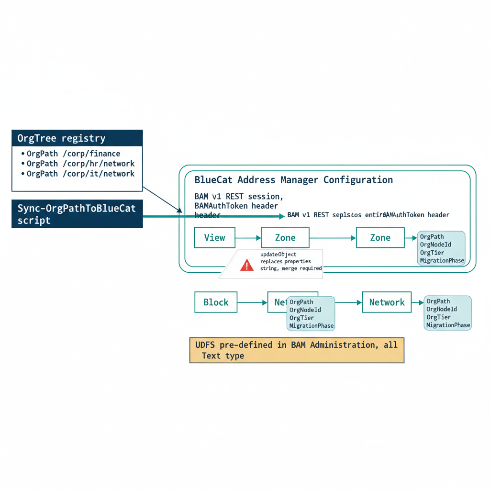

# Chapter 3 — BlueCat — OrgPath via User-Defined Fields and the REST API

::: {.callout-note}
## In this chapter
How OrgPath governance values are carried inside BlueCat Address Manager. The chapter maps the BAM data model — Configurations, Blocks and Networks, Views and Zones — onto the OrgTree, defines the four User-Defined Fields that carry OrgPath context, walks the v1 REST API session model and its key endpoints, and presents the idempotent synchronization script that creates or updates BAM zones and tags networks from the OrgTree registry.
:::

## The BlueCat Data Model and Its Bridge to OrgTree

BlueCat Address Manager organizes its data model around a hierarchy of Configurations, each of which contains all the IP address space and DNS infrastructure under its governance. Within a Configuration, the model splits along two parallel hierarchies:

| BAM hierarchy | Parent | Child | What it represents |
| :--- | :--- | :--- | :--- |
| **IP address space** | Block (a large address range) | Network (a specific subnet within a Block) | The governed IP space |
| **DNS infrastructure** | View (a logical DNS namespace, used for split-horizon DNS) | Zone (exists within a View) | The governed DNS namespace |

This hierarchical structure maps naturally to the OrgTree model:

> An OrgTree node that governs a specific DNS namespace maps to a **Zone** in a BlueCat View, and an OrgTree node that governs a specific IP address range maps to a **Network** within a BlueCat Block.

{#fig-book-14-cpt-03-diagram-01 fig-alt="Engineering blueprint diagram on a white background showing how OrgPath governance values flow from the OrgTree registry into BlueCat Address Manager through User-Defined Fields and the v1 REST API. On the left, a federal navy 1F3A5F box labeled OrgTree registry, with monospace node paths, feeds an arrow to a navy box labeled Sync-OrgPathToBlueCat script. From the script a teal 1A9E8F arrow labeled BAM v1 REST session, BAMAuthToken header points into a large rounded container labeled BlueCat Address Manager Configuration. Inside that container two parallel branches are drawn. The upper teal branch shows View then Zone, with a monospace tag block reading OrgPath OrgNodeId OrgTier MigrationPhase attached to the Zone. The lower teal branch shows Block then Network, with the same monospace tag block attached to the Network. An amber D4A017 callout box at the bottom reads UDFs pre-defined in BAM Administration, all Text type. A small red C0392B warning marker near the Zone reads updateObject replaces entire properties string, merge required. Monospace labels throughout, no human figures, 16:9 landscape." width="85%"}

## OrgPath User-Defined Fields in BlueCat

Every object in the BlueCat model supports User-Defined Fields — metadata fields that administrators define in the BAM Administration interface under User-Defined Fields and then attach to specific object types. UDFs are the BlueCat equivalent of Infoblox Extensible Attributes and serve the same purpose in the OrgPath integration:

> They carry OrgPath governance values on each object so that the same organizational context readable in Entra ID, Intune, and Azure Resource Manager is also readable by querying the BlueCat API.

Before running the synchronization script in this chapter, an administrator must pre-define four UDFs in the BAM Administration interface:

| UDF name | Type | What it carries |
| :--- | :--- | :--- |
| **OrgPath** | Text | The node's full organizational path |
| **OrgNodeId** | Text | The stable OrgTree node identifier |
| **OrgTier** | Text | The governance tier classification |
| **MigrationPhase** | Text | The node's migration-phase value |

Unlike Infoblox EAs, BlueCat does not offer an Enum UDF type in all versions; Text is used for all four fields and the governance pipeline enforces value constraints, as with the BloxOne integration described in the previous chapter.

## The BlueCat REST API — Session Model and Key Endpoints

BlueCat Address Manager exposes a REST API at https://{bam-host}/Services/REST/v1/ that supports HTTP Basic authentication through a session model. A login call authenticated with Basic credentials returns a session token string in the form BAMAuthToken: {token-value}; that token is then passed as the Authorization header value in all subsequent calls within the session. The session must be explicitly closed with a logout call when the script completes.

> Leaving sessions open is not a security risk in itself, since the token expires, but it does consume BAM server-side session resources and should be avoided in automation scripts that run frequently.

BlueCat has introduced a v2 REST API at https://{bam-host}/api/v2/ in more recent BAM versions. The v2 API is more RESTful in design — it uses standard HTTP verbs against resource-oriented URLs rather than the action-based URLs of the v1 API — and it will eventually supersede the v1 API. However, because many enterprise BAM deployments are running versions that do not yet fully support the v2 API, and because the v1 API is stable and well-documented across all current BAM versions, the integration script in this chapter uses the v1 API. The conceptual structure — authenticate, retrieve configuration, look up objects, write UDF values — is identical in both API versions.

The key v1 API endpoints for OrgPath integration are as follows:

| Endpoint | Role in the integration |
| :--- | :--- |
| `/login` | Performs session establishment |
| `/getEntityByName` | Retrieves an object by name within a parent entity — the primary lookup mechanism for finding Configurations, Views, Zones, and Networks by name |
| `/getEntities` | Retrieves all child objects of a given type under a parent entity — used to enumerate Views within a Configuration |
| `/updateObject` | Updates the properties and UDF values of an existing object by its internal numeric ID |
| `/addZone` | Creates a new DNS zone as a child of a View |
| `/logout` | Closes the session |

## The BlueCat Synchronization Script

The synchronization script below authenticates to BlueCat BAM, retrieves the target Configuration, and for each active OrgTree node with a DNS boundary flag, creates or updates the corresponding BAM zone object with OrgPath UDF values. The structure mirrors the NIOS synchronization script: the OrgTree registry is loaded, each active node is iterated, and the platform-specific API calls branch based on what the node's metadata declares. The same comment conventions are used — environment-specific values are explicitly marked with the comment \# ENVIRONMENT VALUE so they can be found by anyone reading the script for the first time.

```powershell
#
# Sync-OrgPathToBlueCat.ps1
#
# .SYNOPSIS
#     Synchronizes OrgTree nodes to BlueCat Address Manager DNS zones
#     and IP networks with OrgPath User-Defined Field values.
#
# .DESCRIPTION
#     Authenticates to the BAM REST API v1, retrieves the target Configuration,
#     and for each active OrgTree node flagged as a DNS boundary or carrying a
#     NetworkCidr, creates or updates the corresponding BAM zone or network
#     object with all four OrgPath UDF values.
#
#     UDFs must be pre-defined in BAM Administration > User-Defined Fields
#     before this script runs. Required UDFs (all Text type):
#       OrgPath, OrgNodeId, OrgTier, MigrationPhase
#
# .PARAMETER OrgTreeRegistryPath
#     Local path to the checked-out OrgTree registry JSON file.
#     ENVIRONMENT VALUE — set to the path used by your pipeline agent.
#
# .PARAMETER BamHost
#     Hostname or FQDN of the BlueCat Address Manager server.
#     ENVIRONMENT VALUE — replace with your BAM server hostname.
#
# .PARAMETER BamUsername
#     BAM REST API service account username.
#     ENVIRONMENT VALUE — replace with your API service account name.
#
# .PARAMETER BamPassword
#     SecureString password for the BAM API service account.
#     In pipeline execution, retrieve from secrets vault:
#       ConvertTo-SecureString (Get-AzKeyVaultSecret -Name "bam-api-pass").SecretValue
#
# .PARAMETER ConfigurationName
#     The name of the BAM Configuration object containing the target zones
#     and networks. ENVIRONMENT VALUE — replace with your Configuration name.
#     Example: "Corporate"
#
# .PARAMETER BaseDomainSuffix
#     Base DNS suffix for zone names.
#     ENVIRONMENT VALUE — replace with your organization's DNS suffix.
#

param(
    [string]       $OrgTreeRegistryPath = "C:\governance\orgtree\registry.json", # ENVIRONMENT VALUE
    [string]       $BamHost             = "bam.corp.contoso.com",                # ENVIRONMENT VALUE
    [string]       $BamUsername         = "svc-governance-bam",                  # ENVIRONMENT VALUE
    [SecureString] $BamPassword,
    [string]       $ConfigurationName   = "Corporate",                           # ENVIRONMENT VALUE
    [string]       $BaseDomainSuffix    = "corp.contoso.com"                     # ENVIRONMENT VALUE
)

Set-StrictMode -Version Latest
$ErrorActionPreference = "Stop"

$baseUri = "https://$BamHost/Services/REST/v1"

# ---------------------------------------------------------------
# Authenticate — BAM v1 login returns a session token string.
# The token value is the last whitespace-delimited segment of the
# response string: "BAMAuthToken: "
# ---------------------------------------------------------------
$plainPwd = [Runtime.InteropServices.Marshal]::PtrToStringAuto(
    [Runtime.InteropServices.Marshal]::SecureStringToBSTR($BamPassword)
)

$loginResponse = Invoke-RestMethod `
    -Uri    "$baseUri/login?username=$BamUsername&password=$plainPwd" `
    -Method GET

# Extract the token value from the response string.
$token      = ($loginResponse -split " ")[-1].Trim()
$authHeader = @{ Authorization = "BAMAuthToken $token" }

# Immediately null the plain-text password from memory.
$plainPwd = $null
[System.GC]::Collect()

Write-Host "[$(Get-Date -f 'HH:mm:ss')] BAM session established against: $BamHost"

# ---------------------------------------------------------------
# Retrieve the Configuration entity by name.
# In BAM, all objects exist within a Configuration. The root parentId
# is always 0. A Configuration's numeric ID is needed as the parentId
# for all subsequent child object lookups.
# ---------------------------------------------------------------
$config = Invoke-RestMethod `
    -Uri    "$baseUri/getEntityByName?parentId=0&name=$ConfigurationName&type=Configuration" `
    -Method GET `
    -Headers $authHeader

$configId = $config.id
Write-Host "[$(Get-Date -f 'HH:mm:ss')] Configuration '$ConfigurationName' resolved — ID: $configId"

# ---------------------------------------------------------------
# Retrieve the first DNS View within the Configuration.
# Most enterprise BAM deployments use a single View named "default"
# or by the organization name. If your deployment uses multiple Views
# for split-horizon DNS, enumerate them and select the correct one.
# ENVIRONMENT VALUE — adjust $viewId selection logic if needed.
# ---------------------------------------------------------------
$views  = Invoke-RestMethod `
    -Uri    "$baseUri/getEntities?parentId=$configId&type=View&start=0&count=10" `
    -Method GET `
    -Headers $authHeader

$viewId = $views[0].id
Write-Host "[$(Get-Date -f 'HH:mm:ss')] DNS View ID: $viewId (using first View in Configuration)"

# ---------------------------------------------------------------
# Load OrgTree registry and filter to active nodes.
# ---------------------------------------------------------------
$registry    = Get-Content $OrgTreeRegistryPath -Raw | ConvertFrom-Json
$activeNodes = $registry.nodes | Where-Object { $_.Status -eq "Active" }

Write-Host "[$(Get-Date -f 'HH:mm:ss')] Active OrgTree nodes to process: $($activeNodes.Count)"
Write-Host ""

$stats = @{ ZoneCreated = 0; ZoneUpdated = 0; NetTagged = 0; Failed = 0 }

foreach ($node in $activeNodes) {

    # ---------------------------------------------------------------
    # Build the UDF properties string.
    # BAM v1 API uses a pipe-delimited "properties" string to carry both
    # system properties and User-Defined Field values on an object.
    # Format: "field1=value1|field2=value2|..."
    # The BAM API parses this string server-side; no JSON body is used
    # for v1 property updates.
    # ---------------------------------------------------------------
    $tier   = if ($node.Tier)           { $node.Tier }           else { "Unclassified" }
    $phase  = if ($node.MigrationPhase) { $node.MigrationPhase } else { "Assessment"   }

    $udfString = "OrgPath=$($node.Path)|OrgNodeId=$($node.Id)|OrgTier=$tier|MigrationPhase=$phase"

    # ---------------------------------------------------------------
    # DNS Zone Synchronization
    # ---------------------------------------------------------------
    if ($node.DnsBoundary -eq $true) {

        $zoneName = "$($node.Id.ToLower()).$BaseDomainSuffix"

        try {
            # Look up whether a Zone with this absolute name exists under the View.
            # BAM getEntityByName on a Zone uses the absolute (FQDN) zone name.
            $existingZone = $null
            try {
                $existingZone = Invoke-RestMethod `
                    -Uri    "$baseUri/getEntityByName?parentId=$viewId&name=$zoneName&type=Zone" `
                    -Method GET `
                    -Headers $authHeader `
                    -ErrorAction Stop
            } catch {
                # getEntityByName returns an HTTP error if the object does not exist.
                # Treat any error here as "not found" and proceed to create.
                $existingZone = $null
            }

            if ($existingZone -and $existingZone.id -and $existingZone.id -ne 0) {

                # Zone exists — update its properties string to include OrgPath UDFs.
                # The updateObject call requires the full object body including the
                # existing system properties merged with the new UDF values.
                $zoneObj = @{
                    id         = $existingZone.id
                    name       = $existingZone.name
                    type       = "Zone"
                    properties = "absoluteName=$zoneName|deployable=true|$udfString"
                }

                Invoke-RestMethod `
                    -Uri         "$baseUri/updateObject" `
                    -Method      PUT `
                    -Body        ($zoneObj | ConvertTo-Json) `
                    -ContentType "application/json" `
                    -Headers     $authHeader | Out-Null

                Write-Host "  [UPDATED-ZONE]  $zoneName"
                $stats.ZoneUpdated++

            } else {

                # Zone does not exist — create it under the View.
                # addZone takes the parent View ID and the absolute zone name.
                # The properties string carries the UDF values at creation time.
                $newZoneId = Invoke-RestMethod `
                    -Uri    "$baseUri/addZone?parentId=$viewId&absoluteName=$zoneName&properties=$udfString" `
                    -Method POST `
                    -Headers $authHeader

                Write-Host "  [CREATED-ZONE]  $zoneName (ID: $newZoneId)"
                $stats.ZoneCreated++
            }

        } catch {
            Write-Warning "  [FAILED-ZONE]   $zoneName — $_"
            $stats.Failed++
        }
    }

    # ---------------------------------------------------------------
    # Network Tagging
    # Retrieves an existing BAM Network by CIDR and updates its
    # properties string with OrgPath UDF values. Does not create networks.
    # ENVIRONMENT VALUE — adjust $blockId lookup if your Block hierarchy
    # is multi-level or identified by means other than CIDR search.
    # ---------------------------------------------------------------
    if ($node.NetworkCidr) {

        try {
            # BAM network lookup: search within the Configuration by CIDR.
            # getEntitiesByName on type "IP4Network" with the CIDR as the name.
            $netSearch = Invoke-RestMethod `
                -Uri    "$baseUri/searchByObjectTypes?keyword=$($node.NetworkCidr)&types=IP4Network&start=0&count=5" `
                -Method GET `
                -Headers $authHeader

            if ($netSearch.Count -gt 0) {

                $netObj = $netSearch[0]
                $updatedNetObj = @{
                    id         = $netObj.id
                    name       = $netObj.name
                    type       = "IP4Network"
                    properties = "$($netObj.properties)|$udfString"
                }

                Invoke-RestMethod `
                    -Uri         "$baseUri/updateObject" `
                    -Method      PUT `
                    -Body        ($updatedNetObj | ConvertTo-Json) `
                    -ContentType "application/json" `
                    -Headers     $authHeader | Out-Null

                Write-Host "  [TAGGED-NET]    $($node.NetworkCidr) → $($node.Path)"
                $stats.NetTagged++

            } else {
                Write-Warning "  [NOT-FOUND-NET] $($node.NetworkCidr) — create the IP4Network in BAM first."
            }

        } catch {
            Write-Warning "  [FAILED-NET]    $($node.NetworkCidr) — $_"
            $stats.Failed++
        }
    }
}

# ---------------------------------------------------------------
# Close the BAM session. Always call logout regardless of earlier errors
# so the server-side session resource is freed.
# ---------------------------------------------------------------
try {
    Invoke-RestMethod -Uri "$baseUri/logout" -Method GET -Headers $authHeader | Out-Null
    Write-Host ""
    Write-Host "[$(Get-Date -f 'HH:mm:ss')] BAM session closed."
} catch {
    Write-Warning "Logout call failed — session may need to expire naturally."
}

# ---------------------------------------------------------------
# Summary
# ---------------------------------------------------------------
Write-Host ""
Write-Host "========================================================"
Write-Host "  BlueCat Address Manager OrgPath Synchronization — Complete"
Write-Host "========================================================"
Write-Host "  Zones Created    : $($stats.ZoneCreated)"
Write-Host "  Zones Updated    : $($stats.ZoneUpdated)"
Write-Host "  Networks Tagged  : $($stats.NetTagged)"
Write-Host "  Failed           : $($stats.Failed)"
Write-Host "  Completed at     : $(Get-Date -f 'yyyy-MM-dd HH:mm:ss') UTC"
Write-Host "========================================================"
```

::: {.callout-note title="Important — BAM Properties String Collision"}
The BAM v1 updateObject call replaces the entire properties string on the object. If the existing zone or network carries system properties beyond those reproduced in the script — for example, deployment options, DHCP policies, or DNS deployment role references — those values must be read from the existing object and merged into the updated properties string before the PUT call is issued. The script above demonstrates the pattern with absoluteName and deployable on zones; extend the merge logic to include any additional system properties that exist on objects in your specific BAM Configuration.
:::
