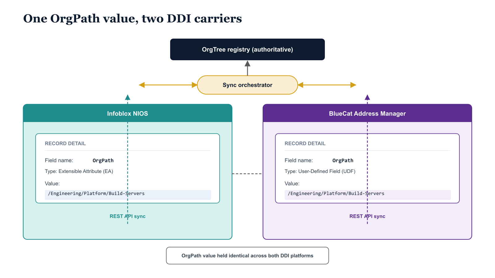

# Chapter 4 — Running Two Systems in Parallel — How OrgPath Keeps Them Coherent

::: {.callout-note}
## In this chapter
During the Parallel migration phase, both the third-party DDI platform and Azure DNS Private Zones serve live resolution traffic at once, and the OrgPath pipeline is the single agent that keeps organizational context coherent across both. This chapter walks the zone-lifecycle state machine (Assessment → Migration → Parallel → Complete) and the gating check that guards the move to Complete, explains how new records stay synchronized through change-feed webhooks or a polling fallback, and presents the on-demand reconciliation script that compares the NIOS and Azure inventories. It closes by mapping the report's four categories to concrete operational actions.
:::

{#fig-14-orgpath-with-third-party-ddi-diagram-02 fig-alt="Side-by-side comparison with a shared registry source at the top. Top: a single box labeled \"OrgTree registry (authoritative)\". Below it, a vertical \"Sync orchestrator\" pill sits in the center with arrows pointing in both directions to the two side panels. Left panel: Infoblox interface mockup, header \"Infoblox NIOS\", center showing a record detail view with field name OrgPath listed as an Extensible Attribute (EA) with monospace value /Engineering/Platform/Build-Servers, footer arrow up to the registry labeled \"REST API sync\". Right panel: BlueCat interface mockup, header \"BlueCat Address Manager\", center showing a record detail view with field name OrgPath listed as a User-Defined Field (UDF) with the same monospace value /Engineering/Platform/Build-Servers, footer arrow up to the registry labeled \"REST API sync\". Dashed reconciliation arrow between the two center panels, labeled \"OrgPath value held identical across both DDI platforms\". Engineering blueprint style, white background, federal navy (#1F3A5F) for the registry at top, teal (#1A9E8F) for the Infoblox panel, purple (#5B2D8E) for the BlueCat panel, amber (#D4A017) for the sync orchestrator, monospace OrgPath values, no human figures, 16:9 landscape." width="85%"}

The Parallel migration phase is the most operationally demanding period in the hybrid transition. It is the period during which both the third-party DDI platform and Azure DNS Private Zones are simultaneously active and serving live DNS resolution traffic — the former for on-premises clients, the latter for Azure-hosted workloads. A zone in the Parallel phase exists in two places: as an authoritative zone in the NIOS Grid or the BlueCat DNS View, with its records managed through the DDI platform's change workflow, and as an Azure DNS Private Zone in the hub subscription, with its records propagated from the DDI platform or maintained in parallel by the Azure DNS team.

> The OrgPath governance pipeline is the single agent that writes organizational context to both systems simultaneously, and the MigrationPhase extensible attribute is the shared state variable that tells both systems — and the operators managing them — exactly where in the transition sequence each zone currently sits.

## The Zone Lifecycle State Machine

Understanding the state machine that governs zone lifecycle during the Parallel phase requires understanding what each state transition represents in concrete operational terms. Each state corresponds to a distinct, observable configuration across the two systems:

| MigrationPhase | What exists | Authoritative source | Operational meaning |
| :--- | :--- | :--- | :--- |
| **Assessment** | Zone tagged in the DDI platform; no Azure DNS Private Zone | DDI platform only | The OrgPath sync script has created the zone in the DDI platform, or stamped OrgPath EAs on a pre-existing zone — but no migration work has begun and no records have been replicated. |
| **Migration** | Azure DNS Private Zone created with matching FQDN and OrgPath values, but no clients pointed at it | DDI platform | The Azure zone exists as an empty or partially populated zone, not yet serving live traffic. |
| **Parallel** | Both zones active; Azure zone serving Azure-hosted workloads, DDI zone serving on-premises clients | Both (split by client population) | Any record change must be applied to *both* zones — to the DDI zone through its normal change workflow, and to the Azure zone through the Azure DNS API or the pipeline's Azure synchronization component. |
| **Complete** | On-premises clients redirected from the DDI name servers to the Azure DNS Private Resolver | Azure | The terminal state — the DDI zone can be decommissioned once cutover is confirmed. |

The transition from Parallel to Complete is the most consequential state change in the entire migration sequence, because it is the point at which on-premises clients are redirected from the DDI platform's name servers to the Azure DNS Private Resolver. The governance pipeline enforces this transition through a prerequisite check. A zone's MigrationPhase attribute cannot be updated to Complete unless the pipeline can confirm, through live API calls, that the matching Azure DNS Private Zone:

- exists with the matching FQDN,
- carries a matching OrgPath tag,
- is linked to the hub virtual network, and
- is accessible from the Azure DNS Private Resolver's inbound endpoint.

If any of these conditions are not met, the pipeline blocks the state transition and writes a blocking reason to the governance log.

> This is the same Decommissioning Readiness Score pattern introduced in Part Eight, applied at the individual zone level.

## The Parallel-Phase Record Synchronization Problem

One operational challenge specific to the Parallel phase is record synchronization: when a new DNS record is created in the DDI platform zone — because a new on-premises server is being deployed, for example — that record must also be created in the Azure DNS Private Zone so that Azure-hosted clients can resolve it without waiting for the next scheduled synchronization run. The governance pipeline addresses this through a change-feed subscription pattern. Both Infoblox NIOS and BlueCat BAM support outbound notifications or webhook-style integrations that fire when a record is created or modified. In NIOS, the Grid's Outbound API notification feature can be configured to POST a JSON payload to the pipeline webhook URL whenever a record change is committed to a zone in the Parallel migration phase. The pipeline webhook receiver, running as an Azure Function or as a Logic App, receives the notification, extracts the record data, and issues an Azure DNS record creation or update call through the Az.PrivateDns module. The record is in Azure DNS within seconds of being committed in NIOS, without any polling delay.

In some environments the DDI platform's outbound notification feature is not available:

- older NIOS versions,
- certain BlueCat configurations, or
- network policy restrictions that prevent the DDI appliance from making outbound HTTP calls to cloud endpoints.

In those cases the pipeline falls back to a polling approach: a scheduled task runs every fifteen minutes, queries the DDI platform for zone records modified in the last fifteen minutes, and replays any changes to the Azure DNS Private Zone. The polling interval should be chosen based on the organization's tolerance for DNS replication lag; fifteen minutes is conservative and appropriate for most workloads. Latency-sensitive workloads that require near-real-time record propagation should be migrated to the Complete phase — and therefore out of the Parallel split-brain configuration — before the on-premises host publishing those records is migrated to Azure.

## The Reconciliation Script

The reconciliation script below addresses the audit and compliance dimension of the Parallel phase: it provides a point-in-time comparison of the NIOS zone inventory and the Azure DNS Private Zone inventory, surfacing gaps and mismatches so that the operations team has a clear picture of where the migration stands. It is run on demand and on a scheduled basis — weekly at minimum during an active migration, daily if the migration is in a fast-moving phase — and its output is committed to the governance repository as a dated artifact. The report format is JSON so that it can be consumed by downstream reporting tools, or by the governance pipeline itself as a gating input for the state transition logic.

```powershell
#
# Get-OrgPathDnsReconciliationReport.ps1
#
# .SYNOPSIS
#     Reconciles Infoblox NIOS DNS zones against Azure DNS Private Zones,
#     identifying synchronization gaps and MigrationPhase mismatches.
#
# .DESCRIPTION
#     Queries both NIOS (via WAPI) and Azure (via Az.PrivateDns) for all
#     OrgPath-tagged DNS zones. Compares the two inventories and produces
#     a structured JSON report covering:
#       - Zones in NIOS with no Azure counterpart (migration not started)
#       - Zones in Azure with no NIOS counterpart (tagging gap or orphan)
#       - Zones in both systems with mismatched MigrationPhase values
#       - Zones that are fully synchronized across both systems
#
#     The report is committed to the governance repository after each run
#     and consumed by the pipeline's state transition gating logic.
#
# .PARAMETER GridMasterFqdn
#     FQDN of the NIOS Grid Master.
#     ENVIRONMENT VALUE — replace with your Grid Master hostname.
#
# .PARAMETER NiosCredential
#     PSCredential for the NIOS API service account.
#
# .PARAMETER AzureDnsResourceGroup
#     Azure resource group containing the Azure DNS Private Zones.
#     ENVIRONMENT VALUE — replace with your DNS resource group name.
#
# .PARAMETER AzureSubscriptionId
#     Azure subscription ID containing the DNS resource group.
#     ENVIRONMENT VALUE — replace with your subscription GUID.
#
# .PARAMETER OutputPath
#     Local filesystem path where the JSON report is written.
#     ENVIRONMENT VALUE — set to the governance repository working directory.
#
# .NOTES
#     Requires: Az.PrivateDns PowerShell module (Install-Module Az.PrivateDns)
#     Run: Connect-AzAccount before executing if not running in a pipeline
#     context where the service principal is already authenticated.
#

param(
    [string]       $GridMasterFqdn          = "gridmaster.corp.contoso.com",  # ENVIRONMENT VALUE
    [PSCredential] $NiosCredential          = (Get-Credential -Message "NIOS API credentials"),
    [string]       $AzureDnsResourceGroup   = "rg-governance-dns",            # ENVIRONMENT VALUE
    [string]       $AzureSubscriptionId     = "00000000-0000-0000-0000-000000000000", # ENVIRONMENT VALUE
    [string]       $OutputPath              = "C:\governance\reports\dns-reconciliation-$(Get-Date -f 'yyyyMMdd').json" # ENVIRONMENT VALUE
)

Set-StrictMode -Version Latest
$ErrorActionPreference = "Stop"

# Set the Azure context to the correct subscription before querying Azure DNS.
Set-AzContext -SubscriptionId $AzureSubscriptionId | Out-Null

$niosBaseUri  = "https://$GridMasterFqdn/wapi/v2.12"
$niosAuthArgs = @{ Credential = $NiosCredential; Authentication = "Basic" }

Write-Host "[$(Get-Date -f 'HH:mm:ss')] Querying NIOS for OrgPath-tagged zones..."

# ---------------------------------------------------------------
# Query NIOS for all authoritative zones, requesting the fqdn and
# extensible_attributes return fields in addition to the default fields.
# _return_fields%2B appends the listed fields to the default field set.
# _max_results caps the query at 2000 zones; increase if your Grid
# manages more zones than this.
# ---------------------------------------------------------------
$niosZonesRaw = Invoke-RestMethod `
    -Uri    "$niosBaseUri/zone_auth?_return_fields%2B=fqdn,extensible_attributes&_max_results=2000" `
    -Method GET `
    @niosAuthArgs

# Filter to zones that carry an OrgPath EA value and project to a normalized shape.
$niosTaggedZones = $niosZonesRaw | Where-Object {
    $_.extensible_attributes -and $_.extensible_attributes.OrgPath.value
} | ForEach-Object {
    @{
        FQDN           = $_.fqdn
        OrgPath        = $_.extensible_attributes.OrgPath.value
        OrgNodeId      = $_.extensible_attributes.OrgNodeId.value
        OrgTier        = $_.extensible_attributes.OrgTier.value
        MigrationPhase = $_.extensible_attributes.MigrationPhase.value
        Source         = "NIOS"
    }
}

Write-Host "[$(Get-Date -f 'HH:mm:ss')] NIOS OrgPath-tagged zones found: $($niosTaggedZones.Count)"
Write-Host "[$(Get-Date -f 'HH:mm:ss')] Querying Azure for OrgPath-tagged Private DNS zones..."

# ---------------------------------------------------------------
# Query Azure DNS Private Zones — all zones in the resource group
# that carry an OrgPath tag. Project to the same normalized shape
# used for the NIOS result set to allow direct comparison.
# ---------------------------------------------------------------
$azureZones = Get-AzPrivateDnsZone -ResourceGroupName $AzureDnsResourceGroup |
    Where-Object { $_.Tags -and $_.Tags["OrgPath"] } |
    ForEach-Object {
        @{
            FQDN           = $_.Name
            OrgPath        = $_.Tags["OrgPath"]
            OrgNodeId      = $_.Tags["OrgNodeId"]
            OrgTier        = $_.Tags["OrgTier"]
            MigrationPhase = $_.Tags["MigrationPhase"]
            ResourceId     = $_.ResourceId
            Source         = "Azure"
        }
    }

Write-Host "[$(Get-Date -f 'HH:mm:ss')] Azure OrgPath-tagged Private DNS zones found: $($azureZones.Count)"

# ---------------------------------------------------------------
# Build lookup hashtables keyed by FQDN for O(1) cross-system lookup.
# ---------------------------------------------------------------
$niosMap  = @{}; foreach ($z in $niosTaggedZones) { $niosMap[$z.FQDN]  = $z }
$azureMap = @{}; foreach ($z in $azureZones)       { $azureMap[$z.FQDN] = $z }

# ---------------------------------------------------------------
# Reconcile the two inventories into four categories.
# ---------------------------------------------------------------
$report = @{
    GeneratedAt           = (Get-Date -Format "o")                   # ISO 8601 timestamp
    GridMaster            = $GridMasterFqdn                          # ENVIRONMENT VALUE
    AzureDnsResourceGroup = $AzureDnsResourceGroup                   # ENVIRONMENT VALUE
    AzureSubscriptionId   = $AzureSubscriptionId                     # ENVIRONMENT VALUE
    NiosOnlyZones         = [System.Collections.Generic.List[object]]::new()  # In NIOS, not in Azure
    AzureOnlyZones        = [System.Collections.Generic.List[object]]::new()  # In Azure, not in NIOS
    PhaseMismatches       = [System.Collections.Generic.List[object]]::new()  # Phase differs between systems
    FullySynchronized     = [System.Collections.Generic.List[object]]::new()  # Identical in both
}

foreach ($fqdn in $niosMap.Keys) {
    if (-not $azureMap.ContainsKey($fqdn)) {
        # In NIOS but not in Azure — migration not started for this zone.
        $report.NiosOnlyZones.Add($niosMap[$fqdn])
    }
    elseif ($niosMap[$fqdn].MigrationPhase -ne $azureMap[$fqdn].MigrationPhase) {
        # In both systems but MigrationPhase values differ — state mismatch.
        $report.PhaseMismatches.Add(@{
            FQDN            = $fqdn
            OrgPath         = $niosMap[$fqdn].OrgPath
            OrgNodeId       = $niosMap[$fqdn].OrgNodeId
            NiosPhase       = $niosMap[$fqdn].MigrationPhase
            AzurePhase      = $azureMap[$fqdn].MigrationPhase
            AzureResourceId = $azureMap[$fqdn].ResourceId
        })
    }
    else {
        # In both systems with matching MigrationPhase — fully synchronized.
        $report.FullySynchronized.Add(@{
            FQDN           = $fqdn
            OrgPath        = $niosMap[$fqdn].OrgPath
            MigrationPhase = $niosMap[$fqdn].MigrationPhase
        })
    }
}

foreach ($fqdn in $azureMap.Keys) {
    if (-not $niosMap.ContainsKey($fqdn)) {
        # In Azure but not in NIOS — could be a new zone created directly in
        # Azure, or a NIOS zone that has completed migration and been retired
        # from NIOS without the reconciliation script being notified.
        $report.AzureOnlyZones.Add($azureMap[$fqdn])
    }
}

# ---------------------------------------------------------------
# Write the report to the output path as formatted UTF-8 JSON.
# The governance pipeline's CI system will commit this file to the
# repository after the script completes.
# ---------------------------------------------------------------
$report | ConvertTo-Json -Depth 10 | Set-Content -Path $OutputPath -Encoding UTF8

Write-Host ""
Write-Host "========================================================"
Write-Host "  DNS Reconciliation Report — Summary"
Write-Host "========================================================"
Write-Host "  NIOS-only zones       : $($report.NiosOnlyZones.Count)  (migration not started)"
Write-Host "  Azure-only zones      : $($report.AzureOnlyZones.Count)  (check for orphaned zones)"
Write-Host "  Phase mismatches      : $($report.PhaseMismatches.Count)  (requires manual resolution)"
Write-Host "  Fully synchronized    : $($report.FullySynchronized.Count)"
Write-Host "  Report written to     : $OutputPath"
Write-Host "========================================================"
```

The reconciliation report's four categories map directly to operational actions:

| Category | What it means | Required action |
| :--- | :--- | :--- |
| **NIOS-only** | Zone exists in the DDI platform but has no Azure counterpart | Begin the Azure DNS Private Zone creation sequence — these zones are the backlog of migration work remaining. |
| **Azure-only** | Zone exists in Azure but has no NIOS counterpart | Investigate: either a legitimate new zone created directly in Azure by a cloud platform team that bypassed the DDI change workflow (register it in the governance system), or an orphaned zone from a previous migration wave that was not properly tracked. |
| **Phase mismatch** | Zone exists in both systems but MigrationPhase values differ | Resolve manually — review both sides, determine which state value is correct, and update the other to match. |
| **Fully synchronized** | Identical in both systems | None — this is the health metric. |

> As the migration progresses, the fully synchronized count should grow toward the total zone count while the other three categories shrink toward zero.
