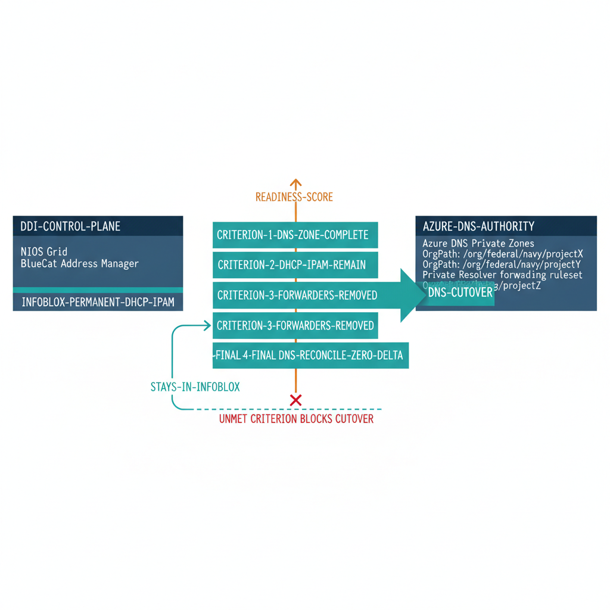

# Chapter 5 — The DNS Authority Cutover — When Azure DNS Takes Over (and DHCP and IPAM Stay)

::: {.callout-note}
## In this chapter
Cutting DNS authority over to Azure is the conclusion of a verifiable sequence, not a single event — and it is a cutover of the DNS surface only, not a retirement of the platform. This chapter defines the four criteria the environment must satisfy before the DNS role can move to Azure: DNS zone completion, confirmation that DHCP and IPAM *remain* in Infoblox as the permanent authority, forwarder removal, and a final DNS reconciliation. It then walks the operational cutover procedure — DNS-scoped read-only mode, a thirty-day DNS-resolution monitoring window, and confirmation that the Grid continues operating for DHCP and IPAM. It closes with what converges to Azure and what remains permanently in Infoblox, with OrgPath running through both.
:::

## The Four Cutover Criteria

Moving DNS authority to Azure is not a single event — it is the conclusion of a sequence of verifiable conditions, each of which must be confirmed before the next step proceeds. The platform has been the system of record for the organization's DNS and IP address estate, in some cases for a decade or more, and handing off its DNS role cannot be treated as a routine infrastructure change. The criteria below define the state the environment must reach before the DNS cutover can begin.

They are organized around the same Readiness Score framework introduced in Part Eight, scoped here to the DNS surface — because the DNS surface is the only part of the platform that is moving. DHCP and IPAM are not being migrated; they remain in Infoblox as the permanent authority, and one of the four criteria exists specifically to confirm that they do.

> No criterion is advisory. Each one, until it is met, represents a live DNS resolution path still served from the platform, or an assurance that DHCP and IPAM have been correctly left in place — and cutting DNS over with any criterion outstanding would either break resolution or quietly strand the addressing functions that stay behind.

{#fig-book-14-cpt-05-diagram-01 fig-alt="Engineering blueprint diagram on a white background depicting four cutover criteria as a gate that controls the move of DNS authority from Infoblox to Azure DNS. On the left, a federal navy box labeled in monospace DDI-CONTROL-PLANE representing the NIOS Grid and BlueCat Address Manager, with a teal sub-label INFOBLOX-PERMANENT-DHCP-IPAM. Four stacked teal gate bars run vertically in the center, each a required check with monospace labels CRITERION-1-DNS-ZONE-COMPLETE, CRITERION-2-DHCP-IPAM-REMAIN, CRITERION-3-FORWARDERS-REMOVED, and CRITERION-4-FINAL-DNS-RECONCILE-ZERO-DELTA. An amber arrow labeled READINESS-SCORE flows upward through the four bars toward the gate. To the right, a federal navy box labeled AZURE-DNS-AUTHORITY listing Azure DNS Private Zones and the Private Resolver forwarding ruleset, each tagged with monospace OrgPath values. A teal arrow labeled DNS-CUTOVER crosses the gate to the Azure side, while a separate teal line loops DHCP and IPAM back into the Infoblox box labeled STAYS-IN-INFOBLOX. A red crossed-out connector at the bottom shows that any single unmet criterion blocks the DNS-cutover arrow from reaching the Azure side. Monospace labels throughout, no human figures, 16:9 landscape." width="85%"}

The four criteria, and the mechanism that verifies each, are summarized below.

| # | Cutover criterion | Required state | Verification mechanism |
| :--- | :--- | :--- | :--- |
| 1 | **DNS zone completion** | Every zone authoritative in the NIOS Grid or BlueCat DNS View carries `MigrationPhase = Complete` and has a matching Azure DNS Private Zone (tagged with the OrgPath value, linked to the hub VNet, reachable from the resolver inbound endpoint) | Reconciliation script (Chapter Four): zero NIOS-only zones, zero Azure-only zones lacking a Complete-phase NIOS entry, zero phase mismatches |
| 2 | **DHCP and IPAM remain in Infoblox** | No DHCP scope and no IPAM authority is moved to Azure or Windows Server. Every DHCP scope and every managed network stays active in the Grid, and the platform is explicitly confirmed as the permanent DHCP and IPAM authority. Azure has no scope-based DHCP service and no authoritative hybrid IPAM to receive them | Governance log: zero DHCP scopes or IPAM networks migrated out; a recorded affirmation that DHCP and IPAM authority is retained in Infoblox |
| 3 | **Forwarder removal** | No conditional forwarding rule on the Azure DNS Private Resolver Forwarding Ruleset references any NIOS or BAM name-server IP address | Final check confirms zero forwarding rules pointing at DDI name servers |
| 4 | **Final DNS reconciliation** | The Chapter-Four reconciliation script reports zero NIOS-only, zero Azure-only, and zero phase-mismatch entries; the fully-synchronized count equals the total DNS zones formerly authoritative in the DDI platform | Archived reconciliation report in the governance repository — the definitive DNS-cutover completion record |

**Criterion 1 — DNS zone completion** is a hard requirement: the existence of even a single zone in the Assessment, Migration, or Parallel state means some DNS resolution is still being served from the DDI platform, and cutting DNS authority over to Azure would cause resolution failures for clients that depend on those zones. The reconciliation script from Chapter Four is the mechanism that verifies it, and all three of its delta categories must read zero before the criterion is considered met.

**Criterion 2 — DHCP and IPAM remain in Infoblox** is the inverse of a migration criterion: its required state is that *nothing moves*. There is no Azure-native destination for these functions to migrate to. Azure VNet DHCP is platform-managed — it hands addresses to virtual machine NICs automatically, but it exposes no administrable, scope-based DHCP service, no reservations, no options, and no failover relationships that an operator can configure to replace an on-premises scope. Azure Virtual Network Manager's IPAM is cloud-only and is not authoritative for on-premises address space.

Because no equivalent service exists in Azure, the DDI platform remains the permanent authority for both DHCP and IPAM, and this criterion confirms exactly that: every DHCP scope and every managed network is still active in the Grid, none has been deleted or pointed at Azure VNet or a Windows Server DHCP server, and the governance record carries an explicit affirmation that DHCP and IPAM authority is retained in Infoblox.

The danger this criterion guards against is the opposite of the old one — not a scope left un-migrated, but a scope mistakenly *migrated* or deleted in the belief that the platform was being fully retired. Chapters Six and Seven describe the permanent DHCP and IPAM roles in full.

**Criterion 3 — Forwarder removal** targets configuration inconsistency. A forwarding rule for a zone whose NIOS or BAM counterpart has been marked Complete means the zone is fully hosted in Azure DNS, yet the resolver is still forwarding queries for it to an on-premises name server that is no longer authoritative — which, in an active system, causes resolution failures for those queries.

> Remove the forwarding rule for each zone *as* its `MigrationPhase` advances to Complete — not at the end of the entire migration. Doing so validates the Complete state in real time and lets the resolver configuration converge incrementally rather than all at once.

The final check before the DNS cutover is simply confirming that no forwarding rules remain that reference any of the DDI platform's name-server addresses.

**Criterion 4 — Final DNS reconciliation** runs the Chapter-Four reconciliation script one last time. Its output must show zero entries in the NIOS-only, Azure-only, and phase-mismatch categories, and the fully-synchronized count must equal the total number of DNS zones previously authoritative in the DDI platform — confirming that every zone has been accounted for in Azure DNS and that none was lost during the cutover. This report is archived in the governance repository as the definitive DNS-cutover completion record.

## The Operational DNS Cutover Procedure

Once all four cutover criteria have been verified, the DNS cutover procedure begins. It proceeds in three stages: a DNS-scoped read-only transition, a thirty-day DNS-resolution monitoring window, and confirmation that the Grid continues operating as the DHCP and IPAM authority. The platform is *not* placed fully read-only, and the appliances are *not* decommissioned — only the DNS write path moves.

1. **Place the DDI platform's DNS objects in read-only mode.** The scope of this step is DNS only. In Infoblox NIOS, this is accomplished through the Grid's access control system: the permissions on DNS records and DNS zones are demoted to read-only for the governance pipeline service account and the day-to-day DNS administration accounts, removing the ability to create, modify, or delete any DNS record or zone in the Grid. Permissions on DHCP scopes and on IPAM network objects are deliberately left unchanged — DHCP and IPAM administration continues normally, because those functions remain in Infoblox. In BlueCat Address Manager, the equivalent is achieved through the BAM access control mechanism, setting DNS-object permissions to read-only at the View level while leaving DHCP and IP-block administration intact. The network operations team is notified that, from this point, any *DNS* changes must be made through Azure-native tooling — the Azure portal, the `Az.PrivateDns` module, or the governance pipeline — while DHCP and IPAM changes continue to be made in the DDI platform as before.

2. **Observe the thirty-day DNS-resolution monitoring window.** The window runs thirty calendar days from the date of the DNS read-only transition. During this period, DNS query logs from the Azure DNS Private Resolver are the primary monitoring artifact. The resolver logs — streamed to an Azure Monitor Log Analytics workspace through the diagnostic settings on the resolver resource — are queried daily to verify that no queries are being forwarded to the DDI platform's name-server IP addresses. A query that reaches the resolver and matches no local Azure DNS Private Zone would normally generate a SERVFAIL or NXDOMAIN response; if such responses appear at a rate higher than baseline during the window, the resolution path for those queries must be traced to determine whether they represent a forwarding rule missed during cleanup or a client configuration bypassing the resolver entirely and querying the old DDI platform name servers directly.

3. **Confirm the Grid continues as the DHCP and IPAM authority.** If the thirty-day window passes without any forwarded queries to the DDI platform's name servers, the DNS cutover is complete — and the Grid Master or BAM appliances keep running. They are *not* decommissioned. This step is an explicit confirmation, recorded in the governance repository, that the platform's DNS role has been cut over to Azure while its DHCP and IPAM roles remain fully operational: DHCP scopes are still leasing addresses, IPAM is still the authoritative inventory of on-premises address space, and the appliances continue to serve both. The governance repository receives a commit recording the DNS-cutover date in ISO 8601 format, the path to the final DNS reconciliation report, the names of the engineers who performed the verification steps, and the names of the approvers who authorized the cutover. This commit message becomes the permanent record of the DNS-authority handoff within the OrgPath governance model — and a standing note that DHCP and IPAM authority did not move.

Every OrgTree DNS-zone node whose `MigrationPhase` field has not already been updated to Complete during the zone-by-zone migration sequence is updated in this final commit. From this point forward, the `MigrationPhase` field on those DNS nodes is a historical attribute — it records the DNS-cutover state, not an active governance control.

The active governance controls for *DNS* are now the Azure DNS Private Zones and the Azure DNS Private Resolver forwarding configuration, all of which carry OrgPath tags set and maintained by the same governance pipeline that formerly wrote DNS objects to the DDI platform's REST API. The pipeline does *not* drop the DDI platform as a target: it continues to write DHCP and IPAM governance attributes to the platform's REST API, because those surfaces remain in Infoblox.

What changes is narrower — the pipeline stops writing DNS zone objects to the DDI API and writes them to Azure-native DNS APIs instead, while continuing to govern DHCP and IPAM in the Grid.

## What Converges and What Remains

The DNS cutover divides the DDI platform's mandate cleanly in two. One function — DNS authority — converges to Azure. Two functions — DHCP and IPAM — remain permanently in Infoblox, because Azure offers no native service that can hold them. The platform does not leave; it sheds a single role and keeps the other two. What that role's departure leaves behind is worth stating precisely, because the reasons the platform was valuable do not expire:

- It still **prevents IP address conflicts** by maintaining a unified address inventory — IPAM remains its job, permanently.
- It **completed the DNS handoff** by providing a single authoritative view of the zone inventory until every zone reached Complete and Azure DNS took over.
- It still **supplies the audit trail and change workflow** for DHCP and IPAM that the organization's operational governance requirements demand.

OrgPath is the thread that runs through all of it — through the part that converged and the part that remains. The same organizational context — the same node identifiers, the same hierarchy paths, the same tier classifications — that is encoded on Entra ID user objects, Intune device objects, Arc resource tags, and Microsoft Defender device groups is encoded on the Azure DNS Private Zones that now hold DNS authority *and* on the NIOS and BlueCat DHCP scopes and IP networks that still hold DHCP and IPAM authority. Every system that touches a governed resource can answer the same question — what organizational context does this object belong to? — through its own native query interface, without any cross-system lookup.

> This is the value the OrgPath model provides that no individual system provides alone. The substrate is now split between Azure and Infoblox, yet the organizational context is identical across both.

It has been propagated — zone by zone, scope by scope, network by network, device by device — to every construct that carries organizational identity forward, whether that construct lives in Azure or in the Grid. After the cutover, what remains is an environment where every DNS zone (now in Azure), every DHCP scope and managed network (still in Infoblox), every virtual network subnet, every resource tag, every device object, and every identity object carries the same coherent organizational context. The OrgPath model has not changed.

The DNS substrate has converged to Azure; the DHCP and IPAM substrate remains, by necessity, in Infoblox — and the same governance pipeline writes OrgPath to both. That coherence across a deliberately split substrate is what the hybrid architecture was building toward, and the DNS cutover is the operational marker that confirms the model holds even when the platforms do not converge.

*OrgPath Governance Series — Part Eight Supplement. This document is part of the OrgPath technical implementation library. The DNS cutover described here moves DNS authority to Azure; Infoblox remains the permanent DHCP and IPAM control plane, as Chapters Six and Seven describe. Refer to Part Eight for the Azure-native DNS baseline. Refer to earlier parts of the series for the OrgTree data model, the Entra ID and Intune governance pipeline, and the Azure Arc and Defender integration patterns.*
