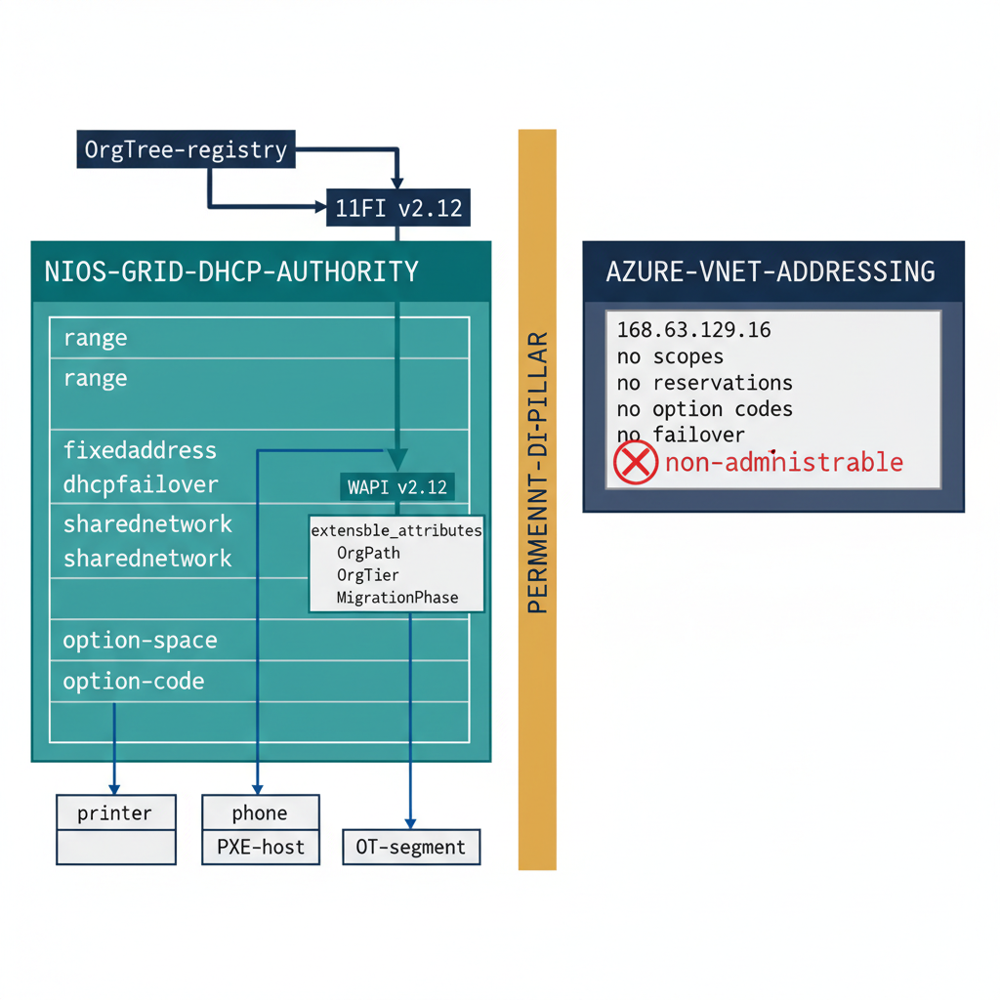

# Chapter 6 — Infoblox as the Permanent DHCP Authority

::: {.callout-note}
## In this chapter
The migration framing of the previous chapters retires Infoblox from DNS once Azure DNS Private Zones take full ownership — but DHCP does not converge the same way, because Azure offers no administrable DHCP service to converge onto. This chapter establishes Infoblox as the *permanent* authority for DHCP in a hybrid GCC-Moderate environment: it explains why Azure's platform-managed addressing is a permanent gap rather than a transitional one, walks the NIOS DHCP object model (ranges, fixed addresses, failover associations, shared networks, and option spaces), maps those objects to their WAPI and BloxOne API representations, and shows how the same four OrgPath Extensible Attributes that govern DNS zones and IP networks govern every DHCP object — driving scope ownership, tier-delegated administration, fixed-address reconciliation against the OrgTree, option governance by tier, and DHCP-derived drift detection. It closes with an idempotent registration pattern and the forward link to IPAM.
:::

## Why DHCP Is a Permanent Gap in Azure

The earlier chapters of this book describe a transition: the third-party DDI platform serves as a bridge for DNS while Azure DNS Private Zones are stood up zone by zone, and once every zone reaches `MigrationPhase = Complete`, the platform's DNS role can be retired. That arc is real, and it is correct — for DNS. It does not hold for DHCP, and the reason is architectural rather than schedule-driven.

Azure Virtual Networks do provide DHCP, but only in the narrow sense that a virtual machine joined to a VNet receives an IP configuration automatically. That configuration is delivered by the Azure platform from the special host address `168.63.129.16` — the Azure platform-resolver and DHCP source — and the lease is fixed at a 136-year duration that the tenant cannot change. There is no scope to define, no reservation to create through a DHCP API, no option code to set beyond what the VNet's DNS-server property exposes, and no failover relationship to configure, because the service is internal to the platform and has no administrative surface at all.

> Azure's DHCP is platform-managed, not platform-*administrable*. You cannot create a scope, hand out a custom option, reserve an address by MAC, or split a range across two servers. These are not features awaiting a roadmap — they are deliberately absent from the VNet addressing model.

This matters because a hybrid GCC-Moderate environment does not consist solely of Azure-hosted virtual machines. It includes on-premises subnets, branch-office networks, printers and IP phones and badge readers and HVAC controllers that PXE-boot or pull vendor-specific option codes, and lab and OT segments whose addressing has nothing to do with any VNet. Every one of those clients needs authoritative DHCP with administrable scopes, reservations, options, and failover. Azure cannot serve them, and Windows Server DHCP — while capable — lacks the unified cross-site visibility, the failover-by-default posture, and the metadata model that the OrgPath architecture depends on. Infoblox therefore remains the authoritative DHCP system not for the duration of a migration but indefinitely, as a permanent DDI pillar standing alongside Azure rather than waiting to be replaced by it.

{#fig-book-14-cpt-06-diagram-01 fig-alt="Engineering blueprint diagram on a white background showing Infoblox as the permanent DHCP authority beside Azure platform-managed addressing. On the right a federal navy #1F3A5F box labeled AZURE-VNET-ADDRESSING contains a small grey-outlined note in monospace source 168.63.129.16, no scopes, no reservations, no option codes, no failover, and a red #C0392B crossed-out icon marks it as non-administrable. On the left a large teal #1A9E8F box labeled NIOS-GRID-DHCP-AUTHORITY holds four stacked monospace object rows range, fixedaddress, dhcpfailover, sharednetwork, plus a row labeled option-space and option-code. A vertical amber #D4A017 band down the center labeled PERMANENT-DDI-PILLAR separates the two sides to show they coexist rather than converge. Above the teal box a navy box labeled OrgTree-registry feeds a navy pipeline box, and a teal arrow labeled WAPI v2.12 carries a metadata block extensible_attributes with monospace key rows OrgPath, OrgNodeId, OrgTier, MigrationPhase down onto each of the four DHCP object rows. On-premises client icons drawn as plain monospace boxes labeled printer, phone, PXE-host, OT-segment connect only to the teal Infoblox side. All object and field labels in monospace, no human figures, 16:9 landscape." width="85%"}

The consequence for the OrgPath model is direct: DHCP objects must carry organizational context the same way DNS zones, IP networks, Entra ID users, Intune devices, and Arc resources do. The `MigrationPhase` attribute, which for DNS zones tracks a journey toward retirement, sits on DHCP objects too — but for most of them it rests permanently at a steady value, recording that this object is not migrating anywhere because there is nowhere for it to migrate to.

## The NIOS DHCP Object Model

NIOS exposes DHCP as a set of object types that compose into a working address-assignment service. Each is a distinct WAPI object, and each accepts the same `extensible_attributes` block that DNS and IPAM objects accept.

| DHCP construct | WAPI object | What it governs |
| :--- | :--- | :--- |
| **DHCP range** | `range` | A contiguous span of dynamically assignable addresses within a network — the pool clients draw from. Defined by a start and end address inside a parent `network`. |
| **Fixed address (reservation)** | `fixedaddress` | A specific address bound to a client identifier (MAC address or DUID) so a given device always receives the same lease — printers, controllers, infrastructure hosts. |
| **Failover association** | `dhcpfailover` | A relationship between two Grid Members that jointly serve a range, providing continuity if one member is unavailable. Configured active/passive or as a load-balancing split. |
| **Shared network** | `sharednetwork` | A grouping of two or more networks served on the same physical segment, allowing a single DHCP service to lease addresses from multiple subnets on one wire. |
| **Option space / option code** | `dhcpoptiondefinition`, embedded option lists | The DHCP options handed to clients — standard codes such as routers (003), domain-name-servers (006), and ntp-servers (042), plus custom vendor and site-specific option codes. |
| **Lease** | `lease` | A read-mostly record of a current or recent address assignment. Queried for telemetry and reconciliation rather than created by the pipeline. |

A **DHCP failover association** in NIOS is not optional infrastructure that an organization bolts on later — it is the mechanism that makes Infoblox DHCP authoritative rather than merely present. Two Grid Members enter a failover relationship for a range; in an active/passive configuration one member leads and the other stands ready, and in a load-balancing configuration the two split the address pool by a configurable ratio (commonly an even split, where each member is primary for half the range and backup for the other half). The relationship maintains lease-state synchronization between the members so that a failover does not produce duplicate assignments. This is precisely the capability Azure's platform DHCP cannot offer, because there is no second server and no relationship to configure.

**Shared networks** address the common reality of a single broadcast domain carrying more than one IP subnet — a situation that arises when a segment outgrows its original allocation and a second subnet is overlaid on the same wire. NIOS models this explicitly so that the DHCP service knows it may lease from either subnet's range for a client on that segment.

**Option spaces and option codes** are where DHCP governance becomes organizationally meaningful. The routers option (003) sets the default gateway; the domain-name-servers option (006) sets the resolvers a client uses; the ntp-servers option (042) sets time sources; and vendor-encapsulated options (043) and site-specific custom codes carry everything from PXE boot-server addresses to VoIP provisioning URLs. These options can be set at the Grid level, at the network level, at the range level, and at the fixed-address level, with the most specific setting winning. That layering is what lets a single attribute — OrgPath — drive differentiated option policy across an organization's tiers, as the next sections describe.

## Mapping DHCP Objects to the API Surface

The integration pattern established in Chapter Two carries forward unchanged in shape. NIOS DHCP objects are managed through the WAPI base URL `https://{gridmaster-fqdn}/wapi/v2.12/` over HTTP Basic, and each object accepts the nested `extensible_attributes` block. BloxOne DDI provides the cloud-native equivalent under `https://csp.infoblox.com/api/ddi/v1/` with a Bearer token and a flat `tags` map.

| NIOS object | NIOS endpoint (under `/wapi/v2.12/`) | BloxOne equivalent (under `/api/ddi/v1/`) | OrgPath carrier |
| :--- | :--- | :--- | :--- |
| DHCP-enabled network | `network` | `ipam/subnet` | `extensible_attributes` / `tags` |
| DHCP range | `range` | `dhcp/range` | `extensible_attributes` / `tags` |
| Fixed address | `fixedaddress` | `dhcp/fixed_address` | `extensible_attributes` / `tags` |
| Failover association | `dhcpfailover` | `dhcp/ha_group` | `extensible_attributes` / `tags` |
| Shared network | `sharednetwork` | `ipam/address_block` (grouping) | `extensible_attributes` / `tags` |
| Lease (read) | `lease` | `dhcp/lease` | read-only, carries inherited EAs |

The four EA definitions are already present in the Grid from the Chapter Two setup step — `OrgPath` (String, inheritable), `OrgNodeId` (String, inheritable), `OrgTier` (Enum: `Tier0`/`Tier1`/`Tier2`/`Unclassified`, inheritable), and `MigrationPhase` (Enum, not inheritable). No new definitions are needed for DHCP; the same four attributes apply to DHCP objects exactly as they apply to DNS zones and IP networks. Inheritance does real work here: because `OrgPath`, `OrgNodeId`, and `OrgTier` are inheritable, stamping them on a DHCP-enabled `network` container propagates them automatically to every `range` and `fixedaddress` within that container, so the governance pipeline tags the container and the children acquire their organizational context without per-object writes — unless a more specific value is set deliberately at the range or fixed-address level.

> A `fixedaddress` for a Tier0 infrastructure host sitting inside a Tier1 network container can override the inherited `OrgTier` to `Tier0` explicitly, while a printer in the same container simply inherits `Tier1`. The model carries organizational nuance down to the individual reservation without forcing it.

## How OrgPath on DHCP Objects Drives Governance

Stamping OrgPath on DHCP objects is not decoration — it is what turns a flat pool of leases and reservations into a governed estate. Four governance behaviors flow directly from the attribute.

**Scope ownership.** Every `range` carries an `OrgPath` value identifying the OrgTree node that owns it. A range is no longer an anonymous block of addresses; it belongs to `/root/operations/infrastructure/network/finance` or to `/root/facilities/building-7/ot`, and that ownership is queryable. When an addressing question arises — who is responsible for this pool, who approves changes to it, who is notified when it nears exhaustion — the answer is read directly from the range object's EAs rather than reconstructed from tribal knowledge or a side spreadsheet.

**Delegated administration by tier.** The `OrgTier` value on DHCP objects feeds the NIOS permission model. Administrators delegated authority over `Tier2` objects can manage `Tier2` ranges and reservations but cannot touch `Tier0` infrastructure scopes; the delegation is expressed against the same tier attribute that governs every other surface. Because tier is inheritable, a delegation granted at a network container flows to the ranges and fixed addresses beneath it, and the few objects that override their inherited tier override their delegation boundary along with it.

**Fixed-address reconciliation against the OrgTree.** Each `fixedaddress` represents a real device with a real organizational home. The governance pipeline reconciles the fixed-address inventory against the OrgTree the same way it reconciles DNS zones: for every reservation, the `OrgNodeId` EA must resolve to an active node in the registry, and the `OrgPath` EA must match that node's current path. A reservation whose `OrgNodeId` points at a retired node, or whose `OrgPath` has drifted from the registry's value, surfaces in the reconciliation report as an exception requiring disposition — either the device has moved organizationally and its EAs need updating, or the reservation is stale and should be released.

**DHCP-derived drift detection.** The richest signal comes from cross-referencing the fixed-address inventory against Entra ID and Intune. A `fixedaddress` carries an `OrgPath` EA; the same device, if it is a managed endpoint, carries an OrgPath value on its Entra ID device object and its Intune record. When the OrgPath on the DHCP reservation disagrees with the OrgPath on the device's Entra object, that disagreement is drift — the device's network identity and its directory identity have diverged, and exactly one of them is correct. The pipeline raises this as a governance finding rather than silently letting the two surfaces describe the same device differently.

| Governance behavior | Driven by | Detects / enables |
| :--- | :--- | :--- |
| Scope ownership | `OrgPath` on `range` | Accountable owner per address pool |
| Tier-delegated administration | `OrgTier` (inheritable) | Who may change which scope |
| Fixed-address reconciliation | `OrgNodeId`, `OrgPath` on `fixedaddress` | Stale reservations, retired-node references |
| Cross-surface drift | `OrgPath` on `fixedaddress` vs Entra device object | Network identity diverging from directory identity |

## Option Governance by Organizational Tier

Because DHCP options layer from Grid to network to range to fixed-address, and because OrgPath classifies every one of those objects by tier, option policy can be driven from organizational context rather than from per-subnet hand-configuration.

Consider the domain-name-servers option (006). A `Tier0` infrastructure segment may be required to point only at the hardened, monitored resolver pair, while a `Tier2` general-user network points at the standard internal resolvers. Rather than encoding that distinction subnet by subnet, the governance pipeline reads each network's `OrgTier` EA and sets the 006 option accordingly — `Tier0` networks receive the Tier0 resolver list, `Tier2` networks receive the general list. The same pattern governs the ntp-servers option (042): regulated tiers may be required to synchronize against an authoritative, audited time source, and that requirement is expressed once, against the tier, then applied to every network the tier classifies.

> The option a client receives is no longer a property of which subnet it happened to land on — it is a property of where that subnet sits in the organization. OrgPath makes "this network is Tier0" the input, and the correct option set is the output.

This is also where DHCP option governance contributes to drift detection. If an audit finds a network whose 006 option points at a resolver that does not match its `OrgTier`, that mismatch is a finding: either the network has been reclassified and its options were not updated, or an option was changed out-of-band. Either way, the discrepancy is visible because the policy and the classification both live in the same attribute model.

## An Idempotent Registration and Sync Pattern

The synchronization pattern for DHCP objects mirrors the DNS pattern from Chapter Two: read the OrgTree registry, iterate active nodes, and for each node that governs a DHCP-bearing network, ensure the range, fixed addresses, and failover association carry the correct EAs — creating the EA block where it is absent and updating it where it has drifted, so the operation is safe to run on every pipeline pass. The pipeline never tears down and recreates a DHCP object to retag it; it searches for the object by its natural key, reads the returned `_ref`, and issues a PUT that updates only the `extensible_attributes` block, leaving the lease-bearing configuration untouched.

| Step | NIOS call | Purpose |
| :--- | :--- | :--- |
| 1 | `GET /range?network={cidr}&network_view={view}` | Locate the range and read its `_ref` |
| 2 | `PUT /{range-_ref}` with `extensible_attributes` body | Stamp/refresh the four OrgPath EAs idempotently |
| 3 | `GET /fixedaddress?network={cidr}` | Enumerate reservations in the network for reconciliation |
| 4 | `PUT /{fixedaddress-_ref}` with `extensible_attributes` body | Update reservation EAs; flag retired-node references |
| 5 | `GET /dhcpfailover?name={assoc}` | Confirm the failover association and tag its owning node |
| 6 | `GET /lease?network={cidr}` | Read leases for telemetry and drift comparison (no write) |

A single range update illustrates the idempotent shape — search by network, then PUT the EA block to the returned reference:

```powershell
# Locate the DHCP range inside the governed network, then refresh its EAs.
$range = Invoke-RestMethod -Uri "$baseUri/range?network=$cidr&network_view=$view" `
    -Method GET @authArgs
if ($range.Count -gt 0) {
    $eaBody = @{ extensible_attributes = @{
        OrgPath        = @{ value = $node.Path }
        OrgNodeId      = @{ value = $node.Id }
        OrgTier        = @{ value = $node.Tier }
        MigrationPhase = @{ value = "Stable" }   # DHCP ranges rest here; no Azure target
    } } | ConvertTo-Json -Depth 5
    Invoke-RestMethod -Uri "$baseUri/$($range[0]._ref)" -Method PUT `
        -Body $eaBody @authArgs -Headers $jsonHdr | Out-Null
}
```

On BloxOne the same logic targets `dhcp/range` and `dhcp/fixed_address` with a Bearer token and a flat `tags` map in place of the nested `extensible_attributes` block, and a PATCH in place of the PUT — the orchestrator selects the platform-specific function and the conceptual operation is identical on both. Because the governance pipeline enforces the allowed `OrgTier` and `MigrationPhase` values before issuing any call, BloxOne's lack of Enum validation at the API layer does not admit invalid values into the DHCP estate.

The `MigrationPhase` value on DHCP objects deserves a closing word. For DNS zones it is a state machine driving toward retirement; for the permanent DHCP estate it records a steady state — these objects are authoritative and are not migrating to an Azure counterpart, because no such counterpart exists. The attribute is still present and still inheritable-free per its definition, but its role on DHCP objects is to assert permanence rather than to track a journey.

## Forward to IPAM

DHCP authority and IP address management are two faces of the same estate: a DHCP range hands out addresses from a pool, and IPAM is the system of record for what every address in that pool is, who owns it, and whether it is free, reserved, or in use. The permanence argument made here for DHCP applies with equal force to IPAM — Azure's per-VNet address tracking has no cross-site, hybrid-wide view, and so the authoritative address inventory, like the authoritative DHCP service, remains in Infoblox indefinitely. The next chapter takes up that inventory directly: how Infoblox IPAM becomes the permanent hybrid address-management authority, how its network containers, address blocks, and host records carry the same four OrgPath attributes, and how the address inventory reconciles against the OrgTree to keep the organization's view of its own address space coherent across every subnet, on-premises and in the cloud alike.
