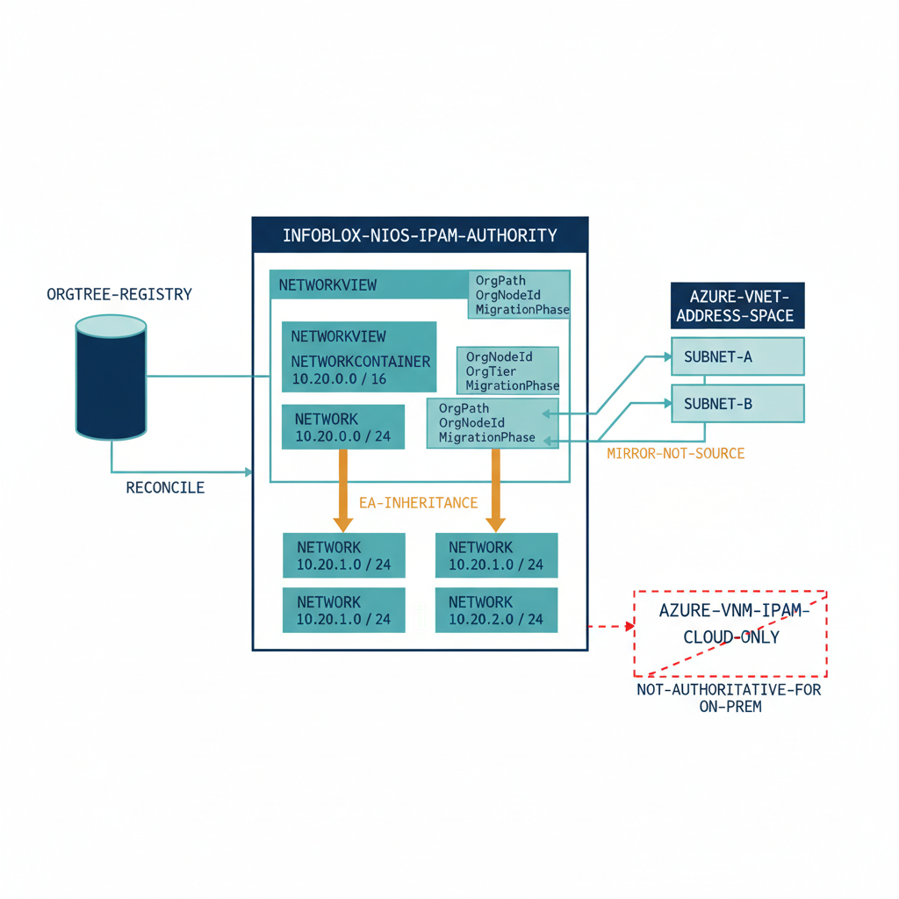

# Chapter 7 — Infoblox as the Permanent IPAM Authority

::: {.callout-note}
## In this chapter
The DHCP-authority chapter that precedes this one established that lease assignment in the hybrid estate is governed, not incidental. This chapter takes the next and larger step: it establishes that IP address management — the plan itself, the inventory of every network, container, and view — is a *permanent* responsibility that Azure cannot assume, and that Infoblox is therefore the lasting system of record for the IP plan rather than a transitional bridge. It walks the reason Azure-native IPAM remains structurally incapable of authoritatively modeling a hybrid estate, the NIOS IPAM object model and how Extensible Attribute inheritance carries OrgPath from a network container down to every child subnet, the WAPI and BloxOne surfaces that read and write that model, and the idempotent allocation pattern that keeps the IP plan reconciled against the OrgTree as the single source of organizational truth.
:::

## From Lease Authority to Plan Authority

The previous chapter drew a clean boundary around DHCP: lease assignment is a governed act, every scope resolves to an owning organizational node, and the failover relationship and renewal behavior are observable through OrgPath. That boundary answered the question *who issued this address, and on whose authority?* It did not answer the prior and more consequential question — *who decided this network should exist at all, what range it occupies, which routing domain it lives in, and which part of the organization owns it?* That is the IP plan, and the IP plan is a different kind of artifact from a lease. A lease is ephemeral and self-correcting; a stale lease expires. The plan is durable and self-propagating; a mistake in the plan — an overlapping range, a network assigned to the wrong org node, a container whose children silently disagree with their parent — replicates itself into every allocation made beneath it and surfaces as an outage weeks later, in a different system, with no obvious cause.

> Lease authority is operational. Plan authority is architectural. The two are not retired on the same schedule, because the cloud can eventually issue leases but cannot, on the timeline of this migration or beyond it, authoritatively hold the plan.

This is the reframing that distinguishes Book Fourteen's final position from its opening one. The earlier chapters of this book treated the third-party DDI platform as a bridge to be retired once Azure-native tooling matured. For DNS, that retirement is real and achievable, and the exit-criteria chapter describes it precisely. For IPAM, it is not. Azure-native address management is not a not-yet-mature version of the IP plan authority — it is a fundamentally cloud-scoped construct that does not model the estate the plan must cover. Infoblox does not bridge that gap; it *is* the authority on the far side of it, permanently.

{#fig-book-14-cpt-07-diagram-01 fig-alt="Engineering blueprint diagram on a white background showing Infoblox as the permanent IPAM system of record for a hybrid Microsoft GCC-Moderate estate. In the center, a tall federal navy box labeled in monospace INFOBLOX-NIOS-IPAM-AUTHORITY contains a nested hierarchy: a teal outer box labeled networkview, inside it a teal box labeled networkcontainer 10.20.0.0 slash 16, and beneath that two smaller teal boxes labeled network 10.20.1.0 slash 24 and network 10.20.2.0 slash 24. Each box carries a monospace tag block reading OrgPath, OrgNodeId, OrgTier, MigrationPhase. A downward amber arrow labeled EA-INHERITANCE runs from the container into both child networks, indicating the children inherit OrgPath from the parent. On the left, a federal navy cylinder labeled ORGTREE-REGISTRY connects by a teal line labeled RECONCILE to the authority box. On the right, a federal navy box labeled AZURE-VNET-ADDRESS-SPACE shows two subnets mapped by teal connectors back to the NIOS networks, with a small amber label MIRROR-NOT-SOURCE. A red dashed box at the lower right labeled AZURE-VNM-IPAM-POOLS-CLOUD-ONLY is connected to the authority box by a red crossed-out line annotated NOT-AUTHORITATIVE-FOR-ON-PREM. Monospace labels throughout for object and field names, federal navy, teal, amber, and red palette, no human figures, 16:9 landscape." width="85%"}

The figure above states the architecture in one frame: NIOS holds the hierarchy, OrgPath inherits downward through it, the OrgTree reconciles against it, Azure mirrors it, and the Azure-native IPAM pool construct is explicitly *not* a source of authority for the on-premises and hybrid plan. The rest of this chapter is the engineering behind that picture.

## Why Azure-Native IPAM Is a Permanent Gap, Not a Temporary One

It is worth being precise about *why* the IP-plan authority does not migrate, because the reason is structural rather than a matter of feature maturity that a future Azure release will close. Azure Virtual Network Manager's IPAM feature manages **address pools** scoped to a Network Manager instance — a cloud-resident construct whose entire universe is the address space of Azure virtual networks. It allocates CIDR ranges to VNets and tracks their consumption within Azure. What it does not do is model the address estate that exists outside Azure: the on-premises subnets behind the ExpressRoute or VPN connection, the lab and DMZ ranges that never appear in a VNet, the legacy RFC 1918 space carved up across data centers a decade before any cloud subscription existed. The IP plan must account for *all* of that space, because the plan's job is to prevent two networks anywhere in the estate from overlapping and to record which organizational node owns each range. A construct that can only see Azure address space cannot perform that job, and no amount of feature development changes its scope without changing what it fundamentally is.

Three specific capabilities the enterprise IP plan depends on are absent from the Azure-native construct by design, and the table below names them against what Infoblox provides.

| Capability | What the IP plan requires | Azure-native IPAM | Infoblox NIOS / BloxOne |
| :--- | :--- | :--- | :--- |
| **Overlapping / separate routing domains** | Model the same RFC 1918 range existing independently in disjoint routing domains (acquisitions, isolated labs, NAT'd partner networks) | No equivalent — a single flat Azure-scoped address space | **Network views** isolate overlapping space into separate routing domains within one system of record |
| **Full-estate inventory** | Authoritatively record every network on-prem, in DMZ, in cloud, whether or not it is an Azure VNet | Cloud-only — sees Azure VNet space exclusively | Single inventory spanning on-prem, hybrid, and Azure-mirrored networks |
| **Utilization history** | Track allocation and consumption over time to forecast exhaustion and audit growth per org node | Point-in-time pool consumption, limited history | Per-network utilization with historical tracking and discovery/reconciliation against observed hosts |

The conclusion is not that Azure-native IPAM is bad — within its scope it is perfectly serviceable for allocating ranges to VNets. The conclusion is that its scope is *Azure*, and the plan's scope is *the estate*. Those are different problems, and only one system in this architecture is built to hold the larger one.

## The NIOS IPAM Object Model

Infoblox models the IP plan as a strict containment hierarchy, and OrgPath governance rides that hierarchy directly. At the top sits the **network view** — a routing-domain boundary. Two networks in two different views may carry identical CIDR ranges without conflict, which is precisely what makes views the mechanism for representing acquisitions, isolated labs, and NAT'd partner space inside a single system of record. Most organizations run a `default` view for their primary routing domain and add named views only where genuinely overlapping or independently-routed space exists.

Within a view, address space is described by two object types that look similar but mean different things. A **network container** is an aggregate — a supernet such as `10.20.0.0/16` that is subdivided into smaller allocations rather than assigned to hosts directly. A **network** is a leaf subnet — `10.20.1.0/24` — from which individual IP addresses are allocated to hosts. Containers may nest within containers; networks are always the terminal allocation. This distinction is what makes **EA inheritance** the load-bearing mechanism of IPAM governance: when the four OrgPath Extensible Attributes — `OrgPath`, `OrgNodeId`, and `OrgTier` (all defined as inheritable) plus `MigrationPhase` (not inheritable) — are written onto a container, NIOS propagates the three inheritable values down to every child container and network beneath it unless a child explicitly overrides them.

> Tag the top-level container for an organizational node *once*. Every subnet carved out of it inherits `OrgPath`, `OrgNodeId`, and `OrgTier` automatically. This is what lets IPAM governance scale: the operator governs an org node's entire address allocation by setting four attributes on one object, not by tagging hundreds of subnets by hand.

`MigrationPhase` is deliberately *not* inheritable, because phase is a property of an individual network's journey to Azure, not of the organizational node that owns it — two subnets under the same container can be at different points in their migration, and inheritance would erase that distinction. Allocation within this model is performed through two NIOS functions that the governance pipeline calls rather than hand-picking ranges: `next-available-network`, which carves the next free subnet of a requested prefix length out of a container, and `next-available-ip`, which returns the next free host address within a network. Both functions consult the live utilization NIOS maintains, and both can stamp Extensible Attributes onto the object they create in the same call — so a freshly allocated subnet is born carrying OrgPath, never assigned it afterward.

## The WAPI and BloxOne Surfaces

The governance pipeline reads and writes this model through two API surfaces depending on the deployment. For on-premises and grid NIOS, the **WAPI** (Web API) is the interface. Requests go to `https://{gridmaster-fqdn}/wapi/v2.12/` over HTTP Basic authentication, and the object types map one-to-one to the model above: `networkview`, `networkcontainer`, and `network`, each exposing an `extattrs` structure that carries the four OrgPath EAs. Allocation uses the function call form — `func:nextavailablenetwork` against a container reference, or `func:nextavailableip` against a network — with the desired `extattrs` supplied in the same request body so the created object is governed from birth. For the cloud-managed **BloxOne DDI** platform, the equivalent objects are **address blocks** and **subnets** under `https://csp.infoblox.com/api/ddi/v1/`, authenticated with a Bearer token, and OrgPath is carried in the native `tags` field rather than in `extattrs`. The object names differ; the governance contract — every IP object carries OrgPath in a native metadata field — is identical across both.

The table below is the minimal reference an operator needs to move between the two surfaces.

| Concept | NIOS WAPI (`/wapi/v2.12/`) | BloxOne DDI (`/api/ddi/v1/`) |
| :--- | :--- | :--- |
| Routing-domain boundary | `networkview` | (address space) |
| Aggregate / supernet | `networkcontainer` | `address_block` |
| Leaf subnet | `network` | `subnet` |
| OrgPath metadata field | `extattrs` (`OrgPath`, `OrgNodeId`, `OrgTier`, `MigrationPhase`) | `tags` |
| Next free subnet | `func:nextavailablenetwork` | next-available on `address_block` |
| Next free host IP | `func:nextavailableip` | next-available on `subnet` |
| Authentication | HTTP Basic | Bearer token |

A single minimal WAPI call shows the binding in concrete form — allocating the next free `/24` from a container and stamping OrgPath onto it in the same request, so no ungoverned window ever exists:

```http
POST /wapi/v2.12/network HTTP/1.1
Host: gridmaster.ddi.agency.gov
Authorization: Basic {credential}
Content-Type: application/json

{
  "network": {
    "_object_function": "next_available_network",
    "_object": "networkcontainer",
    "_object_parameters": { "network": "10.20.0.0/16" },
    "_result_field": "networks",
    "cidr": 24
  },
  "extattrs": {
    "OrgPath":        { "value": "Agency/Division/UnemploymentInsurance/Claims" },
    "OrgNodeId":      { "value": "ON-4417" },
    "OrgTier":        { "value": "Tier1" },
    "MigrationPhase": { "value": "Assessment" }
  }
}
```

## How OrgPath on the IP Plan Drives Governance

Because every network, container, and view carries OrgPath in a native field, the IP plan answers the same governance questions every other UIAO surface answers, through its own query interface and with no cross-system join. A subnet allocation request resolves to an owning org node before any range is reserved: the request names the OrgPath of the requesting node, the pipeline allocates from the container already tagged with that OrgPath, and the inherited attributes make the new subnet's ownership unambiguous from the moment it exists. Delegation of address-space administration follows `OrgTier`: a Tier0 container's allocations are restricted to the central network authority, while Tier1 and Tier2 nodes may be delegated self-service allocation within their own containers, and that delegation is expressed as a function of the same attribute that governs every other surface rather than as an Infoblox-specific access rule maintained in parallel.

Reconciliation closes the loop. The IP plan is reconciled against the OrgTree the same way the DNS zone inventory is: every network's `OrgPath` EA is compared against the OrgTree registry, and three classes of **drift** are surfaced. A network whose `OrgPath` names an org node that no longer exists in the OrgTree is an orphaned allocation. A network whose `OrgPath` disagrees with the `OrgPath` carried by the Entra ID objects of the hosts actually living inside it is a misassignment — the address space says one node owns it, the identities inside it say another, and one of the two records is wrong. And a NIOS network whose range maps to an Azure VNet subnet carrying a *different* OrgPath tag is a hybrid-plan incoherence that, left alone, will eventually let two systems disagree about who owns the same hosts. The reconciliation does not silently repair these; it records them against the owning org node so the discrepancy is governed rather than discovered during an incident.

The mapping between Infoblox networks and Azure VNet address space is itself part of the plan, and the direction of authority is the entire point: NIOS is the source, Azure is the mirror. When a VNet's address space is planned, the range is allocated from the NIOS container for the owning org node — carrying that node's OrgPath — and the Azure VNet and its subnets are then created to match, tagged with the same OrgPath value. Azure holds a faithful copy so that cloud-native tooling can read organizational context locally, but the copy is downstream of the NIOS record. The hybrid plan stays coherent precisely because there is one authority and one mirror, never two competing sources.

## The Idempotent Allocation and Sync Pattern

The pipeline that maintains all of this is written to be idempotent — running it twice produces the same end state as running it once — because the IP plan is too durable to tolerate a sync routine that creates duplicate or conflicting objects on a retry. The pattern is the same shape used elsewhere in the series: read desired state, compare to actual, converge only the difference, and stamp OrgPath on anything created. For IP space, the convergence has a specific ordering, because containers must exist and be tagged before their child networks can inherit.

| Step | Action | Idempotency guarantee |
| :--- | :--- | :--- |
| 1 | Read the org node's desired allocation from the OrgTree (OrgPath, tier, planned prefixes) | Source of truth is the registry, not the pipeline's prior run |
| 2 | Ensure the network container exists in the correct view; create it tagged with the four EAs if absent | Create-if-absent keyed on view + CIDR; a second run finds it and skips |
| 3 | Set or correct the container's inheritable EAs to match the OrgTree | Set-to-desired is naturally idempotent; re-running re-asserts the same values |
| 4 | Allocate child subnets via `next-available-network`, supplying `extattrs` in the call | Allocation requests are keyed to a requested-subnet record so a retry returns the existing subnet rather than carving a new one |
| 5 | Mirror the result to Azure VNet/subnet address space, tagging with the same OrgPath | Azure objects are matched by name and address; matching objects are updated in place, not duplicated |
| 6 | Run reconciliation and record drift against the owning org node | Read-only; produces the same report for the same state |

The inheritance step is what makes this pattern cheap to run at scale. Because step 3 sets the inheritable EAs on the container, steps 4 onward do not need to re-tag every child explicitly — the children inherit, the pipeline writes four attributes to one object, and the entire allocation beneath that container is governed in a single idempotent assertion. A node with two hundred subnets is governed at the cost of governing its container.

## The Plan Returns to the OrgTree

The IP plan, then, is not a thing Infoblox owns on its own behalf. It is the address-space projection of the OrgTree — the same organizational hierarchy that names every user object in Entra ID, every device in Intune, every resource in Arc, and every DNS zone in this book, now expressed as the ranges and subnets the organization's hosts live inside. Infoblox is the permanent authority for that projection because it is the only system in the hybrid estate that can hold the whole of it: every routing domain, every on-premises range, every Azure mirror, each carrying the OrgPath of the node that owns it, each reconciled against the registry that defines what those nodes are. When an operator asks which part of the organization owns a given address, the answer comes from the network's own `OrgPath` EA — and that EA traces, through inheritance and reconciliation, back to the single source of organizational truth that governs every other surface. The IP plan does not stand apart from the OrgTree. It is the OrgTree, read in addresses.

*OrgPath Governance Series — Book Fourteen. This document is part of the OrgPath technical implementation library. Refer to the preceding chapter for the DHCP-authority model that this chapter builds on, and to earlier parts of the series for the OrgTree data model, the Extensible Attribute definitions, and the Entra ID, Intune, and Azure Arc governance pipeline that carries the same OrgPath onto every other governed object.*
