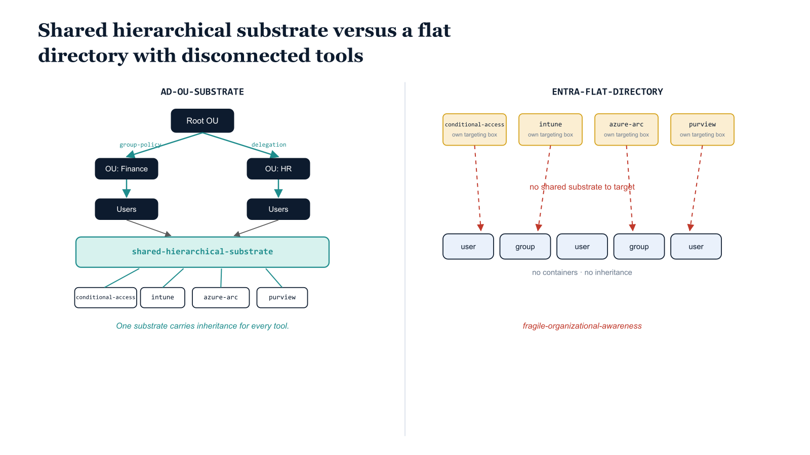

# Chapter 1 — The Directory That Forgot Its Shape

::: {.callout-note}
## In this chapter
Active Directory treated organizational structure as a first-class concept; Entra ID quietly abandoned it for a flat directory of users and groups. This chapter traces what was lost — the shared hierarchical substrate that Group Policy, delegation, and every downstream governance tool drew from — why dynamic groups and administrative units cannot replace it, and how the flatness that feels like simplification returns as compounding complexity the moment differentiated governance is required. It closes by naming the structural problem that OrgPath exists to solve.
:::

## When the Directory Understood Shape

Active Directory was built around a fundamental insight: organizations have shape. The Organizational Unit tree was not merely an administrative convenience. It was a governance vocabulary — a way of saying that a user in the Finance Division of the Eastern Region is not the same kind of identity as a user in the Mission Operations Enclave, even if both authenticate to the same domain. Group Policy flowed down that tree. Delegation followed the same seams. The directory understood organizational structure as a first-class concept, and every governance tool built on top of Active Directory understood that structure as well, because all of them drew from the same hierarchical substrate.

> The OU tree was not plumbing. It was a shared governance vocabulary — and every tool above it spoke the same language because they all read from the same hierarchy.

{#fig-book-15-cpt-01-diagram-01 fig-alt="Engineering blueprint diagram on a white background, split into two panels comparing two governance architectures, 16:9 landscape. Left panel titled in monospace AD-OU-SUBSTRATE shows a federal navy rooted tree of Organizational Unit nodes flowing downward, with teal arrows labeled group-policy and delegation inheriting along the same branches; a teal band beneath the tree is labeled shared-hierarchical-substrate, and monospace tool tags conditional-access, intune, azure-arc, purview all connect to that single band. Right panel titled in monospace ENTRA-FLAT-DIRECTORY shows a flat navy row of user and group icons with no containers and no inheritance; the same four monospace tool tags float disconnected above it, each redrawing its own small isolated targeting box in amber, with red broken connector lines and a red caption fragile-organizational-awareness marking the absent shared substrate. No human figures.} width="100%"}

## How Entra ID Forgot

When Microsoft built Entra ID, that structural vocabulary was quietly abandoned. Entra ID is a flat directory. It has no Organizational Units. It has no containers. It has no inheritance model. What replaced twenty years of structural governance was a flat list of users and groups, with the implicit suggestion that dynamic group rules and administrative units could compensate for the loss.

They cannot. A dynamic group rule can select members based on an attribute value. It cannot express that one part of the organization is subordinate to another. It cannot define where authority flows. And it cannot tell the downstream governance tools what the actual shape of the institution is — because none of those tools share a common structural substrate:

- **Conditional Access**
- **Intune**
- **Azure Arc**
- **Microsoft Purview**

Each one has rebuilt its own version of governance in the absence of a shared foundation, producing a governance architecture that is simultaneously redundant in its enforcement mechanisms and fragile in its organizational awareness.

## The Complexity That Returns With Interest

The consequence of this structural absence is not immediately obvious. In the early days of Entra ID adoption, the flatness of the directory feels like a simplification:

- fewer containers to manage,
- fewer delegation structures to maintain,
- fewer inheritance rules to reason about.

> The complexity does not disappear. It is deferred — and it returns with compound interest the moment the organization needs to govern one part of itself differently from another.

That moment arrives when the organization attempts to apply differentiated governance — when it needs to say that users in the Mission Operations Enclave require phishing-resistant multi-factor authentication while users in the General Administrative domain require only standard MFA, or when it needs to apply one Intune device configuration profile to workstations in one division and a different profile to workstations in another.

At that point, the absent hierarchy must be reconstructed manually. Each mechanism below is maintained independently, each is a potential source of drift, and none of them expresses the underlying organizational truth that the OU tree expressed automatically:

| Reconstruction mechanism | What it must do by hand | Failure mode it introduces |
| :--- | :--- | :--- |
| **Security groups** | Stand in for organizational containers | Multiply without expressing subordination |
| **Dynamic membership rules** | Re-derive position from attribute values | Drift silently when attributes go stale |
| **Administrative unit assignments** | Re-scope delegation by hand | Maintained separately from every other mechanism |

## The Structural Problem OrgPath Solves

This is the structural problem that the UIAO Governance OS exists to solve. Not by replacing Entra ID or circumventing its flat model, but by:

1. **constructing and maintaining** the organizational structure that Entra ID cannot express on its own,
2. **encoding that structure** as a governed attribute on every identity object, and
3. **using that attribute** as the universal targeting primitive for every governance tool in the stack.

The solution is called OrgPath, and its derivation, deployment, and operation constitute the core intellectual contribution of the UIAO program.
