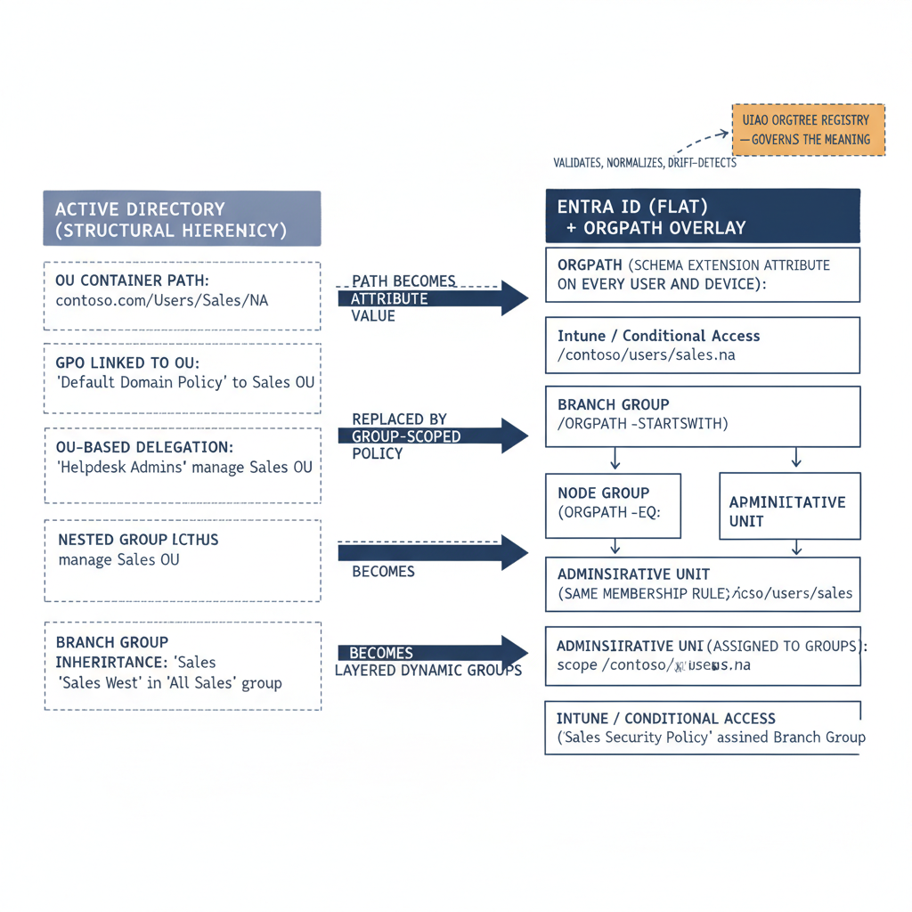

# Chapter 2 — The Translation Schema

::: {.callout-note}
## In this chapter
The first work in an Active Directory to Entra ID migration is not synchronization — it is translation, and the most important translation runs from OU paths to the attribute-based model Entra ID requires. This chapter explains why that is a conceptual replatforming rather than a field mapping, how the monolithic AD computer object decomposes into three independently governable surfaces tied together by OrgPath, the construct-by-construct translation table from legacy AD to Entra constructs, and why hierarchy itself does not translate — its meaning living instead in the governed UIAO OrgTree registry.
:::

## Translation Comes Before Synchronization

The first work in any Active Directory to Entra ID migration is not identity synchronization. It is translation. And the most important translation is the one from OU paths — the hierarchical container addresses that express organizational placement in Active Directory — to the attribute-based model that Entra ID requires.

> This translation is not a one-to-one mapping of fields. It is a conceptual replatforming: taking governance constructs that were implicit in the directory's structure and making them explicit in the directory's data.

{#fig-15-uiao-governance-os-complete-narrative-diagram-01 fig-alt="Left cluster \"Active Directory (structural hierarchy)\" stacks four legacy constructs: OU container path; GPO linked to OU; OU-based delegation; Nested group inheritance. Right cluster \"Entra ID (flat) + OrgPath overlay\" stacks five replacement constructs: OrgPath (schema extension attribute on every user and device); Branch group (OrgPath -startsWith); Node group (OrgPath -eq); Administrative Unit (same membership rule); Intune / Conditional Access (assigned to groups). Translation arrows cross between clusters: OU → OrgPath (labeled \"path becomes attribute value\"); GPO → Intune/CA (labeled \"replaced by group-scoped policy\"); OU delegation → AU (labeled \"becomes\"); Nested group → Branch group (labeled \"becomes layered dynamic groups\"). Within the right cluster: OrgPath fans into Branch group and Node group; both group types feed Intune/CA. A separate top-right governance box \"UIAO OrgTree Registry — governs the meaning\" connects to OrgPath via a dashed arrow labeled \"validates, normalizes, drift-detects\". Engineering blueprint style, white background, fading slate fill for AD constructs to suggest legacy, federal navy (#1F3A5F) for Entra ID cluster, amber (#D4A017) for the registry, monospace identifier strings, 16:9 landscape." width="85%"}

## The Monolithic Computer Object and Its Decomposition

In Active Directory, a computer object is a monolithic identity container. It holds machine identity, organizational placement, group-based access control, configuration state, operating system metadata, and trust relationships in a single directory object. The OU tree provides both a human-readable taxonomy and the primary mechanism for policy targeting through GPO linkage. This model is effective within forest boundaries but produces governance structures that are opaque to automation, difficult to audit programmatically, and fundamentally incompatible with cloud-native management paradigms where there is no forest, no container hierarchy, and no inheritance of any kind.

Modern governance decomposes the Active Directory computer object into three independently governable facets:

- **Microsoft Entra ID** — handles device identity and attribute-based organizational metadata.
- **Microsoft Intune** — governs configuration profiles and compliance policies.
- **Azure Arc** — provides hybrid server management through the Azure Resource Manager control plane.

Each surface provides its own drift-detection, policy enforcement, and compliance reporting capabilities. The central organizing principle that ties all three together is OrgPath — a string attribute that encodes the organizational hierarchy inherited from the OU path, stored as an Entra ID Directory Schema Extension attribute available on every user and device object.

## The Translation Table

The translation table is straightforward in concept but demanding in execution. Each Active Directory construct maps to a specific Entra ID replacement:

| Active Directory construct | Entra ID construct | Translation mechanism |
| :--- | :--- | :--- |
| OU container | OrgPath attribute on the Entra user or device object | The path becomes an attribute value |
| OU subtree scope | Branch dynamic group | Membership rule uses the *-startsWith* operator against the OrgPath value |
| OU exact scope | Node dynamic group | Membership rule uses the *-eq* operator |
| OU-based delegation | Administrative Unit | Populated by the same dynamic membership rule |
| Nested group inheritance | Layered dynamic groups | Compose naturally from branch to department to unit to team |
| GPO targeting via OU | Intune policy targeting | Targets those same dynamic groups |

> The symmetry is near-complete — but the symmetry is engineered, not given.

## What Does Not Translate: Hierarchy Itself

What does not translate is hierarchy itself. OrgPath carries the value of the hierarchy — the string that encodes where an identity sits in the organizational structure — but Entra ID has no native concept of what that string means. The meaning lives in the UIAO OrgTree registry:

- the **schema** of allowed segments,
- the **normalization rules**,
- the **mapping rules** from Active Directory OU paths to OrgPath values, and
- the **drift detection rules** that fire when an identity's OrgPath value diverges from the authoritative governance record maintained in the UIAO repository.

The registry is a governed artifact, versioned in Git, reviewed by the Canon Steward, and enforced at the identity provisioning layer before any object enters production. This governance envelope around the OrgPath attribute is what transforms a simple string field into a structural governance primitive.
